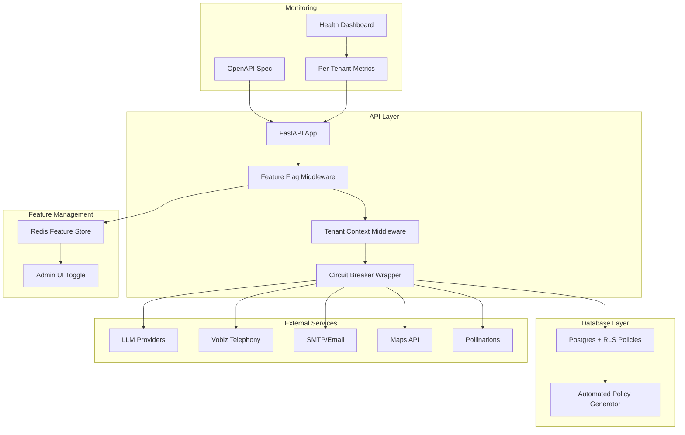
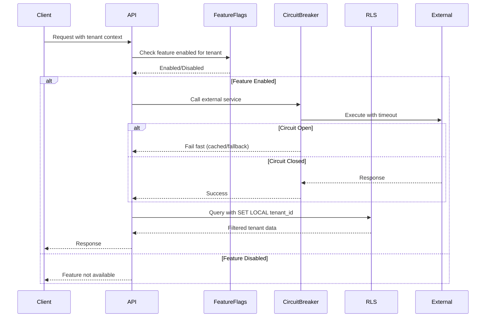

# Design Document: SaaS Infrastructure Upgrade (Production-Grade Patterns)

## Overview

Yeh design LeadGenAI ke LIVE production SaaS ko enterprise-grade multi-tenancy aur scalability patterns se harden karta hai. Current stack already production-ready hai (Postgres+Redis+Docker+PgBouncer+observability), lekin genuinely additive gaps hain jo 2026 SaaS best practices demand karte:

1. **Postgres Row-Level Security (RLS)** for guaranteed tenant isolation
2. **Feature flag system** for progressive rollouts and A/B testing  
3. **System-wide circuit breaker** wrapping ALL external APIs (not just LLM)
4. **OpenAPI spec auto-generation** (FastAPI native capability)
5. **Per-tenant health metrics** for enterprise monitoring
6. **Automated RLS policy generator** scanning tables

Sab patterns **FREE stack**, **incremental deploy** (ek-ek feature flip), **additive** (existing code break nahi), aur **automation-first** (manual toil eliminate).


## Architecture Overview




## Main Algorithm/Workflow




## Core Interfaces/Types

### Feature Flag System

```python
from enum import Enum
from typing import Optional, Dict, Any
from datetime import datetime

class FeatureState(Enum):
    DISABLED = "disabled"
    ENABLED_ALL = "enabled_all"
    ENABLED_PERCENTAGE = "enabled_percentage"
    ENABLED_TENANTS = "enabled_tenants"

class FeatureFlag:
    """Feature flag configuration"""
    key: str
    state: FeatureState
    description: str
    percentage: int = 0  # 0-100 for percentage rollout
    enabled_tenants: list[str] = []
    metadata: Dict[str, Any] = {}
    created_at: datetime
    updated_at: datetime

class FeatureFlagService:
    """Redis-backed feature flag service"""
    def is_enabled(self, flag_key: str, tenant_id: Optional[str] = None) -> bool:
        """Check if feature enabled for tenant"""
        pass
    
    def set_flag(self, flag: FeatureFlag) -> None:
        """Store feature flag configuration"""
        pass
    
    def get_all_flags(self) -> list[FeatureFlag]:
        """List all feature flags"""
        pass
```


### System-Wide Circuit Breaker

```python
from typing import Callable, TypeVar, Optional
from datetime import datetime, timedelta

T = TypeVar('T')

class CircuitState(Enum):
    CLOSED = "closed"      # Normal operation
    OPEN = "open"          # Failing, reject requests
    HALF_OPEN = "half_open"  # Testing if recovered

class CircuitBreakerConfig:
    """Circuit breaker configuration per service"""
    service_name: str
    failure_threshold: int = 5  # Failures before opening
    timeout_seconds: float = 3.0
    reset_timeout_seconds: int = 60  # Time before half-open
    half_open_requests: int = 3  # Test requests in half-open

class CircuitBreaker:
    """Distributed circuit breaker using Redis"""
    def __init__(self, config: CircuitBreakerConfig):
        self.config = config
        self.state = CircuitState.CLOSED
        
    async def call(
        self, 
        func: Callable[..., T],
        *args,
        fallback: Optional[Callable[..., T]] = None,
        **kwargs
    ) -> T:
        """Execute function with circuit breaker protection"""
        pass
```


### Postgres RLS Manager

```python
from dataclasses import dataclass
from typing import List

@dataclass
class RLSPolicy:
    """Row-Level Security policy definition"""
    table_name: str
    policy_name: str
    tenant_column: str = "client_id"
    policy_sql: str = ""
    
class RLSManager:
    """Automated RLS policy generator and enforcer"""
    
    def scan_tables(self) -> List[str]:
        """Find all tables with tenant_column"""
        pass
    
    def generate_policy(self, table_name: str, tenant_column: str) -> RLSPolicy:
        """Generate RLS policy for table"""
        pass
    
    def apply_policy(self, policy: RLSPolicy) -> None:
        """Apply RLS policy to database"""
        pass
    
    def verify_policies(self) -> Dict[str, bool]:
        """Verify all RLS policies are active"""
        pass
```


### Per-Tenant Health Metrics

```python
from pydantic import BaseModel
from datetime import datetime

class TenantHealthMetrics(BaseModel):
    """Health metrics per tenant"""
    tenant_id: str
    requests_total: int
    requests_success: int
    requests_failed: int
    avg_latency_ms: float
    p95_latency_ms: float
    error_rate: float
    last_error: Optional[str]
    last_request: datetime
    features_enabled: List[str]
    
class TenantHealthService:
    """Track and report per-tenant health"""
    
    async def record_request(
        self, 
        tenant_id: str, 
        success: bool,
        latency_ms: float,
        error: Optional[str] = None
    ) -> None:
        """Record request metrics"""
        pass
    
    async def get_health(self, tenant_id: str) -> TenantHealthMetrics:
        """Get tenant health snapshot"""
        pass
    
    async def get_all_health(self) -> List[TenantHealthMetrics]:
        """Get all tenants health"""
        pass
```


## Key Functions with Formal Specifications

### Function 1: is_enabled()

```python
async def is_enabled(
    self, 
    flag_key: str, 
    tenant_id: Optional[str] = None,
    user_id: Optional[str] = None
) -> bool:
    """Check if feature flag is enabled for context"""
```

**Preconditions:**
- `flag_key` is non-empty string
- Redis connection available (falls back to default-off if unavailable)
- `tenant_id` is valid UUID string if provided

**Postconditions:**
- Returns boolean indicating feature availability
- No side effects (pure read operation)
- Result is cached in Redis with 60s TTL
- If flag not found, returns False (safe default)

**Loop Invariants:** N/A (no loops)


### Function 2: circuit_breaker.call()

```python
async def call(
    self,
    func: Callable[..., T],
    *args,
    fallback: Optional[Callable[..., T]] = None,
    **kwargs
) -> T:
    """Execute function with circuit breaker protection"""
```

**Preconditions:**
- `func` is valid async callable
- Circuit breaker config loaded
- Redis available for distributed state (falls back to local state)

**Postconditions:**
- Returns result of `func(*args, **kwargs)` if successful
- Returns `fallback(*args, **kwargs)` if circuit open and fallback provided
- Raises CircuitOpenError if circuit open and no fallback
- Updates circuit state based on success/failure
- Records metrics (failure count, last failure time)

**Loop Invariants:** 
- Circuit state transitions are atomic (Redis WATCH/MULTI)
- Failure counter never negative
- State transitions follow: CLOSED → OPEN → HALF_OPEN → CLOSED


### Function 3: apply_rls_policy()

```python
async def apply_policy(self, policy: RLSPolicy) -> None:
    """Apply RLS policy to Postgres table"""
```

**Preconditions:**
- `policy.table_name` exists in database
- `policy.tenant_column` exists in table
- Database user has ALTER TABLE permission
- Policy SQL is syntactically valid

**Postconditions:**
- RLS enabled on table (`ALTER TABLE ... ENABLE ROW LEVEL SECURITY`)
- Policy created with USING clause filtering by tenant_column
- Policy applied to all operations (SELECT, INSERT, UPDATE, DELETE)
- No data loss or corruption
- If policy already exists, it's replaced (DROP POLICY IF EXISTS)

**Loop Invariants:** N/A


## Algorithmic Pseudocode

### Feature Flag Evaluation Algorithm

```python
ALGORITHM evaluate_feature_flag(flag_key, tenant_id, user_id)
INPUT: flag_key (string), tenant_id (optional string), user_id (optional string)
OUTPUT: enabled (boolean)

BEGIN
  # Step 1: Fetch flag configuration from Redis
  flag_config ← redis.get(f"feature_flag:{flag_key}")
  
  IF flag_config = NULL THEN
    RETURN False  # Safe default: disabled
  END IF
  
  # Step 2: Check global state
  IF flag_config.state = DISABLED THEN
    RETURN False
  END IF
  
  IF flag_config.state = ENABLED_ALL THEN
    RETURN True
  END IF
  
  # Step 3: Tenant-specific check
  IF flag_config.state = ENABLED_TENANTS THEN
    IF tenant_id IN flag_config.enabled_tenants THEN
      RETURN True
    ELSE
      RETURN False
    END IF
  END IF
  
  # Step 4: Percentage rollout (deterministic hash)
  IF flag_config.state = ENABLED_PERCENTAGE THEN
    hash_input ← tenant_id OR user_id OR flag_key
    bucket ← hash(hash_input) MOD 100
    RETURN bucket < flag_config.percentage
  END IF
  
  RETURN False  # Fallback
END
```


**Preconditions:**
- Redis connection available
- flag_key is non-empty string
- tenant_id/user_id are valid UUIDs if provided

**Postconditions:**
- Returns boolean indicating feature availability
- Evaluation is deterministic (same inputs → same output)
- Percentage rollout is evenly distributed
- No side effects on flag configuration

**Loop Invariants:** N/A (no explicit loops)


### Circuit Breaker State Machine

```python
ALGORITHM execute_with_circuit_breaker(service_name, func, args, fallback)
INPUT: service_name (string), func (callable), args (tuple), fallback (optional callable)
OUTPUT: result (any type) or exception

BEGIN
  # Step 1: Load circuit state from Redis
  state ← redis.get(f"circuit:{service_name}:state")
  failure_count ← redis.get(f"circuit:{service_name}:failures") OR 0
  last_failure_time ← redis.get(f"circuit:{service_name}:last_failure")
  
  # Step 2: Check if circuit should transition to HALF_OPEN
  IF state = OPEN AND (now() - last_failure_time) > reset_timeout THEN
    state ← HALF_OPEN
    redis.set(f"circuit:{service_name}:state", HALF_OPEN)
  END IF
  
  # Step 3: Handle OPEN circuit
  IF state = OPEN THEN
    IF fallback IS NOT NULL THEN
      RETURN fallback(*args)
    ELSE
      RAISE CircuitOpenError(service_name)
    END IF
  END IF
  
  # Step 4: Execute function with timeout
  TRY
    result ← await asyncio.wait_for(func(*args), timeout=config.timeout)
    
    # Success: reset or keep closed
    IF state = HALF_OPEN THEN
      state ← CLOSED
      redis.set(f"circuit:{service_name}:state", CLOSED)
    END IF
    redis.set(f"circuit:{service_name}:failures", 0)
    
    RETURN result
    
  CATCH TimeoutError, ConnectionError, ServiceError AS error
    # Failure: increment counter
    failure_count ← redis.incr(f"circuit:{service_name}:failures")
    redis.set(f"circuit:{service_name}:last_failure", now())
    
    # Open circuit if threshold exceeded
    IF failure_count >= config.failure_threshold THEN
      redis.set(f"circuit:{service_name}:state", OPEN)
    END IF
    
    # Try fallback or re-raise
    IF fallback IS NOT NULL THEN
      RETURN fallback(*args)
    ELSE
      RAISE error
    END IF
  END TRY
END
```


**Preconditions:**
- Redis available for distributed state
- service_name is registered in circuit breaker config
- func is async callable
- timeout configured for service

**Postconditions:**
- Circuit state transitions are atomic
- Failure count increments on errors only
- Circuit opens when failure_threshold exceeded
- Circuit auto-recovers via HALF_OPEN after reset_timeout
- Fallback called when circuit open (if provided)

**Loop Invariants:**
- State transitions: CLOSED ↔ OPEN ↔ HALF_OPEN (no invalid states)
- failure_count ≥ 0 always
- last_failure_time ≤ now() always


### RLS Policy Generator

```python
ALGORITHM generate_rls_policies()
INPUT: database connection
OUTPUT: list of RLSPolicy objects

BEGIN
  policies ← []
  
  # Step 1: Scan all tables for tenant columns
  tables ← SELECT table_name FROM information_schema.tables 
           WHERE table_schema = 'public'
  
  FOR EACH table IN tables DO
    columns ← SELECT column_name FROM information_schema.columns
              WHERE table_name = table AND column_name IN ('client_id', 'tenant_id', 'user_id')
    
    IF columns IS NOT EMPTY THEN
      tenant_column ← columns[0]  # Primary tenant column
      
      # Step 2: Generate policy SQL
      policy_name ← f"tenant_isolation_{table}"
      policy_sql ← f"""
        CREATE POLICY {policy_name} ON {table}
        USING ({tenant_column}::text = current_setting('app.current_tenant', true))
        WITH CHECK ({tenant_column}::text = current_setting('app.current_tenant', true))
      """
      
      # Step 3: Create policy object
      policy ← RLSPolicy(
        table_name=table,
        policy_name=policy_name,
        tenant_column=tenant_column,
        policy_sql=policy_sql
      )
      
      policies.append(policy)
    END IF
  END FOR
  
  RETURN policies
END
```


**Preconditions:**
- Database connection active with schema introspection permission
- Tables exist in 'public' schema
- Target columns (client_id/tenant_id/user_id) follow naming convention

**Postconditions:**
- Returns list of valid RLSPolicy objects
- One policy per table with tenant column
- Policy SQL is syntactically correct
- No policies for tables without tenant columns
- No database modifications (pure read/generate)

**Loop Invariants:**
- All processed tables remain unchanged
- policies list grows monotonically
- Each policy has unique policy_name


## Example Usage

### Feature Flag Usage

```python
# Initialize feature flag service
from app.infrastructure.feature_flags import FeatureFlagService

ff_service = FeatureFlagService()

# Create a new feature flag
await ff_service.set_flag(FeatureFlag(
    key="advanced_analytics",
    state=FeatureState.ENABLED_PERCENTAGE,
    percentage=25,  # 25% rollout
    description="Advanced analytics dashboard"
))

# Check if enabled for tenant
@router.get("/analytics")
async def get_analytics(tenant_id: str = Depends(get_tenant_id)):
    if not await ff_service.is_enabled("advanced_analytics", tenant_id):
        raise HTTPException(status_code=404, detail="Feature not available")
    
    # Feature logic here
    return {"analytics": "data"}

# Admin API to toggle feature
@router.post("/admin/features/{key}/enable")
async def enable_feature(key: str, tenant_ids: List[str]):
    flag = await ff_service.get_flag(key)
    flag.state = FeatureState.ENABLED_TENANTS
    flag.enabled_tenants = tenant_ids
    await ff_service.set_flag(flag)
    return {"status": "enabled"}
```


### Circuit Breaker Usage

```python
# Wrap external API calls
from app.infrastructure.circuit_breaker import CircuitBreaker, CircuitBreakerConfig

# Configure circuit breaker for Vobiz telephony
vobiz_breaker = CircuitBreaker(CircuitBreakerConfig(
    service_name="vobiz",
    failure_threshold=5,
    timeout_seconds=3.0,
    reset_timeout_seconds=60
))

# Use circuit breaker
async def make_vobiz_call(phone: str):
    try:
        result = await vobiz_breaker.call(
            vobiz_client.start_call,
            phone,
            fallback=lambda p: {"status": "queued", "message": "Service temporarily unavailable"}
        )
        return result
    except CircuitOpenError:
        logger.warning("Vobiz circuit open, using fallback")
        return {"status": "failed", "reason": "service_unavailable"}

# Wrap all external services
maps_breaker = CircuitBreaker(CircuitBreakerConfig(service_name="google_maps", timeout_seconds=2.0))
smtp_breaker = CircuitBreaker(CircuitBreakerConfig(service_name="smtp", timeout_seconds=5.0))
pollinations_breaker = CircuitBreaker(CircuitBreakerConfig(service_name="pollinations", timeout_seconds=10.0))
```


### RLS Policy Application

```python
# Generate and apply RLS policies
from app.infrastructure.rls_manager import RLSManager

rls_manager = RLSManager()

# Scan database and generate policies
policies = await rls_manager.scan_tables()
print(f"Found {len(policies)} tables requiring RLS")

# Apply policies (idempotent)
for policy in policies:
    await rls_manager.apply_policy(policy)
    print(f"Applied RLS to {policy.table_name}")

# Verify all policies active
status = await rls_manager.verify_policies()
for table, active in status.items():
    print(f"{table}: {'✓' if active else '✗'}")

# Use in request context (middleware sets tenant)
async def query_with_rls(tenant_id: str, session: AsyncSession):
    # Set tenant context for this connection
    await session.execute(text(f"SET LOCAL app.current_tenant = '{tenant_id}'"))
    
    # All queries now automatically filtered by RLS
    clients = await session.execute(select(Client))
    return clients.scalars().all()  # Only tenant's clients visible
```


### Per-Tenant Health Monitoring

```python
# Track per-tenant metrics
from app.infrastructure.tenant_health import TenantHealthService

health_service = TenantHealthService()

# Middleware to track requests
@app.middleware("http")
async def track_tenant_health(request: Request, call_next):
    tenant_id = request.state.tenant_id
    start = time.time()
    
    try:
        response = await call_next(request)
        latency_ms = (time.time() - start) * 1000
        
        await health_service.record_request(
            tenant_id=tenant_id,
            success=response.status_code < 400,
            latency_ms=latency_ms
        )
        return response
    except Exception as e:
        await health_service.record_request(
            tenant_id=tenant_id,
            success=False,
            latency_ms=(time.time() - start) * 1000,
            error=str(e)
        )
        raise

# Health dashboard endpoint
@router.get("/admin/health/tenants")
async def get_tenants_health():
    all_health = await health_service.get_all_health()
    return {"tenants": all_health}

@router.get("/admin/health/tenant/{tenant_id}")
async def get_tenant_health(tenant_id: str):
    health = await health_service.get_health(tenant_id)
    return health
```


## Components and Interfaces

### Component 1: Feature Flag Service

**Purpose**: Provide runtime feature toggling for progressive rollouts, A/B testing, and kill switches

**Interface**:
```python
class FeatureFlagService:
    async def is_enabled(self, flag_key: str, tenant_id: Optional[str] = None) -> bool
    async def set_flag(self, flag: FeatureFlag) -> None
    async def get_flag(self, flag_key: str) -> Optional[FeatureFlag]
    async def get_all_flags(self) -> List[FeatureFlag]
    async def delete_flag(self, flag_key: str) -> bool
```

**Responsibilities**:
- Store feature flags in Redis with JSON serialization
- Evaluate flags based on state (disabled/enabled_all/percentage/tenants)
- Cache flag evaluations with 60s TTL
- Provide admin UI for toggling features
- Fail-safe: default to disabled if Redis unavailable

**Storage Format**:
```
Redis Key: feature_flag:{flag_key}
Redis Value: JSON {state, percentage, enabled_tenants, metadata}
Redis TTL: None (persistent until deleted)
```


### Component 2: System Circuit Breaker

**Purpose**: Prevent cascading failures by failing fast when external services are degraded

**Interface**:
```python
class CircuitBreaker:
    async def call(self, func: Callable, *args, fallback: Optional[Callable] = None, **kwargs) -> Any
    async def get_state(self) -> CircuitState
    async def reset(self) -> None
    async def get_metrics(self) -> Dict[str, Any]
```

**Responsibilities**:
- Track failure rate for each external service
- Open circuit after failure_threshold consecutive failures
- Auto-recover via half-open state after reset_timeout
- Execute fallback function when circuit open
- Store state in Redis for multi-worker coordination
- Record metrics (failures, last_failure_time, state_transitions)

**State Transitions**:
```
CLOSED (normal) → OPEN (failing) after N failures
OPEN → HALF_OPEN after reset_timeout
HALF_OPEN → CLOSED on first success
HALF_OPEN → OPEN on failure
```


### Component 3: RLS Policy Manager

**Purpose**: Automate Row-Level Security policy generation and enforcement for multi-tenant isolation

**Interface**:
```python
class RLSManager:
    async def scan_tables(self) -> List[str]
    async def generate_policy(self, table_name: str, tenant_column: str) -> RLSPolicy
    async def apply_policy(self, policy: RLSPolicy) -> None
    async def verify_policies(self) -> Dict[str, bool]
    async def disable_policy(self, table_name: str) -> None
```

**Responsibilities**:
- Scan database for tables with tenant columns (client_id, tenant_id, user_id)
- Generate RLS policy SQL using current_setting('app.current_tenant')
- Apply policies idempotently (DROP IF EXISTS + CREATE)
- Verify all policies are active
- Provide audit log of policy changes
- Safe rollback mechanism (disable RLS on table)

**Policy Template**:
```sql
CREATE POLICY tenant_isolation_{table}
ON {table}
USING ({tenant_column}::text = current_setting('app.current_tenant', true))
WITH CHECK ({tenant_column}::text = current_setting('app.current_tenant', true));

ALTER TABLE {table} ENABLE ROW LEVEL SECURITY;
ALTER TABLE {table} FORCE ROW LEVEL SECURITY;
```

