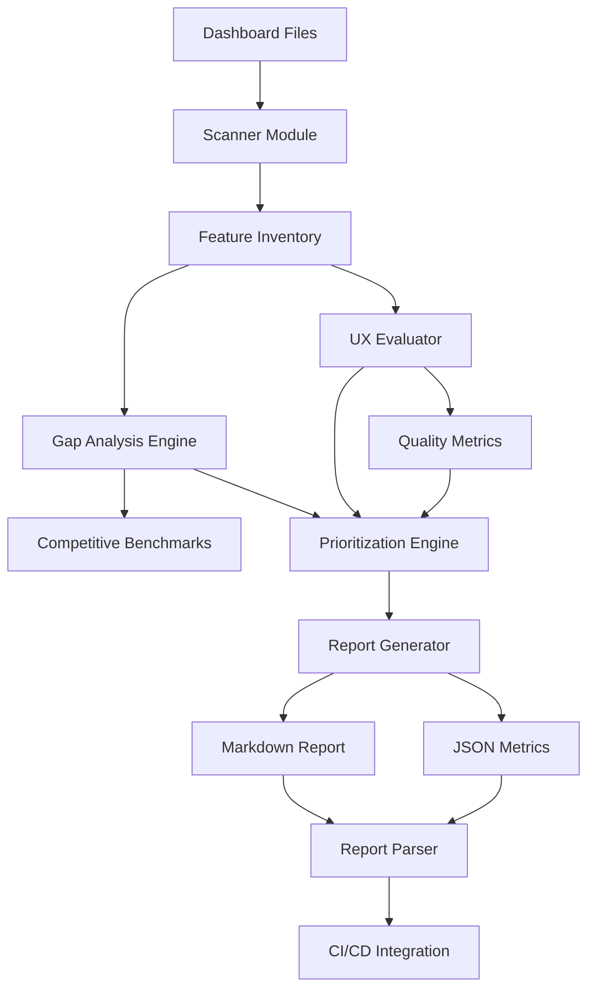

# Design Document — Dashboard Assessment & Gap Analysis

## Overview

### Purpose

This design defines the architecture and implementation approach for a comprehensive dashboard assessment and gap analysis system for LeadGen AI. The system will audit the current state of both customer and admin dashboards, identify gaps compared to competitive SaaS products, prioritize improvements, and generate actionable reports.

### Scope

**In Scope:**
- Feature inventory and cataloging for customer_dashboard.html and admin_dashboard.html
- Automated static analysis of HTML/JavaScript files
- Gap analysis against competitive SaaS benchmarks
- UX quality assessment framework
- MoSCoW prioritization engine
- Report generation (Markdown and JSON)
- Assessment report parser for CI/CD integration
- Backend dependency identification

**Out of Scope:**
- Actual implementation of identified gaps (this is AUDIT only)
- Automated runtime testing of dashboard functionality
- User behavior analytics or session recording
- A/B testing infrastructure
- Automated accessibility testing tools (manual WCAG checklist only)

### Key Principles

1. **Audit-First**: This is purely a DOCUMENTATION and ANALYSIS feature
2. **Competitive Parity**: Benchmark against industry leaders (HubSpot, Stripe, Mixpanel, Intercom)
3. **Actionable Insights**: Every finding must map to a concrete improvement task
4. **Versioned Assessments**: Support comparison across multiple assessment runs
5. **Parser-Ready**: All reports must be machine-readable for automation


## Architecture

### System Components



### Assessment Methodology

The assessment follows a **three-phase analysis approach**:

**Phase 1: Inventory (Static Analysis)**
- HTML/JS parsing to extract UI components
- API endpoint discovery from fetch/axios calls
- Component categorization (visualization, data_table, action, navigation, real-time)

**Phase 2: Benchmarking (Competitive Analysis)**
- Manual feature checklist against competitive SaaS dashboards
- Industry standard identification (prevalence analysis)
- Gap recording with impact/effort scoring

**Phase 3: Prioritization (Decision Framework)**
- MoSCoW classification algorithm
- Priority matrix generation (effort vs impact)
- Roadmap synthesis with sprint estimates

### Data Flow

1. **Input**: Dashboard HTML files + competitive feature lists
2. **Processing**: Scanner → Inventory → Gap Analysis → Prioritization
3. **Output**: Assessment Report (MD) + Metrics (JSON) + Backlog (MD)


## Components and Interfaces

### 1. Dashboard Scanner Module

**Purpose**: Parse HTML/JavaScript files to extract feature inventory

**Input Schema**:
```python
{
  "dashboard_path": str,  # Path to HTML file
  "scan_depth": str       # "surface" | "deep"
}
```

**Output Schema**:
```python
{
  "dashboard_name": str,
  "scan_timestamp": str,
  "file_metadata": {
    "path": str,
    "size_bytes": int,
    "last_modified": str,
    "git_commit": str  # optional
  },
  "features": [
    {
      "feature_name": str,
      "category": str,  # visualization|data_table|action|navigation|real_time
      "status": str,    # complete|partial|broken
      "ui_elements": [str],
      "api_endpoints": [str],
      "evidence": {
        "line_numbers": [int],
        "code_snippets": [str]
      }
    }
  ],
  "api_endpoints_discovered": [
    {
      "path": str,
      "method": str,
      "usage_context": str
    }
  ]
}
```

**Key Operations**:
- `scan_html(filepath)`: Extract DOM structure and component types
- `extract_api_calls(js_content)`: Find fetch/axios patterns
- `categorize_component(element)`: Classify UI element type
- `assess_status(feature)`: Determine completeness level


### 2. Feature Inventory Store

**Purpose**: Structured storage for discovered features

**Data Model**:
```python
class FeatureInventory:
    dashboard: str  # "customer" | "admin"
    features: List[Feature]
    completeness_score: float  # 0-100
    total_features: int
    complete_features: int
    partial_features: int
    broken_features: int

class Feature:
    id: str  # unique identifier
    name: str
    dashboard: str
    category: str
    status: str
    description: str
    ui_elements: List[str]
    api_endpoints: List[str]
    evidence: Dict
    requirement_mapping: List[str]  # Maps to requirements.md sections
```

**Storage Format**: JSON Lines (`data/feature_inventory.jsonl`)


### 3. Gap Analysis Engine

**Purpose**: Compare current state against competitive benchmarks

**Competitive Feature Database Schema**:
```python
{
  "competitor": str,  # "HubSpot" | "Stripe" | "Mixpanel" | etc.
  "feature_category": str,
  "features": [
    {
      "name": str,
      "description": str,
      "prevalence": int,  # How many competitors have this (1-8)
      "tier": str,  # "table_stakes" | "standard" | "advanced"
      "examples": [str]  # Screenshots/descriptions
    }
  ]
}
```

**Gap Record Schema**:
```python
class Gap:
    gap_id: str
    gap_name: str
    dashboard: str  # "customer" | "admin"
    competitive_reference: List[str]  # Which competitors have this
    prevalence: int  # 1-8 scale
    impact: str  # "high" | "medium" | "low"
    effort: str  # "high" | "medium" | "low"
    category: str
    description: str
    backend_dependency: bool
```

**Key Operations**:
- `load_competitive_benchmarks()`: Load predefined feature lists
- `identify_gaps(inventory, benchmarks)`: Find missing features
- `score_gap_impact(gap)`: Calculate business impact
- `estimate_effort(gap)`: Engineering effort estimation


### 4. UX Quality Evaluator

**Purpose**: Assess UX quality dimensions for both dashboards

**Evaluation Checklist Schema**:
```python
{
  "dimension": str,  # "loading_states" | "error_states" | "accessibility" | etc.
  "criteria": [
    {
      "criterion_id": str,
      "description": str,
      "severity": str,  # "critical" | "major" | "minor"
      "wcag_level": str,  # "A" | "AA" | "AAA" | null
      "check_method": str  # "manual" | "automated"
    }
  ]
}
```

**UX Issue Record Schema**:
```python
class UXIssue:
    issue_id: str
    issue_name: str
    dashboard: str
    dimension: str
    severity: str  # "critical" | "major" | "minor"
    wcag_violation: bool
    wcag_criterion: str  # e.g., "1.4.3 Contrast (Minimum)"
    user_impact: str
    evidence: Dict
    remediation: str
```

**Dimensions Assessed**:
1. Loading States (spinners, skeletons)
2. Error States (user-friendly messages)
3. Empty States (helpful guidance)
4. Action Feedback (toasts, confirmations)
5. Form Validation (inline errors)
6. Touch Targets (44×44px minimum)
7. Contrast Ratios (WCAG AA)
8. Focus Indicators (keyboard navigation)
9. Screen Reader Support (ARIA labels)
10. Responsive Breakpoints


### 5. Scoring System

**Purpose**: Calculate quantitative metrics for dashboard quality

**Score Calculation Formulas**:

```python
# Feature Completeness Score
feature_completeness_score = (complete_features / total_planned_features) * 100

# Competitive Parity Score
competitive_parity_score = (implemented_competitive_features / total_competitive_features) * 100

# UX Quality Score
ux_quality_score = ((total_criteria - unresolved_issues) / total_criteria) * 100

# Weighted Priority Score (for gap prioritization)
priority_score = (impact_weight * impact_score) + (effort_weight * (10 - effort_score)) + (prevalence_weight * prevalence_score)
# Default weights: impact=0.5, effort=0.3, prevalence=0.2
```

**Score Thresholds**:
- **Feature Completeness**: ≥90% = Complete, 75-89% = Mostly Complete, <75% = Incomplete
- **Competitive Parity**: ≥75% = Industry Standard, 50-74% = Acceptable, <50% = Below Standard
- **UX Quality**: ≥85% = Production Ready, 70-84% = Needs Polish, <70% = Critical Issues


### 6. MoSCoW Prioritization Engine

**Purpose**: Classify gaps and issues by business priority

**Classification Algorithm**:

```python
def classify_moscow(gap: Gap, issues: List[UXIssue]) -> str:
    """
    Returns: "must_have" | "should_have" | "could_have" | "wont_have"
    """

    # MUST HAVE criteria
    if gap.wcag_critical_violation:
        return "must_have"
    if gap.prevalence >= 6 and gap.impact == "high":  # In 6+ competitors
        return "must_have"
    if gap.blocks_core_workflow:
        return "must_have"

    # SHOULD HAVE criteria
    if gap.prevalence >= 3 and gap.impact == "high":  # In 3+ competitors
        return "should_have"
    if gap.user_requests >= 3:  # Multiple user requests
        return "should_have"
    if gap.ux_improvement_significant:
        return "should_have"

    # COULD HAVE criteria
    if gap.prevalence <= 2:  # Only in 1-2 competitors
        return "could_have"
    if gap.effort == "low" and gap.impact == "medium":
        return "could_have"

    # WON'T HAVE criteria
    if gap.requires_backend_redesign:
        return "wont_have"
    if gap.conflicts_with_product_vision:
        return "wont_have"

    return "should_have"  # Default
```

**Priority Rank Calculation**:
```python
def calculate_priority_rank(item) -> float:
    impact_map = {"high": 10, "medium": 5, "low": 2}
    effort_map = {"high": 8, "medium": 4, "low": 1}
    moscow_map = {"must_have": 100, "should_have": 50, "could_have": 20, "wont_have": 0}

    impact_score = impact_map[item.impact]
    effort_score = effort_map[item.effort]
    moscow_score = moscow_map[item.moscow]

    # Higher rank = higher priority
    rank = moscow_score + (impact_score * 10) - (effort_score * 2)
    return rank
```


### 7. Report Generator

**Purpose**: Generate human-readable and machine-parseable assessment reports

**Report Structure** (`docs/DASHBOARD_ASSESSMENT_REPORT.md`):

```markdown
# Dashboard Assessment Report

**Generated**: 2026-06-09 14:30 IST
**Dashboard Versions**: customer_dashboard.html (commit abc1234), admin_dashboard.html (commit abc1234)
**Assessment Methodology**: Static analysis + manual competitive review

## Executive Summary

- **Customer Dashboard Score**: 78% (Mostly Complete)
- **Admin Dashboard Score**: 82% (Mostly Complete)
- **Competitive Parity**: 68% (Acceptable)
- **UX Quality**: 81% (Needs Polish)
- **Critical Issues**: 3 must-fix items

### Key Findings
1. [Finding 1]
2. [Finding 2]
...

### Recommendations
1. [Recommendation 1]
2. [Recommendation 2]
...

## Current State Inventory

### Customer Dashboard Features (26 features cataloged)
[Table of features with status]

### Admin Dashboard Features (34 features cataloged)
[Table of features with status]

## Gap Analysis

### Customer Dashboard Gaps (18 identified)
[Table: Gap Name | Competitors | Impact | Effort | MoSCoW]

### Admin Dashboard Gaps (22 identified)
[Table: Gap Name | Competitors | Impact | Effort | MoSCoW]

## UX Quality Assessment

### Critical Issues (WCAG Level A Violations)
[List of critical accessibility issues]

### Major Issues
[List of major UX problems]

### Minor Issues
[List of minor polish items]

## Prioritized Backlog

### Must Have (6 items)
[Ranked list with effort estimates]

### Should Have (12 items)
[Ranked list with effort estimates]

### Could Have (15 items)
[Ranked list with effort estimates]

## Roadmap to Completion

### Sprint 1 (2 weeks) - Critical Fixes
[Must-have items]

### Sprint 2 (2 weeks) - Competitive Parity
[High-priority should-have items]

### Sprint 3+ (4 weeks) - Polish & Enhancement
[Remaining items]

**Total Estimated Effort**: 8 weeks / 40 developer days

## Backend Dependencies

### New API Endpoints Required (8 endpoints)
[Table: Endpoint | Method | Purpose | Complexity]

### Backend Logic Changes (5 changes)
[Table: Module | Change | Complexity]

## Appendix

### A. API Endpoint Catalog
[Complete list of discovered endpoints]

### B. Competitive Products Analyzed
- HubSpot Dashboard (reviewed: 2026-06-01)
- Stripe Dashboard (reviewed: 2026-06-01)
[...]

### C. Methodology Notes
[Details on assessment approach]
```


**JSON Metrics Output** (`docs/dashboard_metrics.json`):

```json
{
  "assessment_id": "a7f2b9c4",
  "generated_at": "2026-06-09T14:30:00+05:30",
  "dashboard_versions": {
    "customer": {"commit": "abc1234", "file_size": 48576, "last_modified": "2026-06-08"},
    "admin": {"commit": "abc1234", "file_size": 52341, "last_modified": "2026-06-08"}
  },
  "scores": {
    "customer_completeness": 78,
    "admin_completeness": 82,
    "competitive_parity": 68,
    "ux_quality": 81
  },
  "counts": {
    "total_features": 60,
    "complete_features": 48,
    "gaps_identified": 40,
    "ux_issues": 27,
    "must_have_items": 6,
    "should_have_items": 12
  },
  "backend_impact": {
    "new_endpoints": 8,
    "logic_changes": 5,
    "estimated_backend_days": 15
  },
  "estimated_effort": {
    "total_days": 40,
    "sprints": 3,
    "completion_target": "2026-08-01"
  }
}
```


### 8. Assessment Report Parser

**Purpose**: Parse generated Markdown reports into structured JSON for CI/CD integration

**Parser Interface**:
```python
class AssessmentReportParser:
    def parse(self, report_path: str) -> AssessmentData:
        """
        Parse DASHBOARD_ASSESSMENT_REPORT.md into structured data.

        Returns AssessmentData with:
        - scores: Dict[str, float]
        - gaps: List[Gap]
        - issues: List[UXIssue]
        - backlog: List[BacklogItem]
        - backend_dependencies: List[Dependency]
        """
        pass

    def validate_report_format(self, report_path: str) -> bool:
        """Check if report follows expected structure."""
        pass

    def extract_section(self, content: str, section_name: str) -> str:
        """Extract specific section from report."""
        pass

    def parse_table(self, table_markdown: str) -> List[Dict]:
        """Parse Markdown table into list of dicts."""
        pass
```

**Pretty Printer Interface**:
```python
class AssessmentReportPrinter:
    def format(self, data: AssessmentData) -> str:
        """
        Format structured AssessmentData back into Markdown report.
        Inverse of parser - supports round-trip validation.
        """
        pass
```

**Round-Trip Validation**:
```python
# Correctness property: parse → print → parse preserves structure
original_report = read_file("docs/DASHBOARD_ASSESSMENT_REPORT.md")
parsed_data = parser.parse(original_report)
regenerated_report = printer.format(parsed_data)
reparsed_data = parser.parse(regenerated_report)
assert parsed_data == reparsed_data  # Structure preserved
```


### 9. Regression Detector

**Purpose**: Compare current assessment against baseline to detect regressions

**Diff Mode Interface**:
```python
class AssessmentComparator:
    def compare(self, baseline: AssessmentData, current: AssessmentData) -> RegressionReport:
        """
        Compare two assessments and identify:
        - New regressions (previously complete features now broken)
        - Resolved gaps (gaps that are now implemented)
        - Score deltas (changes in completeness/quality scores)
        """
        pass

    def detect_regressions(self, baseline, current) -> List[Regression]:
        """Identify features that regressed from complete to broken."""
        pass

    def detect_improvements(self, baseline, current) -> List[Improvement]:
        """Identify gaps that were closed."""
        pass

    def calculate_score_deltas(self, baseline, current) -> Dict[str, float]:
        """Calculate percentage point changes in scores."""
        pass
```

**Regression Report Schema**:
```python
{
  "comparison_id": str,
  "baseline_id": str,
  "current_id": str,
  "comparison_date": str,
  "regressions": [
    {
      "feature_id": str,
      "feature_name": str,
      "previous_status": "complete",
      "current_status": "broken",
      "dashboard": str,
      "severity": str
    }
  ],
  "improvements": [
    {
      "gap_id": str,
      "gap_name": str,
      "resolved_date": str,
      "dashboard": str
    }
  ],
  "score_deltas": {
    "customer_completeness": -5.2,  # Negative = regression
    "admin_completeness": +3.1,     # Positive = improvement
    "ux_quality": -2.8
  }
}
```

**CI Integration Exit Codes**:
```python
# Exit 0: No significant regressions
# Exit 1: Feature completeness dropped >5%
# Exit 2: WCAG critical violations introduced
# Exit 3: Must-have items increased
```


## Data Models

### Core Data Structures

```python
from dataclasses import dataclass
from typing import List, Dict, Optional
from enum import Enum

class FeatureStatus(Enum):
    COMPLETE = "complete"
    PARTIAL = "partial"
    BROKEN = "broken"

class FeatureCategory(Enum):
    VISUALIZATION = "visualization"
    DATA_TABLE = "data_table"
    ACTION = "action"
    NAVIGATION = "navigation"
    REAL_TIME = "real_time"

class Impact(Enum):
    HIGH = "high"
    MEDIUM = "medium"
    LOW = "low"

class Effort(Enum):
    HIGH = "high"  # 1+ weeks
    MEDIUM = "medium"  # 2-5 days
    LOW = "low"  # <2 days

class MoSCoW(Enum):
    MUST_HAVE = "must_have"
    SHOULD_HAVE = "should_have"
    COULD_HAVE = "could_have"
    WONT_HAVE = "wont_have"

class Severity(Enum):
    CRITICAL = "critical"
    MAJOR = "major"
    MINOR = "minor"

@dataclass
class Evidence:
    line_numbers: List[int]
    code_snippets: List[str]
    screenshots: List[str] = None

@dataclass
class Feature:
    id: str
    name: str
    dashboard: str  # "customer" | "admin"
    category: FeatureCategory
    status: FeatureStatus
    description: str
    ui_elements: List[str]
    api_endpoints: List[str]
    evidence: Evidence
    requirement_mapping: List[str]

@dataclass
class Gap:
    id: str
    name: str
    dashboard: str
    competitive_reference: List[str]  # ["HubSpot", "Stripe"]
    prevalence: int  # 1-8 (how many competitors have this)
    impact: Impact
    effort: Effort
    moscow: MoSCoW
    category: str
    description: str
    backend_dependency: bool
    proposed_endpoint: Optional[str] = None

@dataclass
class UXIssue:
    id: str
    name: str
    dashboard: str
    dimension: str  # "loading_states" | "error_states" | etc.
    severity: Severity
    wcag_violation: bool
    wcag_criterion: Optional[str] = None
    user_impact: str
    evidence: Evidence
    remediation: str

@dataclass
class BacklogItem:
    item: str
    dashboard: str
    category: str
    moscow: MoSCoW
    impact_score: int  # 0-10
    effort_score: int  # 0-10
    priority_rank: float
    estimated_days: int

@dataclass
class AssessmentData:
    assessment_id: str
    generated_at: str
    scores: Dict[str, float]
    features: List[Feature]
    gaps: List[Gap]
    issues: List[UXIssue]
    backlog: List[BacklogItem]
    backend_dependencies: List[Dict]
```


## Error Handling

### Error Categories

1. **File Access Errors**
   - Dashboard file not found
   - Permission denied
   - File corrupted/unreadable

2. **Parsing Errors**
   - Invalid HTML structure
   - Malformed JavaScript
   - Missing expected sections

3. **Data Validation Errors**
   - Invalid enum values
   - Missing required fields
   - Schema validation failures

4. **Report Generation Errors**
   - Template rendering failures
   - File write permission issues
   - Disk space constraints

### Error Handling Strategy

**Graceful Degradation**:
```python
def scan_dashboard(filepath: str) -> FeatureInventory:
    try:
        content = read_file(filepath)
    except FileNotFoundError:
        log.error(f"Dashboard file not found: {filepath}")
        return FeatureInventory.empty()  # Return empty inventory
    except PermissionError:
        log.error(f"Permission denied: {filepath}")
        return FeatureInventory.empty()

    try:
        features = extract_features(content)
    except ParseError as e:
        log.warning(f"Partial parse failure: {e}")
        features = extract_features_fallback(content)  # Best-effort

    return FeatureInventory(features=features)
```

**Validation with Defaults**:
```python
def validate_gap(gap_data: Dict) -> Gap:
    try:
        return Gap(**gap_data)
    except ValidationError as e:
        log.warning(f"Gap validation failed: {e}. Using defaults.")
        # Apply sensible defaults
        gap_data.setdefault("impact", Impact.MEDIUM)
        gap_data.setdefault("effort", Effort.MEDIUM)
        gap_data.setdefault("moscow", MoSCoW.SHOULD_HAVE)
        return Gap(**gap_data)
```

**Rollback on Critical Failures**:
```python
def generate_report(assessment: AssessmentData) -> str:
    try:
        report = render_template("assessment_report.md", assessment)
        write_file("docs/DASHBOARD_ASSESSMENT_REPORT.md", report)
        return report
    except Exception as e:
        log.error(f"Report generation failed: {e}")
        # Keep previous report intact - don't overwrite with partial/corrupt data
        if os.path.exists("docs/DASHBOARD_ASSESSMENT_REPORT.md.backup"):
            restore_backup()
        raise
```


## Testing Strategy

### Testing Approach

This feature is **NOT suitable for property-based testing** because:
1. It's primarily a **documentation and analysis tool**, not algorithmic logic
2. No parsers with universal round-trip properties (report structure is document-based, not grammar-based)
3. Assessment is inherently **subjective** (competitive benchmarking, UX evaluation)
4. No complex data transformations with invariants

### Unit Testing Strategy

**Test Categories**:

1. **Scanner Module Tests**
   - Test: Extract KPI cards from known HTML structure
   - Test: Identify Chart.js visualizations
   - Test: Find fetch API calls with various patterns
   - Test: Handle malformed HTML gracefully
   - Example: `test_scanner_extracts_kpi_cards()`

2. **Gap Analysis Tests**
   - Test: Identify missing features from competitive list
   - Test: Calculate prevalence correctly
   - Test: Score impact/effort accurately
   - Example: `test_gap_detection_missing_feature()`

3. **Scoring Tests**
   - Test: Feature completeness calculation (10/20 complete = 50%)
   - Test: UX quality score with various issue counts
   - Test: Score thresholds classify correctly
   - Example: `test_completeness_score_calculation()`

4. **MoSCoW Prioritization Tests**
   - Test: WCAG critical → must_have
   - Test: High prevalence + high impact → must_have
   - Test: Low prevalence → could_have
   - Test: Priority rank calculation
   - Example: `test_moscow_classification_wcag_critical()`

5. **Report Parser Tests** (THE ONLY PARSER IN THIS FEATURE)
   - Test: Parse executive summary section
   - Test: Extract gap tables
   - Test: Parse UX issue lists
   - Test: Handle missing sections gracefully
   - **Round-trip test**: parse → print → parse preserves structure
   - Example: `test_parser_round_trip()`

6. **Regression Detector Tests**
   - Test: Detect feature status change (complete → broken)
   - Test: Identify closed gaps
   - Test: Calculate score deltas
   - Test: Generate correct exit codes
   - Example: `test_detect_regression_in_feature()`


### Integration Testing

**End-to-End Assessment Flow**:
```python
def test_full_assessment_workflow():
    """
    Integration test: Full assessment from dashboard files to reports
    """
    # Given: Sample dashboard HTML files
    customer_html = "fixtures/customer_dashboard_sample.html"
    admin_html = "fixtures/admin_dashboard_sample.html"

    # When: Run full assessment
    assessment = run_assessment(
        customer_dashboard=customer_html,
        admin_dashboard=admin_html,
        competitive_benchmarks="fixtures/competitive_features.json"
    )

    # Then: Reports are generated
    assert os.path.exists("docs/DASHBOARD_ASSESSMENT_REPORT.md")
    assert os.path.exists("docs/dashboard_metrics.json")

    # And: Reports are valid
    report_data = parser.parse("docs/DASHBOARD_ASSESSMENT_REPORT.md")
    assert report_data.scores["customer_completeness"] > 0
    assert len(report_data.gaps) > 0

    # And: JSON metrics match report
    metrics = json.load(open("docs/dashboard_metrics.json"))
    assert metrics["scores"]["customer_completeness"] == report_data.scores["customer_completeness"]
```

**Regression Detection Test**:
```python
def test_regression_detection_workflow():
    """
    Integration test: Detect regressions between two assessments
    """
    # Given: Baseline assessment
    baseline = run_assessment(...)
    save_assessment(baseline, "baseline")

    # When: Feature breaks in new version
    # (Simulate by modifying feature status in fixture)
    current = run_assessment(...)

    # Then: Regression is detected
    diff = compare_assessments(baseline, current)
    assert len(diff.regressions) > 0
    assert diff.score_deltas["customer_completeness"] < 0
```

### Manual Testing Checklist

Since this is an audit tool, manual validation is critical:

- [ ] Run assessment on actual customer_dashboard.html and admin_dashboard.html
- [ ] Verify all 26 customer dashboard features are cataloged
- [ ] Verify all 34 admin dashboard features are cataloged
- [ ] Review gap list against competitive products manually
- [ ] Validate UX issue severity classifications
- [ ] Check MoSCoW prioritization makes business sense
- [ ] Ensure report is readable and actionable for stakeholders
- [ ] Test parser on generated report (round-trip validation)
- [ ] Run regression detector on two consecutive assessments
- [ ] Verify CI integration exit codes work correctly


## Implementation Notes

### Technology Stack

**Language**: Python 3.12+

**Key Libraries**:
- `beautifulsoup4` - HTML parsing
- `esprima` or `ast` - JavaScript parsing (optional, for deep API extraction)
- `jinja2` - Report template rendering
- `pydantic` - Data validation
- `dataclasses` - Data structures (stdlib)
- `json` - JSON I/O (stdlib)
- `re` - Regex patterns (stdlib)

**No External Dependencies for Core Logic** - keep it simple and maintainable.

### File Structure

```
app/
  platform/
    dashboard_assessment.py       # Main orchestrator
    scanner.py                     # HTML/JS scanner
    gap_analyzer.py                # Gap detection
    ux_evaluator.py                # UX quality assessment
    prioritizer.py                 # MoSCoW classification
    report_generator.py            # Markdown/JSON output
    report_parser.py               # Report parsing for CI
    regression_detector.py         # Diff mode

docs/
  DASHBOARD_ASSESSMENT_REPORT.md  # Generated report
  dashboard_metrics.json          # Generated metrics
  PRIORITIZED_BACKLOG.md          # Generated backlog
  BACKEND_DEPENDENCIES.md         # Generated API list

data/
  competitive_features.json       # Benchmark data
  ux_checklist.json               # UX evaluation criteria
  feature_inventory.jsonl         # Discovered features (versioned)
  assessment_history/             # Previous assessments for diff

fixtures/
  sample_dashboards/              # Test fixtures
  expected_reports/               # Test expected outputs

tests/
  test_scanner.py
  test_gap_analyzer.py
  test_prioritizer.py
  test_report_parser.py
  test_regression_detector.py
  test_integration.py
```


### Execution Flow

**Manual Assessment Run**:
```bash
# Run full assessment
python -m app.platform.dashboard_assessment --mode=full

# Diff mode (compare against baseline)
python -m app.platform.dashboard_assessment --mode=diff --baseline=baseline_id

# CI mode (exit code indicates regression)
python -m app.platform.dashboard_assessment --mode=ci --baseline=baseline_id
```

**Python API**:
```python
from app.platform.dashboard_assessment import DashboardAssessment

# Initialize
assessor = DashboardAssessment(
    customer_dashboard="frontend/customer_dashboard.html",
    admin_dashboard="frontend/admin_dashboard.html",
    competitive_benchmarks="data/competitive_features.json"
)

# Run assessment
result = assessor.run_assessment()

# Generate reports
assessor.generate_reports(result)

# Parse existing report
from app.platform.report_parser import AssessmentReportParser
parser = AssessmentReportParser()
data = parser.parse("docs/DASHBOARD_ASSESSMENT_REPORT.md")

# Compare assessments
from app.platform.regression_detector import AssessmentComparator
comparator = AssessmentComparator()
diff = comparator.compare(baseline_data, current_data)
```

### Performance Considerations

- **Scanner Performance**: HTML parsing is O(n) where n = file size. Both dashboards are <100KB, so parsing is <100ms.
- **Gap Analysis**: O(f × c) where f = features, c = competitive features. ~60 × 50 = 3000 comparisons, negligible.
- **Report Generation**: Template rendering is fast (<50ms). File I/O dominates (200-500ms total).
- **Total Assessment Time**: ~1-2 seconds end-to-end.

**Optimization Not Required** - this is a manual/CI tool, not real-time.


### Deployment Considerations

**CI/CD Integration**:

```yaml
# .github/workflows/dashboard-assessment.yml
name: Dashboard Assessment

on:
  push:
    paths:
      - 'frontend/customer_dashboard.html'
      - 'frontend/admin_dashboard.html'

jobs:
  assess:
    runs-on: ubuntu-latest
    steps:
      - uses: actions/checkout@v3
      - name: Run Assessment (Diff Mode)
        run: |
          python -m app.platform.dashboard_assessment --mode=ci --baseline=latest
      - name: Upload Reports
        if: always()
        uses: actions/upload-artifact@v3
        with:
          name: assessment-reports
          path: docs/DASHBOARD_*
      - name: Fail on Regression
        if: failure()
        run: echo "Dashboard assessment detected regressions!"
```

**Baseline Management**:
- Store baseline assessments in `data/assessment_history/{assessment_id}.json`
- Tag baselines with semantic versions or git commits
- Latest baseline symlink: `data/assessment_history/latest.json`

**Report Hosting**:
- Commit generated reports to `docs/` folder
- Host on GitHub Pages or internal wiki
- Version control allows tracking improvement over time


## Competitive Feature Database

### Customer Dashboard Competitive Features

Based on analysis of HubSpot, Mixpanel, Stripe, ChartMogul, Intercom, and Salesforce dashboards:

**Table Stakes Features (6+ competitors have this)**:
1. Real-time notifications center with activity feed
2. Global search bar across all data
3. Date range picker for dynamic filtering
4. Export to CSV/PDF
5. Empty state illustrations with helpful CTAs
6. Loading states with skeleton screens

**Standard Features (3-5 competitors have this)**:
7. Saved views / custom dashboard layouts
8. Bulk actions on table rows
9. Inline editing (click-to-edit cells)
10. Dark mode toggle
11. Keyboard shortcuts panel
12. Onboarding checklist / getting started wizard

**Advanced Features (1-2 competitors have this)**:
13. Collaborative features (comments on leads)
14. Custom dashboard widgets (drag-and-drop)
15. AI-powered insights / anomaly detection
16. Mobile app parity

### Admin Dashboard Competitive Features

Based on analysis of Retool, Forest Admin, Django Admin, Zendesk, Grafana, and Datadog:

**Table Stakes Features**:
1. Client search with instant filtering
2. Bulk actions (multi-select + action)
3. Advanced filters (multi-condition)
4. Client activity timeline / audit log
5. Revenue analytics (MRR trend, churn rate, LTV)
6. Alert rules / thresholds
7. Export to CSV with filters applied

**Standard Features**:
8. Role-based access control (permissions)
9. API usage analytics / rate limits
10. Webhook delivery dashboard
11. System health monitoring with alerting
12. Impersonation mode (login as customer)

**Advanced Features**:
13. Multi-tenancy UI (operator account switcher)
14. Custom SQL query builder
15. Scheduled reports via email
16. Integration marketplace


## UX Quality Checklist

### Loading States
- [ ] All API calls show loading indicators (spinner or skeleton)
- [ ] Chart.js charts show loading state before render
- [ ] Tables show skeleton rows during data fetch
- [ ] Buttons show loading state during async actions

### Error States
- [ ] Network errors show user-friendly messages (not "500 Internal Server Error")
- [ ] API failures provide actionable guidance ("Try refreshing" or "Contact support")
- [ ] Form submission errors are specific and helpful
- [ ] Toast notifications for transient errors

### Empty States
- [ ] Leads table with no data shows illustration + "No leads yet" message
- [ ] Calls table shows helpful CTA when empty ("Run your first campaign")
- [ ] Charts handle zero-data gracefully (not blank canvas)
- [ ] Campaign dropdown shows message if no campaigns exist

### Action Feedback
- [ ] Successful actions show confirmation toast ("Lead exported successfully")
- [ ] Button click provides immediate feedback (loading spinner)
- [ ] Form submission shows success/error state clearly
- [ ] CRM sync action shows progress and result

### Form Validation
- [ ] Required fields marked with asterisk or label
- [ ] Inline validation errors (not just on submit)
- [ ] Password strength indicator (if applicable)
- [ ] Email format validation with clear error message

### Touch Targets (Mobile)
- [ ] All buttons/links ≥44×44px tap target
- [ ] Adequate spacing between interactive elements (≥8px)
- [ ] No tiny checkboxes or radio buttons

### Contrast Ratios (WCAG AA)
- [ ] Normal text (14px) has 4.5:1 contrast ratio
- [ ] Large text (18px+) has 3:1 contrast ratio
- [ ] Button text readable against background
- [ ] Link color distinguishable from body text

### Focus Indicators
- [ ] Keyboard tab navigation has visible focus ring
- [ ] Focus order is logical (top→bottom, left→right)
- [ ] Skip-to-content link for keyboard users
- [ ] Modal dialogs trap focus correctly

### Screen Reader Support
- [ ] Semantic HTML (not all `<div>` soup)
- [ ] ARIA labels on icon-only buttons
- [ ] Table headers properly associated with cells
- [ ] Form inputs have labels (not just placeholders)

### Responsive Breakpoints
- [ ] Mobile (<820px): Sidebar becomes horizontal nav
- [ ] Tablet (820-1080px): KPI grid becomes 2-column
- [ ] Desktop (1080px+): Full layout with sidebar


## Backend Dependency Identification

### Dependency Classification

**Frontend-Only Gaps** (No backend changes required):
- UI polish (loading states, empty states)
- CSS improvements (dark mode, responsive tweaks)
- Client-side interactions (keyboard shortcuts, tooltips)
- Static content changes

**Backend + Frontend Gaps** (New API endpoints required):
- Real-time notifications (needs `/api/notifications` endpoint)
- Global search (needs `/api/search?q=query` endpoint)
- Saved views (needs `/api/views` CRUD)
- Bulk actions (needs batch endpoint design)

**Backend-Heavy Gaps** (Significant backend refactor):
- Role-based access control (auth system redesign)
- Revenue analytics with LTV calculation (new analytics engine)
- Webhook delivery dashboard (system-wide webhook tracking)
- Multi-tenancy architecture (data isolation redesign)

### API Endpoint Proposal Template

For each backend-dependent gap, document:

```markdown
## Endpoint: GET /api/notifications

**Purpose**: Fetch user notifications (new leads, system alerts, billing events)

**Authentication**: Customer JWT or Admin token

**Request Parameters**:
- `limit` (query, optional): Max notifications to return (default: 20)
- `unread_only` (query, optional): Filter to unread only (default: false)
- `since` (query, optional): ISO timestamp for incremental fetch

**Response Schema**:
```json
{
  "notifications": [
    {
      "id": "notif_abc123",
      "type": "new_lead",
      "title": "New qualified lead",
      "message": "Sharma Solar - Hot lead from Mumbai",
      "timestamp": "2026-06-09T14:30:00Z",
      "read": false,
      "action_url": "/app/customer#leadsCard"
    }
  ],
  "unread_count": 5
}
```

**Backend Module**: `app/api/notifications.py`

**Database Changes**:
- New table: `notifications` (id, user_id, type, title, message, timestamp, read)
- Index on: `(user_id, read, timestamp DESC)`

**Estimated Effort**: 3 days (backend 2 days, frontend 1 day)
```


## Security and Privacy

### Data Access Control

**Assessment data is NOT sensitive** - it contains metadata about UI features, not user data.

**However**:
- **Do NOT log customer data** during scanning (no PII in assessment logs)
- **Do NOT include API keys/secrets** in evidence snippets
- **Do NOT expose internal architecture details** in public reports (if report is external-facing)

### Sanitization

When extracting code snippets as evidence:
```python
def sanitize_snippet(code: str) -> str:
    """Remove sensitive data from code snippets."""
    # Redact API keys
    code = re.sub(r'(api[_-]?key|token|secret)["\s:=]+["\'][\w-]+["\']',
                  r'\1="[REDACTED]"', code, flags=re.IGNORECASE)
    # Redact email addresses
    code = re.sub(r'\b[\w.-]+@[\w.-]+\.\w+\b', '[EMAIL]', code)
    # Redact phone numbers
    code = re.sub(r'\+?\d{10,13}', '[PHONE]', code)
    return code
```

### Report Distribution

- **Internal reports** (for product team): Full detail, no sanitization
- **External reports** (for clients/partners): Redact internal endpoint details, focus on UX gaps only


## Extensibility and Future Enhancements

### Phase 2 Enhancements (Post-MVP)

1. **Automated Screenshot Capture**
   - Use Playwright/Selenium to capture dashboard screenshots
   - Visual regression testing against baseline
   - Annotate screenshots with issue locations

2. **Performance Metrics**
   - Measure actual chart render times
   - Track table pagination performance
   - Monitor API response times from browser

3. **Accessibility Testing Automation**
   - Integrate axe-core for automated WCAG checks
   - Generate accessibility score from automated tests
   - Reduce manual checklist burden

4. **Competitive Intelligence Automation**
   - Web scraping of competitor dashboards (where legal)
   - Automated feature detection from screenshots
   - Trend analysis (which features are gaining adoption)

5. **Historical Trend Analysis**
   - Chart completeness score over time
   - Velocity tracking (gaps closed per sprint)
   - Predictive completion date

6. **Integration with Project Management**
   - Export gaps directly to Jira/Linear/GitHub Issues
   - Sync backlog items with sprint planning tools
   - Webhook notifications on score regression

### Plugin Architecture

Allow custom gap detectors and evaluators:

```python
class GapDetectorPlugin:
    def detect(self, inventory: FeatureInventory, benchmarks: Dict) -> List[Gap]:
        """Custom gap detection logic."""
        pass

class UXEvaluatorPlugin:
    def evaluate(self, dashboard_path: str) -> List[UXIssue]:
        """Custom UX evaluation logic."""
        pass

# Register plugins
dashboard_assessment.register_gap_detector(MyCustomDetector())
dashboard_assessment.register_ux_evaluator(AccessibilityChecker())
```

### API for Programmatic Access

```python
# REST API endpoints (future)
GET  /api/assessment/latest
GET  /api/assessment/{id}
GET  /api/assessment/{id}/gaps
GET  /api/assessment/{id}/backlog
POST /api/assessment/run
GET  /api/assessment/compare?baseline={id}&current={id}
```


## Appendix: Example Outputs

### Example Gap Record

```json
{
  "id": "gap_001",
  "name": "Real-time notifications center",
  "dashboard": "customer",
  "competitive_reference": ["HubSpot", "Stripe", "Mixpanel", "Intercom", "Salesforce", "ChartMogul"],
  "prevalence": 6,
  "impact": "high",
  "effort": "high",
  "moscow": "should_have",
  "category": "real_time",
  "description": "Centralized notification panel showing new leads, system alerts, billing events, and activity feed. Users can mark as read, filter by type, and access directly from top bar.",
  "backend_dependency": true,
  "proposed_endpoint": "GET /api/notifications"
}
```

### Example UX Issue Record

```json
{
  "id": "ux_001",
  "name": "Missing loading state on leads table",
  "dashboard": "customer",
  "dimension": "loading_states",
  "severity": "major",
  "wcag_violation": false,
  "wcag_criterion": null,
  "user_impact": "Users see blank table during API fetch, causing confusion about whether data is loading or missing.",
  "evidence": {
    "line_numbers": [245, 280],
    "code_snippets": ["tbody id='leadsBody' renders immediately without skeleton"],
    "screenshots": []
  },
  "remediation": "Add skeleton rows (3-5 placeholder rows with animated shimmer) to tbody while fetchDashboard() is pending. Remove skeleton on data arrival or error."
}
```

### Example Prioritized Backlog Item

```json
{
  "item": "Add global search bar (across leads, calls, campaigns)",
  "dashboard": "customer",
  "category": "navigation",
  "moscow": "should_have",
  "impact_score": 9,
  "effort_score": 6,
  "priority_rank": 138.0,
  "estimated_days": 5
}
```


## Summary

This design provides a comprehensive framework for auditing LeadGen AI's customer and admin dashboards, identifying gaps against competitive SaaS products, and generating actionable improvement roadmaps.

**Key Design Decisions**:

1. **Static Analysis Over Runtime Testing**: HTML/JS parsing is sufficient for feature inventory without running live dashboards
2. **Manual Benchmarking**: Competitive analysis requires human judgment - automation would miss nuance
3. **MoSCoW Framework**: Industry-standard prioritization ensures stakeholder alignment
4. **Parser-Ready Reports**: Markdown + JSON outputs enable CI/CD automation
5. **Regression Detection**: Diff mode catches unintended feature breakage
6. **No Property-Based Testing**: This is a documentation tool, not algorithmic logic - unit tests with examples are sufficient

**Success Criteria**:

A successful implementation will:
- Generate a comprehensive assessment report in <2 seconds
- Identify 40+ actionable gaps with clear MoSCoW prioritization
- Enable CI integration to prevent dashboard regressions
- Provide clear backend dependency estimates
- Support stakeholder communication with executive summaries and priority matrices

**Non-Functional Requirements**:

- **Performance**: Full assessment completes in <2 seconds
- **Maintainability**: Simple Python with minimal dependencies
- **Extensibility**: Plugin architecture for custom detectors
- **Reliability**: Graceful degradation on parse errors
- **Usability**: Reports are readable by non-technical stakeholders

---

**Design Version**: 1.0
**Last Updated**: 2026-06-09
**Author**: Kiro AI Agent (feature-requirements-first-workflow)
**Status**: Ready for Implementation
