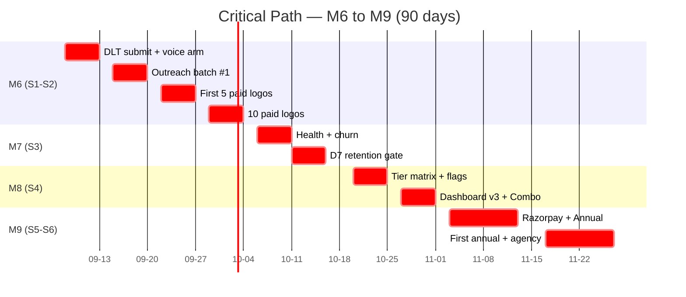

# Sprint Plan — M6–M9 (6 sprints × 2 weeks, 90 days)

> **Cycle:** Mon 09:30 IST sprint planning → Fri 17:00 IST retro. **Velocity target:** 14 ED/sprint baseline, 18 ED on Advanced UI sprint. **Owner-gating budget:** ≤ 30 min/day on push/deploy/external sends.

## Calendar (2026-09-08 → 2026-11-28)

| Sprint | Start (Mon) | End (Fri) | Working days | Theme | Owner-gating actions (count) |
|---|---|---|---|---|---|
| S1 | 2026-09-08 | 2026-09-19 | 10 | **M6 starter** — first 5 deals, voice DLT submit | 4 (1 DLT arm, 1 voice arm, 1 first push, 1 first deploy) |
| S2 | 2026-09-22 | 2026-10-03 | 10 | **M6 scale** — outreach automation, reply agent | 3 (1 reply-agent arm, 1 deploy, 1 close-milestone push) |
| S3 | 2026-10-06 | 2026-10-17 | 10 | **M7 customer success** — health score, churn signals | 3 (1 deploy, 1 close-milestone, 1 D7-gate arm) |
| S4 | 2026-10-20 | 2026-10-31 | 10 | **M8 Advanced UI** — tier-aware dashboard | 4 (1 deploy, 1 Combo arm, 1 agency prep, 1 first agency push) |
| S5 | 2026-11-03 | 2026-11-14 | 10 | **M9 SKU packaging** — Annual + Agency | 3 (1 Razorpay arm, 1 deploy, 1 Annual arm) |
| S6 | 2026-11-17 | 2026-11-28 | 10 | **M9 close + retro + M10 plan** | 4 (1 first annual close, 1 first agency close, 1 retro push, 1 charter amend) |

Total: **60 working days**, **21 owner-gating moments**.

---

## Sprint 1 — M6 starter (2026-09-08 → 2026-09-19)

**Theme:** First 5 paying customers + voice DLT submission

### Critical-path tasks (🔴)
1. **M6-S1-001**: DLT template submission (Sumit + DLT vendor, ~2 ED)
2. **M6-S1-002**: Vobiz DID provisioning (Sumit + Vobiz, 1 ED)
3. **M6-S1-003**: Voice channel arm for 1 pilot tenant (Sumit decision + ops-engineer, 0.5 ED)
4. **M6-S1-005**: Outreach batch #1 (50 Nagpur solar leads, 2 ED)
5. **M6-S1-006**: Reply agent coaching (1.5 ED)
6. **M6-S1-007**: Booked-call scheduler (1 ED)
7. **M6-S1-008**: Closing SOP (1 ED)
8. **M6-S1-009**: UPI payment + activation verify (0.5 ED)
9. **M6-S1-012**: Voice DLT regression runbook (1 ED)

### Sprint goal (Definition of Done)
- ✅ DLT submitted (3 templates)
- ✅ 1 Vobiz DID live
- ✅ Voice arm flag toggled for 1 pilot tenant
- ✅ 50 outreach leads ready
- ✅ 5 booked calls
- ✅ **First 1 paid logo activated** (₹1,999 Starter)
- ✅ Synthetic voice canary hourly, green

### Risks watched
- R-VOICE-001 (DLT slip), R-SALES-001 (first deals slip), R-PROCESS-001 (owner-gating queue)

### Owner-gating schedule
- Day 1 (Tue 09:30 IST): DLT arm permission (paperwork, no chat)
- Day 5 (Mon W2): Voice arm flip for pilot tenant
- Day 7 (Wed W2): First push (after green CI)
- Day 10 (Fri W2): First deploy + 5-min smoke verify

### Sprint review (Fri 17:00)
Demo: Nagpur solar pilot onboarded; live dashboard with 1 customer; DLT 3-template status; canary dashboard.

---

## Sprint 2 — M6 scale (2026-09-22 → 2026-10-03)

**Theme:** Outreach automation + reply agent v2 → 10 paid logos

### Critical-path tasks
1. **M6-S2-015**: Outreach batches #2 + #3 (150 leads, 2 ED)
2. **M6-S2-016**: Reply agent v2 (objection library, GPT-Swara fine-tune, 3 ED)
3. **M6-S2-017**: Closing agent v1 (Sumit approves send, 2 ED)
4. **M6-S2-018**: Sales OS dashboard (2 ED)
5. **M6-S2-022**: Combo upsell playbook (1 ED)

### Sprint goal
- ✅ 150 outreach leads ready (3 niches)
- ✅ Reply agent v2 deployed
- ✅ Closing agent in assistant mode
- ✅ Sales OS dashboard live
- ✅ **10 paid logos cumulative**
- ✅ Combo upsell playbook ready

### Risks watched
- R-SALES-002 (reply hallucination), R-SALES-004 (lead dry-up), R-VOICE-002 (voice quality)

### Owner-gating
- Day 1: Reply-agent v2 deploy approval
- Day 5: Combo upsell arm approval
- Day 10: 10-logo milestone push + retro

---

## Sprint 3 — M7 customer success (2026-10-06 → 2026-10-17)

**Theme:** Customer success loop, churn signals, D7 retention gate

### Critical-path tasks
1. **M7-S3-001**: Customer health score v1 (2 ED)
2. **M7-S3-002**: Churn signal detector (2 ED)
3. **M7-S3-003**: Proactive intervention (2 ED)
4. **M7-S3-005**: Cohort report (1.5 ED)
5. **M7-S3-012**: **D7 ≥ 50% validation GATE** (BLOCKING for Combo push)

### Sprint goal
- ✅ Health score live in CS dashboard
- ✅ Churn signals firing (with 2-of-3 confirmation)
- ✅ Proactive intervention sent (WhatsApp + in-app)
- ✅ First cohort report auto-generated
- ✅ **D7 ≥ 50% retention confirmed** (gate passes)

### Risks watched
- R-CS-001 (D7 < 50%), R-CS-002 (false-positive churn), R-CS-003 (stat noise)

### Owner-gating
- Day 1: CS dashboard deploy
- Day 5: First cohort report close
- Day 10: **D7 gate decision** — pass → Combo push in S4; fail → recovery (CS re-tune)

---

## Sprint 4 — M8 Advanced UI (2026-10-20 → 2026-10-31)

**Theme:** Tier-aware dashboard + tier gating + first Combo upgrade

### Critical-path tasks
1. **M8-S4-001**: Tier matrix in `packages.py` (1 ED)
2. **M8-S4-002**: Feature flags per tier (1.5 ED)
3. **M8-S4-003**: Customer dashboard v3 (3 ED)
4. **M8-S4-005**: Combo upgrade flow (2 ED)
5. **M8-S4-009**: Voice AI console v2 (2 ED)
6. **M8-S4-010**: Billing portal (1 ED)
7. **M8-S4-014**: **First Combo upgrade GATE** (BLOCKING for agency prep)

### Sprint goal
- ✅ Tier matrix shipped
- ✅ All flags wired
- ✅ Dashboard v3 live for all 10 paying customers
- ✅ Combo upgrade flow tested
- ✅ **First Combo upgrade** (Starter ₹1,999 → Combo ₹5,999)
- ✅ Voice AI console v2 visible to owner

### Risks watched
- R-UI-001 (flag misconfig), R-UI-002 (perf regression), R-PBILL-003 (UPI verify false-positive)

### Owner-gating
- Day 1: Tier matrix deploy
- Day 5: Combo upgrade arm
- Day 7: Voice console v2 deploy
- Day 10: First Combo upgrade gate + agency prep push

---

## Sprint 5 — M9 SKU packaging (2026-11-03 → 2026-11-14)

**Theme:** Annual + Agency SKUs + Razorpay integration

### Critical-path tasks
1. **M9-S5-001**: Annual Starter SKU (1 ED)
2. **M9-S5-002**: Agency plan SKU (1 ED)
3. **M9-S5-003**: Razorpay integration for annual billing (2 ED)
4. **M9-S5-004**: Annual plan change UI (2 ED)
5. **M9-S5-005**: Agency sub-account onboarding wizard (2 ED)
6. **M9-S5-006**: White-label token provisioning (1 ED)
7. **M9-S5-007**: Annual contract template (1 ED)

### Sprint goal
- ✅ Annual SKU in `packages.py`
- ✅ Razorpay annual recurring billing live
- ✅ Agency plan (₹25,999/mo) configured
- ✅ White-label tokens provisioned for 1 pilot agency
- ✅ Annual contract T&C signed off by Sumit
- ✅ Pricing page refreshed

### Risks watched
- R-PBILL-001 (Razorpay webhook race), R-PBILL-004 (proration edge cases), R-UI-004 (agency tenant leak)

### Owner-gating
- Day 1: Razorpay arm approval
- Day 5: Annual SKU deploy
- Day 10: First annual push (no customer yet, just deploy)

---

## Sprint 6 — M9 close + retro + M10 plan (2026-11-17 → 2026-11-28)

**Theme:** First annual + agency customer, retros, M10 charter

### Critical-path tasks
1. **M9-S6-001**: 50-logo milestone retrospective
2. **M9-S6-002**: MRR ≥ ₹1.5L validation
3. **M9-S6-003**: D7 ≥ 50% validation
4. **M9-S6-004**: First annual customer onboarding
5. **M9-S6-005**: First agency customer onboarding (1.5 ED)
6. **M9-S6-006**: M10 SOC2 Type 1 prep kickoff (2 ED)
7. **M9-S6-008**: Charter renewal M10–M13

### Sprint goal
- ✅ **50 paying logos** cumulative
- ✅ **MRR ≥ ₹1.5L**
- ✅ **D7 ≥ 50%** confirmed (re-confirmed at end)
- ✅ **First annual customer** onboarded
- ✅ **First agency customer** onboarded
- ✅ SOC2 vendor selected
- ✅ M10 charter drafted

### Risks watched
- R-PBILL-002 (annual refund-claim), R-COMPLY-001 (DPDP purge for cancelling customers)

### Owner-gating
- Day 1: First annual close (Sumit)
- Day 5: First agency close (Sumit)
- Day 8: Retro push
- Day 10: Charter amendment + M10 plan push

---

## Critical path visualization

---

## Sprint ceremonies

| Ceremony | When | Who | Duration |
|---|---|---|---|
| Sprint planning | Mon 09:30 IST | Sumit + lead | 30 min |
| Daily standup | Daily 10:00 IST (async) | All agents post status | 5 min |
| Mid-sprint check-in | Wed 16:00 IST | Sumit + lead | 15 min |
| Sprint review | Fri 17:00 IST | Sumit + lead + customer-facing agents | 30 min |
| Sprint retro | Fri 17:30 IST | Sumit + lead | 30 min |

---

## Velocity tracking (per-sprint measurement)

| Sprint | Planned (ED) | Actual (ED) | Velocity index | Notes |
|---|---|---|---|---|
| S1 | 14 | TBD | TBD | First sprint — calibration |
| S2 | 14 | TBD | TBD | |
| S3 | 14 | TBD | TBD | |
| S4 | 18 | TBD | TBD | Largest sprint (Advanced UI) |
| S5 | 11 | TBD | TBD | |
| S6 | 11 | TBD | TBD | |

**Velocity index** = Actual / Planned.
- ≥ 1.0 = on or above target
- 0.8–0.99 = amber; investigate
- < 0.8 = red; mid-sprint review triggered

---

## Mid-charter review trigger

If any of:
- Velocity index < 0.8 for 2 consecutive sprints
- Any 🔴 risk realized for > 24h without mitigation
- Owner-gating queue > 5 actions/day sustained for 1 week

→ Mid-charter review meeting (Sumit + all leads), scope amendment or schedule re-pin within 48h.