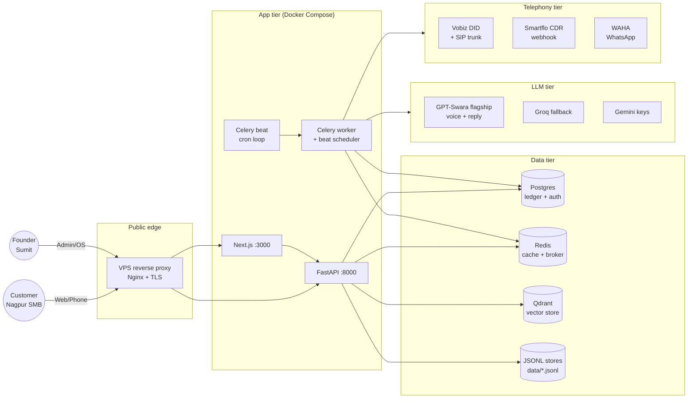
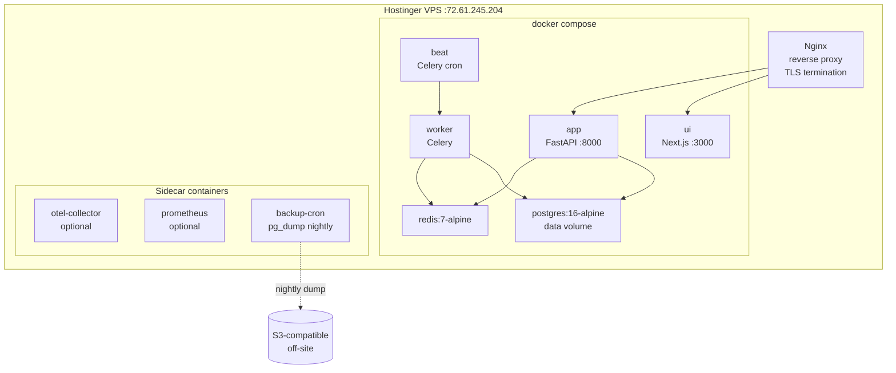
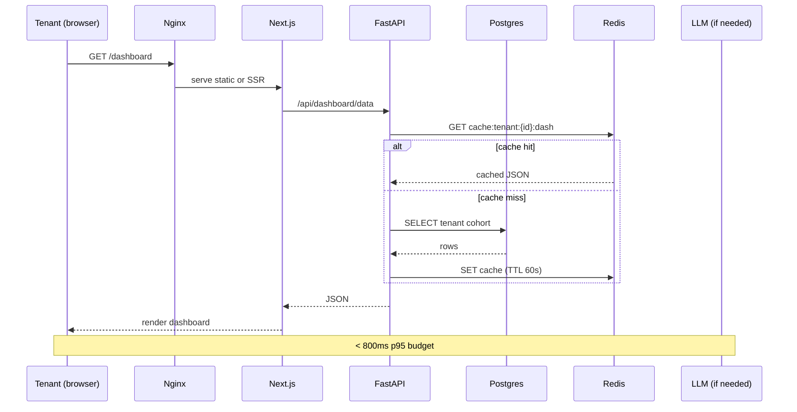
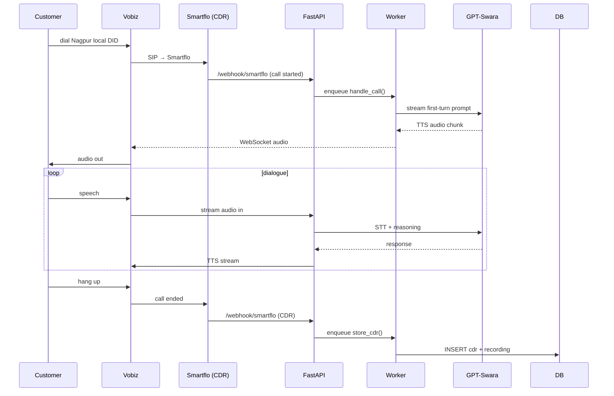
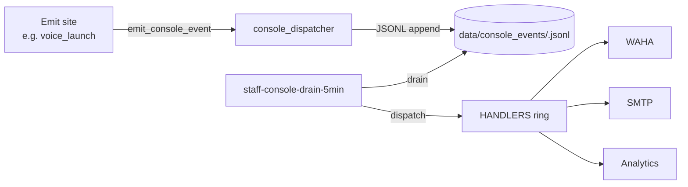
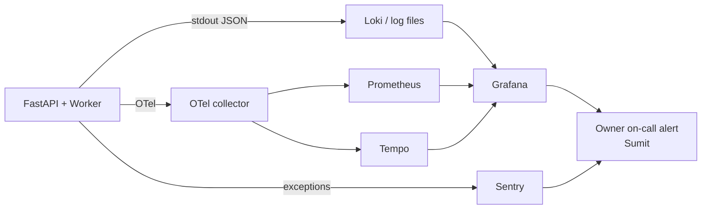

# Architecture — LeadGen AI (high-level + low-level, M6–M9 state)

> **Source:** consolidates `docs/ARCHITECTURE.md`, `docs/ARCHITECTURE_BLUEPRINT.md`, `docs/UNITY_VIRTUAL_OFFICE_ARCHITECTURE.md`, `docs/FINAL_INFORMATION_ARCHITECTURE.md`. Diagrams are Mermaid (renders inline on GitHub + in our preview panel).
> **Last updated:** 2026-09-05 (post-M5, pre-M6)

## High-level system architecture



---

## Container architecture (Docker Compose on Hostinger VPS)



---

## Request flow (typical tenant dashboard load)



---

## Voice call flow (Vobiz DID → Swara → customer)



---

## Console event dispatcher flow (M2/M5)



---

## Customer data isolation (per-tenant boundary)

```mermaid
flowchart TB
    Req[HTTP request] --> MW[tenant_scope middleware]
    MW -->|extract tenant_id from JWT| Ctx[request.ctx.tenant_id]
    Ctx --> ORM[ORM query filter<br/>always tenant_id = ctx]
    ORM --> DB[(Postgres + JSONL)]
    Ctx --> Cache[Redis key prefix<br/>tenant:{id}:*]
    Ctx --> Vector[Qdrant collection<br/>tenant_{id}]
    Note[Every query path<br/>MUST flow through tenant_scope] -.-> MW
```

**Invariant:** every read/write MUST pass `tenant_scope` middleware. ORM raw SQL without filter is a P0 bug.

---

## Observability layer



---

## Module organization (FastAPI app)

```
app/
├── main.py                 # FastAPI app + middleware + routers
├── api/                    # HTTP routes (1406 ops)
│   ├── product_consoles.py # 8 EVENT_SLOTS — single source of truth
│   ├── revenue_sprint.py
│   ├── admin_*.py          # admin endpoints (RBAC-gated)
│   └── ...
├── automation/             # Console dispatcher, schedulers
│   ├── console_dispatcher.py  # M2 durable contract
│   ├── console_events.py
│   └── ...
├── agents/                 # AI staff agents (28 of them)
│   ├── sales_team.py
│   ├── reply_agent.py
│   └── ...
├── billing/                # Billing truth
│   ├── subscription.py
│   ├── packages.py         # Tier matrix
│   └── ...
├── marketing/              # Marketing automation
├── platform/               # Cross-cutting (auth, runtime-data, RBAC)
│   ├── runtime_data_authority.py
│   ├── runtime_data_allowlist.py
│   ├── runtime_data_manifest.py
│   └── ...
├── telephony/              # Vobiz, Smartflo, voice
│   ├── vobiz_stream.py
│   ├── smartflo_*.py
│   └── voice_*.py
├── voice_agent/            # GPT-Swara integration
├── ml/                     # Models, vector store
├── integrations/           # WhatsApp (WAHA), email, HubSpot, Google
├── api/                    # REST + MCP routes
├── middleware/             # tenant_scope, RBAC, OTel
└── ...
```

---

## Layer boundaries

1. **API tier** (`app/api/`): thin — receives HTTP, validates, dispatches. No business logic.
2. **Domain tier** (`app/agents/`, `app/billing/`, `app/marketing/`): business logic, transactional scripts.
3. **Platform tier** (`app/platform/`): cross-cutting concerns — auth, RBAC, runtime-data, observability, MCP.
4. **Integration tier** (`app/integrations/`, `app/telephony/`, `app/voice_agent/`): external systems — adapters only, never domain logic.
5. **Data tier**: Postgres, Redis, Qdrant, JSONL. All writes flow through runtime-data allowlist gate.

---

## Cross-cutting patterns

- **Runtime-data allowlist**: every JSONL write to `data/*.jsonl` MUST be bound to a `runtime_data_allowlist_entries.py` entry. UNDECLARED → BLOCKING in CI. Source: `app/platform/runtime_data_allowlist.py`.
- **Tenant scope middleware**: every request MUST carry tenant_id; raw SQL without filter is a P0. (`. `app/middleware/tenant_scope.py`.)
- **Voice kill-switch**: `VOICE_LAUNCH_KILL=1` blocks all voice dispatch. Owner-gated arm.
- **Console event dispatcher**: durable envelope between product consoles and worker. (M2; `app/automation/console_dispatcher.py`.)
- **Owner-gating protocol**: external actions (push, deploy, outbound sends, payments, refunds) require explicit owner approval. (See `15_OWNER_GATING_PROTOCOL.md`.)
- **DPDP purge**: 8-step idempotent purge before customer deletion. (`app/platform/dpdp.py`.)
- **MCP gate**: `/mcp` endpoint mounted only with token + RBAC. (`app/api/mcp.py`.)

---

## Architecture decision log (ADRs)

See `docs/ADR-*.md` for individual decisions. Top-level:
- **ADR-001**: repo cleanup (2025)
- **ADR-104**: deploy runbook (2026)
- **ADR-150**: owner_os coordination hub (2026-08-04)
- **ADR-154**: platform.workforce_memory hub (2026-08-03)
- **ADR-158/161**: memory_governance (do-not-remember + audit, 2026-08-05)
- **ADR-177**: marketing.gsc_rankings (2026-08-11)
- **ADR-009**: COMBO product gate (2026)

ADR template: context → options → decision → consequences. New ADRs required for: new external integration, schema change > 1 table, RBAC change, feature flag add/remove.

---

## Performance budgets

| Path | p50 | p95 | p99 | SLA breach = P2 |
|---|---|---|---|---|
| `/api/dashboard/*` | < 200ms | < 800ms | < 1.5s | > 2s |
| `/api/voice/*` | < 100ms | < 400ms | < 800ms | > 1s (call quality risk) |
| `/api/admin/*` | < 500ms | < 1.5s | < 3s | > 4s |
| Webhook handlers | < 50ms | < 200ms | < 500ms | > 1s (replay risk) |
| Worker task dispatch | < 1s | < 5s | < 30s | > 60s (queue depth risk) |

Enforced via Grafana SLO board (CC-004). Breach auto-pages Sumit.

---

## Capacity targets (M9 end)

| Metric | Target | Buffer |
|---|---|---|
| Active tenants | 50 | 100 (auto-scale pre-empt at 70%) |
| Daily voice calls | 500 | 1000 |
| Daily WhatsApp messages | 5000 | 10000 |
| Daily LLM API calls | 20000 | 50000 |
| Daily UPI transactions | 100 | 500 |
| Storage (Postgres) | 50 GB | 100 GB |
| Storage (JSONL) | 20 GB | 50 GB |
| Storage (Qdrant) | 5 GB | 10 GB |
| Bandwidth | 1 TB / mo | 3 TB / mo |

Capacity review at end of S4; pre-emptive upgrade if approaching target.