# CI/CD Pipeline — LeadGen AI (design + deployment strategy)

> **Source:** `.github/workflows/`. **Owner:** sre-engineer (R), Sumit (A), infra-doctor (C).

## Pipeline overview

```mermaid
flowchart LR
    Dev[Developer / AI agent<br/>commits to feature branch] -->|push| PR[Open PR]
    PR -->|triggers| PRCI[PR CI<br/>ci.yml + tests.yml]
    PRCI -->|status check| Review[Code review<br/>code-reviewer agent]
    Review -->|approve| Merge[Merge to main]
    Merge -->|triggers| MainCI[Main CI<br/>ci.yml gate + tests]
    MainCI -->|gate green| DeployGate[release-gate]
    DeployGate -->|DEPLOY_ENABLED=true| Build[Build image<br/>GHCR :sha]
    Build --> Deploy[Deploy to VPS<br/>via deploy-vps.yml]
    Deploy --> Smoke[Post-deploy smoke<br/>5 min, 6 checks]
    Smoke --> Monitor[Sentry + Grafana<br/>alert on anomaly]
```



---

## Pipeline stages (per environment)

### 1. PR CI (per push to feature branch)

| Stage | Tool | Blocking? | Trigger |
|---|---|---|---|
| Lint + secrets | `ruff`, `detect-secrets` | YES | every push |
| Syntax check | `python -m py_compile` | YES | every push |
| SAST | `bandit`, CodeQL | YES | every push |
| Dependency audit | `pip-audit` | YES (critical CVE only) | every push |
| Trivy repo scan | `trivy-action` | YES | every push |
| Trivy image scan | `trivy-action` (build explicit ref) | YES | every push |
| Test (4 shards) | `pytest --splits 4` | YES | every push |
| Contract tests | `pytest tests/test_billing_truth_2026.py` | **YES (BLOCKING)** | every push |
| Prod check | `python scripts/prod_check.py` | **YES (BLOCKING)** | every push |
| Gate A (sketch) | Gate-A | advisory | every push |
| Ratchet | `runtime-data ratchet` | YES | every push |
| Coverage report | `coverage.py` | YES (>= 80% on touched) | every push |
| Harness real-redis | integration | YES | every push |

Owner-blocking gates: lint, prod_check, billing-truth, runtime-data ratchet, dependency CVE (critical), pytest, secrets.

### 2. Main CI (on push to main)

| Stage | Tool | Blocking? |
|---|---|---|
| Gate job | Same as PR CI, single job | YES |
| Release gate | depends on Gate | YES |
| Build | `docker/build-push-action` | only if `DEPLOY_ENABLED=true` |
| Deploy | SSH + `leadgen-deploy-release` wrapper | only if `DEPLOY_ENABLED=true` |

---

## CI workflow files

| File | Purpose | Runs on |
|---|---|---|
| `ci.yml` | PR + main gate (lint, prod_check, billing, ratchet, security) | PR + push to main |
| `tests.yml` | Parallel pytest 4-shard | PR + push to main |
| `deploy-vps.yml` | Build + deploy to VPS | push to main (gated by DEPLOY_ENABLED) |
| `security-scan.yml` | Daily SAST/DAST/dependency scan | schedule (cron) |
| `migrations.yml` | DB migration dry-run on PR | PR (when `app/platform/runtime_data*.py` or migrations change) |
| `pr-factory-ci-repair.yml` | Auto-fix CI failures on owner PRs | PR |
| `pr-factory-gate-a.yml` | Gate-A sketch | PR |
| `auto-merge.yml` | Auto-merge Dependabot | PR from Dependabot |
| `dsh-runtime.yml` | DSH runtime probes | schedule |
| `uptime.yml` | Uptime check + alert | schedule (5 min) |
| `llm-eval.yml` | LLM-as-judge eval suite | schedule (weekly) |

---

## Deployment strategy

### Default: rolling deploy via Compose

- Pull new image, take down old `app` container, start new one.
- Rollback = re-tag previous image + redeploy (auto within 60s via `leadgen-deploy-release`).
- Concurrency: `cancel-in-progress: false` (racing a half-deployed image is worse than waiting).

### When to use blue-green

- Pricing changes (`packages.py`)
- Schema migrations (forward + backward)
- Auth/RBAC changes
- Voice channel arm/disarm
- Any change Sumit flags as "high-risk"

Blue-green procedure (manual, owner-gated):
1. Run new image as `app_blue` alongside current `app`
2. Caddy/Nginx routes `/api` to BOTH, weighted 95/5
3. Monitor for 15 min (Sentry error rate, p95 latency, billing truth)
4. If green → flip weight to 100/0
5. If red → flip weight back, kill `app_blue`, RCA

### When to use canary

- Voice channel arm for new tenant (1 pilot, monitored for 24h before scale)
- New LLM model rollout (1% traffic for 48h, then 10%, then 100%)
- New feature flag flip (1 paying tenant for 1 week before fleet)

---

## Image build + retention

- **Image tag**: `ghcr.io/sumitrevolt/leadgenrationaivoiceagent:<sha>` (immutable)
- **Retention**: 14-day rolling; nightly cron prune (`scripts/deploy_image_retention.py`)
- **Re-deploy**: previous image is still on GHCR for ≤ 14 days; VPS-side rollback pulls `<prev-sha>` and starts it.
- **Build args**: `APP_VERSION=<sha>`, `BUILD_DATE=<iso>`

---

## Secrets handling

- **No secrets in image**. Secrets come from `.env` on VPS (mode 600) at container start.
- **GitHub Actions secrets**: `VPS_HOST`, `VPS_USER`, `VPS_SSH_KEY_DEPLOY`, `GHCR_PAT` (legacy), `SENTRY_DSN`.
- **Secret rotation**: quarterly (Sumit decision, no automated).
- **Secret leak detection**: `detect-secrets` pre-commit + GitHub secret-scanning + GH push protection.

---

## Post-deploy smoke (5 minutes, 6 checks)

```yaml
post-deploy-smoke:
  - /health/ready → 200
  - /api/dashboard/sample → 200, JSON valid
  - billing_truth_test inline → green
  - voice synthetic canary → green (or skipped if kill-switch ON)
  - runtime-data ratchet → 0 new UNDECLARED
  - first tenant dashboard → 200, < 1.5s p95
```

If any check fails → auto-rollback to previous image, auto-page Sumit.

---

## Self-healing workflows

1. **Container crash loop**: docker compose auto-restarts 3× then alerts SRE
2. **VPS unreachable**: Hostinger snapshot + standby VPS warm-DNS (T+5 min)
3. **DB connection storm**: pgbouncer limits + worker circuit breaker
4. **LLM provider down**: failover Groq ↔ GPT in < 30s, queue replay
5. **Voice DID exhausted**: auto-failover to Smartflo SIP-trunk
6. **Image registry down**: cached on VPS for 24h, no immediate impact

---

## Concurrency + safety

- `concurrency.cancel-in-progress: false` on every deploy workflow
- Pre-deploy gate: `git log main..HEAD --oneline` shows green CI
- Owner-gating: every deploy requires explicit `deploy / ship / go / M{n}` from Sumit
- Post-deploy gate: 5-min smoke; if fail → auto-rollback

---

## Metrics (per deploy)

| Metric | Target | Source |
|---|---|---|
| Lead time (commit → prod) | < 4 hours | GitHub Actions timestamps |
| Deploy frequency | 1 per day average, 3 per sprint | GitHub Actions runs |
| Mean time to recovery (MTTR) | < 30 min P0/P1 | Sentry + uptime |
| Change failure rate | < 5% | Sentry error rate post-deploy vs pre |
| Rollback rate | < 10% | `leadgen-deploy-release` history |

Quarterly review: did we improve? Where?

---

## Pipeline failure modes + recovery

| Failure | Detection | Recovery | Owner |
|---|---|---|---|
| Gate flaky (e.g. timeout) | CI fail, retry-once | Manual re-trigger | code-reviewer |
| Prod check fail on main | Auto-block | Fix-and-retry or revert | staff-engineer |
| Image build fail | Build fail | Pin to last-known-good SHA, RCA | sre-engineer |
| Deploy to VPS fail | SSH timeout | Re-pull previous image, RCA | sre-engineer |
| Smoke fail | 5-min smoke | Auto-rollback, auto-page | sre-engineer |
| GHCR outage | Push fail | Build re-try with retry-once | sre-engineer |
| VPS unreachable | Deploy hang | Failover to standby VPS | sre-engineer |

---

## What owner gates vs what CI gates

| Action | Owner-gated? | CI-gated? |
|---|---|---|
| Push to remote | YES (Sumit `push`) | YES (all checks green) |
| Trigger deploy workflow | YES (Sumit `deploy / ship`) | YES (release-gate) |
| Send bulk WhatsApp / email | YES (Sumit `send`) | YES (rate-limit) |
| Auto-merge Dependabot | NO (auto-merge.yml) | YES (CI green) |
| Rollback (auto on smoke fail) | NO (auto) | YES (smoke fail) |
| Emergency rollback (manual) | YES (Sumit `rollback <sha>`) | NO (immediate) |
| Migrations | YES (Sumit approve) | YES (dry-run) |
| Feature flag flip | YES (Sumit `arm <flag>`) | YES (test in CI) |

---

## Self-healing examples (concrete)

### SH-01: Container OOM
- Detection: docker compose exits 137
- Auto-action: restart (backoff 1s/5s/30s)
- After 3 restarts: alert sre-engineer
- After 5: auto-rollback to previous image

### SH-02: Celery worker crash
- Detection: process exits non-zero
- Auto-action: restart (1s backoff)
- After 3: alert ops-engineer
- After 5: scale up worker count via compose up

### SH-03: DB pool exhaustion
- Detection: SQLAlchemy `QueuePool limit` error
- Auto-action: worker gracefully retries with jitter
- After 5s sustained: page sre-engineer + reduce worker concurrency
- After 60s: stop new requests, return 503, alert

### SH-04: Voice DID down
- Detection: Vobiz webhook returns 5xx 3×
- Auto-action: voice kill-switch auto-arm (`VOICE_LAUNCH_KILL=1`)
- After arm: page Sumit, RCA within 30 min

### SH-05: LLM provider rate-limit
- Detection: 429 response from provider
- Auto-action: switch to backup (Groq ↔ GPT)
- Queue replay for failed tasks
- After 1h: scale up provider quota OR page Sumit

---

## Pipeline as code (key files)

- `.github/workflows/ci.yml`
- `.github/workflows/deploy-vps.yml`
- `.github/workflows/tests.yml`
- `.github/workflows/security-scan.yml`
- `.github/workflows/migrations.yml`
- `.github/workflows/pr-factory-ci-repair.yml`
- `scripts/prod_check.py`
- `scripts/deploy_image_retention.py`
- `scripts/skill_evals/check_repo_skills.py`

---

## Future improvements (M10+ backlog)

- **Auto-rollback on SLO breach** (currently only on smoke fail)
- **Progressive delivery** (Flagger / Argo Rollouts) for safer canary
- **Predictive alerting** (anomaly detection on deploy error rate)
- **Self-service dashboards** (per-tenant Grafana boards)