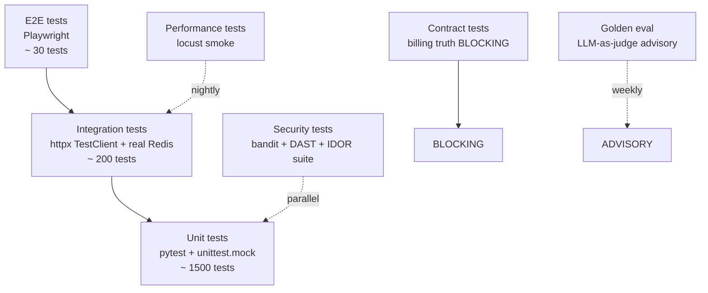

# Testing Strategy — LeadGen AI (unit, integration, performance, security)

> **Owner:** qa-test-engineer (R), Sumit (A), staff-engineer (C). **Coverage gate:** ≥ 80% on touched files, 100% on billing/voice/auth/DPDP code paths.

## Test pyramid

---

## 1. Unit tests

| Layer | Target | Tools | Coverage |
|---|---|---|---|
| Domain logic | `app/agents/`, `app/billing/`, `app/marketing/` | pytest + respx | ≥ 80% |
| Platform | `app/platform/runtime_data*.py`, `app/platform/dpdp.py` | pytest + fixtures | ≥ 90% (critical) |
| Voice | `app/voice_agent/`, `app/telephony/` | pytest + mock LLM | ≥ 85% |
| Auth + RBAC | `app/middleware/`, JWT helpers | pytest + TestClient | 100% (critical) |

**Conventions:**
- One test file per module (`tests/test_<module>.py`)
- Fixture for `client`, `db`, `redis`, `mock_llm`
- Mock external services (WAHA, Vobiz, Razorpay, GPT, Groq)
- Determinism: no sleep, no real time, no real network

---

## 2. Integration tests

| Suite | What | Frequency |
|---|---|---|
| `tests/test_*_truth.py` | Pricing/billing truth | per commit (BLOCKING) |
| `tests/test_runtime_data_*.py` | Allowlist + ratchet + scanner | per commit (BLOCKING) |
| `tests/test_a4_delivery_fail_closed.py` | Voice fail-closed path | per commit |
| `tests/test_activation_first_paid_delivery.py` | First paid customer activation | per commit |
| `tests/test_admin_remove_customer.py` | Customer deletion + DPDP purge | per commit |
| `tests/harness/real-redis-integration.yml` | Real Redis worker integration | per PR |
| `tests/test_concurrent_*.py` | Concurrent requests, no race | per commit |

**Conventions:**
- Use `httpx.AsyncClient` for async endpoints
- Use real Postgres + real Redis (test DB)
- Mock LLM (deterministic, no real $$)
- Test data cleanup after each test (idempotent)

---

## 3. Performance tests

### Smoke (per commit, < 5 min)
- `locust` against staging mirror
- p50, p95, p99 latency for `/api/dashboard/*`
- Assert p95 < 800ms (matches SLO budget)

### Load (weekly, ~30 min)
- 50 concurrent users, 5 min sustained
- Monitor: CPU, memory, DB connections, Redis evictions
- Assert: error rate < 0.1%, no OOM, no connection storm

### Stress (pre-release)
- 200 concurrent, 10 min
- Document breaking point
- Auto-page if production matches stress load

---

## 4. Security tests

### SAST (per commit)
| Tool | Scope | Blocking? |
|---|---|---|
| `bandit` | Python source | YES (high/critical) |
| CodeQL | Python + JS | YES (high/critical) |
| `detect-secrets` | All files | YES (any) |
| `gitleaks` | Git history | YES (any) |
| `pip-audit` | Dependencies | YES (critical CVE) |
| Trivy | Image | YES (critical CVE) |

### DAST (weekly)
| Tool | Scope | Blocking? |
|---|---|---|
| `zap-baseline` | Staging mirror | YES (high/critical) |
| Auth bypass tests | /admin/*, /api/admin/* | YES (any |
| Tenant isolation tests | cross-tenant data probe | YES (any) |
| IDOR probe | /admin/remove-customer | YES (any) |

### Penetration (quarterly)
- External pentester (Q3 S4)
- Internal red-team exercise
- DPDP-grade consent flow audit

---

## 5. Contract tests (BLOCKING)

| File | What it asserts | Why critical |
|---|---|---|
| `tests/test_billing_truth_2026.py` | Pricing SKUs match `packages.py`, plan-change proration correct | Billing correctness = revenue + customer trust |
| `tests/test_runtime_data_baseline_governance.py` | Allowlist ↔ manifest ↔ scanner all agree | Data debt leaks → unbounded JSONL growth |
| `tests/test_runtime_data_ratchet.py` | Net-new UNDECLARED = 0 | Prevents baseline debt creeping up |
| `tests/test_runtime_data_path_allowlist.py` | Every shipped allowlist entry binds to a finding | Prevents stale/orphan entries |
| `tests/test_admin_remove_customer.py` | DPDP purge is 8-step idempotent | Compliance + customer trust |

---

## 6. Golden eval (LLM-as-judge, weekly)

| Suite | What |
|---|---|
| Hindi prosody | GPT-Swara voice quality (ELO ≥ top-2 SaaS peer) |
| Reply agent | Hallucination rate < 5%, brand-voice match ≥ 4/5 |
| Sales coach | Objection-handling ELO |
| Closing agent | Booking-conversion prediction accuracy |

Deterministic-only fallback for CI (no real LLM judge, just regex/keyword asserts). Full eval on schedule (weekly) with real LLM judge.

---

## 7. Test environment parity

| Layer | Dev | CI | Staging | Prod |
|---|---|---|---|---|
| Postgres | local docker | test DB (cleaned per run) | staging DB (subset of prod data, scrubbed) | prod DB |
| Redis | local docker | real (ephemeral namespace) | real (pre-prod namespace) | real |
| Qdrant | local docker | mock (in-memory) | real (staging collection) | real |
| LLM | mock | mock | rate-limited real (low-cost model) | full real |
| Vobiz | mock | mock | mock (sandbox DID) | real |
| WAHA | mock | mock | real (sandbox tenant) | real |
| Razorpay | mock | mock | sandbox | real |

**Principle:** tests must fail locally if they would fail in CI; tests must fail in CI if they would fail in prod.

---

## 8. Test data strategy

- **Fixtures**: small, deterministic, per-test file
- **Sample data**: `tests/fixtures/*.json` for golden inputs
- **Generated data**: factories (`factory_boy`) for larger datasets
- **Production-like data**: scrubbed (PII removed), in `tests/fixtures/prod_scrubbed/`
- **DPDP**: never use real customer data in tests; if real, anonymize via `app/platform/data_privacy.py`

---

## 9. Coverage targets

| Code path | Min coverage | Why |
|---|---|---|
| Billing (`app/billing/`) | 100% | Revenue + customer trust |
| Auth + RBAC (`app/middleware/`, `app/platform/auth.py`) | 100% | Security |
| DPDP (`app/platform/dpdp.py`) | 100% | Compliance |
| Voice (`app/voice_agent/`, `app/telephony/`) | 90% | Quality + cost |
| Marketing (`app/marketing/`) | 80% | Revenue |
| Platform (`app/platform/`) | 85% | Cross-cutting |
| Integrations (`app/integrations/`) | 70% | Adapter code, less critical |
| Scripts (`scripts/`) | 50% | Tooling |
| Tests | n/a | n/a |

**Coverage enforcement**: `coverage.py --fail-under` per directory in `tests/conftest.py`. Pre-commit + CI gate.

---

## 10. Defect leakage target

**Goal: < 1% of pre-prod bugs reach prod.**

Measurement:
- Pre-prod bugs: closed tickets before reaching `main`
- Prod bugs: opened issues + Sentry errors in prod, traced back to code change within 30 days
- Leakage = prod_bugs / (pre_prod_bugs + prod_bugs)

**If leakage > 1% for 2 consecutive sprints:** root-cause analysis, update test strategy, charter amendment if scope > 1 sprint.

---

## 11. Test observability

- All test runs report to `tests/results/` JSON (for trend analysis)
- Slowest 10 tests tracked weekly
- Flakiest 10 tests (retry rate > 5%) quarantined + RCA
- Coverage trend tracked weekly; regression > 2% triggers alert

---

## 12. Test ownership

| Test layer | Owner (R) | Reviewer (C) | Frequency |
|---|---|---|---|
| Unit | staff-engineer | qa-test-engineer | per feature |
| Integration | qa-test-engineer | staff-engineer | per feature |
| Performance | sre-engineer | frontend-engineer | weekly + pre-release |
| Security | security-engineer | infra-doctor | per PR + weekly + quarterly |
| Contract | billing-engineer / platform-engineer | code-reviewer | per commit (BLOCKING) |
| Golden | ml-engineer | reply-engineer | weekly |

---

## 13. Test anti-patterns (forbidden)

1. ❌ `time.sleep()` in tests (use `freezegun` for time, `respx` for HTTP)
2. ❌ Real LLM calls in CI (mock deterministically)
3. ❌ Real network calls in CI (mock with `respx` or `httpx_mock`)
4. ❌ Real PII in fixtures (anonymize via `data_privacy.anonymize`)
5. ❌ Shared mutable state between tests (use fixtures)
6. ❌ `pytest.skip()` to silence failures (use `@pytest.mark.xfail` with reason)
7. ❌ Tests that pass without exercising the code (always assert on behavior)
8. ❌ Skipping contract tests (BLOCKING gates)
9. ❌ Coverage exemption without reason (`# pragma: no cover` requires ADR)
10. ❌ Disabling linters to make CI green (fix the underlying issue)

---

## 14. Test metrics dashboard

Built into Grafana (`test-results` dashboard):
- Test pass rate (per layer, per day)
- Coverage trend (per file)
- Slowest tests (top 10)
- Flakiest tests (top 10)
- Coverage delta (vs last sprint)
- Defect leakage rate (rolling 30 days)