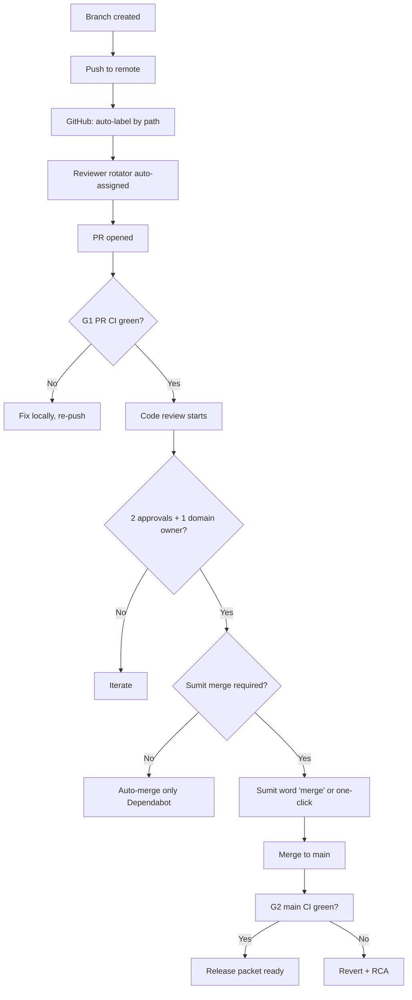

# Code Review Matrix — LeadGen AI

> **Source:** consolidates `docs/AGENT_WORK_RULES.md`, `docs/RACI_MATRIX.md`, `docs/CODE_QUALITY.md`. **Owner:** code-reviewer (R), Sumit (A), staff-engineer (C).
> **Rule of thumb:** every PR gets **2 reviewers minimum** + **1 domain owner**. No exceptions, no "minor fix bypass".

---

## Reviewer roles

| Role | Count | Cadence | Selection |
|---|---|---|---|
| **code-reviewer** (primary) | 1 | per PR | staff-engineer picks from rotator (3 names) |
| **Domain owner** (accountable) | 1 | per PR | based on `path:` label (table below) |
| **Sumit** (final merge) | 1 | per non-trivial PR | auto-attended when `path:` includes `**/billing/**`, `**/auth/**`, `**/dpdp/**`, `**/runtime_data/**`, `**/deploy-vps.yml` |

**Reviewer rotation** (3-deep, monthly):
- Slot A — `code-reviewer-A` (staff-engineer primary, generalist)
- Slot B — `code-reviewer-B` (platform-engineer, runtime-data/billing)
- Slot C — `code-reviewer-C` (telephony-engineer OR data-engineer, depending on PR label)

---

## Code-path → Reviewer matrix

| File path / directory | Domain owner | Required reviewers | Special gates |
|---|---|---|---|
| `app/automation/**` | platform-engineer | code-reviewer + platform-engineer | Runtime-data ratchet + Manifest/Allowlist binding |
| `app/auth/**`, `app/rbac/**` | security-engineer | code-reviewer + security-engineer + Sumit | Auth bypass test + IDOR probe |
| `app/billing/**` | billing-engineer | code-reviewer + billing-engineer + Sumit | **Billing-truth contract test + 100% coverage** |
| `app/compliance/dpdp/**` | compliance-engineer | code-reviewer + compliance-engineer + Sumit | **8-step idempotent purge test + audit-chain HMAC verify** |
| `app/voice/**` | telephony-engineer | code-reviewer + telephony-engineer | Synthetic canary + DLT-template gate |
| `app/marketing/**` | marketing-engineer | code-reviewer + marketing-engineer | Conversion-funnel integrity + DLT-template gate (outbound) |
| `app/customer_success/**` | cs-engineer | code-reviewer + cs-engineer | Health-score formula review + cohort repro |
| `app/agentic/reply/**`, `app/agentic/closing/**` | sales-engineer | code-reviewer + sales-engineer + data-engineer | **LLM-eval (deterministic) + prompt-injection test** |
| `app/platform/runtime_data_manifest.py`, `app/platform/runtime_data_allowlist_entries.py` | platform-engineer | code-reviewer + platform-engineer + Sumit | **Declared ↔ detected bidirectional ratchet** |
| `app/platform/feature_flags.py`, `app/platform/tier_matrix.py` | platform-engineer | code-reviewer + platform-engineer + Sumit | Tier-feature allowed-list parity |
| `migrations/**` | platform-engineer | code-reviewer + platform-engineer + Sumit | Migration dry-run + back-out plan in ADR |
| `app/deploy/**`, `.github/workflows/deploy-vps.yml` | sre-engineer | code-reviewer + sre-engineer + Sumit | Concurrency-safe + smoke-required + DEPLOY_ENABLED gate |
| `docs/ADR-*.md` | lead-engineer | Sumit (sole reviewer for ADRs) | Format + rationale + alternatives + reversibility |
| `deliverables/**` | lead-engineer | Sumit (sole reviewer for deploy packets) | Deploy packet checklist |
| `tests/**` | qa-test-engineer | code-reviewer + qa-test-engineer | Coverage delta ≤ -1% on touched files |
| All other files | staff-engineer | code-reviewer + staff-engineer | standard G1 gates |

---

## PR creation → review flow

---

## Approval matrix by PR kind

| PR kind | Required approvals | Owner merge | Auto-merge eligible? |
|---|---|---|---|
| Dependabot version-bump | 0 (CI only) | NO | **YES** (if G1 green + only manifest changes) |
| `docs/**` (typo, clarification) | 1 | NO | NO (must be reviewed once) |
| New feature flag (tier=off) | 1 + domain owner | NO | NO |
| Feature flag flip to ON (tier=on) | 2 + domain owner | **YES** (Sumit one-click) | NO |
| Bug fix (single file) | 1 + domain owner | NO | NO |
| Refactor (no behaviour change) | 2 + domain owner | NO | NO |
| Schema migration | 2 + platform-engineer + Sumit | **YES** | NO |
| RBAC change | 2 + security-engineer + Sumit | **YES** | NO |
| Billing logic change | 2 + billing-engineer + Sumit | **YES** | NO |
| DPDP flow change | 2 + compliance-engineer + Sumit | **YES** | NO |
| LLM prompt change | 2 + sales-engineer + data-engineer + Sumit | **YES** | NO |
| Voice/Kill-switch flag flip | 2 + telephony-engineer + Sumit | **YES** | NO |
| Production deploy workflow | 2 + sre-engineer + Sumit | **YES** | NO |
| External service onboarding | 2 + lead-engineer + Sumit | **YES** | NO |
| Charter amendment | 1 (Sumit) | **YES (Sumit sole)** | NO |

---

## Reviewer checklist (per PR)

Every reviewer MUST verify and stamp inline before approving:

### Universal (all PRs)

- [ ] **L0 purpose**: 1-sentence "why" in PR title or description
- [ ] **Tests added/updated**: behaviour change ships with a test
- [ ] **No print/console.log** left behind
- [ ] **No hardcoded secret/credential** (gitleaks auto-rejects)
- [ ] **No new runtime-data debt** (ratchet holds)
- [ ] **Backout plan** in PR description for any infra/schema change
- [ ] **Changelog** updated (last commit includes CHANGELOG.md entry)

### Domain-specific

| Domain | Add-on check |
|---|---|
| Billing | [ ] `tests/test_billing_truth_2026.py` still green; [ ] pricing in code matches pricing in T&C; [ ] no midnight-UTC race introduced |
| Voice | [ ] DLT-template ID present if outbound; [ ] kill-switch default ON for new tenants; [ ] synthetic canary can run locally |
| Marketing | [ ] conversion tracking tagged; [ ] outbound rate-limit aware; [ ] no PII in logs |
| DPDP | [ ] purge idempotent within 24h; [ ] audit log HMAC unchanged; [ ] retention ≤ 90d for voice recordings |
| Auth/RBAC | [ ] tenant-scope middleware present in every endpoint; [ ] no `request.headers["x-tenant-id"]` trust; [ ] admin paths gated by `require_admin` |
| LLM | [ ] deterministic eval for prompt change; [ ] prompt-injection probe passed; [ ] cost per call logged |
| Migrations | [ ] dry-run passed against fresh DB; [ ] back-out migration tested; [ ] ADR-*.md added |
| Platform/runtime-data | [ ] scanner finds ≥ declared entries; [ ] declared entries ≤ scanner finds; [ ] no `_mutable_symbols` ternary left (`if/else` only) |
| Deploy workflow | [ ] `concurrency.cancel-in-progress: false`; [ ] DEPLOY_ENABLED gate honoured; [ ] smoke verify before going live |

---

## Review timing SLA

| PR size | First review within | Merge window |
|---|---|---|
| Small (≤ 50 lines, 1 file) | 4 working hours | within 24h |
| Medium (≤ 200 lines, ≤ 3 files) | 1 working day | within 3 days |
| Large (≤ 500 lines, ≤ 10 files) | 2 working days | within 1 week |
| XL (≥ 500 lines) | MUST be split OR explicit Sumit override | within 2 weeks |

**Review SLA breach** = lead-engineer paged.

---

## Reviewer quality (per-persona metrics)

| Metric | Target |
|---|---|
| First-review median time | < 8 working hours |
| Reviewer round-trip (iter) | ≤ 2 (re-pushes before merge) |
| Comments per PR | ≥ 3 substantive (NOT nit-picks) |
| False approval rate | < 5% (caught in G2 main CI or post-deploy) |
| Reviewer-side bug rate | < 1 bug per 100 approvals (caught post-merge) |

---

## Anti-patterns (will block merge)

1. ❌ **"LGTM but I didn't actually read it"** — every approval must include ≥ 1 substantive question or confirmation
2. ❌ **"Approved without running it locally"** — for `app/billing/**`, `app/auth/**`, `app/voice/**`, the reviewer MUST show CI artifact of local test run
3. ❌ **Approval on a PR that includes the reviewer's own commit** — must re-assign OR explicit Sumit override
4. ❌ **"Looks good, ship" with no tests** — every behaviour change needs a test, no exceptions
5. ❌ **Override declared-vs-detected mismatch with `# pragma: allow` comment** — escalate to platform-engineer
6. ❌ **Reviews of > 1000-line diffs** — PR must be split or Sumit override
7. ❌ **Approval during error-budget freeze** — only Sumit can approve during a freeze
8. ❌ **Skipping domain owner** because they're "unavailable" — SLA = 2 days, then lead-engineer steps in

---

## When Sumit IS the code reviewer (rare)

Sumit reviews directly (sole approver) only on:
- **Charter amendments** (`docs/PLANNING_*` or ADR)
- **Cross-cutting governance changes** (e.g. new agent role in `AI_WORKFORCE.md`)
- **Single-file critical fixes** for P0 incidents with full RCA attached
- **Architecture decisions** that cross module boundaries

In all other cases, Sumit acts as the **Accountable** (merge approval) not the **Responsible** (reviewer).

---

## Reviewer-onboarding (per new agent / reviewer)

| Step | Action | Owner |
|---|---|---|
| 1 | Read this matrix + `docs/AGENT_WORK_RULES.md` + last 3 incident RCAs | new reviewer |
| 2 | Shadow 3 PRs with reviewer rotator | code-reviewer primary |
| 3 | Co-review 3 PRs (review + Sumit sanity check) | Sumit |
| 4 | Solo-review 3 PRs in `path: app/platform/**` (lowest risk) | code-reviewer primary |
| 5 | Graduated to full reviewer; logged in `code-reviewer-rotator.md` | lead-engineer |

---

## Code Review meetings (rhythm)

| Cadence | Attendees | Purpose |
|---|---|---|
| Daily async | code-reviewer + lead | Triage open PRs > 24h old |
| Weekly (Fri 16:00 IST) | Sumit + lead + code-reviewer + qa-test-engineer | Reviewer-quality metrics, anti-pattern catches |
| Monthly | All reviewers | Rotator refresh, threshold tuning |

---

## Reviewer RACI quick reference (per PR)

| Review role | R | A | C | I |
|---|---|---|---|---|
| code-reviewer | ✅ (does the review) | | | |
| domain owner | ✅ (domain correctness) | ✅ (signs off in domain) | | |
| Sumit | | ✅ (final merge for high-risk) | | |
| qa-test-engineer | ✅ (test coverage check) | | ✅ (CI gate) | ✅ (reviewer) |
| security-engineer | | | ✅ (for `app/auth/**`, `app/billing/**`) | ✅ (always) |
| sre-engineer | | | ✅ (for deploy-vps.yml, migrations) | ✅ (always) |
| compliance-engineer | | | ✅ (for DPDP) | ✅ (always) |
| lead-engineer | | ✅ (process adherence) | ✅ (rotator) | ✅ |

> At PR creation: **2 reviewers + 1 domain owner + Sumit (for high-risk)** — same rule, every PR, no exceptions.
