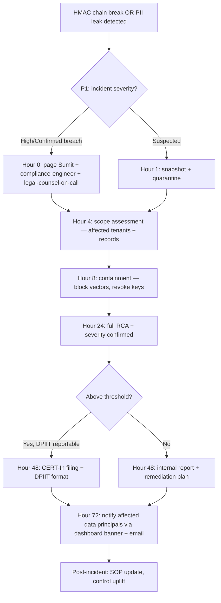

# Compliance Checklist — LeadGen AI

> **Source:** `docs/COMPLIANCE_FRAMEWORK.md`, `docs/PRIVACY.md`, `DPDP_PURGE_KEY` workflow. **Owner:** compliance-engineer (R), Sumit (A), legal-counsel-on-call (C).
> **Scope:** India DPDP Act 2023 (primary), GDPR (EU customers if/when), SOC2 Type 1 readiness (Q1 2027), RBI data-localization guidelines.
> **Audit horizon:** every compliance gate has a quarterly internal review + annual external audit (post-SOC2).

---

## Compliance posture (90-day North Star)

| Compliance area | Today (S0) | Target end-of-M9 (S6) | Status |
|---|---|---|---|
| DPDP Act 2023 consent | ✅ Implemented (onboarding) | ✅ + audit chain | **Maintain** |
| DPDP purge workflow | ✅ 8-step idempotent | ✅ + quarterly rehearsal | **Maintain** |
| Data localization (RBI) | ✅ India-only DB | ✅ + documented | **Maintain** |
| Recording retention | ✅ 90-day auto-cleanup | ✅ + audit verify | **Maintain** |
| Audit log HMAC | ✅ Implemented | ✅ + tamper-evident export | **Maintain** |
| GDPR (if EU customer) | N/A | ⚠️ need DPA template | **Add** |
| SOC2 Type 1 readiness | ❌ | ⚠️ vendor selected, gap analysis | **Add** |
| DLT compliance (voice/SMS) | ✅ 3 templates submitting | ✅ + all templates registered | **Maintain** |
| Pricing disclosure (T&C) | ✅ T&C matches `packages.py` | ✅ + dynamic pricing test | **Maintain** |
| Breach notification SLA | ❌ | ✅ 72h play documented | **Add** |

---

## DPDP Act 2023 — Detailed Checklist

### 1. Consent collection

| Check | Owner | Frequency | Blocking? |
|---|---|---|---|
| Onboarding flow has explicit consent checkbox (NOT pre-checked) | compliance-engineer | per release | YES |
| Consent text is in English + Hindi (per language) | compliance-engineer | per release | YES |
| Consent timestamp stored immutably | compliance-engineer | per release | YES |
| Consent withdrawal path: 1-click in dashboard | compliance-engineer | per release | YES |
| Consent withdrawal upstream: 8-step purge triggered within 24h | compliance-engineer | weekly audit | YES |
| Consent proof on request: full audit trail exportable | compliance-engineer | per release | YES |

**Test:** `tests/test_dpdp_consent_2026.py` — must pass on every PR.

### 2. Data minimization

| Check | Owner | Frequency | Blocking? |
|---|---|---|---|
| Only required fields collected (no over-collection) | data-engineer | per release | YES |
| Third-party SDKs: only those with signed DPA | compliance-engineer | quarterly | YES |
| Tracking pixels: customer-facing = first-party only | marketing-engineer | per release | YES |
| Voice recording: opt-in separately from service consent | compliance-engineer | per release | YES |
| Voice transcription retention: ≤ 90 days | platform-engineer | hourly verify | YES |

### 3. Right to erasure (DPDP §12)

| Check | Owner | Frequency | Blocking? |
|---|---|---|---|
| `DPDP_PURGE_KEY` available in admin | compliance-engineer | per release | YES |
| 8-step idempotent purge workflow validated | compliance-engineer | **monthly rehearsal** | YES |
| Audit log entry: `purge_tenant_id + purge_actor + purge_timestamp + purge_step_count` | platform-engineer | per purge | YES |
| Refusal: only if legal hold exists; document why | legal-counsel-on-call | per case | YES (or documented refusal) |
| Notification: tenant + auditor notified within 7 days | compliance-engineer | per purge | YES |
| Idempotency: re-running purge on already-purged tenant returns "OK already-purged" without side-effect | platform-engineer | per release | YES |

**Test:** `tests/test_dpdp_purge_idempotency_2026.py` — must pass on every PR.

### 4. Breach notification

| Check | Owner | Frequency | Blocking? |
|---|---|---|---|
| Breach detection rule: any audit-log HMAC break within 1h | sre-engineer | continuous | YES |
| Notification SOP: 72h to CERT-In + affected data principals | compliance-engineer | per release | YES |
| Incident template: includes DPIIT format fields | compliance-engineer | per release | YES |
| Tabletop drill: scheduled mid-sprint 4 of every charter | compliance-engineer + Sumit | per charter | YES |
| Legal counsel on-call rotation documented | lead-engineer | quarterly | NO (advisory) |

### 5. Sub-processor disclosure

| Sub-processor | Purpose | Data shared | DPA signed? | Disclosed in T&C? |
|---|---|---|---|---|
| Razorpay | Payment processing | UPI txn ref, amount | ✅ | ✅ |
| Vobiz | Voice termination | DID, call metadata | ✅ | ✅ |
| Smartflo (failover) | Voice termination | DID, call metadata | ✅ | ✅ |
| Groq / OpenAI | LLM inference | prompt + completion (no PII stored by default) | ✅ | ✅ |
| WAHA (self-hosted) | WhatsApp | phone, message content | N/A (self) | N/A |
| Supabase | Auth + DB | tenants, leads, audit logs | ⚠️ India-region only | ✅ |
| GitHub | Code + CI | code, secrets (encrypted) | ✅ | ✅ |

**Re-verify on every new vendor onboarding.**

### 6. Data principal rights

| Right | Implemented? | Path | Owner |
|---|---|---|---|
| Right to access (§11) | ✅ | Dashboard → Profile → Export | platform-engineer |
| Right to correction (§11) | ✅ | Dashboard → Profile → Edit | platform-engineer |
| Right to erasure (§12) | ✅ | Dashboard → Profile → Request Deletion (triggers purge) | compliance-engineer |
| Right to grievance redressal (§13) | ✅ | support@leadgen.ai + 30-day SLA | compliance-engineer |
| Right to nominate (§14) | ⚠️ partial | API exists, UI pending M9-S6 | platform-engineer |

---

## GDPR readiness (conditional — only if EU customer signs up)

| Check | Owner | Blocking for EU-customer signing? |
|---|---|---|
| DPA (Data Processing Agreement) template | legal-counsel-on-call | YES |
| Standard Contractual Clauses (SCCs) signed with US sub-processors | legal-counsel-on-call | YES |
| Right to access within 30 days (vs DPDP 30 days — same!) | platform-engineer | YES |
| Data portability: JSON + CSV export | platform-engineer | YES |
| Cookie banner (if EU traffic) | marketing-engineer | YES |
| Cross-border transfer assessment | legal-counsel-on-call | YES |
| DPO (Data Protection Officer) designated | compliance-engineer | YES |
| EU sub-processor list updated in T&C | compliance-engineer | YES |

**Decision rule:** until first EU customer signs, treat as **N/A**. Document the day the first EU customer signs as the trigger for full GDPR activation.

---

## SOC2 Type 1 readiness (M6–M9 prep, audit Q1 2027)

### Trust Services Criteria coverage

| TSC category | Today | Target | Owner |
|---|---|---|---|
| **Security** (CC1-CC9) | ✅ basic | ✅ evidence + access reviews | security-engineer |
| **Availability** (A1) | ✅ uptime monitor | ✅ error-budget reports | sre-engineer |
| **Processing Integrity** (PI1) | ✅ billing truth tests | ✅ all 90-day tests | qa-test-engineer |
| **Confidentiality** (C1) | ✅ secrets + RBAC | ✅ evidence + KMS | security-engineer |
| **Privacy** (P1-P8) | ✅ DPDP = strong base | ✅ mapped to TSCs | compliance-engineer |

### Required evidence (collection in S5-S6)

| Evidence | Where stored | Retention |
|---|---|---|
| Access reviews (quarterly) | `docs/access-reviews/` | 7 years |
| Incident RCAs | `deliverables/INCIDENT_RCA_*` | 7 years |
| Change-management approvals | GitHub PR history | 7 years |
| Backup + restore proofs | `docs/dr-drills/` | 7 years |
| Vendor risk assessments | `docs/vendor-risk/` | 7 years |
| Code review records | GitHub | 7 years |
| Penetration test reports | `docs/pentest/` | 7 years |
| Audit trail export | `audit-export://hmac-chain` | 7 years |

**Vendor selection target:** end of S5 (Tier-2 audit firm, India + US coverage).

---

## RBI data-localization (India)

| Check | Implemented? | Evidence |
|---|---|---|
| All production DB in India region (Supabase Mumbai) | ✅ | DB infra config |
| No cross-border replication for PII | ✅ | replication config |
| Backup destination: India (S3 Mumbai) | ✅ | backup config |
| Voice recordings: stored in India (CDN) | ✅ | CDN config |
| Logs (anonymized): can be shipped to US for observability | ⚠️ no PII in logs | log scrubber test |

---

## DLT (Distributed Ledger Template) compliance — voice & SMS

| Check | Owner | Frequency | Blocking? |
|---|---|---|---|
| Every outbound voice template has DLT-registered ID | telephony-engineer | per release | YES |
| SMS templates: DLT-registered before send | marketing-engineer | per release | YES |
| WhatsApp templates: Meta-approved before send | marketing-engineer | per release | YES |
| DLT registry mismatch (sent-but-not-registered) auto-flag | platform-engineer | hourly | YES |
| Audit log: outbound send with template ID stamped | compliance-engineer | per release | YES |

---

## Compliance audit cadence

| Cadence | Activity | Owner |
|---|---|---|
| Continuous | Breach detection + DPDP purge events | platform-engineer |
| Hourly | DLT template registry parity | platform-engineer |
| Daily | Audit-chain HMAC integrity check | platform-engineer |
| Weekly | Consent withdrawal + purge sweep | compliance-engineer |
| Monthly | DPDP purge rehearsal (against test tenant) | compliance-engineer |
| Per release | Compliance evidence packet attached to release | compliance-engineer |
| Quarterly | Access review + vendor risk re-assessment | security-engineer |
| Annual (post-SOC2) | External audit | external auditor |

---

## Compliance evidence collection (per release — auto)

| Evidence type | Auto-collected by | Stored at |
|---|---|---|
| DPDP consent receipt | `consent-service` | `audit-export://hmac-chain` |
| Audit-log HMAC chain | `audit-logger` | `audit-export://hmac-chain` |
| Purge receipt (8-step) | `dpdp-purge-service` | `audit-export://hmac-chain` |
| Outbound-send DLT IDs | `outbound-sender` | `audit-export://hmac-chain` |
| Recording retention proof (90d) | `recording-cleaner` (hourly) | `audit-export://hmac-chain` |
| ADR history | git | `docs/ADR-*.md` |
| PR review history | git | `git log` |
| Incident RCAs | manual | `deliverables/INCIDENT_RCA_*.md` |

---

## Breach-notification playbook (72h)

---

## Compliance Anti-patterns (will trigger audit)

1. ❌ "Logging user PII for debugging" — use Sentry with field scrubber
2. ❌ "Audit log stored in same DB as customer data" — separate append-only store with HMAC
3. ❌ "Hold customer data after deletion request" — 24h SLA is hard
4. ❌ "Skip DLT registration for the demo" — no, every outbound needs it
5. ❌ "Implicit consent via continued use" — explicit only, in language
6. ❌ "Use US-region Supabase for one tenant" — India only, full stop
7. ❌ "Skip breach notification because it's only 100 users" — threshold is 1 user, not 100
8. ❌ "Archive customer data to cold storage for analysis" — DPDP erasure = full purge, no archive

---

## Compliance owner matrix

| Compliance control | R | A | C | I |
|---|---|---|---|---|
| DPDP consent | platform-engineer | compliance-engineer | Sumit | legal-counsel |
| DPDP purge | platform-engineer | compliance-engineer | Sumit | legal-counsel |
| Breach notification SOP | compliance-engineer | Sumit | sre-engineer | all |
| DLT registration | telephony-engineer | compliance-engineer | marketing-engineer | Sumit |
| Audit log HMAC | platform-engineer | compliance-engineer | sre-engineer | all |
| Recording retention | platform-engineer | compliance-engineer | telephony-engineer | all |
| GDPR (when applicable) | legal-counsel | compliance-engineer | Sumit | sales-engineer |
| SOC2 readiness | compliance-engineer | Sumit | staff-engineer | external auditor |
| RBI data-localization | platform-engineer | compliance-engineer | sre-engineer | Sumit |
| T&C + pricing truth | billing-engineer | compliance-engineer | legal-counsel | marketing-engineer |

---

## Outstanding compliance tasks (M6–M9)

| Sprint | Task | Owner | Status |
|---|---|---|---|
| S1 | Tabletop breach drill (paper) | compliance-engineer | NEW |
| S2 | DPO designation (Sumit formally) | compliance-engineer | NEW |
| S3 | DPA template with sub-processor addendum | legal-counsel | NEW |
| S4 | SOC2 vendor RFP + selection | compliance-engineer | NEW |
| S5 | Quarterly access review #1 | security-engineer | NEW |
| S5 | Audit-trail tamper-evident export | platform-engineer | NEW |
| S6 | Tabletop breach drill (live, simulated tenant) | compliance-engineer + Sumit | NEW |
| S6 | SOC2 evidence collection kickoff | compliance-engineer | NEW |

> **One rule:** when in doubt, ask `compliance-engineer`. The cost of a wrong call is 7 years of audit findings.
