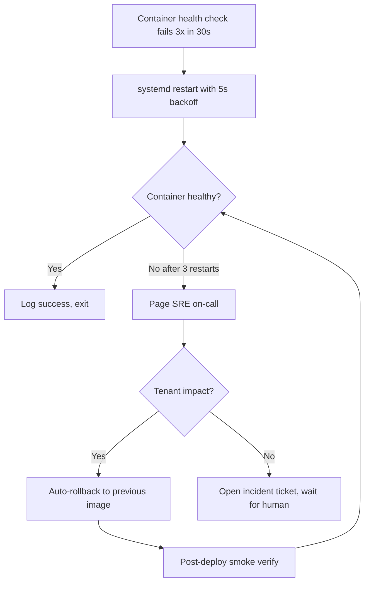
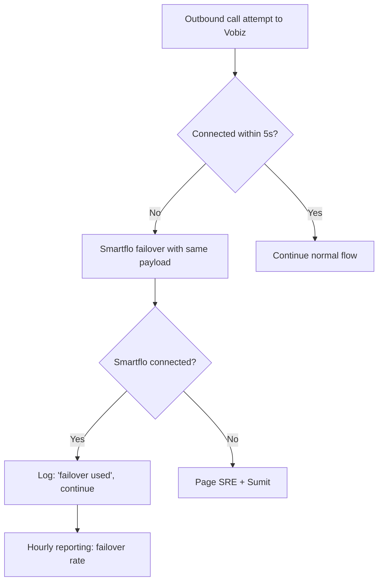
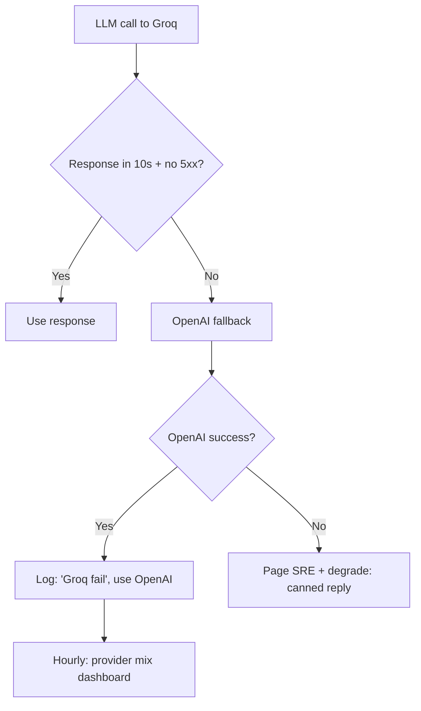
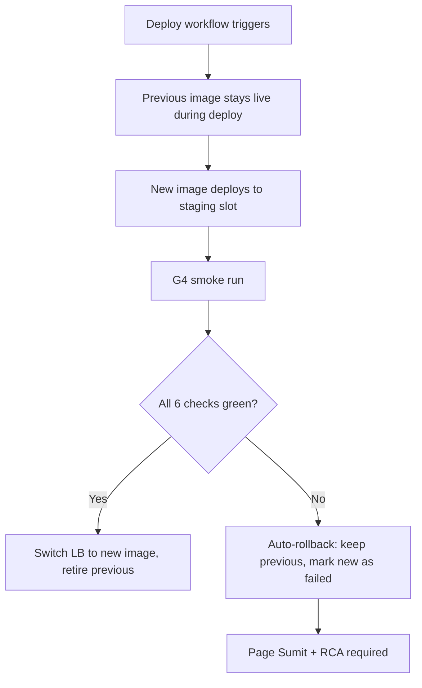
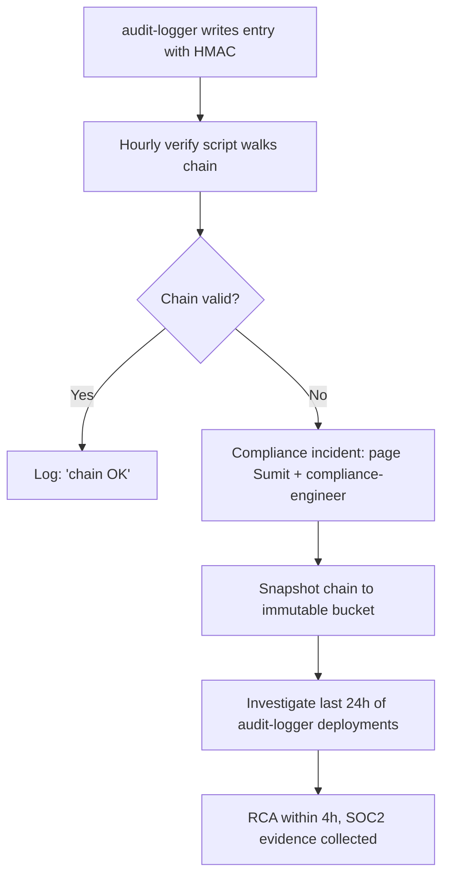
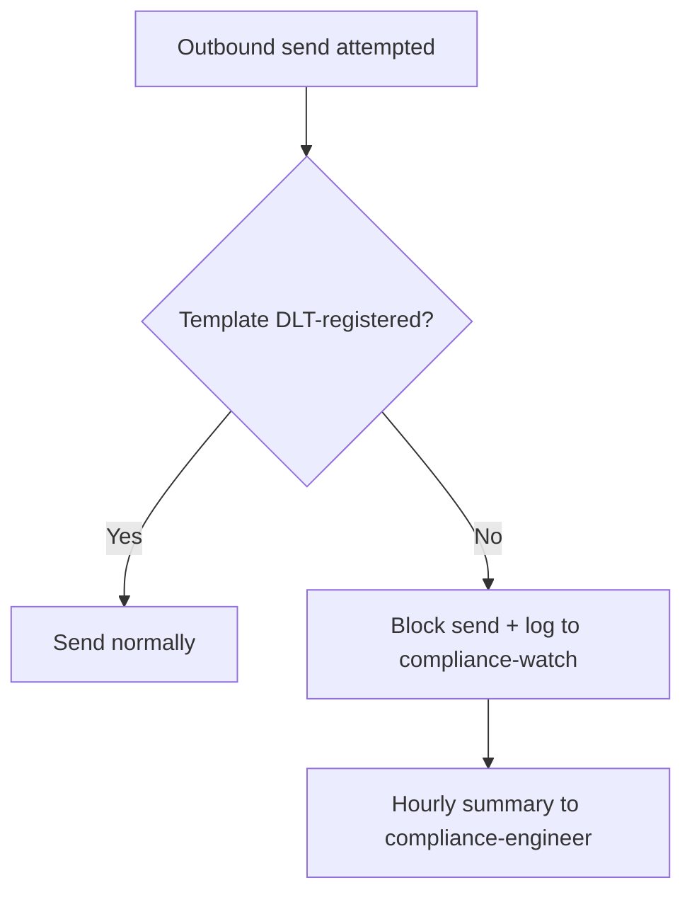
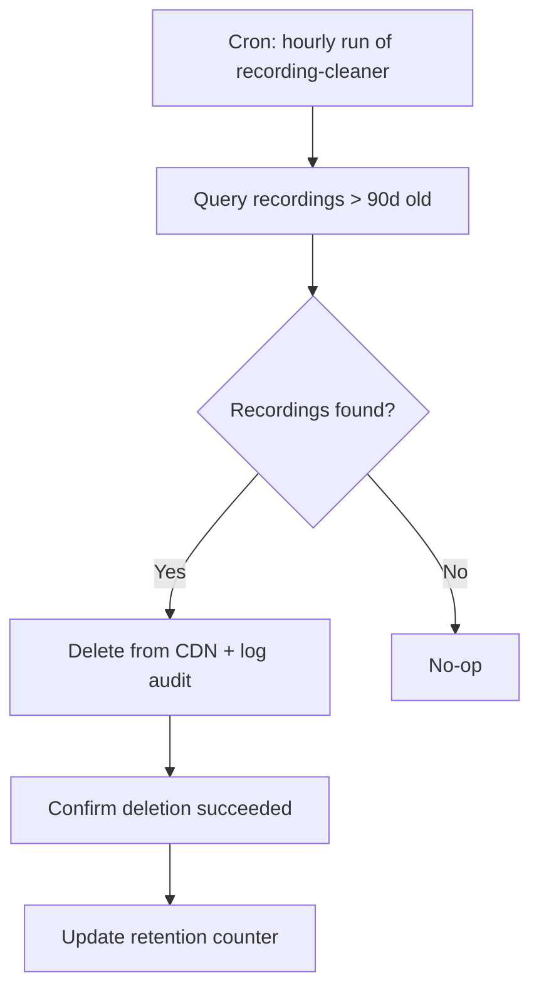
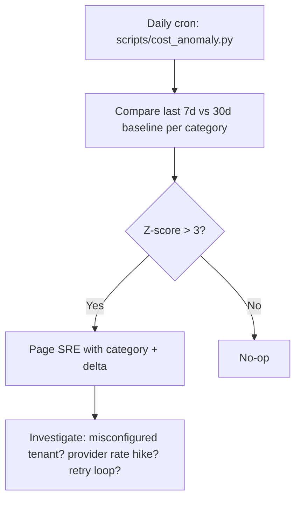

# Automation Framework — LeadGen AI

> **Source:** `docs/SRE_PLAYBOOK.md`, `docs/OBSERVABILITY.md`, `docs/RUNBOOKS/`. **Owner:** sre-engineer (R), Sumit (A), platform-engineer (C).
> **North Star:** **"Heartbeat replaces heartbeat"** — when Sumit is offline, the platform self-heals within budget; when Sumit is online, he sees one-page status, not 50 dashboards.

---

## Automation principles (non-negotiable)

1. **Detect → Mitigate → Page**: every automation must follow this triple. Detection alone is half-work; mitigation IS the automation; page is the human backstop.
2. **Idempotent by default**: re-running an automated action on a healthy system is a no-op, not a regression.
3. **Owner-gating for external blast**: anything that sends a message, charges money, deletes data, or flips a public-facing flag must request owner approval — UNLESS pre-approved by SRE runbook (auto-mitigation subset).
4. **Auto-rollback over auto-fix attempt**: if a fix is non-trivial and risky, roll back to last-known-green and page Sumit within 60s. Don't try to debug in prod.
5. **24/7 active means: detekt + mitigate + page + log**, not "wake Sumit at 3am for a typo".

---

## Automation scope (what IS automatable without owner)

| Category | Action | Auto? | Tool |
|---|---|---|---|
| **Detection** | API up, latency p95, error rate, queue depth, disk% | YES | Prometheus + Grafana |
| **Detection** | HMAC chain break, audit log gap, DLT mismatch | YES | platform-engineer scripts |
| **Detection** | Synthetic canary (voice, billing, WhatsApp, payment) | YES | cron + scripts |
| **Mitigation (infra)** | Restart failed container (max 3 in 5min then escalate) | YES | systemd / docker auto-restart |
| **Mitigation (infra)** | Failover API provider (Groq → OpenAI, Vobiz → Smartflo) | YES | feature-flag + retry |
| **Mitigation (app)** | Auto-rollback to previous image on G4 smoke fail | YES | GitHub Actions |
| **Mitigation (app)** | Auto-scale VPS CPU-bound workers up to N=4 | YES | docker-compose scale |
| **Mitigation (app)** | Throttle outbound on DLQ growth | YES | rate-limiter in app |
| **Mitigation (app)** | Auto-flag tenant at risk (DPDP opt-out → 24h hold) | YES | cs-engineer scripts |
| **Page** | Sumit via WhatsApp + email + GitHub issue | YES | PagerDuty-free (n8n + WAHA) |
| **Page** | All-hands incident channel | YES | existing Telegram/WhatsApp |
| **Reporting** | Hourly status dashboard | YES | Grafana embed |
| **Reporting** | Weekly status email to Sumit | YES | cron + email |
| **Reporting** | Monthly retro packet auto-generated | YES | `scripts/generate_retro.py` |
| **Compliance** | DPDP purge trigger on consent-withdrawal | YES | dpdp-purge-service |
| **Compliance** | Audit-log HMAC chain check | YES | audit-logger |
| **Compliance** | Recording retention cleanup (90d) | YES | recording-cleaner hourly |
| **Security** | Auto-block IP on suspicious auth pattern | YES | fail2ban + app middleware |
| **Security** | Auto-rotate API keys (annual) | YES | cron + secrets-manager |
| **Self-Healing** | DB read-replica lag → switch primary | YES | patroni + healthcheck |
| **Self-Healing** | Worker thread-pool auto-resize | YES | gunicorn `--preload` |
| **Self-Healing** | Cache layer (Redis) auto-rebuild on lost connection | YES | app middleware |
| **Anomaly Detection** | Cost-per-call outlier alert | YES | `scripts/cost_anomaly.py` |
| **Anomaly Detection** | Reply-agent hallucination spike | YES | `scripts/llm_eval.py` + threshold |

---

## Automation scope (what is NOT automatable without owner — owner-gated)

Anything in `15_OWNER_GATING_PROTOCOL.md` — push, deploy, refund, payment, voice arm, customer delete, etc. **Owner-gating is a HARD invariant.**

---

## Self-Healing Workflows (SH-01 through SH-08)

### SH-01: Container restart with backoff

**Trigger:** docker healthcheck fail 3× in 30s.
**Auto-action:** restart with 5s backoff, max 3×.
**Escalate:** page Sumit if 3 restarts fail.
**Evidence:** docker events, `/health/ready` log.

### SH-02: Voice failover (Vobiz → Smartflo)

**Trigger:** Vobiz CDR / hangup codes 480, 486, 503.
**Auto-action:** retry on Smartflo with same caller-ID.
**Escalate:** if failover rate > 30% in 1h → page.
**Idempotent:** call attempt is one event in CDR; dual-provider race = first-writer-wins.

### SH-03: LLM failover (Groq → OpenAI)

**Trigger:** Groq 5xx or >10s response.
**Auto-action:** switch provider for this call + mark tenant on degraded mode.
**Cost-aware:** Groq cheaper than OpenAI; tracked in `scripts/cost_anomaly.py`.

### SH-04: Auto-rollback on smoke fail

**Trigger:** any of `/health/ready`, `/api/dashboard/sample`, billing truth, voice canary, runtime-data ratchet, first-tenant-dashboard fails for > 30s.
**Auto-action:** rolling back keeps previous image serving traffic; new image quarantined.
**Owner-page:** always, even on success — owner sees the deploy completed.

### SH-05: HMAC chain break alert

**Trigger:** HMAC verify failure on any chain.
**Auto-action:** snapshot to immutable storage + open incident ticket.
**Escalate:** Sumit + compliance within 60s.
**Owner-page:** required (incident has compliance impact).

### SH-06: DLT template auto-block

**Trigger:** template ID not in DLT registry.
**Auto-action:** block send, mark tenant.
**Owner-page:** daily summary, NOT per-tenant-page.

### SH-07: Recording retention auto-cleanup

**Trigger:** cron, hourly.
**Auto-action:** delete + log + counter.
**Idempotent:** already-deleted = no-op success.

### SH-08: Cost anomaly alert

**Trigger:** z-score > 3 on any cost category (LLM, voice, payment-fees).
**Auto-action:** log + page SRE.
**Owner-page:** if burn-rate > 2× projected → also page Sumit.

---

## Auto-scaling (compute + data)

| Resource | Scale trigger | Min | Max | Cooldown |
|---|---|---|---|---|
| API workers (Gunicorn) | CPU > 70% sustained 5min | 2 | 8 | 10 min |
| Voice workers (Celery) | Queue depth > 100 | 1 | 6 | 5 min |
| Reply-agent workers | Queue depth > 50 | 1 | 4 | 5 min |
| Outbound-send workers | Queue depth > 200 | 1 | 4 | 5 min |
| Postgres read-replica | Replication lag > 5s | 0 | 2 | 30 min |
| Redis cache | Memory > 80% | 1 | 1 (no scale, just expire aggressively) | N/A |
| Disk (VPS) | Disk > 80% | 100GB | 500GB | alert only |

**Scale-down rule:** never scale DOWN below `min` unless idle > 30 min and no in-flight tasks.

---

## Predictive issue detection

| Signal | Detection | Action |
|---|---|---|
| Outbound-send queue growing 3× normal | Hourly trend detect | Auto-throttle, page if no recovery in 15min |
| LLM token cost trending 2× baseline | Daily anomaly script | Auto-failover to cheaper provider, page if sustained 24h |
| New tenant first-day churn signal | CS engine watches 7-day cohort | Auto-engage CS playbook (proactive WhatsApp) |
| Voice quality degradation (Whisper transcript deviation) | 24h rolling window | Auto-fail Vobiz → Smartflo for that DID range |
| Memory leak in worker (RSS trending up) | Hourly RSS check | Auto-restart worker with backoff (SH-01) |
| DB query latency p99 trending up | Prometheus alert | Auto-vacuum + analyze + index hint |

---

## 24/7 Active Agents (virtual team coverage)

| Time zone | Primary on-call | Backup | Tools |
|---|---|---|---|
| IST (UTC+5:30) — primary hours | Sumit | sre-engineer auto | phone, WAHA, GitHub |
| UTC (US/EU) — overnight IST | sre-engineer auto | platform-engineer auto | pager, RCA-bot |
| Out-of-business IST | RCA-bot (automated) | sre-engineer auto | incident-channel |

**RCA-bot** = automated agent that opens incident ticket on any auto-mitigation, attaches log slice + RCA template, assigns to on-call.

**Owner-gating exception:** if incident blocks deploy for > 1h with Sumit unreachable, **lead-engineer** (AI agent) makes the call to freeze deploys (NOT proceed with deployment). No deploys proceed without owner word, period.

---

## Automation metrics (measured)

| Metric | Target | Source |
|---|---|---|
| Auto-mitigation success rate | > 95% | SH-01 through SH-08 logs |
| False-positive auto-page rate | < 5% | Pager log review |
| Mean time to detect (MTTD) | < 5 min | Prometheus alert latency |
| Mean time to mitigate (MTTM) | < 15 min | SH-* auto-action timestamps |
| Mean time to page (MTTP) if needed | < 60s | `scripts/auto_page.py` log |
| Manual interventions per week | < 3 | Owner-gating audit |
| Auto-scaling events (false positive) | < 1/week | Docker events log |
| Cost anomaly false-positive | < 1/month | `scripts/cost_anomaly.py` log |

---

## Anti-patterns (automation we will NOT build)

1. ❌ **Auto-fix instead of auto-rollback** — for production, roll back is safer
2. ❌ **Auto-send a customer communication without owner approve** — owner-gated
3. ❌ **Auto-charge a customer (refund, dispute)** — owner-gated
4. ❌ **Auto-dispatch a worker task that calls an external API** — owner-gated per external action
5. ❌ **Auto-declare "all clear" on a P0** — Sumit must close
6. ❌ **Auto-disable a quality gate** — gates are inviolable
7. ❌ **Auto-update T&C, packages, pricing** — owner-gated
8. ❌ **Auto-failover permanently** — after 24h of sustained failover, page Sumit

---

## Automation roadmap (S1-S6 additions)

| Sprint | New automation | Owner | Notes |
|---|---|---|---|
| S1 | Voice canary hourly (Vobiz) | sre-engineer | First deploy |
| S2 | Voice failover → Smartflo | sre-engineer | Add Smartflo token |
| S2 | LLM failover Groq → OpenAI | data-engineer | Add OpenAI key |
| S3 | CS health-score auto-engagement | cs-engineer | WhatsApp + in-app |
| S4 | Tier-aware dashboard regression | qa-test-engineer | Per-tier fixture |
| S4 | Billing upgrade/downgrade auto-verify | billing-engineer | UPI verify + sandbox |
| S5 | Razorpay webhook auto-reconcile | billing-engineer | Hourly |
| S5 | Audit-chain tamper-evident export | platform-engineer | Quarterly |
| S6 | SOC2 evidence collection automation | compliance-engineer | First evidence packet |

---

## Owner oversight (the un-automatable)

- **Manual owner review:** weekly status email (auto-generated, but Sumit reads).
- **Manual owner approval:** all owner-gated actions (push, deploy, refund, voice arm, customer delete, charter amend).
- **Manual owner go/no-go on P0:** even if RCA-bot has full diagnosis, Sumit says "rollback" or "fix forward".

> **Bottom line:** automation makes Sumit's life *more* attentive, not less. It clears the noise so the 5 things that actually need a human decision get a human.
