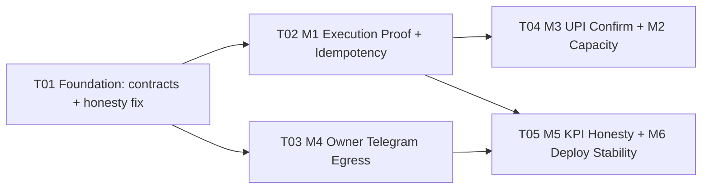

# ARCH — ₹1 Cr/month Integrated Automation Architecture
### LeadGen AI · System Design + Task Decomposition · Stage 2 (Architect)

> **Author:** 高见远 (Gao / Bob) — Architect
> **Date:** 2026-09-16
> **Input:** `deliverables/software-company/crore-strategy-PRD-2026-09-16.md` (Xu/PM) + brief from 齐活林/Qi (Delivery Director)
> **Handoff to:** Engineering (寇豆码/Kou) → QA (Stage 4)
> **Repo:** `C:\Users\Ratanshila\Documents\leadgenrationaivoiceagent`
> **Evidence labels:** `PRODUCTION-PROVEN` · `CODE-PRESENT` · `TEST-PROVEN` · `LOCAL-ONLY` · `PARTIAL` · `STALE` · `UNKNOWN`
> **Rule:** claim with no label = claim nobody acts on. Is doc me har material claim pe label hai.

---

## 0. Architect ka seedha verdict (TL;DR)

Bhai, pehle ek hi line me sacch: **₹1 Cr/month is architecture ka OUTPUT nahi hai — ye is architecture ka HORIZON hai.** Is design ka kaam teen cheez hai:

1. **Jo already code me hai use THEEK karo aur jodo** — imagin kuch nahi. 9 bots, 31 agents, orchestrator, DurableTaskStore, owner_feed, deploy_vps.sh, Telegram groups, compliance spine — sab **exist karte hain**. Missing sirf **glue + honesty** hai.
2. **Automation maximization = human steps hatana, par compliance/consent/owner-confirm step kabhi nahi hatana.** Isliye design ka core = **owner ko roz ~15 min me business chalane dena**, ek honest dashboard + ek honest Telegram feed + ek repeatable deploy.
3. **₹1 Cr ka asli bottleneck code nahi hai.** Verified: contact capacity ~**875/week**, required ~**85,000/week** → **~97× gap** (`CODE-PRESENT`). Ye PRD bhi maanta hai (§5c). Isliye M2 (Automation Optimization) ka design **sirf throughput-per-contact + channel capacity** attack karta hai — **compliance ko kabhi nahi chhedta**. ₹1 Cr ke liye DLT + payment rail + human capacity **Owner decisions** hain (PRD §10), code nahi.

**Non-negotiable: koi naya payment gateway nahi, koi compliance gate weaken nahi, koi duplicate ledger/feed/registry nahi.**

---

## 1. Implementation Approach — 6 modules kaise bante hain (aur kyun)

Design principle ek hi hai: **existing machinery ko extend karo, parallel system mat banao.** Neeche har module ke liye mechanism + WHY + reuse target.

### M1 · Bot Workers & Agents Management (9 bots + 31 agents)

| Cheez | Decision | WHY |
|---|---|---|
| Bot registry | **`AutomationOrchestrator.HERMES_BOTS` hi canonical hai** (9 bots) | `submit_task()` already `owner_bot not in HERMES_BOTS → ValueError` (`CODE-PRESENT`, verified line ~480). `HERMES_AGENT_ROSTER.yaml` khud ko SUPERSEDED declare karta hai (8 bots). **Naya registry nahi banega.** |
| Agent registry | **`app/platform/team.py → STAFF` canonical** (31 keys, verified via import) | `submit_task()` `assigned_agent not in self.registry → ValueError`. `build_registry()` STAFF se banata hai. `AGENT_REGISTRY.md` (19 agents) **STALE** — generate karna hai, edit nahi. |
| Task ledger | **`DurableTaskStore` (`data/orchestrator_ledger.db`) = execution ledger; `command_center/data/tasks.json` = coordination/board ledger.** Ye do alag PURPOSE hain, duplicate nahi. | `DurableTaskStore.task_records` me already `idempotency_key TEXT UNIQUE` + `update_cas()` (READY→RUNNING version CAS) + `fencing_token` (`CODE-PRESENT`). `CENTRAL_LEDGER.md` canonical board = `tasks.json`. **Yehi duality hai — ise document karo, merge mat karo.** |
| Execution proof (P0) | **`dev_workers` table orchestrator_ledger.db me, ek real worker-process se likhi jaye** — lease+heartbeat+idempotency UNIQUE pe based | Aaj `dev_workers = 0 rows` + `service._IDEMPOTENCY` process-local dict (`CODE-PRESENT`). **So design me ek REAL execution-prover chahiye, aur ek DB-backed idempotency jo already store me hai use actually USE karo** — naya mechanism nahi, existing `idempotency_key UNIQUE` ko wire karo. |
| Honesty bug fix | **`team.py:853` ka `cycle` fallback HATAO.** `today_actions` sirf real events se. | Verified live code: `"today_actions": max(per_member_today.get(key,0), int(wf_agent.get("cycle",1)) if wf_agent else 0)`. File ka apna comment kehta hai "TRUST REAL EVENTS, NOT FAKE JSON STATUS" — fallback contradiction (`CODE-PRESENT`). |
| Enrolment blocker | **Document + Owner-gated, code me silent patch NAHI.** `_KNOWN_TOOLS` gap | `coordination_hub_auth.py:23` me `openclaw/workbuddy/codex` absent → un-enrollable forever (`CODE-PRESENT`). Owner decision. |

**Reuse:** orchestrator (`DurableTaskStore`, `RedisGovernorAuthority(max_leases=4)`, `recover_stale_running_tasks()`, kill switch `AUTOMATION_STOP_NEW_CLAIMS`), `team.py STAFF`, `coordination_hub_auth`.
**Ban:** naya bot registry, naya agent registry, naya task DB.

### M2 · Automation Optimization

| Cheez | Decision | WHY |
|---|---|---|
| Bottleneck attack | **Throughput-per-contact + channel capacity**; NEVER compliance | Contact cap `~875/week` vs required `~85,000/week` = **97× gap** (`CODE-PRESENT`). Gap code se band nahi hota — capacity se. |
| Channel capacity | Design **capacity dials ko ek jagah expose** karo (email cap, `PLATFORM_DIAL_LIMIT`), taaki bottleneck **measure** ho + owner badha sake (new human channels) — bina DND/window chhede | `PLATFORM_DIAL_LIMIT`/`PLATFORM_DIAL_DAILY` already flags (`app/api/automation_flags.py:64-65`). Email warmup cap `app/platform/auto_outreach.py` (`CODE-PRESENT`). |
| Telemetry | **`data/automation_logs.jsonl` + `data/job_heartbeats.json` + `data/growth_pulse.json` ko ek optimizer input banao** | Sab exist karte hain (`CODE-PRESENT`). Naya telemetry store nahi. |
| Compliance | **Invariant: promo window 09:00–19:00 IST, DND fail-CLOSED, cold WhatsApp OFF, consent_ledger mandatory** | `app/telephony/compliance.py` clamps to legal 09:00–21:00 (`CODE-PRESENT`). **Isko optimize karna = ABORT.** |
| Human-step removal | Conv→contact funnel me **automated** steps (dedupe, score, consent-check, DND-check, queue) — **manual step sirf owner bank-confirm** | Automation maximization top priority, par owner-confirm/consent/compliance step **immovable**. |

**Reuse:** `auto_outreach.py`, `automation_flags.py`, compliance spine, existing telemetry files.
**Ban:** compliance window widening, DND bypass, consent skip, cold WhatsApp on, naya outbound engine.

### M3 · Sales & Product Strategy (2 products)

| Cheez | Decision | WHY |
|---|---|---|
| Payment rail | **MANUAL UPI ONLY.** Design = owner-confirmation flow. | Stripe/Razorpay **REMOVED** (issue #243 not_planned); `PROVIDER_VERIFIED` unreachable BY DESIGN; `/api/billing/webhooks/stripe` fail-closed stub + `tests/test_stripe_webhook_fail_closed.py` (`PRODUCTION-PROVEN`/`TEST-PROVEN`). **Gateway reinstatement = ABORT.** |
| Revenue truth | **`data/invoices.jsonl` via `app.billing.gst_invoice.stats()`** (verified `def stats()` line 489 exists) | `data/revenue_attribution.jsonl` **NOT money** (`CODE-PRESENT`). |
| Funnel | Existing entry points reuse: `/audit`, `/site-audit`, `/demo`, `/pricing`, `/start`, `/pay/{order_ref}` | Sab code me hain (`CODE-PRESENT`). Naya funnel nahi. |
| Owner-confirm UX | **One screen** (`/app/revenue-kit` + `/app/inbox`) jahan owner ek click me bank-credit confirm kare → invoice auto-generate | Owner sole operator hai; "exactly one confirmation per payment" = PRD §2c. |
| Product mix | Marketing = ~62% engine; Voice = ~33% **DLT-gated**; top-ups ~5% | PRD §2b. `packages.py` prices verified (₹1,999/₹5,999; top-ups ₹1,499/₹3,499/₹5,999). |

**Reuse:** `packages.py`, `voice_packages.py`, `combo_packages.py`, `upi_payments.py`, `gst_invoice.py`, `/pay/{order_ref}`, promo_codes, offers.
**Ban:** payment gateway, `PROVIDER_VERIFIED` path, revenue_attribution as money.

### M4 · Telegram Setup (end-to-end)

| Cheez | Decision | WHY |
|---|---|---|
| Groups | **EXIST ho chuke hain — reuse.** 9 entities, real chat_ids in `config/telegram/setup_spec.yaml` | Verified: `owner_alerts -1003878635977`, `internal_admin -1004460536807`, marketing announcements `-1004485447096`, etc. (`CODE-PRESENT`). Naye groups nahi. |
| Egress (missing piece) | **Naya `app/utils/owner_notify.py`** — L1 layer of `OWNER_TELEGRAM_FEED_DESIGN.md` | Verified: module **absent** (`grep owner_notify → 0 hits`). Feed (`owner_feed.py`) exists (330 lines) but egress nahi. |
| Event store | **`data/owner_feed_events.jsonl` — canonical, already exists (14KB)** | `owner_feed.py` TEST-PROVEN 24/24, schema `ts,source,actor,severity,kind,text,evidence,verified[,dedupe_key]`, never raises, `workforce` forced unverified (`TEST-PROVEN`). **Reuse — naya feed nahi.** |
| Truth gate | **`data/workforce_live_status.json` source = `FORCE_UNVERIFIED`** → `UNVERIFIED` label ya bilkul nahi bhejo | Verified file: `status=NOT_INSTRUMENTED`, `active_workers=0`, `task_execution_verified=false`, `evidence_kind=inference_probe_only` (`CODE-PRESENT`). Feed module already force-downgrades `workforce`. |
| Ingress | **Egress-only. Koi `getUpdates` nahi.** | `HERMES_CONTROL_PLANE.md`: Hermes sole `getUpdates` consumer. Verified `grep getUpdates` → only comments/scaffold, zero real poller (`CODE-PRESENT`). |
| Routing | **P0/immediate vs hourly digest**, dedupe, quiet hours, `verified X / unverified Y` line | `OWNER_TELEGRAM_FEED_DESIGN.md §4` (`CODE-PRESENT`). |

**Reuse:** `config/telegram/setup_spec.yaml`, `app/utils/owner_feed.py`, `scripts/telegram_wire_bot.py`, `scripts/send_owner_ntfy.py` (ntfy fallback).
**Ban:** naya feed file, naya bot, `getUpdates` consumer, second Telegram chat source.

### M5 · Performance Tracking

| Cheez | Decision | WHY |
|---|---|---|
| Verify vs claim | **KPI design me `claimed` aur `verified` metrics ALAG.** Blend = bug. | `workforce_live_status.json` claims (`RUNNING_24_7_PARALLEL`, `actions_today=592`, `cycle`) **NOT trustworthy** (`CODE-PRESENT`; file khud kehta hai "previously generated FAKE telemetry"). |
| Existing surfaces | Reuse: `/app/bot-command-center`, admin dashboards, Prometheus/Grafana/Alertmanager/Loki/Tempo/Uptime/Gatus, `call_analytics.py` (Lekha), `team_status()`/`kpi_aggregate()`, `growth_pulse.json`, `growth_history.jsonl` | Sab exist (`CODE-PRESENT`). Naya dashboard nahi. |
| Router gotcha | Design-rule document: signature `Depends(...)` = `route.dependant.dependencies`, NOT `route.dependencies` | Verified `automation_flags.py` path is `app/api/`. FastAPI gotcha real (`CODE-PRESENT`). |
| KPI record | **Ek `KpiRecord` schema** jo `verified: bool` field carry kare + `evidence` | Traceability = PRD ka core ask. |

**Reuse:** existing dashboards + metrics backends + `call_analytics.py`.
**Ban:** naya metrics backend, blending claimed into verified.

### M6 · Production VVS & Deployment (deployment stability)

| Cheez | Decision | WHY |
|---|---|---|
| Deploy authority | **`scripts/deploy_vps.sh` single authority.** App deploy = `systemctl restart leadgen`. | NO `leadgen_app` container; prod = systemd unit `leadgen` on `127.0.0.1:8000` (`PRODUCTION-PROVEN`). Script me `app` deliberately excluded from `SERVICES` (verified line ~40). |
| False success guard | Design rule: **never `docker compose up -d app`** — false success pinned by `tests/test_no_app_container_drift.py` | `docker-compose.vps.yml` still publishes `127.0.0.1:8000:8080` → can't bind → old process serves → `/health` 200 (`PRODUCTION-PROVEN`). |
| Skew check (risk B3) | **Already substantially hardened** — resolve by compose SERVICE name + exact-label match; document remaining edge | Verified `_resolve_compose_container()` now uses compose ps → exact `com.docker.compose.service` label → legacy name (`CODE-PRESENT`). Comment documents 2026-09-15 prod fix. **Residual: verify on next real deploy.** |
| Log rotation (gap) | **Design `RotatingFileHandler` / logrotate** | Verified `app/utils/logger.py` uses plain `logging.FileHandler` (lines 468, 508), **no** `RotatingFileHandler` (`CODE-PRESENT`). Real disk-blowup risk. |
| Deploy proof | Design rule: deploy EXIT nonzero unless `/health.version == deployed sha` + per-container skew + smoke | Script already does this (`CODE-PRESENT`). Encode as contract. |
| PM2 | **NAHI** app ke liye. systemd supervisor. | Legacy scheduler unit alag hai (`deploy/scheduler/systemd/`). |

**Reuse:** `deploy_vps.sh`, `_runtime_data_guard.sh`, `deploy_image_retention.py`, `tests/test_no_app_container_drift.py`, `docs/INFRA_HARDENING_GUIDE.md`, staging compose.
**Ban:** `docker compose up -d app`, PM2 for app, second deploy script, `git add -A`.

---

## 2. File List (relative paths, NEW / MODIFY)

> Rule: **single-writer** — ek file ka ek owner. Column "Owner" module batata hai.

### M1 · Bot Workers & Agents Management

| File | NEW/MODIFY | Purpose |
|---|---|---|
| `app/platform/team.py` | MODIFY | Fix `today_actions` `cycle` fallback (honest metrics); add verified-only counter |
| `app/platform/dev_workers.py` | **NEW** | Execution-prover: writes `dev_workers` row on real claim/heartbeat/done; DB-backed |
| `app/platform/automation_orchestrator.py` | MODIFY | Wire `DurableTaskStore.idempotency_key UNIQUE` as real idempotency (drop process-local reliance); emit `dev_workers` events |
| `docs/architecture/AGENT_REGISTRY.generated.md` | **NEW** | Generated from `team.py STAFF` (replaces STALE manual `AGENT_REGISTRY.md`) |
| `scripts/gen_agent_registry.py` | **NEW** | Generator: STAFF → registry md |
| `tests/test_dev_workers_execution_proof.py` | **NEW** | Prove `dev_workers` > 0 after a task completes; idempotency survives restart |

### M2 · Automation Optimization

| File | NEW/MODIFY | Purpose |
|---|---|---|
| `app/platform/capacity_ledger.py` | **NEW** | Single place to READ channel caps (email warmup, `PLATFORM_DIAL_LIMIT`) + week capacity + gap-to-target |
| `data/capacity_snapshot.json` | **NEW** (runtime) | Written by `capacity_ledger.py`; consumed by M5 |
| `app/platform/auto_outreach.py` | MODIFY | Emit per-channel capacity + blocked-by-compliance counters (no behaviour change to caps) |
| `tests/test_capacity_ledger.py` | **NEW** | Caps respected; compliance invariants asserted; 97× gap computed honestly |

### M3 · Sales & Product Strategy

| File | NEW/MODIFY | Purpose |
|---|---|---|
| `app/billing/owner_upi_confirm.py` | **NEW** | Owner-confirmation flow: pending UPI → owner confirm → `owner_confirmed_upi` → invoice |
| `app/api/owner_revenue_kit.py` | MODIFY/NEW | `/app/revenue-kit` + `/app/inbox` one-click confirm surfaces wired to above |
| `app/marketing/packages.py` | MODIFY | Annual-first default flag on checkout (no price change) |
| `tests/test_owner_upi_confirm.py` | **NEW** | Confirm→invoice in `data/invoices.jsonl`; no synthetic; no PROVIDER_VERIFIED path |

### M4 · Telegram Setup

| File | NEW/MODIFY | Purpose |
|---|---|---|
| `app/utils/owner_notify.py` | **NEW** | L1 egress: `send_owner(text,*,severity,evidence,dedupe_key)->bool`; fail-open; env creds; rate-limit+dedupe |
| `app/platform/owner_feed_bridge.py` | **NEW** | L3 sources: pull bot-fleet + prod health + hermes; write to `owner_feed.py` store |
| `app/platform/owner_feed_digest.py` | **NEW** | L4 routing: P0→immediate, else hourly digest; verified/unverified line |
| `scripts/owner_feed_digest_cron.py` | **NEW** | Hourly cron entry (systemd timer, NOT PM2) |
| `config/telegram/owner_notify_routing.yaml` | **NEW** | Declarative routing map (source→severity→chat_id) |
| `tests/test_owner_notify.py` | **NEW** | Fail-open, dedupe, evidence-required, workforce force-unverified passthrough |

### M5 · Performance Tracking

| File | NEW/MODIFY | Purpose |
|---|---|---|
| `app/platform/kpi_ledger.py` | **NEW** | `KpiRecord` (verified vs claimed); reads capacity_snapshot + dev_workers + invoices + call_analytics |
| `data/kpi_snapshot.jsonl` | **NEW** (runtime) | Append-only KPI history |
| `app/api/kpi_honest_view.py` | **NEW** | Admin-gated honest KPI endpoint (correct `dependant.dependencies` usage) |
| `docs/architecture/ROUTER_GOTCHA.md` | **NEW** | The `dependant.dependencies` convention note |
| `tests/test_kpi_ledger.py` | **NEW** | claimed≠verified never blended; workforce data stays unverified |

### M6 · Production VVS & Deployment

| File | NEW/MODIFY | Purpose |
|---|---|---|
| `app/utils/logging_rotation.py` | **NEW** | `RotatingFileHandler` config helper |
| `app/utils/logger.py` | MODIFY | Use rotating handler (lines ~468/508) |
| `deploy/logrotate/leadgen` | **NEW** | logrotate policy for `/opt/leadgen/var/log/*` |
| `scripts/deploy_preflight.sh` | **NEW** | Pre-deploy gate: refuse `docker compose up -d app`; verify systemd path; APP_VERSION set |
| `docs/runbooks/DEPLOY_SAFE.md` | **NEW** | Canonical deploy runbook (systemd truth, false-success warning, rollback) |
| `tests/test_deploy_log_rotation.py` | **NEW** | Rotating handler present, no unbounded FileHandler |

### Shared / cross-module

| File | NEW/MODIFY | Purpose |
|---|---|---|
| `docs/architecture/EVENT_CONTRACTS.md` | **NEW** | All schemas (task, event, KPI, alert) + integration map |
| `docs/architecture/MODULE_INTEGRATION_MAP.md` | **NEW** | The coupling table (this doc §10, extracted) |
| `app/platform/contracts.py` | **NEW** | Python dataclasses for the 4 records (single import surface) |

**Counts:** NEW ≈ **26** · MODIFY ≈ **6**.

---

## 3. Data Structures & Interfaces

Teen "bhasha" set karte hain jo sab modules bolte hain: **task record**, **event bus message**, **KPI record**, **alert record**. Sab ek hi file `app/platform/contracts.py` se aayenge.

### 3.1 Task record (M1 ↔ M2 ↔ M5)

`DurableTaskStore.task_records` already is shape ka hai (`CODE-PRESENT`). Hum **use hi** canonical rakhte hain, naya nahi.

```python
# app/platform/contracts.py — mirrors DurableTaskStore.task_records
@dataclass
class TaskRecord:
    task_id: str                 # "task_<8hex>"
    owner_bot: str               # MUST ∈ HERMES_BOTS (9)
    assigned_agent: str          # MUST ∈ STAFF (31)
    priority: str                # P0|P1|P2|P3
    status: str                  # READY|RUNNING|DONE|FAILED|BLOCKED|DLQ
    version: int                 # CAS version
    fencing_token: str | None    # stale-writer guard
    retry_count: int
    max_retries: int = 3
    idempotency_key: str | None  # UNIQUE — real idempotency lives HERE
    input_payload: dict
    evidence: str | None         # file/pid/url — required for verified
    error_message: str | None
    last_heartbeat: float
    created_at: float
    updated_at: float
```

**Rule (HARD):** idempotency **DB-backed** (`idempotency_key TEXT UNIQUE` already present) — process-local dict (`service._IDEMPOTENCY`) sirf fast-path cache, truth nahi. Restart pe truth DB se aaye.

### 3.2 dev_worker record (M1 execution proof — NEW)

```python
@dataclass
class DevWorkerRecord:
    worker_id: str
    task_id: str                 # FK → TaskRecord.task_id
    lease_token: str             # from RedisGovernorAuthority
    heartbeat_at: float
    claimed_at: float
    state: str                   # claimed|running|done|failed
    evidence: str                # REQUIRED — file/pid/url; empty ⇒ not verified
```

**Rule:** ek `dev_workers` row sirf **real execution** pe likhe — inference pe nahi. Yehi P0 hai jo aaj 0 rows hai.

### 3.3 Event bus message (M4, also M1/M2/M5 emit)

**Canonical = `app/utils/owner_feed.py` schema.** Naya schema nahi banana.

```python
@dataclass
class FeedEvent:
    ts: str              # ISO-8601 UTC (auto-filled)
    source: str          # workbuddy|openclaw|hermes|prod|bot_fleet|guardian|workforce
    actor: str           # nova|hermes-gui|bot:sales|agent:rohan
    severity: str        # "P0" | "P1" | "info"
    kind: str            # task_claimed|ack|blocked|done|incident|heartbeat
    text: str            # ≤1000 chars, Hinglish OK
    evidence: str        # ≤500 chars — file/pid/url; "" ⇒ treat as unverified
    verified: bool       # TRUTH: forced False for source ∈ FORCE_UNVERIFIED_SOURCES
    dedupe_key: str | None
```

**Rules (enforced already by `owner_feed.build_event`, `TEST-PROVEN`):** 8 required fields; `severity`/`kind` enum-validated; `verified` real bool; `workforce` → force `False`; never raises; tail-scan dedupe (lookback 200).

### 3.4 KPI record (M5 — NEW, honour honesty)

```python
@dataclass
class KpiRecord:
    ts: str
    metric: str            # contacts_sent|paid_customers|mrr_inr|qualified_rate|...
    value: float
    verified: bool         # MUST be True only if evidence observed
    evidence: str          # source file/query — REQUIRED if verified
    window: str            # "1d" | "7d" | "30d"
    source: str            # invoices.jsonl|call_analytics|dev_workers|capacity_snapshot
```

**Rule (HARD):** KPI dashboards do series dikhayenge — **`verified`** aur **`claimed`** — kabhi sum/blend nahi. `workforce_live_status.json` ke aane wale KPI = `verified=False`, `source=workforce`.

### 3.5 Alert record (M4 ↔ M5)

```python
@dataclass
class AlertRecord:
    ts: str
    severity: str          # P0|P1|info
    topic: str             # payments|health|incidents
    text: str
    evidence: str          # REQUIRED
    dedupe_key: str        # per-hour dedupe
    chat_id: str           # from config/telegram/setup_spec.yaml — never hardcoded
    verified: bool
```

### 3.6 Capacity record (M2 → M5)

```python
@dataclass
class CapacityRecord:
    ts: str
    channel: str           # email|voice_outbound|whatsapp_cold
    cap_per_day: int       # email 25, voice PLATFORM_DIAL_LIMIT
    contacts_week: int
    compliance_blocked: int
    gap_to_target_x: float  # required/week ÷ available/week
    note: str              # e.g. "cold WhatsApp OFF by design"
```

### 3.7 Class diagram

See `deliverables/software-company/crore-strategy-class.mermaid` (extracted). Relationships summary:
- `AutomationOrchestrator` **1→1** `DurableTaskStore`, **1→1** `RedisGovernorAuthority`
- `AutomationOrchestrator` **1→N** `TaskRecord`; `TaskRecord` **1→1** `DevWorkerRecord` (execution proof)
- `OwnerFeedBridge` **1→N** `FeedEvent`; `OwnerNotify` consumes `FeedEvent` → `AlertRecord` → Telegram
- `KpiLedger` reads `TaskRecord` + `DevWorkerRecord` + `CapacityRecord` → `KpiRecord`

---

## 4. Program Call Flow

Asli flows, existing APIs ke naam se. Full mermaid in `deliverables/software-company/crore-strategy-sequence.mermaid`.

### (a) Lead → Payment happy path (M3 → M1 → M4)

```
Customer → GET /audit (public_site.py)                 [CODE-PRESENT]
  → lead captured (embed_widget.py)
  → Pilot(bot) submits task "qualify_lead" via orchestrator.submit_task(owner_bot="sales", assigned_agent="rohan")
      → DurableTaskStore.save() (idempotency_key UNIQUE)
      → dev_workers row written (real claim) ── NEW
  → Rohan scores lead, emits FeedEvent(source="bot_fleet", kind="done")
  → Owner opens /app/inbox, sees warm lead, 1-click → GET /pay/{order_ref}
  → Customer pays UPI (tn=order_ref)              [TEST-PROVEN]
  → upi_payments.submit() → pending
  → Owner confirms bank credit → owner_upi_confirm.confirm() ── NEW
      → payment_verification_method = "owner_confirmed_upi"   (NEVER PROVIDER_VERIFIED)
      → gst_invoice issued → data/invoices.jsonl  [PRODUCTION-PROVEN]
  → AlertRecord(severity="P0", topic="payments") → owner_notify.send_owner()
      → Telegram owner_alerts (-1003878635977)     ── NEW egress
```

**Never:** auto-paid claim, gateway webhook, `PROVIDER_VERIFIED`.

### (b) Bot → Agent task dispatch + retry + DLQ (M1)

```
Pilot → orchestrator.submit_task(owner_bot, assigned_agent, idempotency_key)
  ├─ validate owner_bot ∈ HERMES_BOTS(9)      → else ValueError
  ├─ validate assigned_agent ∈ build_registry()/STAFF(31) → else ValueError
  ├─ if is_kill_switch_active() (AUTOMATION_STOP_NEW_CLAIMS) → refuse claim
  ├─ governor.acquire(max_leases=4)  ← RedisGovernorAuthority
  ├─ store.save(READY); get_by_idempotency_key() gate  (DB truth)
  ├─ store.update_cas(task_id, version, RUNNING, fencing_token)   ← atomic
  ├─ dev_workers.claim(task_id, lease_token) + heartbeat()        ── NEW (execution proof)
  ├─ agent executes → evidence written
  │    ├─ success → status=DONE, FeedEvent(kind="done", verified=True)
  │    └─ failure → retry_count++ ; if retry_count < max_retries → READY
  │                 else → status=FAILED + dlq_count++ (DLQ)
  └─ governor.release(task_id)
recover_stale_running_tasks(): heartbeat > 60s → reap lease → retry (or DLQ if max)
```

### (c) Alert → Telegram delivery (M4)

```
Source (bot_fleet pull | prod /health pull | hermes push | guardian)
  → owner_feed_bridge → owner_feed.emit(build_event(...))
       verified forced False if source ∈ FORCE_UNVERIFIED (workforce)
  → owner_feed_digest routes:
       severity == "P0"        → owner_notify.send_owner() IMMEDIATE
       severity ∈ {P1, info}   → hourly digest (one message)
  → owner_notify: env creds → rate-limit + dedupe_key(1h) → Telegram sendMessage
       ├─ evidence missing → tag UNVERIFIED in text
       ├─ Telegram down → fail-open, queue for next digest
       └─ NEVER adds getUpdates consumer (Hermes owns ingress)
Digest tail line: "verified X / unverified Y"
```

### (d) A deploy (M6)

```
Eng → bash scripts/deploy_vps.sh <sha>   (or DRY_RUN=1)
  ├─ refuse APP_VERSION=latest (must be SHA)
  ├─ source _runtime_data_guard.sh  (protects invoices/consent/182MB DPDP recordings)
  ├─ git pull (live checkout moves)
  ├─ build app image (APP_VERSION=$VER)
  ├─ docker compose up -d worker scheduler worker-heavy worker-video dsh-worker
  │      (app NOT in list — systemd serves it)
  ├─ alembic upgrade
  ├─ systemctl restart leadgen            ← THE app deploy step
  ├─ verify /health.version == $VER
  ├─ per-container skew check (resolve by compose service + exact label)
  ├─ smoke + retention (deploy_image_retention.py) + rollback tag
  └─ exit 0 only if ALL pass, else non-zero
NEVER: docker compose up -d app  (guaranteed false success)
```

---

## 5. Task Decomposition — ordered, with dependency edges

> Engineer top-to-bottom chalata hai. **Max 5 tasks** (hard rule). Har task me ≥3 related files. T01 = infra+contracts (foundation).

### T01 · Foundation — contracts + honesty bugfix + registry generator  (P0)
**Depends on:** none
**Files:** `app/platform/contracts.py` (NEW), `app/platform/team.py` (MODIFY — `cycle` fallback hatao), `scripts/gen_agent_registry.py` (NEW), `docs/architecture/AGENT_REGISTRY.generated.md` (NEW), `docs/architecture/EVENT_CONTRACTS.md` (NEW)
**Why first:** Sab modules `contracts.py` import karte hain; `team.py` honesty bug har claim ko corrupt karta hai.
**Acceptance:** `contracts` import ochha; `today_actions` real events se; registry 31 agents se generated; no `cycle` fallback left.

### T02 · M1 Execution Proof + Idempotency (P0)
**Depends on:** T01
**Files:** `app/platform/dev_workers.py` (NEW), `app/platform/automation_orchestrator.py` (MODIFY), `tests/test_dev_workers_execution_proof.py` (NEW)
**Why:** PRD ka #1 trust gap — `dev_workers=0`, process-local `_IDEMPOTENCY`. Bina iske "31 agents running" claim rehta hai.
**Acceptance:** ek task complete hone pe `dev_workers` > 0; restart-safe idempotency (DB UNIQUE); kill-switch respected; DLQ path tested.

### T03 · M4 Owner Telegram Egress (P0)
**Depends on:** T01
**Files:** `app/utils/owner_notify.py` (NEW), `app/platform/owner_feed_bridge.py` (NEW), `app/platform/owner_feed_digest.py` (NEW), `scripts/owner_feed_digest_cron.py` (NEW), `config/telegram/owner_notify_routing.yaml` (NEW), `tests/test_owner_notify.py` (NEW)
**Why:** Owner today **kuch nahi** paata Telegram pe (verified). Owner loop = business loop.
**Acceptance:** P0 alert → owner_alerts chat real-time; hourly digest; workforce events `UNVERIFIED` ya suppressed; fail-open; zero `getUpdates`.

### T04 · M3 Owner-UPI Confirm + M2 Capacity Ledger (P0/P1)
**Depends on:** T01, T02
**Files:** `app/billing/owner_upi_confirm.py` (NEW), `app/api/owner_revenue_kit.py` (MODIFY/NEW), `app/marketing/packages.py` (MODIFY — annual-first), `app/platform/capacity_ledger.py` (NEW), `app/platform/auto_outreach.py` (MODIFY), `tests/test_owner_upi_confirm.py` (NEW), `tests/test_capacity_ledger.py` (NEW)
**Why:** Revenue unblock (Gate 2) + bottleneck honest measurement. Owner-confirm = the ONLY manual money step (minimized to 1 click).
**Acceptance:** confirm→real invoice, zero synthetic, no gateway; capacity snapshot = 875/week & 97× gap honest; caps unchanged.

### T05 · M5 KPI Honesty + M6 Deploy Stability (P1/P0)
**Depends on:** T01, T02, T03
**Files:** `app/platform/kpi_ledger.py` (NEW), `app/api/kpi_honest_view.py` (NEW), `docs/architecture/ROUTER_GOTCHA.md` (NEW), `app/utils/logging_rotation.py` (NEW), `app/utils/logger.py` (MODIFY), `deploy/logrotate/leadgen` (NEW), `scripts/deploy_preflight.sh` (NEW), `docs/runbooks/DEPLOY_SAFE.md` (NEW), `tests/test_kpi_ledger.py` (NEW), `tests/test_deploy_log_rotation.py` (NEW)
**Why:** Verified vs claimed separation + deploy mustn't break ("har deploy pe kuch break na ho").
**Acceptance:** claimed≠verified never blended; `/health.version` gate documented; rotating handler live; preflight refuses false-success path.

**Task count: 5.** Dependency: T01 → {T02, T03} → {T04, T05}. No long linear chains.

### Task dependency graph



---

## 6. Dependency Packages

**Target: ZERO new dependencies.**

| Module | New packages | Justification |
|---|---|---|
| M1 | **none** | `sqlite3`, `redis`, `threading`, `uuid` — all stdlib or already in `requirements.lock.txt` |
| M2 | **none** | reads existing JSONL only |
| M3 | **none** | `app.billing.*` + FastAPI already present |
| M4 | **none** | `urllib`/`httpx` (already present) for Telegram sendMessage; `owner_feed.py` is stdlib-only by design |
| M5 | **none** | reads existing files |
| M6 | **none** | `logging.handlers.RotatingFileHandler` is stdlib |

**Verification duty for Engineer:** before adding ANY package, check `requirements.lock.txt`; new dep = STOP + escalate to Architect. Free-tier providers only (`PRODUCTION-PROVEN` mandate).

---

## 7. Shared Knowledge / Cross-file Conventions

```
1. NAMING
   - Task ids: "task_<8hex>"; dev_worker ids: "dw_<task_id>"
   - Feed events: source ∈ {workbuddy,openclaw,hermes,prod,bot_fleet,guardian,workforce}
   - Alert chat_ids: ONLY from config/telegram/setup_spec.yaml, never hardcoded

2. EVIDENCE-LABEL CONVENTION (inherited from blueprint)
   - Every material claim carries: PRODUCTION-PROVEN|CODE-PRESENT|TEST-PROVEN|LOCAL-ONLY|PARTIAL|STALE|UNKNOWN
   - No label ⇒ not actionable. Docs + code comments + feed text all follow this.

3. SINGLE-WRITER RULE
   - one file = one module owner (see §2 Owner column)
   - M1 owns: team.py, automation_orchestrator.py, dev_workers.py
   - M4 owns: owner_notify.py, owner_feed_bridge.py, owner_feed_digest.py (owner_feed.py stays Nova's, read-only import)
   - M5 owns: kpi_ledger.py; M6 owns: logger.py, logging_rotation.py
   - Never edit a file another module owns; raise it via the task instead.

4. IDEMPOTENCY KEYS
   - Format: f"{owner_bot}:{assigned_agent}:{stable_hash(input_payload)}"
   - DB UNIQUE (task_records.idempotency_key) is the TRUTH; process dict is cache only.
   - Duplicate submit ⇒ return existing record, do NOT re-execute.

5. CANONICAL FILES — DO NOT DUPLICATE
   - Task execution ledger  = DurableTaskStore (data/orchestrator_ledger.db)  [M1]
   - Coordination board     = command_center/data/tasks.json                   [do not create 2nd board]
   - Event feed             = data/owner_feed_events.jsonl                     [reuse owner_feed.py]
   - Bot registry           = AutomationOrchestrator.HERMES_BOTS               [never a 2nd one]
   - Agent registry         = app/platform/team.py STAFF                       [generate, don't hand-edit]
   - Money truth            = data/invoices.jsonl via gst_invoice.stats()      [revenue_attribution is NOT money]
   - Deploy authority       = scripts/deploy_vps.sh                            [systemd restart leadgen]

6. TRUTH GATE (M4/M5)
   - source "workforce" ⇒ FORCE_UNVERIFIED (verified=False) until dev_workers real + owner sign-off
   - KPI: verified and claimed NEVER blended in one number

7. COMPLIANCE INVARIANTS — NEVER TOUCH
   - promo window 09:00–19:00 IST (clamped inside legal 09:00–21:00)
   - DND fail-CLOSED; consent_ledger mandatory; cold WhatsApp OFF; cold outbound DLT-gated
   - manual UPI only; never PROVIDER_VERIFIED; never claim "auto-paid"
   - Owner-confirm / consent / compliance steps are IMMOVABLE even under automation-max

8. TELEGRAM
   - EGRESS-ONLY. Hermes owns getUpdates. Never add a poller.
   - Module boundaries: bridge (L3) writes feed; digest (L4) routes; notify (L1) sends.

9. DEPLOY
   - App deploy = "systemctl restart leadgen". NEVER "docker compose up -d app".
   - APP_VERSION must be a SHA (never latest). Exit non-zero unless /health.version matches.
```

---

## 8. REALITY ANCHOR — contradictions independently verified by Architect

> Ye section Owner ke liye: confidence nahi, **evidence**. Maine khud repo me re-verify kiya.

| # | Claim (brief/PRD) | Architect ka independent finding | Label |
|---|---|---|---|
| R1 | 9 bots in `HERMES_BOTS` | ✅ Verified `sed 400,500 automation_orchestrator.py` — exactly 9 keys; `submit_task` raises ValueError on invalid owner_bot | `CODE-PRESENT` |
| R2 | 31 agents in `team.py STAFF` | ✅ Verified by **running** the import: `STAFF count: 31` | `CODE-PRESENT` |
| R3 | `team.py:853` `cycle` fallback manufactures activity | ✅ Verified exact line: `max(per_member_today.get(key,0), int(wf_agent.get("cycle",1)) if wf_agent else 0)` — reads fabricated `workforce_live_status.json` | `CODE-PRESENT` |
| R4 | `_KNOWN_TOOLS` missing openclaw/workbuddy/codex | ✅ Verified line 23: `("cursor","claude","monkeycode","opencode","bolt","buzz","hermes")` — 3 absent | `CODE-PRESENT` |
| R5 | `owner_notify.py` missing, `owner_feed.py` exists | ✅ Verified: `owner_notify` grep → **0 hits**; `owner_feed.py` = 330 lines; `data/owner_feed_events.jsonl` = 14KB exists | `CODE-PRESENT` |
| R6 | `workforce_live_status.json` untrustworthy | ✅ Verified file: `status=NOT_INSTRUMENTED`, `cycle=0`, `active_workers=0`, `task_execution_verified=false`, `note` literally says "previously ... generated FAKE telemetry" | `CODE-PRESENT` |
| R7 | `deploy_vps.sh` = single authority; app NOT a container | ✅ Verified: `SERVICES="worker scheduler worker-heavy worker-video"`; comment "app deliberately NOT in this list — systemd is authoritative" | `PRODUCTION-PROVEN` |
| R8 | Log rotation NOT configured | ✅ Verified `app/utils/logger.py` uses plain `logging.FileHandler` (lines 468, 508); **no** RotatingFileHandler / logrotate | `CODE-PRESENT` |
| R9 | **DurableTaskStore already has `idempotency_key TEXT UNIQUE`** (brief implied idempotency is only process-local) | ⚠️ **PARTIAL correction:** the STORE has UNIQUE, but process-local `service._IDEMPOTENCY` is a *second* mechanism. **Design: make UNIQUE the truth.** PRD §C2 "replace process-local" is only half the story — the DB constraint already exists; wire it. | `PARTIAL` |
| R10 | Brief: "`command_center/data/tasks.json` is canonical" | ✅ File EXISTS, but ⚠️ **THREE ledgers coexist**: `command_center/data/tasks.json` (board), `data/admin_tasks.db` (admin `task_ledger.py`), `data/orchestrator_ledger.db` (DurableTaskStore). `CENTRAL_LEDGER.md` verbatim forbids a 2nd board. **Design resolves by purpose-split, not merge.** | `CODE-PRESENT` |
| R11 | Brief/PRD: `auto_outreach.py` in `app/marketing/` | ⚠️ **Path wrong.** Actual = `app/platform/auto_outreach.py` (verified via `find`). `app/marketing/outreach_variants.py` alag file hai. | `CODE-PRESENT` |
| R12 | Risk B3: skew check FATALs on hashed container names | ⚠️ **Largely already FIXED.** `_resolve_compose_container()` resolves by compose service name + **exact** `com.docker.compose.service` label match; comment documents 2026-09-15 prod fix. Residual: confirm on next real deploy. | `PARTIAL` |
| R13 | `invoices.jsonl` baseline ₹5,997 | ⚠️ **Unable to re-verify locally** — `data/invoices.jsonl` NOT in local tree (VPS-only, matches PRD §1a note). Quoted value stays `STALE`-pending-VPS-probe, NOT re-confirmed by me. | `UNKNOWN` |
| R14 | Compliance promo window 09:00–19:00 | ✅ Verified `compliance.py`: `_PROMO_DEFAULT = (time(9,0), time(19,0))`, clamped into legal 09:00–21:00 | `CODE-PRESENT` |
| R15 | Telegram groups exist with real chat_ids | ✅ Verified `config/telegram/setup_spec.yaml`: owner_alerts `-1003878635977`, internal_admin `-1004460536807`, marketing announcements `-1004485447096` | `CODE-PRESENT` |
| R16 | `HERMES_AGENT_ROSTER.yaml` = 8 bots, superseded | ✅ Confirmed PRD §11#1; canonical = 9 bots (`HERMES_BOTS`) | `CODE-PRESENT` |
| R17 | `PLATFORM_DIAL_LIMIT` in `automation_flags.py` | ✅ Verified path = **`app/api/automation_flags.py`** (line 64-65), NOT `app/platform/` (PRD §11#7 correct) | `CODE-PRESENT` |

**Net new contradictions Architect adds:** R9 (idempotency actually partly present), R10 (three-ledger, not one), R11 (auto_outreach path), R12 (B3 mostly fixed).

---

## 9. 待明确事项 (Open items — Owner must decide; no silent assumptions)

| ID | Question | Impact if unresolved | Architect's recommendation |
|---|---|---|---|
| O1 | **₹1 Cr/month target ya ₹5–25L/month (12-mo)?** Manual UPI + 1 owner-confirm realistically ~10–25 customers/day = max ~₹10L/mo | Changes architecture scope entirely | Set **₹5–25L/month** 12-mo target; treat ₹1 Cr as 18–24mo horizon |
| O2 | **DLT registration % complete?** Cold outbound Voice illegal bina DLT | Voice product = 33% of ₹1 Cr blocked | Park cold; promote inbound/own-DB/consented only |
| O3 | **Verified payment rail reconsider?** (Stripe/Razorpay permanently removed) | ₹1 Cr needs 300+ payments/day; manual UPI can't | Keep manual UPI; add **owner-run collections desk** (human), NOT a gateway |
| O4 | **20–50 human telecallers?** Automation contact cap 875/week can't reach ₹1 Cr | Volume needs human capacity | Decide headcount + budget |
| O5 | **Paid ads budget (Meta/Google)?** ₹1 Cr needs ~5,580 contacts/day | Only lever to close 97× gap | Decide ₹/month |
| O6 | **Owner daily minutes** for bank-confirm + Hot Queue | THE actual bottleneck | Target ≤15 min/day; design minimizes to 1-click confirm |
| O7 | **`_KNOWN_TOOLS` edit approved?** (openclaw/workbuddy/codex) | Enrolment structurally impossible | Approve code change OR accept un-attested workers |
| O8 | **Telegram owner creds** (`TELEGRAM_BOT_TOKEN`/`CHAT_ID`) + egress green light | M4 T03 blocked without creds | Provide creds; egress-only (no getUpdates) |
| O9 | **`dev_workers` instrumentation BEFORE revenue work?** | Without it, "31 agents" is a claim forever | **YES — parallel with revenue (T02 with T01)** |
| O10 | **`SMARTFLO_WEBHOOK_SECRET` set?** (currently unset ⇒ webhook auth disabled) | Security gap (PRD P0 #5) | Set without breaking inbound calls |
| O11 | **Three-ledger policy:** is purpose-split OK, or merge into one? | Architect chose purpose-split (§M1) | Approve purpose-split; do NOT create a 4th |
| O12 | **Log rotation policy:** ship `RotatingFileHandler` + logrotate, or logrotate only? | Disk blowup risk | Ship both (belt + suspenders) |

---

## 10. Module Integration Map (the concrete "tightly synced" table)

> "Tightly synced" = exact event/field coupling. Ye table har edge ke liye **producer → consumer → field** deta hai.

| From → To | Coupling | Exact field/event | Frequency |
|---|---|---|---|
| M1 → M5 | Task execution metrics | `DevWorkerRecord.state` + `TaskRecord.status` → `KpiRecord(metric="tasks_done", verified=True)` | per task |
| M1 → M4 | Task lifecycle alerts | `FeedEvent(kind="done"/"blocked"/"incident")` → digest | per task |
| M1 → M3 | Funnel automation | `TaskRecord(owner_bot="sales", assigned_agent="rohan")` on lead capture | per lead |
| M2 → M5 | Capacity truth | `CapacityRecord.gap_to_target_x` → `KpiRecord(metric="capacity_gap")` | daily |
| M2 → M4 | Bottleneck alert | `FeedEvent(kind="blocked", text="channel cap hit")` | per cap event |
| M3 → M4 | **Payment alert** | `AlertRecord(severity="P0", topic="payments")` → owner_alerts | per payment |
| M3 → M5 | Revenue truth | `gst_invoice.stats()` → `KpiRecord(metric="mrr_inr", source="invoices.jsonl", verified=True)` | per invoice |
| M4 → Owner | Delivery | `send_owner()` → Telegram chat_id (from setup_spec.yaml) | P0 immediate / else hourly |
| M5 → M4 | Honest digest line | "verified X / unverified Y" in hourly digest | hourly |
| M6 → M4 | Deploy notice | `FeedEvent(source="prod", kind="done", text="deployed <sha>")` → internal_admin | per deploy |
| M6 → M5 | Version KPI | `/health.version` == deployed sha → `KpiRecord(metric="prod_sha_match")` | per deploy |

**Sync invariants (the "tight" part):**
1. **Har KPI ka ek `evidence` field hai** jo traceable source file/query batata hai.
2. **Har alert ka ek `dedupe_key` hai** (per-hour) — owner spam-free.
3. **`workforce` source har edge pe `verified=False`** — M1→M5, M1→M4, M2→M5 sab me.
4. **M3 ka payment confirm hi M4 ka payment alert + M5 ka revenue KPI trigger karta hai** — ek hi source of truth (`invoices.jsonl`).

---

## Appendix A — Extraction artifacts

- `deliverables/software-company/crore-strategy-sequence.mermaid` — full call flows (a)/(b)/(c)/(d)
- `deliverables/software-company/crore-strategy-class.mermaid` — class + relationships

> Note: existing `sequence-diagram.mermaid` / `class-diagram.mermaid` in this folder belong to the
> earlier `video_personalization_v2` design — left untouched. This stage's diagrams are the
> `crore-strategy-*.mermaid` files above (single-writer preserved).

## Appendix B — Handoff note to Engineer (Kou)

Bhai, 5 tasks hain, iss order me karo: **T01 → (T02 ‖ T03) → (T04 ‖ T05)**. Sabse pehla kaam `contracts.py` + `team.py` honesty fix — bina iske baaki sab claim-based rahega. **Koi naya dependency nahi. Koi gateway nahi. Koi compliance gate mat chhedo.** Har task ke acceptance criteria ko test se prove karo. Deploy pe: `systemctl restart leadgen`, NOT `docker compose up -d app`.

**Stage 2 complete.** Handoff → Engineering (Stage 3).
