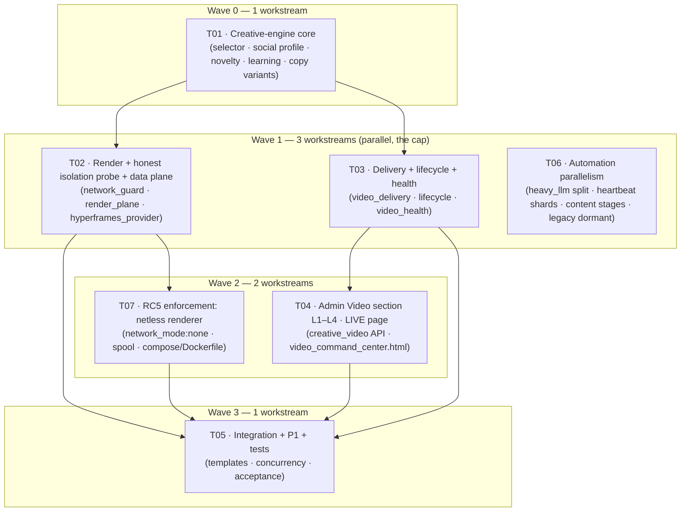

# System Design — Per-Customer Video Personalization & End-to-End Video Automation

**Product:** LeadGen AI (https://leadsgenai.in)
**Project:** `video_personalization_v2`
**Author:** 高见远 (Gao) — Architect, Software Development Team
**Date:** 2026-09-11
**Repo:** `leadgenrationaivoiceagent` · branch `main` @ `33189b70`
**Input:** `deliverables/software-company/video-personalization-prd-2026-09-11.md` (PRD, 许清楚)
**Status:** For Engineer implementation. Design only — no implementation code in this document.
**Rev 2 (2026-09-11):** three post-implementation gaps ruled on — see **§12** (A1 dashboard relocation · A2 `video_jobs.py` ownership · A3 RC5 netless enforcement). Part B now includes **T07**; §2.2/§2.4/§9 amended; §1 REUSED row corrected.

> **Evidence vocabulary used throughout:** PRODUCTION-PROVEN · CODE-PRESENT · TEST-PROVEN · LOCAL-ONLY · PARTIAL · STALE · UNKNOWN.
> Every "REUSED" line names a real file at `33189b70`. Every "NEW" line is genuinely absent from the repo (verified by grep).

---

## 0. Design thesis (one paragraph)

The complaint — *"same video roz customer ko ja raha hai"* — has four independent causes: the recipe is fixed, the copy is templated, the composition is fixed, and the learning that would break the tie is dead. The design therefore changes **four decision points, not one**: (1) a deterministic tenant-seeded **selector** replaces the env default as the sole recipe/template authority; (2) a **SocialProfile** (Creative DNA) feeds tone/pillars into copy + template choice; (3) a **novelty gate** fingerprints scene text and refuses near-duplicates, re-selecting rather than shipping a clone; (4) the **learning ledger** is persisted and actually fed. Separately, rendering moves to a **local worker that pulls from the VPS** over a lease-based, idempotent, resumable data plane, with `network_disabled()` turned from a declared flag into an enforced primitive. Nothing in the compliance stack (`recipe_allowed`, `entitlement_gate`, consent, publish gate, Swara voice) is touched.

---

## Part A — System Design

### 1. Implementation Approach & Framework / Library Choices

#### 1.1 Core technical challenges

| # | Challenge | Why it is hard here | Resolution |
|---|---|---|---|
| C-1 | **Provable novelty** across days without a diff of rendered bytes | Video bytes differ trivially (timestamps, encode noise). Need a content fingerprint that is stable across encodes but sensitive to copy/composition change. | Fingerprint **normalised scene text** (word 3-gram shingles) + `(recipe, template_id)` identity. Runs pre-enqueue on the in-memory spec. |
| C-2 | **Learning that survives restart** | `_MEM_STORE` is process-local (`learning.py:65`). | Per-tenant **append-only JSONL**, resolved through `runtime_data_authority` (the project's canonical store seam), locked with `filelock` (already a dependency — `delivery_ledger.py:286`). |
| C-3 | **Idempotent + resumable local↔VPS transport** | Local machine may be NAT'd/asleep (OQ-2 unresolved); worker may crash mid-render. | **Pull + lease** model. Leases, heartbeats, backoff and reclaim **reuse `app/dev_control`** (atomic claim, `lease_policy`, `reconcile`) rather than a new lease engine. Completion is idempotent on `(job_id, revision, sha256)`. |
| C-4 | **Enforcing network isolation** | `network_disabled()` (`hyperframes_provider.py:131`) has zero call sites. A flag cannot stop a child process from opening a socket; `unshare --net` is unavailable (no `CAP_SYS_ADMIN` on `worker-video`). | Enforcement is a **`network_mode: "none"` renderer** (T07) — no capabilities, no netns syscall; `network_guard` asserts that runtime fact from inside the netless container (`enforced: true`) and labels honestly otherwise (`network_best_effort`, PARTIAL). See §9 / §12 A3. |
| C-5 | **Unlocking `before_after`/`testimonial` without weakening the gate** | `_BLOCKED_WITHOUT_SOURCE` must stay intact (`recipes.py:10`). | A **capture flow** that registers consent-flagged assets and a verified quote through the *existing* `assets.register_asset`, then passes `source_asset_ids` / `verified_quote` to the *unchanged* `recipe_allowed`. |
| C-6 | **One honest lifecycle view** | State is spread over `store`, `qa`, `enterprise_qa`, `approval`, `delivery_ledger`. | A **projection** (`lifecycle.py`) reads those stores; a missing stage is reported `failed`/`not_reached`, never `passed`. |

#### 1.2 Framework & library selections (REUSED vs NEW)

| Concern | Choice | REUSED (path) / NEW | Justification |
|---|---|---|---|
| Web framework | FastAPI (existing) | **REUSED** `app/main.py`, `app/api/*` | No change; new routers are `APIRouter`s included the same way. |
| Task queue | Celery, `video` queue | **REUSED** `app/worker.py`, `app/tasks/video_jobs.py` | Heavy render already off the web path; new tasks follow the same `@celery_app.task` seam. |
| Spec / hashing | `CreativeSpec` dataclass | **REUSED** `creative_os/spec.py` | `spec_hash()`, `compute_input_hashes()`, `canonical_json()` are exactly the identity primitives the novelty gate needs. |
| Recipe engine | 8 recipes | **REUSED** `creative_os/recipes.py` | Extended with copy variants + `dna`; `recipe_allowed` untouched. |
| Render | HyperFrames CLI subprocess | **REUSED** `creative_os/hyperframes_provider.py` | Local render already implemented; only isolation + manifest evidence added. |
| QA | base + enterprise | **REUSED** `creative_os/qa.py`, `enterprise_qa.py` | Q1/Q2/Q3/Q4 definitions already live here. |
| Approval | exact-hash binding | **REUSED** `creative_os/approval.py` | Publish gate unchanged. |
| Record store | JSON per record | **REUSED** `creative_os/store.py` | Tenant-isolated, no migration. |
| Flags | fail-closed env flags | **REUSED** `creative_os/flags.py` | New flags added to the single `flag_snapshot()`. |
| Store path authority | tri-state resolver | **REUSED** `app/platform/runtime_data_authority.py` | Mandatory for every NEW store (repo ratchet). |
| Delivery audit | append-only JSONL | **REUSED** `app/marketing/delivery_ledger.py` | New event types added additively. |
| Owner truth gate | verified/labelled feed | **REUSED** `app/utils/owner_feed.py` | Health probes reuse `build_event` so unverified sources are force-labelled. |
| Lease / heartbeat / reconcile | control-plane primitives | **REUSED** `app/dev_control/claims.py` (minimally generalised), `lease_policy.py` + `reconcile.py` (as-is) | C8: do **not** build a second lease engine. `lease_policy`/`reconcile` reused **as-is**; `claims.py` gets one backward-compatible generalisation — its conditional-UPDATE must take a row model, because `atomic_claim`/`claim_next` are hard-coded to `DevTask` (`claims.py:63,70,127`) and cannot lease a `RenderJob`. DevTask wrappers preserved — no fork. |
| Telegram egress | `sendVideo`/`sendMessage` HTTP | **REUSED** `app/social_engine/providers.py:38-77` | Delivery reuses the proven request shape; the provider stays **unregistered** (ban-risk, `providers.py:458`). |
| Local worker HTTP | `httpx` / `urllib` | **REUSED** existing stack | No new dependency; `filelock` for local journal. |
| Network isolation (RC5) | `network_mode: "none"` render sandbox | **NEW** usage (Docker compose, no PyPI dep) | Zero extra capabilities, stronger than a netns; proxy-blackhole fallback. See §9. `unshare --net` is **rejected** — no `CAP_SYS_ADMIN` on `worker-video`. |
| Admin UI (P0-10) | live server-rendered HTML console | **REUSED** `frontend/admin_dashboard.html` + `/design-system/styles.css` | The React `admin-dashboard/` SPA is **dead** (mock-only, never built/served — see §2.4). The live admin surface is `frontend/*.html` served via `FileResponse` (`app/main.py:1805`). |
| Design language | `/design-system/styles.css` (live) | **REUSED** `frontend/admin_dashboard.html:32` | The `frontend/archify-*.html` pages are **not served** by any route; `archify-design-system.css` is referenced only by those unserved pages. |

**Net new third-party packages: ZERO.** (See §6.)

---

### 2. File List

Legend: **NEW** = create · **MOD** = modify existing. All paths repo-relative.

#### 2.1 Creative-engine core (Wave 0 — T01)

| File | NEW/MOD | Purpose |
|---|---|---|
| `app/marketing/creative_os/social_profile.py` | **NEW** | `SocialProfile` type, `analyze()`, tenant-scoped persistence, `apply_to_copy()`. |
| `app/marketing/creative_os/selector.py` | **NEW** | Deterministic tenant-seeded `(recipe, template_id, hook_variant)` selector + cold-start rotation. |
| `app/marketing/creative_os/novelty.py` | **NEW** | `scene_fingerprint()`, `jaccard()`, lineage index, `check()`. |
| `app/marketing/creative_os/learning_store.py` | **NEW** | Durable per-tenant JSONL learning ledger (replaces `_MEM_STORE`). |
| `app/marketing/creative_os/spec.py` | **MOD** | Add `hook_variant`, `selection_reason`, `novelty`, `social_profile_version` fields (additive defaults). |
| `app/marketing/creative_os/recipes.py` | **MOD** | Add `COPY_VARIANTS` + `dna`/`variant` kwargs to `build_scene_plan`. `recipe_allowed` untouched. |
| `app/marketing/creative_os/brief.py` | **MOD** | Attach persisted `SocialProfile` into `BrandProfile.social_profile` (read-only). |
| `app/marketing/creative_os/learning.py` | **MOD** | Delegate persistence to `learning_store`; keep the public API identical. |
| `app/marketing/creative_os/flags.py` | **MOD** | New fail-closed flags + `flag_snapshot()` entries. |
| `app/marketing/creative_os/service.py` | **MOD** | Wire selector + novelty gate + learning feed; new `enqueue_generate` params. |

#### 2.2 Render + data plane (Wave 1 — T02)

| File | NEW/MOD | Purpose |
|---|---|---|
| `app/marketing/creative_os/network_guard.py` | **NEW** | `build_isolation()` → argv prefix + env; `enforced` truth value. |
| `app/render_plane/__init__.py` | **NEW** | Package marker + public exports. |
| `app/render_plane/jobstore.py` | **NEW** | `RenderJob` persistence + lease/heartbeat **+ expired-lease reclaim** (thin wrapper over `lease_policy`) — reclaim folded in so T02 stays ≤10 files (see §5 note ¹). |
| `app/render_plane/api.py` | **NEW** | Worker-facing router: lease / heartbeat / complete / fail / status / fetch. |
| `app/render_plane/transport.py` | **NEW** | Resumable, hash-verified chunked upload/download. |
| `app/render_plane/worker.py` | **NEW** | Local render-worker loop (journal recovery, lease, render, upload). |
| `app/render_plane/client.py` | **NEW** | Worker HTTP client (token from env, never logged). |
| `app/marketing/creative_os/hyperframes_provider.py` | **MOD** | `_run_renderer` applies `network_guard`; records isolation evidence in the asset. |
| `app/tasks/video_jobs.py` | **MOD** | **SOLE WRITER: T02.** Adds `render_plane_lease_task` **and** the thin wrappers `video_delivery_task` + `video_delivery_retry_task` (see §2.3 / §12 A2); wires completion back into `process_generation`. |
| `app/dev_control/claims.py` | **MOD (minimal, backward-compatible)** | One generalisation: the conditional-UPDATE claim takes a **row model** so `atomic_claim`/`claim_next` can lease a `RenderJob` (they are hard-coded to `DevTask` — `claims.py:63,70,127`). DevTask wrappers preserved; **no fork, no second lease engine** (§1.2, §12.4). |
| `app/main.py` | **MOD — but edited in T04, not T02** | Router includes (`render_plane.api` + `creative_video`) happen **once**, in T04 (§2.4). Listed here only to make the batch boundary explicit — **T02 does not edit `main.py`**. |

> **RC5 note (amended — see §12 A3 / §9.1).** T02 ships the **honest capability probe + truthful labelling** only (`enforced: true` iff isolation actually ran). The actual RC5 *enforcement* (a `network_mode: none` renderer) is **T07**, because it needs a compose file and a filesystem transport that do not fit T02's ≤10-file budget. After T02, RC5 = **PARTIAL**; after T07, RC5 = enforced.
>
> **File-ownership note.** `app/tasks/video_jobs.py` has exactly **one writer per wave** (T02). T03 owns the *implementation* in `app/marketing/video_delivery.py` and must **not** edit `video_jobs.py`; T05 verifies all three tasks exist and delegate correctly. This removes the two-writer conflict and keeps T02 ∥ T03 truly parallel. Full contract in §12 A2.
>
> **`dev_control` reuse note.** The lease primitives are **reused, not reinvented** (C8): `lease_policy.py` and `reconcile.py` are used **as-is**, and `claims.py` gets **one minimal backward-compatible generalisation** — its conditional-UPDATE must accept a row model, because `atomic_claim`/`claim_next` are hard-coded to `DevTask` (`claims.py:63,70,127`) and cannot lease a `RenderJob`. The `DevTask` wrappers are preserved (**no fork**). This is what holds T02 at **10 owned files** (§1.2, §5 note ¹, §12.4).

#### 2.3 Delivery + lifecycle + health (Wave 1 — T03, parallel to T02)

| File | NEW/MOD | Purpose |
|---|---|---|
| `app/marketing/video_delivery.py` | **NEW** | Telegram per-customer + ops-group delivery, retry queue, capture flow helpers. |
| `app/marketing/creative_os/lifecycle.py` | **NEW** | 9-stage tenant-scoped lifecycle projection. |
| `app/marketing/video_health.py` | **NEW** | End-to-end automation probes (artifact + freshness + verified). |
| `app/marketing/delivery_ledger.py` | **MOD** | Add event types (video_delivered, novelty_blocked, render_plane_*, social_profile_*). |
| `app/platform/scheduler_config.py` | **MOD** | Register 4 new jobs in `JOB_META`. |
| `app/api/automation_flags.py` | **MOD** | Register new gated flags. |
| `app/marketing/daily_video.py` | **MOD** | Call selector + novelty; learning feed; local-render status. |
| `app/tasks/video_jobs.py` | **NOT T03** | The two delivery task wrappers are written by **T02** (sole writer — §2.2 / §12 A2). T03 implements `video_delivery.py` and must not edit this file. |

#### 2.4 Admin Video section (Wave 2 — T04)

| File | NEW/MOD | Purpose |
|---|---|---|
| `app/api/creative_video.py` | **NEW** | Tenant-scoped Video API — router prefix `/api/admin`, routes under `/video` (full paths `/api/admin/video/…`; 5 endpoints — see §12 A1b). |
| `frontend/video_command_center.html` | **NEW** | **LIVE** L1→L4 Video page served at `/app/admin/video`; plain `fetch` + admin Bearer token + Archify CSS (the `delivery_command_center.html` pattern). |
| `app/main.py` | **MOD** | Two edits, once: `FileResponse` route `/app/admin/video` → `frontend/video_command_center.html`, **and** `include_router(creative_video.router)` (+ `render_plane.api`). |
| `frontend/admin_dashboard.html` | **MOD** | One nav link line (`<nav class="nav">`, beside the existing `/app/studio` link at :277) → `/app/admin/video`. |

> **Amended (see §12 A1).** The original §2.4 targeted `admin-dashboard/src/**`, which is **dead UI code**: `admin-dashboard/src/api/client.ts:1059` wires `createMockApiClient()`, there is no HTTP layer (`fetch`/`axios`/`VITE_API` = 0 hits), no HTTP dependency, and nothing in `deploy/`/`docker-compose.vps.yml`/`scripts/` ever builds or serves the SPA. Shipping there would be surface without substance. The live admin surface is `frontend/*.html` served by `FileResponse` from `app/main.py`. **All `admin-dashboard/**` files are removed from T04's file list.**

#### 2.5 Integration + verification + P1 (Wave 3 — T05)

| File | NEW/MOD | Purpose |
|---|---|---|
| `app/marketing/creative_os/hyperframes_templates.py` | **MOD** | Register ≥3 new tenant-niche templates (P1-2). |
| `app/marketing/creative_os/hyperframes_provider.py` | **MOD** | New binders for the added templates (P1-2). |
| `video_renderer/hyperframes/templates/makeover_before_after_v1/` | **NEW** | Composition for the makeover niche. |
| `video_renderer/hyperframes/templates/salon_service_v1/` | **NEW** | Composition for the salon niche. |
| `app/marketing/creative_os/selector.py` | **MOD** | Niche→template map extended to the new templates. |
| `app/marketing/creative_os/flags.py` | **MOD** | Concurrency-cap flags (P1-3). |
| `tests/test_novelty_gate.py` | **NEW** | Consecutive-day Jaccard < 0.6 acceptance. |
| `tests/test_network_isolation.py` | **NEW** | Proves an outbound call fails during render. |
| `tests/test_render_plane_resume.py` | **NEW** | Network drop + worker restart → no duplicate, no loss. |

> Files touched by more than one wave (e.g. `service.py`, `video_jobs.py`, `main.py`, `flags.py`, `hyperframes_provider.py`) are edited in their **owning wave**; later waves add only their own hunks. This keeps each change batch ≤10 files (§5).

---

### 3. Data Structures & Interfaces

#### 3.1 NEW persisted types

```python
# app/marketing/creative_os/social_profile.py
@dataclass
class SocialProfile:
    tenant_id: str
    profile_version: str              # sha256 of the input signals (content-addressed)
    source: str                       # "instagram_graph" | "manual_link" | "owner_supplied" | "kb_only"
    source_ref: str                   # masked handle/url; NEVER a token
    analysis_method: str              # "graph_api" | "assisted" | "kb_derived"
    analyzed_at: float
    tone: str                         # e.g. "warm, aspirational, Hinglish"
    audience: str                     # e.g. "women 22-40, Mumbai, bridal+party"
    content_pillars: list[str]        # ["before/after", "client stories", "pricing transparency"]
    visual_style: dict[str, Any]      # {"palette": [...], "layout": "editorial", "motion": "slow"}
    posting_cadence: dict[str, Any]   # {"per_week": 4, "best_days": ["Tue","Fri"]}
    top_performing_format: str        # e.g. "before_after"
    language_hint: str                # "hinglish" | "hi" | "en"
    verified: bool                    # True only when a verifiable source produced it
    evidence_label: str               # PRODUCTION-PROVEN | CODE-PRESENT | LOCAL-ONLY | PARTIAL | UNKNOWN
    needs_input: list[str]            # missing fields → needs_customer_input, never fabricated
    raw_signals: dict[str, Any]       # non-secret signals kept for audit

    def profile_hash(self) -> str: ...
    def to_dict(self) -> dict[str, Any]: ...
```

```python
# app/marketing/creative_os/novelty.py
@dataclass
class CreativeLineage:
    tenant_id: str
    creative_id: str
    revision: int
    day: str                    # "YYYY-MM-DD" (UTC) — the consecutive-day key
    recipe: str
    template_id: str
    hook_variant: str
    spec_hash: str
    scene_text_hash: str        # sha256 of normalised concatenated scene text
    shingles: list[str]         # sorted 16-char hashes of word 3-grams
    at: float
    forced: bool = False        # operator explicitly overrode a near_duplicate refusal

    def to_dict(self) -> dict[str, Any]: ...
    @classmethod
    def from_dict(cls, d: dict) -> "CreativeLineage": ...
```

```python
# app/marketing/creative_os/learning.py  (CreativeLearningLink — EXTENDED, additive)
@dataclass
class CreativeLearningLink:
    creative_id: str
    revision: int
    tenant_id: str
    publish_record_id: str = ""
    platform: str = ""
    recipe: str = ""
    metrics: dict[str, float] = field(default_factory=dict)
    lead_event_ids: list[str] = field(default_factory=list)
    booking_ids: list[str] = field(default_factory=list)
    revenue_inr: float | None = None
    source: str = "manual_import"
    verified: bool = False
    # --- NEW (additive; from_dict filters to known keys, so old rows load) ---
    kind: str = "engagement"    # qa | approval | rejection | engagement
    note: str = ""              # rejection reason / QA blocker, <=400 chars
    at: float = 0.0
    day: str = ""
```

```python
# app/render_plane/jobstore.py
@dataclass
class RenderJob:
    job_id: str                  # == f"rp:{tenant_id}:{creative_id}:rev{revision}"
    idempotency_key: str         # UNIQUE — job_id
    tenant_id: str
    creative_id: str
    revision: int
    spec_hash: str
    template_id: str
    aspect_ratio: str
    # lease columns mirror DevTask exactly (reuse, do not reinvent)
    state: str                   # queued|leased|rendering|uploading|done|failed|expired
    lease_owner: str = ""
    lease_until: float = 0.0
    attempt: int = 0
    retry_count: int = 0
    next_eligible_at: float = 0.0
    # artifact
    artifact_path: str = ""
    artifact_sha256: str = ""
    artifact_bytes: int = 0
    manifest_hash: str = ""
    network_isolation: dict[str, Any] = field(default_factory=dict)  # {"method":..., "enforced": bool}
    error: str = ""
    created_at: float = 0.0
    updated_at: float = 0.0
```

#### 3.2 How learning persistence replaces `_MEM_STORE`

- **Store:** per-tenant **append-only JSONL** at `resolve_store_path(store_id="marketing.creative_learning", legacy_path=Path("data")/"creative_os"/"learning", target_segments=("marketing","creative_learning"))` → `<root>/<tenant_id>.jsonl`.
- **Why JSONL + filelock rather than a single atomic-replace JSON:** the ledger is append-only by contract and can grow unbounded; `delivery_ledger.py` already proves this exact pattern per-tenant (`_read_events`/`log_event`, `filelock` at `:286`). `daily_video._STATE`'s atomic-replace is the right pattern for a small mutable *map*, and is reused for the novelty/state files; it is not the right pattern for an accumulating ledger. Both resolve through `runtime_data_authority`, satisfying the PRD's "per-tenant via runtime_data_authority" requirement.
- **API compatibility:** `learning.record_learning()` / `get_learning_history()` / `get_tenant_recipe_stats()` / `suggest_next_creative_strategy()` keep their signatures; only the backing store changes. `get_learning_history()` reads the last `limit` lines (default 500 cap) and skips corrupt lines (never raises).
- **The 4 feed sites** (PRD P0-4):
  1. **QA verdict** — `service.process_generation`, after `run_qa`/`enterprise_qa.evaluate` → `kind="qa"`, `verified=True`, `metrics={"enterprise_class": 1.0 if approvable else 0.0}`.
  2. **Approval** — `service.approve_exact` → `kind="approval"`, `verified=True`.
  3. **Rejection** — `service.request_changes` → `kind="rejection"`, `note=change_note`, `verified=True`.
  4. **Post-publish engagement** — `video_delivery.deliver_video` + a P1 ingest adapter → `kind="engagement"`, `verified` **only** when the source is verifiable (per `CreativeLearningLink.verified`).
- Learning stays **advisory-only**: `suggest_next_creative_strategy` biases the selector; it never mutates prompts or spends (the existing `auto_mutate_prompts: False` contract is preserved).

#### 3.3 EXTENDED `enqueue_generate` signature (back-compatible, keyword-only)

```python
def enqueue_generate(
    *, tenant_id: str, business_name: str,
    recipe: str = "offer_announcement",           # now the SELECTOR's output, not the sole authority
    offer: str = "", niche: str = "general", language: str = "hinglish",
    platform: str = "instagram", aspect_ratio: str = "9:16",
    provider: str = "deterministic", cta: str = "",
    publish_targets: list[str] | None = None,
    source_asset_ids: list[str] | None = None,
    brand_revision: str = "v1", seed: int = 0,
    # --- NEW ---
    template_id: str = "",              # validated against TEMPLATE_REGISTRY (never a path)
    hook_variant: str = "",             # selector output, recorded on the spec
    verified_quote: str = "",           # P0-5: enables `testimonial` via recipe_allowed
    force: bool = False,                # operator override of a near_duplicate refusal
    social_profile_version: str = "",   # pins which DNA produced the copy
) -> dict[str, Any]: ...
```

`recipe_allowed(recipe, source_asset_ids=..., verified_quote=verified_quote)` is now called **with** `verified_quote` — the function already supports it (`recipes.py:54`); only the call site was incomplete. The gate logic is untouched.

#### 3.4 Class diagram

See `class-diagram.mermaid` (generated alongside this document). Relationships:
`CreativeSelector` → depends on `SocialProfile`, `LearningStore`, `RecipeEngine`;
`Service` → orchestrates `CreativeSelector`, `NoveltyGate`, `Brief`, `CreativeStore`, `RenderPlane`;
`NoveltyGate` → reads/writes `CreativeLineage`;
`HyperFramesProvider` → uses `NetworkGuard`;
`RenderPlaneJobStore` → reuses `DevControlClaims`/`LeasePolicy`/`Reconcile`;
`VideoDelivery` → uses `TelegramEgress` + `DeliveryLedger`;
`LifecycleProjection` → reads `CreativeStore` + `DeliveryLedger` + `Approval` + `Assets`.

---

### 4. Program Call Flow

Full sequence diagrams: `sequence-diagram.mermaid`.

#### 4.1 Per-customer personalised video path (P0-1/2/3/4/5/7/8)

1. **Scheduler** (`staff-daily-video-daily`, unchanged cadence) → `daily_video.run_daily()`.
2. `run_daily` → `selector.select_creative(tenant_id, day, learning_stats, profile)`.
   - `selector` → `social_profile.get_profile(tenant_id)` → `dna` (or `needs_customer_input`).
   - `selector` → `learning_store.get_tenant_recipe_stats(tenant_id)` (advisory bias only).
   - Returns `{recipe, template_id, hook_variant, seed, reason}`; blocked recipes excluded unless `source_asset_ids`/`verified_quote` present.
3. `run_daily` → `service.enqueue_generate(..., recipe=<selected>, template_id=<selected>, hook_variant=<selected>)`.
4. `service` → `brief.resolve_brief(...)` (entitlement + verified brand facts — **unchanged, fail-closed**).
5. `service` → `recipes.build_scene_plan(recipe, ..., dna=dna, variant=variant)` (varied copy).
6. `service` → builds in-memory `CreativeSpec` → `novelty.check(spec, tenant_id, N=7)`:
   - **near_duplicate** → `service` re-calls `selector` with the next rotation index (bounded, `K ≤ 6`); if all fail → `{"ok": False, "outcome": "near_duplicate"}` (unless `force=True`, then recorded with `forced=True`).
   - **ok** → `novelty.accept(spec)` appends a `CreativeLineage` line.
7. `service` → `store.save_record(spec)` + `budget.record_attempt` + `delivery_ledger.log_event("creative_os_queued")` → `_enqueue_celery(...)`.
8. **Celery** `render_creative_os_task` → `service.process_generation(tenant, creative)` → `provider.generate(spec)` → `hyperframes_provider._run_renderer` under `network_guard` (enforced) → artifact + `manifest_hash`.
9. `run_qa` → `enterprise_qa.evaluate` → `qa_results.classification`.
10. `learning_store.record_learning(kind="qa", ...)`; status → `approval_pending`; `delivery_ledger.log_event("video_ready")`.
11. **Owner** approves → `service.approve_exact` → `approval.bind_approval` (exact-hash + live bytes) → `learning_store.record_learning(kind="approval", ...)`.
12. `video_delivery.deliver_video(tenant, creative)` → resolves artifact via `service.resolve_output_path` → Telegram **per-customer thread** + **ops group** (egress only) → `delivery_ledger.log_event("video_delivered", key=...)`; failures → retry queue.
13. `lifecycle.project(tenant, creative)` renders the 9 stages for the dashboard.

#### 4.2 Local-render-worker ↔ VPS data plane (P0-6, RC5)

**Model: pull + lease.** The local worker polls the VPS; the VPS never dials the worker (NAT-safe, tolerates the machine being asleep — OQ-2).

1. **Worker start** → `worker.recover_journal()`: re-reads its local journal of in-flight `job_id`s and re-leases them by id.
2. **Lease** → `client.lease_next()` → `api.POST /api/render-plane/lease` → `jobstore.atomic_claim(...)` (reuses `dev_control` conditional UPDATE) → returns `{job, lease_token, expires_at}`. No global lock: each job is leased independently; many tenants render concurrently.
3. **Heartbeat loop** → `api.POST /heartbeat` → `jobstore.atomic_heartbeat(...)` (extends only a lease the caller owns).
4. **Fetch inputs** → `transport.fetch(spec, assets)` — resumable by byte offset, sha256-verified.
5. **Render** → `HyperFramesProvider.generate(spec)` under `network_guard` (no network needed during render — RC5 enforced).
6. **Upload artifact** → `transport.upload(path)` chunked + resumable; server verifies sha256.
7. **Complete** → `api.POST /complete {job_id, revision, attempt, sha256, manifest_hash}` → `jobstore.complete(...)`:
   - same `(job_id, revision, sha256)` already `done` → **idempotent success**;
   - same `(job_id, revision)` different `sha256` → **conflict**, first wins, second rejected.
8. `delivery_ledger.log_event("render_plane_completed")` → VPS marks the creative ready for QA (step 9 of §4.1).

**Failure / interruption semantics**

| Event | Behaviour | Guarantee |
|---|---|---|
| **Network loss during render** | Render is local → completes unaffected; heartbeats fail → worker backs off; resumes heartbeat on reconnect. | No lost render. |
| **Network loss during upload** | Upload resumes from last acknowledged byte offset (`Content-Range`). | No re-render, no partial artifact accepted (sha256 verified server-side). |
| **Worker process restart** | `recover_journal()` re-leases the same `job_id`; if the lease was reclaimed, the worker sees `state != leased` and abandons the stale attempt. | No duplicate artifact. |
| **Worker crash (no restart)** | Lease expires → `render_plane.jobstore.reconcile_render_leases` reclaims via `lease_policy.plan_lease_reclaim` → requeue with exponential backoff (`60s·2^n`, 15 min cap, jitter). | Poison job cannot hot-loop. |
| **VPS restart** | Job rows/leases are durable; expired leases are reclaimed on the next reconcile tick. | No lost job. |
| **Duplicate execution** | Completion is keyed on `(job_id, revision, sha256)`; the DB unique `idempotency_key` makes a second create a no-op. | Exactly-once effect. |

---

### 5. Ordered Task List with Dependencies

**Hard limits honoured:** ≤5 tasks; each task ≤10 files; ≤3 concurrent workstreams (waves).

| Wave | Task | Files | Depends on | Priority |
|---|---|---|---|---|
| **W0** | **T01 — Creative-engine core** (selector, social profile, novelty gate, learning persistence, recipe copy variants, spec/flags/brief/service wiring) | 10 | — | P0 |
| **W1** | **T02 — Render + honest isolation probe + local↔VPS data plane** | 10 (12 − `main.py` deferred to T04 − `reconcile.py` folded into `jobstore.py`)¹ | T01 | P0 |
| **W1** | **T03 — Delivery + lifecycle + health** (Telegram egress, lifecycle projection, health probes, ledger events, scheduler jobs) | 7 | T01 | P0 |
| **W1** | **T06 — Automation parallelism** (B2 queue split · B3 heartbeat shards · B4 staged content dispatch · B5 legacy dormant) — see §11 | 4 | — (independent) | P0 |
| **W2** | **T04 — Admin Video API + LIVE page (L1→L4)** — `app/api/creative_video.py` + `frontend/video_command_center.html` (see §12 A1) | 4 | T01, T03 | P0 |
| **W2** | **T07 — RC5 enforcement: netless renderer** (`network_mode: none` + filesystem transport) — see §9.1 / §12 A3 | 5 | T02 | P0 |
| **W3** | **T05 — Integration, template expansion (P1-2), concurrency caps (P1-3), acceptance tests** | 9 | T02, T03, T04, T07 | P1 |

¹ `app/main.py` is edited exactly once (in T04, to include both `render_plane.api` and `creative_video` routers). Expired-lease reclaim is folded into `jobstore.py` (it is only a thin wrapper over `lease_policy`), so T02 owns **exactly 10 files**: `network_guard.py` (1) · `render_plane/{__init__,jobstore,api,transport,worker,client}.py` (6) · `hyperframes_provider.py`, `dev_control/claims.py`, `video_jobs.py` (3). `claims.py` is edited (not reused verbatim) because `atomic_claim`/`claim_next` are hard-coded to the `DevTask` model (`claims.py:63,70,127`) and cannot lease a `RenderJob` row as-is — see §1 REUSED row.

**Per-task detail**

**T01 — Creative-engine core** · Files: `social_profile.py`(N), `selector.py`(N), `novelty.py`(N), `learning_store.py`(N), `spec.py`(M), `recipes.py`(M), `brief.py`(M), `learning.py`(M), `flags.py`(M), `service.py`(M). Deps: none. Acceptance: consecutive-day specs → Jaccard < 0.6 or `near_duplicate` refusal; `record_learning` has ≥4 callers; history survives restart.

**T02 — Render + data plane** · Files as above. Deps: T01 (spec fields, service seam). Acceptance: forced network drop + worker restart → no duplicate artifact, no lost video; outbound call fails during render.

**T03 — Delivery + lifecycle + health** · Files: `video_delivery.py`(N), `lifecycle.py`(N), `video_health.py`(N), `delivery_ledger.py`(M), `scheduler_config.py`(M), `automation_flags.py`(M), `daily_video.py`(M). **`video_jobs.py` NOT edited** — T02 is the sole writer (§2.2 / §12 A2). Deps: T01. Acceptance: every published video has a Telegram receipt; each automation reports artifact + freshness + `verified`.

**T04 — Admin Video section (LIVE page)** · Files: `app/api/creative_video.py`(N), `frontend/video_command_center.html`(N), `app/main.py`(M), `frontend/admin_dashboard.html`(M). Deps: T01, T03. Acceptance: L1→L4 drill at `/app/admin/video`, zero secrets, tenant-scoped server-side. **No `admin-dashboard/**` file is touched** (§12 A1).

**T07 — RC5 enforcement: netless renderer** · Files: `app/marketing/creative_os/network_guard.py`(M, adds the `CREATIVE_RENDER_NETLESS` fact-branch), `docker-compose.vps.yml`(M, new `renderer` service + `worker-video` demotion), `deploy/compose/docker-compose.video.yml`(M, overlay follows), `Dockerfile.video`(M, keep toolchain; add spool volume + `ENV CREATIVE_RENDER_NETLESS=1`), `app/render_plane/spool.py`(N, filesystem job/artifact spool). Deps: T02. Acceptance: `tests/test_network_isolation.py` asserts egress fails and `enforced is True`/`method=="container_netns_none"` (§9.3).

**T05 — Integration + P1** · Files: `hyperframes_templates.py`(M), `hyperframes_provider.py`(M), `selector.py`(M), `flags.py`(M), `templates/makeover_before_after_v1/`(N), `templates/salon_service_v1/`(N), `tests/test_novelty_gate.py`(N), `tests/test_network_isolation.py`(N), `tests/test_render_plane_resume.py`(N). Deps: T02, T03, T04, **T07**.

**Concurrency:** W0 = T01 alone. W1 = T02 ∥ T03 ∥ T06 (3 workstreams). W2 = T04 ∥ T07 (2 workstreams — both unblock once T01/T03 and T02 respectively land). W3 = T05. Never >3.

---

### 6. Dependency Packages

**New third-party Python packages: none.** Every capability is served by an existing dependency or the OS.

| Need | Solution | Free-tier / licence |
|---|---|---|
| Resumable HTTP (worker↔VPS) | `httpx` (already in the FastAPI stack) or stdlib `urllib`/`http.client` | OSS, already present |
| Local file locking | `filelock` (already imported at `delivery_ledger.py:286`) | BSD, already present |
| Store-path authority | `app.platform.runtime_data_authority` | in-repo |
| Lease/reconcile | `app.dev_control` (SQLAlchemy already present) | in-repo |
| Network isolation (RC5) | `network_mode: "none"` renderer (Docker Compose) + `network_guard` fact-branch | Docker-provided, no PyPI dep, **no extra capabilities** |
| Telegram egress | HTTP `POST api.telegram.org` via existing stack | free Bot API |
| Admin UI | live server-rendered HTML (`frontend/*.html` + `/design-system/styles.css`) | already present; the React SPA is **dead** (§12 A1) |

**No paid AI provider is introduced** (C2). The social-profile analyser is **assisted/manual + KB-derived** by default, not a paid API (see §10 OQ-4).

---

### 7. Shared Knowledge / Cross-File Conventions

**Naming**
- New modules: snake_case under `app/marketing/creative_os/` (engine) and `app/render_plane/` (data plane).
- Every public entry returns a dict and **never raises** (mirrors `store.py`, `assets.py`, `delivery_ledger.py`).
- IDs: `job_id = f"rp:{tenant_id}:{creative_id}:rev{revision}"`; `creative_id` stays `cr_<hex12>` (`CreativeSpec.new_id`).

**Flags (all fail-closed, all added to `flags.flag_snapshot()`)**
| Flag | Default | Meaning |
|---|---|---|
| `CREATIVE_NOVELTY_ENABLED` | `1` | Novelty gate active. ON is the *safe* state (it refuses clones); disabling it is the risky act, so fail-closed = ON. |
| `CREATIVE_SOCIAL_PROFILE_ENABLED` | `0` | Enable social-profile analysis (new data collection → off by default). |
| `CREATIVE_LEARNING_PERSIST_ENABLED` | `1` | Persist the learning ledger to disk. |
| `CREATIVE_RENDER_PLANE_ENABLED` | `0` | Route renders through the local worker data plane. |
| `CREATIVE_HYPERFRAMES_NETWORK_STRICT` | `0` | Refuse to render when isolation cannot be *enforced* (else label `network_best_effort`). |
| `VIDEO_TELEGRAM_DELIVERY_ENABLED` | `0` | Telegram result delivery (egress only). |
| `RENDER_PLANE_LEASE_SECONDS` | `600` | Worker lease TTL. |
| `RENDER_PLANE_WORKER_TOKEN` | unset | Worker auth token (env only, never logged/returned). |

**State machines**
- **Creative OS** (`states.py`, unchanged): `queued→generating→{qa_failed,approval_pending}→approved→scheduled→published`, plus `quarantined`. New flags must not invent states.
- **Render job** (`jobstore.py`): `queued→leased→rendering→uploading→done`; `failed→queued` (backoff). Reclaim uses `lease_policy` (CLAIMED/RUNNING→BLOCKED→QUEUED|FAILED semantics). **No new vocabulary is invented** — the render states map onto the control-plane pattern.
- **Lifecycle stages** (`lifecycle.py`, projection only): `spec → assets → render → qa → enterprise_grade → approval → publish → delivery → evidence`. Missing stage ⇒ `failed`/`not_reached`, never `passed`.

**Evidence labels** — every status field carries one of: `PRODUCTION-PROVEN · CODE-PRESENT · TEST-PROVEN · LOCAL-ONLY · PARTIAL · STALE · UNKNOWN`. The health probe (`video_health.py`) and the dashboard must render `verified:false` sources through the `owner_feed` truth gate (unverified may not look like fact).

**Store resolution** — every NEW store calls `runtime_data_authority.resolve_store_path(store_id=..., legacy_path=..., target_segments=...)` at call time (never an import-time constant). New store ids: `marketing.creative_learning`, `creative.novelty`, `creative.social_profile`, `video.delivery_bindings`, `render.plane_jobs`.

**Tenant isolation (C4)** — every store is keyed by `tenant_id`; cross-tenant reads return `not_found`/`tenant_mismatch`. Chat ids / tokens / phone numbers are masked in every projection; the API never returns them.

**Secrets (C3)** — `TELEGRAM_BOT_TOKEN`, `TELEGRAM_CHAT_ID`, `RENDER_PLANE_WORKER_TOKEN` come from env only; never logged, never in a manifest, never in a UI response.

---

### 8. Novelty Gate Design

**Goal:** guarantee consecutive videos for the same tenant are not near-duplicates (PRD Q5; PRD P0-1).

**8.1 What is fingerprinted**
- **Scene text only** (not bytes, not colours). For a candidate spec:
  1. Normalise each `SceneSpec.text`: lowercase → strip punctuation/control chars → collapse whitespace.
  2. Concatenate normalised scene texts in scene order.
  3. Emit **word-level 3-gram shingles**, hashed to 16 hex chars, stored **sorted** → `shingles: list[str]`.
  4. Also store `scene_text_hash` (sha256 of the normalised concatenation) and the `(recipe, template_id, hook_variant)` tuple.
- Rationale: bytes differ on every encode; text + recipe/template identity is what a viewer actually perceives as "the same video".

**8.2 Where the check runs**
- **Inside `service.enqueue_generate`**, **after** the spec is built and validated in memory, **before** `save_record` / `record_attempt` / Celery enqueue.
- On a near-duplicate, `service` re-invokes `selector.select_creative(..., rotation_index += 1)` and rebuilds the spec — up to `K ≤ 6` rotations. Only the **winning** spec is persisted (rejected candidates are never written to the ledger). If all rotations fail → `{"ok": False, "outcome": "near_duplicate", "tried": [...]}` (unless `force=True`).

**8.3 Comparison set & thresholds**
- Compare against the tenant's **last N = 7** accepted `CreativeLineage` entries (same tenant only — C4).
- Refuse when: `jaccard(candidate.shingles, prior.shingles) ≥ 0.6` **OR** `(recipe, template_id)` identical to **yesterday's** entry.
- `jaccard(A,B) = |A∩B| / |A∪B|` (empty-union ⇒ 0.0).
- `force=True` (operator) bypasses the refusal but writes `forced=True` on the lineage line and emits `delivery_ledger("novelty_blocked", meta={"forced": true})` so the override is auditable.

**8.4 Cross-customer distinctness (Q6, advisory)**
- `novelty.check` also flags when a **different** tenant shares an identical `spec_hash` within the lookback window. This is a **warning**, not a refusal (two different shops can legitimately run the same recipe), surfaced in the dashboard L2 card.

---

### 9. Enforcement Design for Network Isolation (RC5)

**Problem (verified):** `network_disabled()` (`hyperframes_provider.py:131`) is defined and re-exported (`:783`) but has **zero call sites**; `_hermetic_env()` only blanks `HYPERFRAMES_API_KEY` and unsets npm vars — it does **not** block egress.

**9.1 Where it is enforced — AMENDED (see §12 A3)**

> **Corrected premise.** The original §9.1 assumed `unshare --net` works inside `worker-video`. It does **not**: `docker-compose.vps.yml:510-517` declares `worker-video` with `user: "0:0"` and **no `cap_add:` and no `security_opt:`**. Docker's default capability set excludes `CAP_SYS_ADMIN`, so the netns syscall fails and `build_isolation()` would report `enforced=False` — RC5 would *look* fixed while staying broken. That is the worst outcome (C7), so the design is corrected rather than shipped.

**Chosen enforcement (option b): a `network_mode: none` renderer.** The isolation is provided by the **container runtime**, not by an in-process syscall — no capabilities are needed, and it is *stronger* than a netns prefix because the render process has **no network interface at all** (only `lo`).

- New service `renderer` (image = `Dockerfile.video`, i.e. the existing toolchain image): `network_mode: none`, `cap_drop: [ALL]`, `security_opt: [no-new-privileges:true]`, `mem_limit: 10240m`, `shm_size: 512m`. It is **not** a Celery worker — it needs no Redis/Postgres/egress, so `network_mode: none` is safe for it.
- It is driven by a **filesystem spool** on a shared volume: the networked orchestrator writes a job file, the renderer renders and writes the artifact + status back. Viable because `render_plane/transport.py` already fetches the spec + assets **before** the hermetic render step (the renderer needs no egress — `Dockerfile.video:71-73` already documents "a production render must never reach the network").
- `worker-video` becomes the **thin, networked orchestrator**: base image (toolchain moved out to `renderer`), `-Q video`, fetch → spool → collect → QA/register/approve.
- `network_guard.build_isolation()` becomes:
  1. If running inside the netless renderer (`CREATIVE_RENDER_NETLESS=1` set by the service) → `method="container_netns_none"`, **`enforced=True`** — this is a *fact asserted by the runtime*, not a probe.
  2. Else probe `unshare --net` capability and report honestly: `method="netns"`, `enforced=True` only if the probe actually succeeded.
  3. Else `method="proxy_blackhole"`, **`enforced=False`** (env blackhole: `HTTP(S)_PROXY`/`ALL_PROXY` → `http://127.0.0.1:9`, `NO_PROXY` cleared, plus the existing `_hermetic_env()` blanks).
- **Rejected — option (a) `cap_add: ["SYS_ADMIN"]`.** It grants a privilege far broader than "no network" and weakens the container boundary; RC5 is an *isolation* requirement, and (a) would trade one isolation weakness for a worse one.
- **Retained — option (c) proxy-blackhole + `network_best_effort` (PARTIAL)**, as the honest fallback wherever the netless renderer is not running (and on a bare Windows local box).
- `_run_renderer` records the outcome on the asset: `asset["network_isolation"] = {"method": iso["method"], "enforced": iso["enforced"]}`.
- **Fail-closed option:** when `CREATIVE_HYPERFRAMES_NETWORK_STRICT=1` and `enforced is False`, `_run_renderer` raises `RenderError("network_isolation_unavailable")` — no render rather than an un-isolated one.

**9.2 What "enforced" means for claims**
- The provider/asset may be described as **hermetic only when `network_isolation.enforced is True`**. Otherwise the artifact is labelled `network_best_effort` (PARTIAL) — the design explicitly forbids the phrase "hermetic render" for `enforced=False` (honours PRD §2 RC5 and C7).
- `enterprise_qa` gains an optional, non-blocking check `network_isolation_enforced` recorded in the QA evidence (so the dashboard can show it at L4).

**9.3 Proof (acceptance)**
- `tests/test_network_isolation.py` runs the renderer inside the `network_mode: none` service with a probe child that attempts `socket.connect(("1.1.1.1", 443))` (and a `curl` equivalent) and asserts the connection **fails**; it also asserts `asset["network_isolation"]["enforced"] is True` and `method == "container_netns_none"`. This is the PRD acceptance criterion 6.
- **Delivery split:** T02 ships the honest probe + labelling (RC5 = **PARTIAL**); **T07** ships the netless renderer (RC5 = **enforced**). Splitting keeps T02 within its ≤10-file budget and stops RC5 from being declared fixed before it is. T07's files are the enforcement artefacts that do **not** belong to T02: `network_guard.py` (M), `docker-compose.vps.yml` (M — new `renderer` service), `deploy/compose/docker-compose.video.yml` (M — overlay follows), `Dockerfile.video` (M — spool volume + `CREATIVE_RENDER_NETLESS=1`), `app/render_plane/spool.py` (N). These compose/Dockerfile files are **added to the file list here** and were not part of T02's batch.

---

### 10. Open Items

Items the PRD left ambiguous and that cannot be resolved from code at `33189b70`. Each is a **blocking input** for the named task; the design proceeds with the stated default.

| # | Open item | Affects | Design default until answered |
|---|---|---|---|
| OI-1 | **OQ-2 — local machine topology.** Always-on box vs owner's intermittent laptop? | T02 (resume protocol) | Pull + lease with TTL and journal recovery — tolerates sleep either way. |
| OI-2 | **OQ-4 — Instagram access method.** Graph API (business account + app review) vs owner-supplied link/screenshots? | T01 `social_profile` | `analysis_method="assisted"` (owner-supplied + KB). Graph API only if a business token is configured (fail-closed). |
| OI-3 | **OQ-3 — Telegram surfaces.** Are `TELEGRAM_BOT_TOKEN`/`TELEGRAM_CHAT_ID` set, what is the ops-group id, who may add a customer thread? | T03 delivery | Per-tenant binding store + `TELEGRAM_OPS_GROUP_ID`; delivery stays flag-OFF until confirmed. |
| OI-4 | **OQ-5 — consent wording** for before/after photos + testimonials (who signs, where recorded). | T01 capture path | `assets.register_asset(consent_status="granted")` is the record; capture UI collects an explicit consent flag. **Do not ship the proof format without a consent trail.** |
| OI-5 | **OQ-6 — authority of `DAILY_VIDEO_RECIPE`** after P0-3. | T01 selector | Env value becomes the **cold-start default for tenants with <2 lineage entries**; it is no longer a hard override. |
| OI-6 | **Render-job persistence backend.** DB `RenderJob` table (reuses `dev_control`) vs file store. | T02 jobstore | DB row via `dev_control` reuse (multi-worker lease correctness). Migration mechanism (Alembic vs `create_all`) must be confirmed from repo convention. |
| OI-7 | **B1 / OQ-1 — ₹5L acquisition plan.** | Success metrics | Not a rendering question; flagged, not assumed. Design delivers B2/B3/B4 only. |
| OI-8 | **New template HTML authorship** (P1-2) — requires real composition assets. | T05 | Registry + binder contract specified; HTML is authored in T05 against the existing `index.html` contract. |

---

## Part B — Task Decomposition

*(Section 5 above is the ordered task list; this part records the consolidated summary and dependency graph.)*

### Task summary

| ID | Name | Files | Wave | Deps | Priority |
|---|---|---|---|---|---|
| T01 | Creative-engine core | 10 | W0 | — | P0 |
| T02 | Render + honest isolation probe + local↔VPS data plane | 10 | W1 | T01 | P0 |
| T03 | Delivery + lifecycle + health | 7 | W1 | T01 | P0 |
| T04 | Admin Video API + **LIVE** page (L1→L4) | 4 | W2 | T01, T03 | P0 |
| T05 | Integration + template expansion + acceptance tests | 9 | W3 | T02, T03, T04, T07 | P1 |
| T06 | Automation parallelism (B2/B3/B4/B5; B1 documented) — §11 | 4 | W1 | — | P0 |
| T07 | RC5 enforcement: netless renderer — §9.1 / §12 A3 | 5 | W2 | T02 | P0 |

**File counts:** NEW = 22 · MODIFIED = 23 · total distinct files = 45. (Some files are edited in more than one wave — e.g. `flags.py`, `hyperframes_provider.py`, `selector.py`, `docker-compose.vps.yml` — each is counted once. `T02` and `T07` both touch `network_guard.py`, but T02 creates it, so it counts as NEW. `dev_control/claims.py` is a **MOD** — minimally generalised, §2.2 note.)

### Task dependency graph



> T06 has **no dependency edges** — it touches `team_scheduler.py`, `automation_health.py`, `worker.py`, `docker-compose.vps.yml`, none of which are touched by T01–T05, so it can start immediately and run alongside W1.
> T07 depends only on T02 and shares **no** file with T04 (`network_guard.py`, compose/Dockerfile vs `creative_video.py`, `video_command_center.html`), so W2 runs two workstreams in parallel. T05 gates on T07 because the network-isolation acceptance test (§9.3) asserts the netless method.

---

## §11 — Automation Parallelism (T06)

**Trigger:** owner requirement **"Ye automation system parallel me sab kuch chalaye"**. This is an addendum to §5 / Part B. **T06 is independent of T01–T05** and runs in parallel with them.

### 11.0 Which scheduler path actually runs in production (this decides B1)

**Production = Celery beat + workers. The in-process `team_scheduler.scheduler_loop` is the rollback fallback, not the live path.**

| Evidence | Statement |
|---|---|
| `docker-compose.vps.yml:20` | "(.env: `RUN_IN_PROCESS_SCHEDULER=0` + `--profile celery`)"; the `:-1` default is the *fallback* |
| `app/tasks/staff_jobs.py:10-12` | "LIVE VPS (2026-06-10 se): durable path ON — `RUN_IN_PROCESS_SCHEDULER=0` + `docker compose -f docker-compose.vps.yml --profile celery up -d`" |
| `deploy/scheduler/README.md:3` | "Primary scheduler = Celery beat (`--profile celery`, `leadgen_scheduler` container)" |
| `memory/decisions.md:1597` (ADR-001) | Durable Celery path chosen because the in-process loop blocked the web process; in-process kept only as rollback |
| `app/worker.py:793` | "`RUN_IN_PROCESS_SCHEDULER=0`, so an in-process-only job is DEAD in prod" |
| `progress.md:624` | prod recreates `worker` + `scheduler` with `--profile celery` |

⇒ Production parallelism is governed by **Celery worker concurrency** (`worker` conc=4; `worker-heavy` conc=1; `worker-video` conc=1) and by the **`content` mega-job's internal dispatch**. Those are B2 and B4.

### 11.1 Decision per blocker (nothing omitted)

| Blocker | Decision | Reason |
|---|---|---|
| **B1** `scheduler_loop` sequential `await _run_job` (`team_scheduler.py:1683-1966`) | **LEAVE UNCHANGED** (comment-only) | It is the **rollback path**, not the production path (§11.0). Bounded-concurrency dispatch there would not affect production and would change the proven behaviour of the emergency fallback. A one-line comment records the decision so it is not re-"optimised". If the rollback path is ever re-activated, bounded dispatch becomes a follow-up (T07). |
| **B2** `heavy` queue conc=1 serialising 8 jobs (`worker.py:54-63`, `docker-compose.vps.yml:390`) | **CHANGE** — resource-class queue split, flag-gated | Production serialisation. Split into `heavy_llm` (parallelisable, network-bound) vs `heavy` (ML, stays serial), with a safe fallback so the split can never strand jobs. |
| **B3** `file_lock` on every `record_run` snapshot (`automation_health.py:416`, `utils/file_lock.py`) | **CHANGE** — sharded lock-free heartbeat snapshot, flag-gated | Production serialisation on the shared heartbeat file. |
| **B4** `content` engines sequential + silent skips (`team_scheduler.py:851-932`) | **CHANGE** — bounded-concurrency staged dispatch + explicit skip/outcome record for every engine | Production serialisation **and** a silent-failure defect. |
| **B5** legacy jobs permanently `never_ran` (`automation_health.py:130-148` vs `worker.py:884`) | **CHANGE** — gate on `ENABLE_LEGACY_BEAT`, label `legacy_dormant` | The contradiction the team-lead flagged; permanent false alarms. |

`app/utils/file_lock.py` is **left unchanged** — justification in §11.3.

### 11.2 B2 — resource-class queue split

Classes (module constants in `app/worker.py`):
- `HEAVY_LLM_JOBS = {"blog", "content", "digest", "prospect"}` — LLM/network-bound; each job holds one outbound request at a time → parallelisable.
- `HEAVY_ML_JOBS = {"qa", "trainer", "hot_queue_brief", "hot_queue_owner_pack"}` — torch/ML, RAM+CPU-bound → stay serial.
- `HEAVY_STAFF_JOBS = HEAVY_ML_JOBS | HEAVY_LLM_JOBS` — **membership unchanged**, so no job changes semantics.

Routing (`_route_staff_task`, flag-gated): when `CELERY_HEAVY_LLM_QUEUE=1`, LLM jobs → `heavy_llm`, ML jobs → `heavy`; flag `0` (default) → **exactly today's behaviour** (all 8 → `heavy`).

Compose:
- New `worker-heavy-llm` (`--profile celery`): `-Q heavy_llm --concurrency=${HEAVY_LLM_CONCURRENCY:-2}`, `mem_limit: 1500m`, `cpus: "1.0"`.
- `worker-heavy` command becomes `-Q heavy,heavy_llm` — **it stays a second consumer of `heavy_llm`**. Deliberate: if `worker-heavy-llm` is not started, `worker-heavy` drains `heavy_llm` serially, so the routing flag can never strand jobs in a queue with no consumer (the hazard documented at `docker-compose.vps.yml:326-335`).

**VPS headroom reasoning (16 GB RAM / 4 vCPU, `docker-compose.vps.yml:42`).** Existing `mem_limit` ceilings already sum to ≈16.7 GB (app 3g, mcp 2g, db 2g, worker 2g, worker-heavy 2500m, worker-video 2000m, qdrant 768m, dsh 768m, redis 512m, redis-cache 384m, pgbouncer 256m, scheduler 512m). Ceilings are not usage, but **adding a container without reclaiming is not safe to assume**. Therefore:
- Reclaim in the same change: `worker` `--concurrency` 4 → 3 (removes one prefork child's peak).
- New service cap **1500m** (not 2g): 2 concurrent network-bound LLM jobs at ~300–600 MB RSS ≈ 1.2 GB peak < 1500m.
- `HEAVY_LLM_CONCURRENCY` clamped 1–3 (default 2). **Do not raise above 2 until measured.**
- **Mandatory validation gate before enabling the flag:** `docker stats --no-stream` + `free -m` under a real `content`+`blog` overlap; enable only if host free memory stays > 2 GB and no container is throttled. This is a procedure, not a promise — the design does **not** assert the number is safe without that measurement.

Rollback: set `CELERY_HEAVY_LLM_QUEUE=0` (routing reverts to the single `heavy` queue) and stop `worker-heavy-llm`; `worker-heavy` then drains `heavy,heavy_llm` serially = today's throughput. No data migration.

### 11.3 B3 — lock-free heartbeat snapshot

Problem: `record_run` (`automation_health.py:409-428`) appends to `job_runs.jsonl` (already atomic, lock-free) **and then** takes `file_lock(_BEATS())` to read-modify-write the single `job_heartbeats.json` snapshot. Every job completion across app×2 + worker(s) serialises on that one lock.

Change (flag `AUTOMATION_HEARTBEAT_SHARDED=0` default = today):
- When `=1`: each process writes only its own shard `job_heartbeats.d/<pid>.json` via atomic replace (`os.replace`) — **no cross-process lock**.
- Reader merges shards + the legacy single file (so a partial/rolled-back deploy still reads correctly). Missing/corrupt shard → skipped, never raises.
- A stale shard (older than `max(gap) × 2`) is ignored so a dead process's last heartbeat cannot mask a real one.

Durability / false-alarm guarantee: `job_runs.jsonl` remains the **authoritative** heartbeat and is unchanged; the shard is only the fast-read cache. `health()` falls back to the jsonl when shards are absent, so a lost shard can never produce a false dead-man alarm. `file_lock.py` is **left unchanged** — the fix removes the contended caller rather than editing a shared primitive also used by compliance stores (`delivery_ledger`, `owner_feed`); tuning a compliance-critical lock to speed up telemetry is the wrong trade (C1 spirit).

Rollback: set `AUTOMATION_HEARTBEAT_SHARDED=0` → the single-file locked path (retained in code) resumes.

### 11.4 B4 — content mega-job: staged bounded parallelism + explicit skip

Current: 13 engines `await`ed sequentially under `CONTENT_TIME_BUDGET_S` (default 420). Budget skips are recorded per engine by `_run_content_engine` (`team_scheduler.py:531-543`), **but** (a) the `customer_crm` block at `:924-932` is guarded by `if _content_budget.ok():` inside a bare `try/except: pass` — a **silent** skip; (b) engine *failures* are logged, never recorded; (c) nothing records an engine that was never dispatched.

Change (flag `CONTENT_PARALLEL_ENGINES=0` default = today):
- Declare `CONTENT_ENGINE_STAGES: list[list[str]]` (module constant in `team_scheduler.py`) — an explicit **stage order** so semantics are preserved:
  - **Stage 1** (independent producers): `auto_content`, `content_schedule`, `wa_campaign_runner`, `cadence`, `sales_pipeline`, `dunning`, `lifecycle_nurture`, `voice_followup`, `channel_experiments`, `booking_reminders`, `review_monitor`, `customer_crm`.
  - **Stage 2** (consumes stage-1 output, strictly ordered): `video_ad_cycle`, then `social_autopost` (publishes what `content_schedule` prepared).
  - Within a stage, dispatch with `asyncio.Semaphore(CONTENT_ENGINE_CONCURRENCY)`; **across** stages, strictly ordered. No engine changes what it does — only *when*.
- `CONTENT_ENGINE_CONCURRENCY` default **1** (clamp 1–3). Justification: the whole `content` task occupies **one** `worker` slot (2 g, 1.5 vCPU shared by 4 prefork children), so intra-task fan-out competes for that one slot; 2 is a safe step, 3 the ceiling, 1 = today.
- **Explicit skip for every engine not run.** Extend `automation_health` with `record_engine_outcome(job, engine, status, **extra)`, `status ∈ {ran, skipped_budget, skipped_not_reached, failed}`; `record_engine_skip` becomes a thin caller (kept for back-compat). The dispatch loop calls it for every stage-1/stage-2 engine it does **not** start, and the `customer_crm` block is routed through `_run_content_engine` so its skip is recorded too. `engine_skip_summary()` already surfaces the rollup.
- **Lease via `app/dev_control` (C8).** When `AUTOMATION_ENGINE_LEASE=1`, the `content` run first creates/claims a `DevTask` with `idempotency_key=f"automation:content:{slot}"` via `dev_control.claims.atomic_claim` (heartbeat during the run, released at the end). A re-fired beat or an overlapping tick therefore cannot double-run the mega-job. **No second lease engine is built.**

Rollback: `CONTENT_PARALLEL_ENGINES=0` + `AUTOMATION_ENGINE_LEASE=0` → sequential dispatch, no lease (today). The skip/outcome recording is **additive and not flag-gated** — it is a bug fix (no silent failure), not a behaviour change, and it cannot alter what runs.

### 11.5 B5 — legacy dead-man contradiction

`automation_health.EXPECTED_GAP_MIN` registers 15 legacy jobs (`crm-sync`, `process-call-queue`, `daily-lead-scraping`, `daily-report`, `weekly-report`, `clean-logs`, `brain-*` ×6, `vertex-*` ×3) that `worker.py:884` **strips** from beat unless `ENABLE_LEGACY_BEAT=1`. They can never run in production, yet sit in the dead-man registry and report `never_ran` forever.

Change:
- Wrap the legacy block in `if _legacy_beat_enabled():` (`ENABLE_LEGACY_BEAT=1`) so **`EXPECTED_GAP_MIN` stays the single source of expected cadence** — entries are conditionally included, not duplicated into a second registry.
- New `legacy_dormant_jobs()` returns the excluded entries with `status="legacy_dormant"` (explicit, visible) instead of `never_ran`. The dashboard shows them in a separate "dormant (legacy beat off)" group.
- `process-voice-followups` stays registered (kept by `worker.py:885`). The three `content_os.*` entries stay (they are added to beat *after* the strip at `worker.py:902-914`) and are labelled `gated_inert` when their flag is off — a distinct, honest status.

Rollback: `ENABLE_LEGACY_BEAT=1` restores the previous fully-populated registry; the `legacy_dormant` group simply empties.

### 11.6 T06 files, flags, rollback

| File | NEW/MOD | Change |
|---|---|---|
| `app/platform/team_scheduler.py` | MOD | `CONTENT_ENGINE_STAGES`, bounded staged dispatch, dev_control lease, explicit skips, B1 decision comment. |
| `app/platform/automation_health.py` | MOD | `record_engine_outcome`, legacy gating, `legacy_dormant_jobs()`, sharded heartbeat read/merge. |
| `app/worker.py` | MOD | `HEAVY_LLM_JOBS`/`HEAVY_ML_JOBS`, flag-gated `heavy_llm` routing. |
| `docker-compose.vps.yml` | MOD | `worker-heavy-llm` service; `worker-heavy -Q heavy,heavy_llm`; `worker` conc 4→3; flags. |
| `app/utils/file_lock.py` | unchanged | Justified in §11.3. |

Flags (all fail-closed, default = today's behaviour):
`CONTENT_PARALLEL_ENGINES=0` · `CONTENT_ENGINE_CONCURRENCY=1` (1–3) · `AUTOMATION_ENGINE_LEASE=0` · `CELERY_HEAVY_LLM_QUEUE=0` · `HEAVY_LLM_CONCURRENCY=2` (1–3) · `AUTOMATION_HEARTBEAT_SHARDED=0`.

Rollback: every change is a flag flip back to `0`; legacy code paths are retained in place, and no store format change is destructive (shards are additive; the legacy snapshot file remains readable).

### 11.7 Task list update

| Wave | Task | Files | Depends on | Priority |
|---|---|---|---|---|
| **W1** | **T06 — Automation parallelism** (B2 queue split · B3 heartbeat shards · B4 staged content dispatch + explicit skips · B5 legacy dormant · B1 documented) | 4 MOD (0 NEW) | — (independent of T01–T05) | P0 |

**Concurrency:** W0 = T01. **W1 = T02 ∥ T03 ∥ T06 (3 workstreams — the cap).** W2 = T04 ∥ T07. W3 = T05. T06 touches none of T02/T03/T04's files, so it runs in parallel without collision.

**Top 2 risks (T06).**
1. **B2 memory headroom is unproven until measured.** The host's `mem_limit` ceilings already exceed 16 GB; the new `heavy_llm` slot is only safe if the `docker stats`/`free -m` validation gate passes. Mitigation: flag OFF by default, conservative 1500m cap, `worker` conc 4→3 reclaim, and `worker-heavy` as a serial fallback consumer.
2. **B4 parallelism can reorder side effects if the stage table is wrong.** Engines are not uniformly independent (`social_autopost` consumes `content_schedule` output). Mitigation: explicit two-stage table, intra-stage concurrency only, default concurrency 1, and `CONTENT_PARALLEL_ENGINES=0` rollback.

---

## §12 — Design Amendment Record (post-implementation gaps)

**Trigger:** three gaps surfaced while T01 was in QA. This section is the **authoritative record of the rulings**; where §2–§9 disagree with §12, **§12 wins**. No implementation code is included.

### 12.1 A1 — GAP 1 (BLOCKING): the L1→L4 Video section targeted a dead dashboard

**Finding (verified).** The original §2.4 placed T04's frontend in `admin-dashboard/src/**`. That SPA is **dead UI**: `admin-dashboard/src/api/client.ts:1059` is `export const api: ApiClient = createMockApiClient();`; there is **no HTTP layer** (`fetch`/`axios`/`VITE_API` → 0 hits), no HTTP dependency in its `package.json`, and no `deploy/`, `docker-compose.vps.yml`, or `scripts/` entry ever builds or serves it. Shipping the Video section there would be **surface without substance** — a page that never runs.

**Ruling (a) — which LIVE page hosts L1→L4:** a **new live page `frontend/video_command_center.html`**, served by `app/main.py` at route **`/app/admin/video`**. It reuses the *proven* live pattern of `frontend/delivery_command_center.html` (admin Bearer token from `localStorage.accessToken`, plain `fetch` via a `callApi()` helper, Archify CSS, `/api/admin/*` endpoints) — the same pattern already live at `/app/delivery-command-center` and `/app/owner-command-center`. A single nav link is added in `frontend/admin_dashboard.html` (`<nav class="nav">`, beside the existing `/app/studio` link at :277).

**Ruling (b) — exact API contract.** New router `app/api/creative_video.py`, prefix `/api/admin/video`, tenant-scoped **server-side** (C4), every response `{ok, data, error}` and never echoing secrets (C3):

| Method | Path | Purpose | Returns |
|---|---|---|---|
| GET | `/api/admin/video/health` | L1 automation health | per-job `{artifact, freshness, verified}` |
| GET | `/api/admin/video/customers` | L2 per-customer list | `[{tenant_id, name, last_video_at, novelty_ok}]` |
| GET | `/api/admin/video/customers/{tenant_id}` | L3 drill | lineage, `social_profile`, `selection_reason`, novelty history |
| GET | `/api/admin/video/assets/{asset_id}` | L4 detail | `spec_hash`, `network_isolation{method,enforced}`, QA evidence, delivery receipt |
| POST | `/api/admin/video/generate` | manual trigger | `{job_id}` (respects the novelty gate; `force` flag audited) |

**Ruling (c) — options for `admin-dashboard/`.** **Leave it untouched** (do not delete, do not extend, do not wire). Rationale: it is out of scope for this workstream, deleting it is a destructive change with no acceptance value, and any future revival is a separate decision. **All `admin-dashboard/**` files are removed from T04's file list.**

### 12.2 A2 — GAP 2: two tasks claimed `app/tasks/video_jobs.py`

**Finding.** §2.2 (T02) and §2.3 (T03) both listed `video_jobs.py` as modified — a two-writer conflict that would break T02 ∥ T03 parallelism.

**Ruling.** **`app/tasks/video_jobs.py` has exactly one writer per wave: T02.** In one edit T02 adds `render_plane_lease_task` **and** the two thin delivery wrappers `video_delivery_task` + `video_delivery_retry_task` (each one line, delegating to `app/marketing/video_delivery.py`). T03 **implements** `video_delivery.py` and must **not** edit `video_jobs.py`. T05 verifies all three tasks exist and delegate correctly. The two waves' file sets are now disjoint (§2.2 / §2.3 amended).

### 12.3 A3 — GAP 3: RC5 "enforced" is not achievable as originally designed

**Finding.** §9.1 assumed `unshare --net` runs inside `worker-video`. It cannot: `docker-compose.vps.yml:510-517` gives `worker-video` `user: "0:0"` with **no `cap_add`/`security_opt`**, and Docker's default caps exclude `CAP_SYS_ADMIN`, so the netns syscall fails. `build_isolation()` would report `enforced=False` — RC5 would *look* fixed while staying broken (the worst outcome under C7).

**Ruling — option (b): a `network_mode: none` renderer.** Isolation is provided by the **container runtime**, needs **zero capabilities**, and is **stronger** than a netns prefix (no network interface at all, only `lo`). Options weighed:

- **(a) `cap_add: ["SYS_ADMIN"]` — REJECTED.** Grants a privilege far broader than "no network"; trades one isolation weakness for a worse one.
- **(b) dedicated `network_mode: none` container — CHOSEN.** New `renderer` service (image `Dockerfile.video`): `network_mode: none`, `cap_drop: [ALL]`, `security_opt: [no-new-privileges:true]`, `mem_limit: 10240m`, `shm_size: 512m`. Driven by a **filesystem spool** (the networked orchestrator writes a job file; the renderer renders and writes artifact + status back — the renderer needs no egress). `worker-video` becomes the thin networked orchestrator. `network_guard.build_isolation()` gains a fact-branch: inside the netless renderer (`CREATIVE_RENDER_NETLESS=1`) → `method="container_netns_none"`, `enforced=True`.
- **(c) proxy-blackhole PARTIAL — RETAINED as the honest fallback** wherever the netless renderer is not running (and on a bare Windows local box).

**Delivery split.** **T02** ships the honest probe + truthful labelling (RC5 = **PARTIAL**). **T07** ships the netless renderer (RC5 = **enforced**), touching `network_guard.py`, `docker-compose.vps.yml`, `deploy/compose/docker-compose.video.yml`, `Dockerfile.video`, `app/render_plane/spool.py` (5 files). Splitting keeps T02 ≤10 files and stops RC5 from being declared fixed before it is.

### 12.4 What changed in this document

| Location | Change |
|---|---|
| §1 | REUSED row corrected: `claims.py` is **minimally generalised** (not reused verbatim) — `atomic_claim`/`claim_next` are `DevTask`-hard-coded |
| §2.2 | `video_jobs.py` marked **SOLE WRITER: T02**; `reconcile.py` folded into `jobstore.py` (T02 = 10 files); RC5 PARTIAL note |
| §2.3 | `video_jobs.py` row → **NOT T03** |
| §2.4 | `admin-dashboard/**` removed → `frontend/video_command_center.html` + `app/main.py` + `frontend/admin_dashboard.html` nav link |
| §5 | wave table: T04 → 4 files; **T07** added (5 files, W2, dep T02); T05 deps += T07; T02 = 10 files; W2 = T04 ∥ T07 |
| §9 | §9.1–9.3 rewritten for netless enforcement; compose/Dockerfile files added to the file list |
| Part B | summary table + dependency graph updated (T07; W2 = T04 ∥ T07); counts NEW 22 / MOD 23 / total 45 |
| `class-diagram.mermaid` | `RenderPlaneReconcile` annotated as living in `jobstore.py` |

---

## §13 — ERRATA (Rev 3, 2026-09-11)

**Origin:** factual defects surfaced while implementing and verifying **T05**. Per team-lead instruction this is an **appendix** — the body above is deliberately **not** rewritten, to preserve the audit trail. **Where §13 disagrees with any earlier section, §13 wins.**

### 13.1 E1 — Template count vs. file table (self-contradiction)

- **Defect.** §2.5 (:134) says *"Register ≥3 new tenant-niche templates (P1-2)"* but its own table (:136–137) lists only **two** new dirs; §5 (:382) lists the same two.
- **Truth.** **Three** templates shipped and are registered: `makeover_before_after_v1`, `salon_service_v1`, **`bridal_package_v1`**. `TEMPLATE_REGISTRY` now totals **6** (3 original + 3 new).
- **Correction.** Read §2.5's table and §5 (:382) as also containing `video_renderer/hyperframes/templates/bridal_package_v1/` (**NEW**). `TEMPLATE_REGISTRY` = **6**. This raises the Part B / §12.4 counts by one (see 13.7).

### 13.2 E2 — `tests/test_network_isolation.py` is double-owned (a two-writer collision the doc forbids)

- **Defect.** §2.5 (:141) declares it **NEW under T05**; §5 (:380) assigns it to **T07**. The doc's own rule forbids two writers on one file (cf. §12 A2).
- **Truth.** The file is **legitimately shared-append-only**: it now contains **T02's**, **T07's** and **T05's** test classes. T05's appended class contained one test that duplicated T07's `test_netless_fact_branch_is_enforced`; **that duplicate has been removed and verified** (suite: 21 tests → 19 pass / 2 honest skips).
- **Correction / rule.** Ownership: **T07 owns the file's structure and the netless fact-branch test**; **T02 and T05 append their own classes only**. Treat the file as **shared-append-only** — no wave rewrites another wave's classes. This supersedes the single-owner reading of §2.5 (:141). **Note:** the rule is **forward-looking** — it was **not** the cause of anything here; the three writers' test sets all survived (**12 + 7 + 3 = 22**) because T05 appended rather than rewrote. **No data was lost.**

### 13.3 E3 — §7's flag table omits the shipped concurrency-cap flags

- **Defect.** §7 (:413–423) does not list the P1-3 concurrency flags, yet §2.5 (:139) and §5 (:366) say T05 added them.
- **Truth (on-disk `app/marketing/creative_os/flags.py`).** Two flags shipped (both in `flag_snapshot()`):

| Flag | Default | Meaning |
|---|---|---|
| `CREATIVE_RENDER_MAX_CONCURRENT_PER_TENANT` | `2` | Max in-flight renders for a single tenant. |
| `CREATIVE_RENDER_MAX_CONCURRENT_GLOBAL` | `8` | Max in-flight renders across all tenants. |

- **Correction.** Add both rows to §7's flag table.

### 13.4 E4 — "fail-closed" is undefined for a **numeric** cap (deadlock risk)

- **Defect.** §7's blanket rule *"all fail-closed"* reads as *refuse work*. Applied to a concurrency cap that would mean **limit 0 → the render plane deadlocks**.
- **Correct semantics (as implemented by T05).** For a **numeric cap**, fail-closed means **never exceed the cap**, falling back to a **small safe default** when the value is unset/invalid — it does **not** mean zero. Concretely: an unset/garbage `CREATIVE_RENDER_MAX_CONCURRENT_*` clamps to the safe defaults (2 / 8) — never 0, never unbounded.
- **Correction.** §7's "all fail-closed" applies **per flag type**: booleans fail to their **safe state** (§7 :416–421); **numeric caps fail to their safe default and are always enforced as an upper bound**.

### 13.5 E5 — the three NEW templates are intentionally self-contained

- The three new templates (`makeover_before_after_v1`, `salon_service_v1`, `bridal_package_v1`) use **inline CSS with zero `assets/` references**, whereas the three original templates reference `assets/base.css`. This asymmetry is **deliberate and verified** — **not** an oversight. Do **not** "fix" it by adding empty asset dirs or by pointing the new templates at `assets/base.css`.

### 13.6 E6 — `app/render_plane/spool.py` is legitimate (not a stray)

- Confirmed: `app/render_plane/spool.py` was **created in T07** and **is** in the agreed file list (§9.3 :495 and §12.3). The earlier suspicion that it was a stray file is **retracted**.

### 13.7 E7 — a task the design assumes runs was never scheduled (inert `render_plane_lease_task`)

- **Defect.** `render_plane_lease_task` (`app/tasks/video_jobs.py:127`) is **completely inert**. `grep -rn "render_plane_lease_task" --include=*.py .` returns only its own definition, a log line, and tests — **zero** references in any of the six registries, no beat entry, no programmatic caller. Its own docstring claims *"safe on a beat"*, and **§9 (:349) states expired leases are reclaimed "on the next reconcile tick"**, so the design assumes it runs. **No wave in §5 included its wiring.**
- **Impact (three effects reachable from nowhere else):** `reclaim_render_leases`, `_enqueue_render_jobs` (creates render jobs so the local worker has something to lease), and `_bridge_done_jobs` (feeds a finished render into `service.process_generation` so it enters QA exactly once). **Net: the local render pipeline has nothing to lease, and a finished render never re-enters QA** — so it is never approved and never delivered. A direct hit on the owner's end-to-end requirement.
- **Correction / correct wiring expectation.** The task must be **(a) registered** in the beat schedule (a periodic VPS-maintenance entry) and **(b) named in §5** as an explicit acceptance item of **T02** (the sole writer of `video_jobs.py`, §12 A2). **§9 (:349)'s "next reconcile tick" is currently unreachable** and only becomes true once the beat entry exists. It is **already routed to the T02 writer.** The bridge must stay exactly-once (guarded by `job_id`/revision) so a re-run never double-enters QA.

### 13.8 E8 — §8.3's "identical to yesterday's entry" is superseded by a rolling W-day window

- **Defect.** §8.3 (:458) says the gate refuses a candidate when `(recipe, template_id)` is *"identical to yesterday's entry"*. That is no longer the rule. The shipped structural rule uses a **rolling W-day window**: `within_window = 0 < day(candidate) − day(prior) ≤ W`, with **`W = 7`** by default (clamped `[1, 30]`). A same-recipe/template render 2–3 days old is now refused — closing the previously-observed escape.
- **Observable-contract rename.** The refusal reason is now **`same_recipe_template_within_window`**; the emitted `against[].is_yesterday` field is likewise gone. The old key/reason **`is_yesterday` / `same_recipe_template_as_yesterday` no longer exists** — tests assert on the new string, so treat it as part of the contract.
- **The Jaccard lookback was never broken (do not "fix" it).** `JACCARD_THRESHOLD = 0.6` (`novelty.py:46`), `DEFAULT_LOOKBACK = 7` (`:49`), `check(..., n=DEFAULT_LOOKBACK)` (`:304`) — the loop applies `jaccard ≥ 0.6` across **all 7 priors day-agnostically**. Only the structural (`recipe`+`template_id`) branch was day-scoped. The Jaccard window stays **7 entries** and the fix is confined to the structural rule.
- **New flags (fail-closed direction noted).** §7's flag table is no longer the only record of the novelty controls:

| Flag | Default | Fail-closed direction |
|---|---|---|
| `CREATIVE_NOVELTY_WINDOW_DAYS` | `7` (clamp `[1,30]`) | larger = stricter (refuse more) |
| `CREATIVE_NOVELTY_JACCARD_THRESHOLD` | `0.6` (clamp 0–1) | lower = stricter |
| `CREATIVE_NOVELTY_SCENE_MATCH_RATIO` | `0.75` (clamp `[0,1]`) | **lower = stricter** (refuse more partial clones) |
| `CREATIVE_NOVELTY_MAX_ROTATIONS` | `6` | smaller = stricter (less re-selection) |
| `CREATIVE_NOVELTY_ALERT_ON_UNVERIFIABLE` | `1` (ON) | ON = stricter (alert; never a silent pass) |

  Unset/invalid ⇒ the safe default above — never `0`, never unbounded, never a silent pass.
- **Zero-signal is `cannot_evaluate`, never a pass.** A spec whose scenes yield **zero shingles** (dict-shaped scenes read via `getattr` → `""`, or <3 total words) is **not** "no evidence of duplication" — it is **cannot evaluate**, and must **not** silently pass. Root fix: `scene_fingerprint` reads dict scenes (`sc.get("text")`). If it still yields nothing, the verdict is `cannot_evaluate` → re-select; if the spec stays unverifiable, surface it via `CREATIVE_NOVELTY_ALERT_ON_UNVERIFIABLE` — **never a bare `ok=True`**.
- **Starvation guard — an explicit design invariant (not just code).** If **all K rotations are refused**, the **least-similar candidate is accepted with `forced=True`** and a **`novelty_exhausted`** event is emitted (audited). **A tenant must never end up with no video.** This invariant is load-bearing because the ruling *assumes* the selector-rotation fix lands: if rotation still misbehaves, the worst case is "a slightly repetitive video", **never "no video"**.
- **Residual gap (recorded scope decision).** The fix is confined to the **structural (recipe/template)** rule. That covers a 3-of-4 clone that *shares* recipe+template (the common case — templates drive scene text). It does **not** cover a byte-identical partial clone carrying a **different** recipe/template, because whole-text Jaccard **dilutes** below 0.6. If QA's case (a) is written with a different recipe/template and is still expected to REFUSE, a **scene-level trigger** (per-scene hash-match ratio ≥ 0.75) is required *in addition*. Recorded here so this is a known decision, not an oversight.

### 13.9 Errata summary (authoritative deltas)

| # | Location | Correction |
|---|---|---|
| E1 | §2.5 :136–137 · §5 :382 | 3 new templates (add `bridal_package_v1`); `TEMPLATE_REGISTRY` = 6 |
| E2 | §2.5 :141 · §5 :380 | `tests/test_network_isolation.py` = **shared-append-only**; T07 owns structure, T02/T05 append; T05's duplicate test removed |
| E3 | §7 :413–423 | add `CREATIVE_RENDER_MAX_CONCURRENT_PER_TENANT=2`, `CREATIVE_RENDER_MAX_CONCURRENT_GLOBAL=8` |
| E4 | §7 :413 | numeric caps: fail-closed = **never exceed the cap**, clamp to safe default (**never 0**) |
| E5 | §2.5 :136–137 | new templates are self-contained (inline CSS, no `assets/`) — intentional |
| E6 | §9.3 :495 · §12.3 | `render_plane/spool.py` is legitimate (T07) |
| E7 | §9 :349 · §5 · `app/tasks/video_jobs.py:127` | `render_plane_lease_task` is inert (unregistered, unscheduled); **§9 :349's "next reconcile tick" is unreachable**. Must be registered in beat + listed in §5 under T02. |
| E8 | §8.3 :458 · §7 :413–423 | structural duplicate rule is a **rolling W-day window** (`0 < Δday ≤ W`, `W=7`), not "yesterday"; reason renamed `same_recipe_template_within_window`; the Jaccard lookback (7) was never day-scoped; 4 new novelty flags; `shingles=[]` ⇒ `cannot_evaluate` (never a silent pass); **starvation guard** invariant ("never no video") |

**No body text was modified by this errata.** Net effect of E1 on the accounting: Part B / §12.4 counts become **NEW 23 · MOD 23 · total 46** (the third template dir); all other deltas (E2–E8) are factual and do not change any count.

---

*Evidence vocabulary: PRODUCTION-PROVEN · CODE-PRESENT · TEST-PROVEN · LOCAL-ONLY · PARTIAL · STALE · UNKNOWN.*
*All code references read at `main` @ `33189b70`. Where the PRD and the code disagree, the code wins (e.g. default template `beauty_luxury_offer_v1`).*
