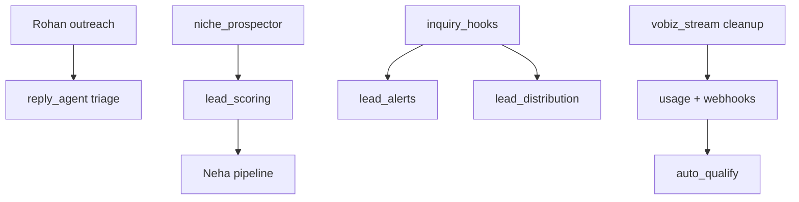

# Agent Registry — AI Staff & Automation Agents

> **Source of truth (code):** `app/platform/team.py` → `STAFF` dict · **UI:** `/app/team` · **API:** `GET /api/platform/team?product=marketing|voice`
> **Updated:** 2026-09-14 (roster synced 19 → **31** against `app/platform/team.py → STAFF`)

---

## 1. Registry overview

| Field | Meaning |
|-------|---------|
| **ID** | Internal key (`swara`, `rohan`, …) |
| **Product** | `marketing` · `voice` · `platform` (shared) |
| **Inputs** | Triggers, APIs, scheduler jobs |
| **Outputs** | DB events, emails, drafts, calls — default **draft-only** for side-effect agents |
| **Permissions** | Env flags; never auto-apply core code (Vikram) |

Events logged → `agent_events` table · Dashboard 3-tier status: working / active / offline.

---

## 2. Core staff roster

| ID | Name | Product | Role | Schedule | Primary I/O |
|----|------|---------|------|----------|-------------|
| `manager` | Boss | platform | Supervisor / router | On-demand `/api/agents/run` | In: task → Out: plan JSON (no execute) |
| `swara` | Swara | voice | Telecaller | Calls + web demo | In: audio/transcript → Out: qualification |
| `dev` | Dev | marketing | Data / KB seed | New client onboard | In: website URL → Out: Qdrant `client:{id}` |
| `rohan` | Rohan | marketing | Leads / outreach | 10:30 email job | In: prospects → Out: cold emails (cap 25/d) |
| `isha` | Isha | marketing | Content / social | 07:00 content job | In: niche → Out: post drafts |
| `arjun` | Arjun | voice | QA | 02:30 nightly | In: scripts → Out: scorecard report |
| `meera` | Meera | voice | Trainer | 03:00 nightly | In: transcripts → Out: tuning suggestions |
| `kavya` | Kavya | platform | Ops health | Hourly | In: probes → Out: alerts/digest lines |
| `hermes` | Hermes | platform | Infra scan | Hourly watchdog | In: VPS metrics → Out: 0–100 score + fixes |
| `tara` | Tara | voice | Telephony readiness | Hourly | In: Vobiz/env → Out: readiness score |
| `nikhil` | Nikhil | platform | Revenue ops | Daily digest | In: billing → Out: dunning/nurture drafts |
| `vikram` | Vikram | platform | Code upgrader | Hourly (`CODE_UPGRADER=1`) | In: signals → Out: patch **proposals** only |
| `guru` | Guru | platform | Skill trainer | Trainer job (`SKILL_PACK=1`) | In: skills KB → Out: ingested snippets |
| `pranav` | Pranav | platform | SRE | Hourly (`SRE_AGENT`) | In: backups/DR → Out: survivability KPI |
| `vidya` | Vidya | platform | FinOps | Daily 9am (`FINOPS_AGENT`) | In: spend → Out: margin digest |
| `arnav` | Arnav | platform | Security | Daily 9:30 (`SECURITY_AGENT`) | In: CVE/compliance → Out: posture report |
| `ravi` | Ravi | marketing | SEO scout | Blog + Mon batch | In: niches×cities → Out: SEO pages |
| `neha` | Neha | marketing | Pipeline ops | 11:00 IST | In: leads DB → Out: rescore + hot list |
| `kiran` | Kiran | marketing | Campaign Optimizer | Weekly + 100-interaction threshold | In: transcripts/replies/outcomes → Out: A/B proposals (gated `CAMPAIGN_OPTIMIZER`) |
| `ananya` | Ananya | voice | Appointment Booker | On-demand (booking campaigns / callbacks) | Appointment / site-visit / demo slot booking + calendar + reminders |
| `riya` | Riya | voice | AI Receptionist | On-demand (inbound / mini-site widget) | Inbound calls — greeting, department routing, message taking, appointment (**no** sales pitch) |
| `lekha` | Lekha | voice | Call Analytics Lead | Daily morning + on-demand (`/api/admin/web-calls/kpis`) | Call-centre KPIs — duration, qualified/booking rate, reply latency p50/p95, dead-air |
| `raksha` | Raksha | voice | Human Escalation Manager | On-demand (live calls) | AI unsure / angry customer → route the call to a human (`app/telephony/call_transfer.py`) |
| `anika` | Anika | marketing | Cadence Manager | Daily scheduled (`team_scheduler.py` `cadence.run_due()`) | Enrolled leads → per-day omnichannel sequence (email/SMS/WhatsApp/LinkedIn draft), gated `CADENCE_ENGINE` |
| `priya` | Priya | marketing | CRM Sync Specialist | On-demand (each qualified lead, when the client connected a CRM) | Qualified leads → client's own Zoho/HubSpot, gated `CRM_SYNC` |
| `zara` | Zara | marketing | Social Media Manager | Queue-driven (when approved content is publish-ready) | Approved content queue → per-client channels (Telegram / Postiz / Meta), gated `SOCIAL_ENGINE` |
| `ira` | Ira | marketing | Journey Automation Manager | Event-driven (any wired hook fires) | Event rules (inquiry / booking / reply / pipeline) → journey actions + drafts, gated `JOURNEY_ENGINE` |
| `arya` | Arya | platform | MCP Engineer | Hourly (gated `MCP_ENGINEER`) + `/api/platform/mcp/health` | 3-layer MCP surface (`/mcp`, `/api/mcp-product/v1/*`, A2A Agent Card) + dependency/gate/quota/rotation health pulse |
| `aryan` | Aryan | platform | Dependency / Supply-chain Engineer | Weekly Sun 04:30 IST (gated `DEPS_AGENT`) | `pip-audit` (read-only), lock-file pinning hygiene, CVE → upgrade **proposals** |
| `diya` | Diya | platform | Data-Integrity Engineer | Daily 10:30 IST (gated `DATA_INTEGRITY_AGENT`) | Lead/CRM quality — duplicate phone/email detection, missing-contact leads, prospect-store integrity |
| `kabir` | Kabir | platform | DB Reliability Engineer | Daily 10:00 IST (gated `DBRE_AGENT`) | Postgres health — slow-query patterns, unused/bloating indexes, connection-pool pressure |

> **Sync note (2026-09-14):** the roster above is now **31/31**, matching `app/platform/team.py → STAFF`. Previously this table listed only **19**; the 12 rows marked above were added verbatim from the `STAFF` entry (`name` / `product` / `title` / `schedule` / `duties`). The earlier rows keep their hand-authored `In: … → Out: …` phrasing; the 12 new ones use the `duties` field because no equivalent I/O line had been authored for them. **Re-check `STAFF` before trusting this table again** — the doc has no test pin.

---

## 3. Enterprise flywheel agent map (Jun 2026)

| Flywheel stage | Agent / module | Store |
|----------------|----------------|-------|
| Lead discovery | Rohan + Dev (`prospector`, `lead_harvester`) | `prospects.jsonl`, `leads` |
| Deduplication | `identity_resolver.py` | `identity_merge_log.jsonl` |
| Enrichment | Dev (`email_finder`, `web_extract`) | contact.enriched_at |
| Lead scoring | Neha (`lead_scoring`, `pipeline_ops`) | `leads.lead_score` |
| Email outreach | Rohan (`auto_outreach`) | `interactions.jsonl` |
| WhatsApp | Isha (`whatsapp_campaign`) | campaign runs |
| Voice | Swara (`vobiz_stream`, `telecaller_brain`) | `call_transcripts/` |
| Follow-up | Rohan (`cadence`, followups) | `cadence_runs.jsonl` |
| Appointment | Ananya (`booking`) | calendar_booking |
| CRM | Nikhil (`crm_sync` push + `CRM_SYNC_PULL`) | `crm_sync.jsonl` |
| Analytics | Neha + Vidya (`growth_engine`, `revenue_attribution`) | `agent_events` |
| Learning | Meera + Guru (`skill_library`, `objection_extractor`) | Qdrant `objections:{niche}` |
| Campaign optimization | **Kiran** (`campaign_optimizer.py`) | `campaign_optimization/` |
| Compliance | Arnav (`compliance`, `consent_ledger`) | `consent_ledger.jsonl` |

Orchestration: `process_engine` (deterministic) + `coordinator` (LLM) + `eval_gate` (safety).

---

## 4. Multi-agent engines (not in STAFF UI but registered)

| Engine | Module | Mode | Flag |
|--------|--------|------|------|
| Coordinator | `coordinator.py` | planner/handoff/fanout/Reflexion | optional |
| Process engine | `process_engine.py` | deterministic gates | `PROCESS_ENGINE=1` |
| Self-improve | `self_improve.py` | forever Celery loop | `SELF_IMPROVE_LOOP=1` |
| Sales team (BANT) | `sales_team.py` | 5-agent deep dive | `SALES_TEAM=1` |
| FDE deploy | `fde.py` | client setup skills | API `/api/growth/fde/*` |
| LangGraph supervisor | `staff_supervisor.py` | high-stakes routing | `USE_LANGGRAPH_SUPERVISOR=1` |

Decision tree: [`AUTOMATION.md`](AUTOMATION.md)

---

## 4. Scheduler parity (source of truth = `JOB_META`)

Celery beat (`app/worker.py`) mirrors `team_scheduler._run_job`. Job catalogue count lives in `app/platform/scheduler_config.JOB_META` — **do not hardcode a number here** (was stale at "24"; live count is whatever `len(JOB_META)` reports — currently 43 as of 2026-08-03). Dead-man: heartbeat + revive-beat + ops watchdog.

**Rule:** worker recreate ke baad `redis-cli llen celery` — if >500 → `del celery`.

---

## 5. Permissions & safety

| Rule | Detail |
|------|--------|
| Execute vs draft | Rohan/Isha auto-email = capped send; WhatsApp = 1-click human; cadence = drafts |
| Core code | Vikram **never** auto-applies — admin approve API only |
| Voice | Compliance gates in `compliance.py` — agents cannot bypass |
| Customer data | Agents scoped by `client_id`; customer JWT IDOR guards on mutations |

---

## 6. Dependencies

---

## 7. Prompts per agent

See [`PROMPT_LIBRARY.md`](PROMPT_LIBRARY.md) → full text in [`AGENT_SYSTEM_PROMPTS.md`](AGENT_SYSTEM_PROMPTS.md).

---

## 8. Adding a new agent (checklist)

1. Entry in `STAFF` (`team.py`)
2. `team_scheduler._run_job` + `worker.py` beat (if scheduled)
3. `automation_health.EXPECTED_GAP_MIN` registration
4. Flag in `AUTOMATION_FLAGS` (`growth.py` / `automation_flags.py`)
5. UI tab if admin-facing (`/app/automation`)
6. Update this registry + prompt library
