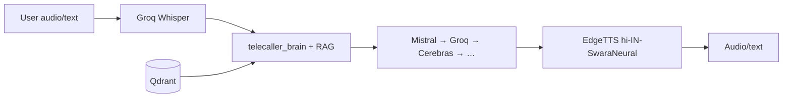
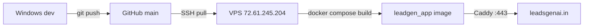

# System Architecture — LeadGenAI

> **Updated:** 2026-06-27 · **Live:** https://leadsgenai.in · **Deep research:** `Architecture_Research_RAG_Agents_MCP.md` · **Runtime verified 2026-06-27:** worker + scheduler Up, Celery queue 0, heartbeat fresh (see `DIAGNOSTIC_ROOT_CAUSE_2026_06_27.md`)

---

## 1. High-level diagram

```mermaid
flowchart TB
  subgraph clients [Clients]
    WEB[Browser / Mini-site / Widget]
    PHONE[Phone PSTN]
  end

  subgraph edge [Edge]
    CADDY[Caddy TLS]
  end

  subgraph app [FastAPI leadgen_app :8000]
    API[REST ~761 routes]
    MCP[/mcp + MCP Product]
    VOICE[Voice Pipeline]
    STAFF[AI Staff Scheduler hooks]
  end

  subgraph data [Data Layer]
    PG[(Postgres via PgBouncer)]
    REDIS[(Redis)]
    QDRANT[(Qdrant kb_main)]
  end

  subgraph async [Async]
    WORKER[Celery worker]
    BEAT[Celery beat]
  end

  subgraph telephony [Telephony]
    VOBIZ[Vobiz API]
    FS[FreeSWITCH container]
  end

  WEB --> CADDY --> API
  PHONE --> VOBIZ --> FS
  FS --> VOICE
  API --> PG
  API --> REDIS
  API --> QDRANT
  BEAT --> WORKER
  WORKER --> PG
  WORKER --> REDIS
  VOICE --> QDRANT
```

---

## 2. Component map

| Layer | Technology | Key paths |
|-------|------------|-----------|
| **Web** | FastAPI + uvicorn (`WEB_CONCURRENCY=2`) | `app/main.py` |
| **Frontend** | Server HTML (50 pages) | `frontend/` |
| **DB** | Postgres `leadgen_db` | PgBouncer `:6432` |
| **Cache/Queue** | Redis | Celery broker + call state |
| **Vector RAG** | Qdrant | `app/ml/vector_store.py`, ns `niche:` / `client:` |
| **Jobs** | Celery durable | `app/worker.py`, `app/tasks/staff_jobs.py` |
| **Telephony** | Vobiz + WS stream | `app/telephony/vobiz_stream.py` |
| **Obs** | Prometheus/Grafana/Loki (opt-in) | `deploy/compose/docker-compose.observability.yml` |

---

## 3. AI stack (free-only)



- Chain: `app/voice_agent/free_ai.py`
- Brain: `app/voice_agent/telecaller_brain.py`
- Scripts: `app/voice_agent/niche_scripts.py`
- Tuning path: FREE web-call `/app/test-call` before phone spend

---

## 4. AI agents & MCP

| System | Role | Entry |
|--------|------|-------|
| **AI Staff (15+)** | Scheduled ops (scrape, email, QA, digest) | `app/platform/team.py` |
| **Coordinator** | Planner/handoff/fanout/Reflexion | `app/agents/coordinator.py` |
| **Process engine** | Event-sourced gates + human breakpoints | `app/agents/process_engine.py` |
| **Self-improve loop** | Celery forever-tick proposals | `app/agents/self_improve.py` |
| **MCP server** | Platform/Data/Agents tools | `/mcp` |
| **MCP product** | niches, score-lead, qualifier | `/api/mcp-product/v1/*` |
| **A2A card** | Agent discovery | `/.well-known/agent.json` |

Registry detail: [`AGENT_REGISTRY.md`](AGENT_REGISTRY.md)

---

## 5. Telephony architecture

```
Outbound: CallManager → VobizClient.place_call → answer URL → vobiz_stream WS (L16/16k)
          → STT/LLM/TTS pipeline → post_call_hooks (billing + webhooks + qualify)

Compliance (fail-CLOSED promotional): DND · 9am–7pm IST calling-window (TRAI actual 9am–9pm; code conservative) · AI disclosure · consent ledger
International fallback: Twilio (India-domestic foreign trunk = ILLEGAL)
```

Files: `vobiz_handler.py` · `vobiz_stream.py` · `compliance.py` · `consent_ledger.py` · `call_state.py`

---

## 6. CRM & lead data

| Store | Use |
|-------|-----|
| Postgres `leads`, `clients`, `calls`, `billing_*` | Primary CRM |
| `data/inquiries.jsonl` | Public inquiry append log |
| `data/cadence_*.jsonl` | Omnichannel sequences |
| `clients_store.py` | Per-client config + mini-site |
| Optional sync | Zoho/HubSpot (`crm_sync.py`, OFF) |

---

## 7. API surface

- **Public:** `/api/public/*`, `/b/{slug}`, `/audit`, webhooks
- **Customer JWT:** `/api/customer/*` (IDOR-safe `_authed_client_id`)
- **Admin:** `/api/admin/*`, `/api/growth/*`
- **OpenAPI:** `GET /openapi.json` (authoritative route list)

Detail: [`API.md`](API.md)

---

## 8. Deployment (production)



- Compose: `docker-compose.vps.yml` (+ `--profile celery` for worker/beat)
- App dir: `/opt/leadgen`
- Rollback: systemd `leadgen` disabled but installed; SQLite backup read-only

Deploy SOP: [`PROJECT_SOP.md`](PROJECT_SOP.md) · Cutover: [`PRODUCTION_CUTOVER.md`](PRODUCTION_CUTOVER.md)

---

## 9. Multi-tenant / white-label

`TenantBrandingMiddleware` — subdomain/custom domain → `request.state.tenant` (fail-open).

---

## 10. Related docs

| Topic | Doc |
|-------|-----|
| Infra truth | `SAAS_INFRA_TRUTH_AND_GAPS_2026_06_15.md` |
| Automation loops | `AUTOMATION.md` |
| Telephony deep (pending P3) | `superpowers/plans/PENDING_PLANS.md` |
| RAG upgrades | `RAG_KnowledgeGraph_Agentic.md` |
