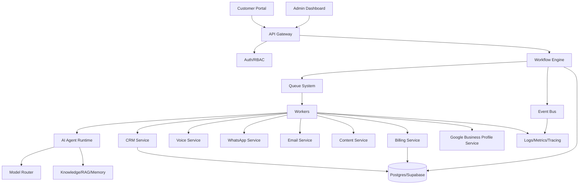

# 06 — Architecture Standards

## Objective

Create a modular, scalable, auditable and production-safe architecture for LeadGen AI.

## Target Architecture

## Service Boundaries

### Lead Service
Owns lead ingestion, deduplication, source tracking, consent status, DND flags, enrichment state and lifecycle.

### CRM Service
Owns pipeline stages, lead status, next actions, follow-up dates, owner assignment and conversion reporting.

### Voice Service
Owns call queue, call attempts, telephony provider integration, call recording metadata, transcript ingestion and call outcome.

### Content Service
Owns daily content generation, captions, hashtags, branded poster metadata, approval workflow and customer portal delivery.

### Billing Service
Owns plan, subscription, invoice, payment status, GST fields, trial expiry and renewal reminders.

### Workflow Service
Owns state machines, workflow transitions, retries, idempotency and execution history.

### Agent Runtime
Owns prompt execution, tool access, model routing, fallback models, confidence scoring and evaluation.

## Architecture Rules

- Domain modules must not call each other through hidden side effects.
- Cross-domain actions must use explicit service methods or events.
- External providers must be wrapped behind internal interfaces.
- Every workflow transition must be persisted.
- Every customer-impacting action must be idempotent.
- Every long-running task must run through queue/worker infrastructure.
- Every provider call must have timeout, retry, circuit breaker and logging.
- Every integration must support sandbox/mock mode.
- Every sensitive operation must have audit logs.

## Anti-Patterns

- One giant service controlling lead, CRM, voice, billing and content together.
- Agent directly writing to unrelated tables.
- Scheduler triggering external action without lock.
- Retry logic placed only in UI.
- Webhook accepted without signature verification.
- Prompt output trusted without validation.
- Billing state derived only from payment provider webhooks without reconciliation.

## Required Architecture Reviews

Run an architecture review when:
- Adding a new core service.
- Adding a new external provider.
- Changing database schema.
- Changing workflow state machine.
- Adding a new scheduler.
- Adding a new AI agent with side effects.
- Changing billing or customer data ownership.

---

## Mandatory Acceptance Criteria

This document is complete only when the related implementation has:

- A named owner.
- Clear inputs and outputs.
- Logged execution.
- Observable metrics.
- Automated tests.
- Error handling.
- Retry and recovery behavior.
- Production-safe defaults.
- Documented rollback.
- Evidence recorded in an ADR or execution report.

## Definition of Done

A module following this document is Done only when it is implemented, tested, monitored, documented, secured, recoverable, and validated through at least one end-to-end scenario.

## Continuous Improvement Rule

After every change, re-run discovery, dependency mapping, regression tests, security checks, workflow validation, scheduler validation, queue validation, and production simulation for impacted areas.
