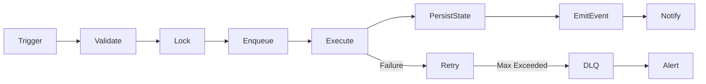

# 07 — Automation Engine

## Objective

Create a safe automation system for lead generation, content generation, outreach, follow-up, CRM updates, billing and reporting.

## Automation Contract

Every automation must define:

- Name
- Owner
- Trigger
- Input contract
- Validation rules
- State machine
- Queue name
- Worker name
- Retry policy
- Timeout
- Idempotency key
- Side effects
- Rollback or compensating action
- Logs
- Metrics
- Alerts
- Runbook
- E2E test

## Standard Automation Lifecycle

## Core Automations

### Lead Collection Automation
Imports leads from configured sources, checks duplicate records, validates phone/email, stores source, applies consent rules and creates enrichment jobs.

### Lead Enrichment Automation
Adds business category, location, website, Google profile signals, social signals and quality score.

### Voice Outreach Automation
Selects eligible leads, checks DND/opt-out, applies call window rules, starts call job, stores transcript, analyzes outcome and updates CRM.

### Follow-Up Automation
Creates WhatsApp/email/callback sequences based on lead status, conversation intent, objections and next best action.

### Daily Content Automation
Generates customer-specific Hinglish captions, branded creatives, hashtags and festival/offer variants. Sends to portal for approval before publishing or sharing.

### Billing Automation
Tracks subscriptions, invoice generation, renewal reminders, failed payment recovery and plan status changes.

## Hardening Requirements

- Idempotency for every external side effect.
- Distributed lock for scheduled triggers.
- Max retry count.
- Exponential backoff.
- Dead-letter queue.
- Execution history.
- Error classification.
- Circuit breaker for providers.
- Manual replay.
- Dry-run mode.
- Simulation mode.
- Customer impact tag.

## Automation Freeze Rules

Freeze automation when:
- Duplicate customer actions are detected.
- Opt-out/DND logic fails.
- Provider sends repeated errors.
- Billing inconsistency appears.
- Queue depth exceeds threshold.
- Scheduler creates overlapping executions.
- Unknown state transition appears.

---

## Mandatory Acceptance Criteria

This document is complete only when the related implementation has:

- A named owner.
- Clear inputs and outputs.
- Logged execution.
- Observable metrics.
- Automated tests.
- Error handling.
- Retry and recovery behavior.
- Production-safe defaults.
- Documented rollback.
- Evidence recorded in an ADR or execution report.

## Definition of Done

A module following this document is Done only when it is implemented, tested, monitored, documented, secured, recoverable, and validated through at least one end-to-end scenario.

## Continuous Improvement Rule

After every change, re-run discovery, dependency mapping, regression tests, security checks, workflow validation, scheduler validation, queue validation, and production simulation for impacted areas.
