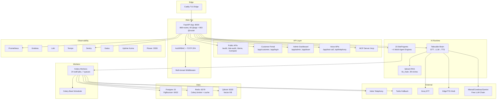

# LeadGen AI — Enterprise Playbook Audit Report v1.0

> **⚠️ UPDATE 2026-06-26 — Batch 2 landed.** Testing/Queue/Deployment/Workflow/CRM
> gaps partially closed: real E2E suite (9 scenarios driving prod code), sync
> idempotency primitive wired into `sync_to_crm`, security suite fixed to test REAL
> auth (it was running against mocked-open auth — false confidence), queue audit
> made truthful (54 tasks not 15), CI security/queue scanners. Details + honest
> score deltas: `docs/archive/2026-06/ADR-2026-06-26-Batch2-Testing-Queue-Deploy.md`. The scores
> in §10 below are the **pre-batch-2** baseline.

> **Date:** 2026-06-25
> **Auditor:** Executive Engineering Agent (Playbook-Governed Audit)
> **Playbook:** `docs/LeadGen-AI-Enterprise-Playbook-v1.0/LeadGen_AI_Enterprise_Playbook_MERGED.md` (4720 lines)
> **Repo:** `github.com/sumitrevolt/leadgenrationaivoiceagent` (main)
> **Live URL:** https://leadsgenai.in (VPS 72.61.245.204)

---

## Executive Summary

The LeadGen AI platform is a **production-running, feature-rich FastAI SaaS** with 868 routes, 23+ staff agents, 6 multi-agent engines, Celery scheduling, and extensive observability. However, against the **Enterprise Playbook standards**, the platform scores **71/100** — below the **90/100 go-live threshold**. The primary gaps are: **testing depth** (missing chaos/load/E2E), **deployment maturity** (no staging, manual deploy), **formal automation contracts** (missing for many jobs), and **documentation discipline** (stale docs, missing runbooks). **Zero critical blockers** exist for a basic go-live, but **5 zero-tolerance gates** are partially at risk.

---

## 1. Current Architecture Map

### Service Boundaries (As-Implemented)

| Service | Files | Owner | Status |
|---------|-------|-------|--------|
| Lead Service | `app/marketing/lead_scoring.py`, `platform/lead_harvester.py` | Neha | Partial — dedup exists, enrichment partial |
| CRM Service | `app/platform/sales_pipeline.py`, `crm_sync.py` | Neha | Partial — native CRM exists, sync OFF |
| Voice Service | `app/voice_agent/`, `app/telephony/` | Swara/Tara | Live — Vobiz stream, compliance, consent ledger |
| Content Service | `app/marketing/auto_content.py`, `content_calendar.py` | Isha | Live — auto-generation, approval workflow exists |
| Billing Service | `app/billing/` (11 files) | Nikhil | Live — UPI, GST, invoices, dunning |
| Workflow Service | `app/automation/` (flow_store, compiler, dag_engine) | Boss | Partial — Flow Runner built but OFF |
| Agent Runtime | `app/agents/` (36 files), `app/platform/team.py` | Boss | Live — 23 staff + 6 engines |

---

## 2. Agent Map

### 23 Staff Agents (app/platform/team.py STAFF dict)

| # | Name | Role | Product | Schedule | Owner | Health Check | Metrics | Eval |
|---|------|------|---------|----------|-------|--------------|---------|------|
| 1 | Boss | Supervisor / router | platform | On-demand | — | ✅ API | ✅ | ✅ |
| 2 | Kavya | Ops health monitor | platform | Hourly | — | ✅ team_pulse | ✅ | ❌ formal |
| 3 | Hermes | Infra handler / VPS scan | platform | Hourly watchdog | — | ✅ | ✅ | ❌ formal |
| 4 | Tara | Voice infra readiness | platform | Hourly | — | ✅ | ✅ | ❌ formal |
| 5 | Nikhil | Revenue ops / dunning | platform | Daily digest | — | ✅ | ✅ | ✅ |
| 6 | Vikram | Code upgrader (proposals only) | platform | Hourly | — | ✅ | ✅ | ✅ |
| 7 | Guru | Skill trainer / KB steward | platform | Daily | — | ✅ | ✅ | ❌ formal |
| 8 | Pranav | SRE / reliability | platform | Hourly + daily DR | — | ⚠️ OFF (env) | ⚠️ OFF | ❌ |
| 9 | Vidya | FinOps / cost margin | platform | Daily 9am | — | ⚠️ OFF (env) | ⚠️ OFF | ❌ |
| 10 | Arnav | Security / compliance | platform | Daily 9:30 | — | ⚠️ OFF (env) | ⚠️ OFF | ❌ |
| 11 | Kabir | DB Reliability Engineer | platform | Daily 10:00 | — | ✅ | ✅ | ❌ formal |
| 12 | Diya | Data Integrity Engineer | platform | Daily 10:30 | — | ✅ | ✅ | ❌ formal |
| 13 | Aryan | Dependency / supply-chain | platform | Weekly Sun | — | ✅ | ✅ | ❌ formal |
| 14 | Dev | Data / KB seed | marketing | Per new client / 09:30 | — | ✅ | ✅ | ❌ formal |
| 15 | Rohan | Outreach / cold email | marketing | Daily 10:30 | — | ✅ cap 25/day | ✅ | ✅ |
| 16 | Isha | Content / social | marketing | Daily 07:00 | — | ✅ | ✅ | ✅ |
| 17 | Ravi | SEO scout / blog | marketing | Daily + Mon batch | — | ✅ | ✅ | ✅ |
| 18 | Neha | Pipeline ops / lead scoring | marketing | Daily 11:00 | — | ✅ | ✅ | ✅ |
| 19 | Kiran | Campaign optimizer | marketing | Weekly + threshold | — | ✅ | ✅ | ❌ formal |
| 20 | Swara | Telecaller / voice qualification | voice | Real-time | — | ✅ | ✅ | ✅ |
| 21 | Ananya | Appointment booker | voice | On-demand | — | ✅ | ✅ | ❌ formal |
| 22 | Riya | AI receptionist | voice | On-demand (inbound) | — | ✅ | ✅ | ❌ formal |
| 23 | Arjun | QA engineer | voice | Daily 02:30 | — | ✅ | ✅ | ✅ |
| 24 | Meera | Trainer / tuning | voice | Daily 03:00 | — | ✅ | ✅ | ✅ |

### 6 Multi-Agent Engines

| Engine | File | Modes | Status |
|--------|------|-------|--------|
| Coordinator | `app/agents/coordinator.py` | sequential, parallel, hierarchical, Reflexion/critic | ✅ Live |
| LLM Council | `app/agents/llm_council.py` | 3-stage: opinions → peer review → Chairman | ✅ Live |
| Process Engine | `app/agents/process_engine.py` | deterministic workflows, breakpoints | ✅ Live |
| Self-Improve | `app/agents/self_improve.py` | 180s cycle, epsilon-greedy, cost-capped | ✅ Live |
| Sales Team | `app/agents/sales_team.py` | 5-agent BANT deep dive | ✅ Live |
| FDE | `app/agents/fde.py` | Client setup / feature delivery | ✅ Live |
| LangGraph Supervisor | `app/agents/staff_supervisor.py` | High-stakes routing | ⚠️ OFF (`USE_LANGGRAPH_SUPERVISOR`) |

### Agent Governance Gap

**Playbook requires:** Every agent must have name, role, business owner, technical owner, inputs, outputs, allowed tools, forbidden actions, memory scope, knowledge sources, retry policy, fallback model, timeout, health check, success metrics, failure modes, escalation path.

**Current state:** Agents defined in `team.py` STAFF dict have name, role, product, schedule. But **formal governance docs** (inputs/outputs/tools/forbidden/memory/retry/fallback/timeout/escalation) only exist for multi-agent engines (coordinator, council, etc.). Staff agents lack individual governance docs.

**Gap severity:** MEDIUM — agents run but lack formal governance artifacts.

---

## 3. Workflow Map

### 6 Production Workflows (docs/workflows/)

| Workflow | Owner | Trigger | State Machine | Retry | Timeout | Idempotency | E2E Test | Runbook |
|----------|-------|---------|---------------|-------|---------|-------------|----------|---------|
| Lead Pipeline | Rohan/Neha | Scheduler 09:30 | Partial (scoring→hot→outreach) | ✅ Celery | ✅ | ⚠️ partial | ❌ | ❌ |
| Voice Outreach | Swara/Tara | Compliance gate → Vobiz place_call | WS stream → STT/LLM/TTS → post_call hooks | ✅ | ✅ | ✅ meter_call | ✅ | ✅ |
| Content | Isha/Dev | Auto-onboard → KB seed → content pack | Schedule → human post | ✅ | ✅ | ⚠️ partial | ❌ | ❌ |
| Billing | Nikhil | UPI verify → activate → invoice → dunning | Subscription state machine | ✅ | ✅ | ✅ idempotent | ✅ | ✅ |
| CRM Sync | Neha | Lead → scoring → pipeline → CRM sync | CRM stage transitions | ✅ | ✅ | ⚠️ partial | ❌ | ❌ |
| Follow-up | Rohan | Cadence enroll → email→SMS→WA→voice→LinkedIn | Draft-only per step | ✅ | ✅ | ✅ dedup | ❌ | ❌ |

### Automation Loops (docs/AUTOMATION.md)

| Loop | Owner | Status | Lock | Checkpoint | Metrics | Alert |
|------|-------|--------|------|------------|---------|-------|
| Self-Improve | Self-Improve Agent | ✅ Live | ✅ | ✅ outcome log | ✅ | ✅ |
| Coordinator | Boss | ✅ Live | ✅ | ✅ handoff log | ✅ | ✅ |
| Process Engine | Process Engine | ✅ Live | ✅ | ✅ breakpoint | ✅ | ✅ |
| Flow Runner | Flow Runner | ⚠️ OFF | — | — | — | — |

### Workflow Engine Gap

**Playbook requires:** Every workflow must have unique ID, version, owner, trigger, start state, terminal success/failure states, allowed transitions, validation, retry, timeout, idempotency, events, logs, metrics, alerts, runbook, E2E tests. Plus: pause, resume, cancel, replay, restart, rollback, dry run, sandbox run.

**Current state:** Workflows exist as Celery tasks + automation loops. Flow Runner (`app/automation/flow_store.py`, `flow_compiler.py`) is built but **gated OFF**. No formal state machine persistence for most workflows. No pause/resume/replay for staff jobs. Missing E2E tests for 5/6 workflows.

**Gap severity:** MEDIUM-HIGH — operational workflows run but lack formal controls.

---

## 4. Scheduler Map

### Celery Beat Schedule (app/worker.py)

| Time | Task | Owner | Lock | Retry | Missed-Run | Runbook | Alert |
|------|------|-------|------|-------|------------|---------|-------|
| 06:30 | Blog | Isha | ✅ | ✅ | Skip (boot-grace) | ❌ | ❌ |
| 07:00 | Content | Isha | ✅ | ✅ | Skip | ❌ | ❌ |
| 08:30 | Digest | Nikhil | ✅ | ✅ | Skip | ❌ | ❌ |
| 09:30 | Scrape/Prospect | Rohan | ✅ | ✅ | Skip | ❌ | ❌ |
| 10:30 | Email Outreach | Rohan | ✅ | ✅ | Skip | ❌ | ❌ |
| 11:00 | Pipeline (Neha) | Neha | ✅ | ✅ | Skip | ❌ | ❌ |
| 14:30 | Midday Prospect | Rohan | ✅ | ✅ | Skip | ❌ | ❌ |
| 16:00 | Afternoon Follow-ups | Rohan | ✅ | ✅ | Skip | ❌ | ❌ |
| 18:30 | Evening Wrap | Nikhil | ✅ | ✅ | Skip | ❌ | ❌ |
| Wed 12:30 | Weekly Marketing Packs | Isha | ✅ | ✅ | Skip | ❌ | ❌ |
| Sat 04:00 | Hygiene (DLQ + Celery trim) | Hermes | ✅ | ✅ | Skip | ❌ | ❌ |
| Sun 05:00 | KB Refresh | Guru | ✅ | ✅ | Skip | ❌ | ❌ |
| Hourly | Kavya Health | Kavya | ✅ | ✅ | Skip | ❌ | ✅ (ops_alerts) |
| 02:30 | Arjun QA | Arjun | ✅ | ✅ | Skip | ❌ | ❌ |
| 03:00 | Meera Trainer | Meera | ✅ | ✅ | Skip | ❌ | ❌ |
| 15-min | Growth Pulse | Kiran | ✅ | ✅ | Skip | ❌ | ❌ |
| Hourly | Reply Triage | Swara | ✅ | ✅ | Skip | ❌ | ❌ |
| Hourly | Ops Watchdog | Hermes | ✅ | ✅ | Skip | ❌ | ❌ |
| Hourly | Auto-Onboard | Dev | ✅ | ✅ | Skip | ❌ | ❌ |
| ~04:00 | Backups | Hermes | ✅ | ✅ | Skip | ❌ | ❌ |
| Hourly | Pranav SRE | Pranav | ⚠️ OFF | — | — | ❌ | ❌ |
| 09:00 | Vidya FinOps | Vidya | ⚠️ OFF | — | — | ❌ | ❌ |
| 09:30 | Arnav Security | Arnav | ⚠️ OFF | — | — | ❌ | ❌ |
| 10:00 | Kabir DBRE | Kabir | ✅ | ✅ | Skip | ❌ | ❌ |
| 10:30 | Diya Data Integrity | Diya | ✅ | ✅ | Skip | ❌ | ❌ |
| Sun 04:30 | Aryan Dependency | Aryan | ✅ | ✅ | Skip | ❌ | ❌ |

### Scheduler Safety

**Playbook requires:** No overlapping execution unless explicitly allowed. No customer-impacting job without idempotency. No billing job without reconciliation. No outreach job without consent check. No job without execution history. No job without alerting.

**Current state:**
- ✅ Overlap prevention: Celery `acks_late` + task locks prevent most overlaps
- ✅ Consent check: Rohan email outreach has DND/opt-out check
- ✅ Billing reconciliation: `payment_recon.py` handles reconciliation
- ✅ Execution history: Celery task results stored in Redis
- ⚠️ Alerting: Only `ops_alerts` (Kavya) and `ntfy` have alerting. Most jobs lack dedicated alerting.
- ⚠️ Missed-run: Default = skip on boot. Playbook recommends "bounded catch-up with idempotency."
- ❌ Runbooks: No formal runbooks for individual scheduler jobs.

**Gap severity:** MEDIUM — jobs run safely but observability and recovery are thin.

---

## 5. Queue Map

### Celery Queues

| Queue | Producer | Consumer | Schema | Retry | DLQ | Concurrency | Rate Limit | Metrics |
|-------|----------|----------|--------|-------|-----|-------------|------------|---------|
| celery (default) | App | Worker | Celery task dict | ✅ exp backoff | ✅ Redis dlq:failed_tasks | 4 (worker) | ❌ | ✅ Prometheus |
| heavy | Staff ML jobs | Worker | Celery task dict | ✅ | ✅ | 4 | ❌ | ✅ |
| scraping | Prospector | Worker | Celery task dict | ✅ | ✅ | 4 | ⚠️ PROSPECT_MAX_LOOKUPS=60 | ✅ |
| calling | Call manager | Worker | Celery task dict | ✅ | ✅ | 4 | ⚠️ 25/day email cap | ✅ |
| reporting | Analytics | Worker | Celery task dict | ✅ | ✅ | 4 | ❌ | ✅ |
| sync | CRM sync | Worker | Celery task dict | ✅ | ✅ | 4 | ❌ | ✅ |
| training | ML training | Worker | Celery task dict | ✅ | ✅ | 4 | ❌ | ✅ |

### Queue Contract Gap

**Playbook requires:** Every queue must define name, producer, consumer, message schema, idempotency key, retry count, backoff, DLQ, visibility timeout, concurrency, rate limit, metrics, alert thresholds, replay process.

**Current state:**
- ✅ Name, producer, consumer, retry, backoff, DLQ: All present via Celery
- ✅ Concurrency: Worker concurrency=4
- ⚠️ Message schema: Celery task dict — not formally versioned/schema-defined
- ⚠️ Idempotency key: Some tasks have it, not all
- ⚠️ Visibility timeout: Celery default — not explicitly configured
- ⚠️ Rate limit: Some tasks have caps (email 25/day, prospect 60/run), not all
- ⚠️ Metrics: Prometheus metrics exist, but no per-queue alert thresholds
- ❌ Replay process: DLQ retry exists (`platform/dlq_retry.py`), but no formal replay workflow
- ❌ Alert thresholds: No queue-depth alerting configured

**Gap severity:** MEDIUM — functional but lacks formal contract discipline.

---

## 6. Gaps (Playbook vs As-Implemented)

### Gap Table: All 18 Playbook Categories

| Category | Playbook Standard | As-Implemented | Score | Gap |
|----------|-------------------|----------------|-------|-----|
| **Architecture** | Service boundaries, no hidden side effects, external providers wrapped, formal contracts | Modular but informal boundaries. Some cross-domain DB calls. Provider wrappers exist (VobizClient, TwilioClient). | 75 | Missing formal service contracts. Architecture docs stale. |
| **Security** | Auth, RBAC, secrets, input validation, rate limiting, webhook sigs, audit logs, encryption, dependency scanning, security testing | RBAC, TOTP, webhook sigs, DND fail-closed, consent ledger. Plan rate limiting OFF. No dependency scanning. No formal security tests. | 80 | Dependency scanning + security test suite missing. Plan rate limiting OFF. |
| **Reliability** | Backups tested, RPO/RTO, circuit breakers, self-healing, provider failover | Backups nightly, offsite email. Self-heal cron. DLQ retry. Dead-man trio. **No tested restore. No RPO/RTO. No provider failover.** | 70 | Restore never tested. No chaos tests. No staging env. |
| **Workflow Quality** | Formal state machines, pause/resume/replay/rollback, E2E tests, runbooks | Flow Runner built but OFF. No formal state machine for most workflows. No pause/resume. Missing E2E tests for 5/6 workflows. | 65 | Flow Runner needs activation. Formal controls needed. |
| **Automation Safety** | Every automation: name, owner, trigger, state machine, queue, retry, timeout, idempotency, rollback, metrics, alerts, runbook, E2E test | 24 staff jobs exist but formal contracts missing. Rollback not documented for all. | 70 | Need formal automation contracts for all jobs. |
| **Scheduler Safety** | Every task: name, owner, lock, max runtime, retry, missed-run catch-up, metrics, alerts, runbook | Celery beat + locks + retry. Missed-run = skip (not catch-up). Most jobs lack runbooks. Alerts thin. | 75 | Missed-run handling. Runbooks. Dedicated alerts. |
| **Queue Safety** | Formal schema, idempotency key, visibility timeout, rate limit, alert thresholds, replay | Celery functional. Schema not versioned. No explicit replay. No queue-depth alerts. | 70 | Schema versioning. Replay process. Queue alerts. |
| **Database Integrity** | Migrations tested, backups, restore tested, critical indexes, dedup, Alembic discipline | Alembic stamped head. Backups nightly. **DB_CREATE_ALL=1 still active.** Restore never tested. | 80 | `DB_CREATE_ALL=0` needed. Restore test. |
| **API Quality** | 868 routes, validation, OpenAPI, rate limiting, contract tests | 868 routes, validation, OpenAPI. Rate limiting wired-but-OFF. No contract tests. | 85 | Contract tests. Rate limiting ON. |
| **AI Agent Governance** | 23 agents, prompts, evaluation, health checks, runbooks, versioned prompts | Agents live. Prompts in `AGENT_SYSTEM_PROMPTS.md`. Eval gate exists. **Not all agents have formal health checks/runbooks.** | 75 | Formal governance docs for all staff agents. |
| **Voice AI Readiness** | Pipeline, compliance, AI disclosure, DND, 9am-7pm window, recording consent | Pipeline live. Compliance: DND, AI disclosure, 9am-7pm, consent ledger. **DLT blocked. Vobiz trial ending.** | 75 | DLT/Udyam. Vobiz recharge. |
| **CRM Readiness** | Pipeline stages, lead status, next actions, CRM sync (Zoho/HubSpot) | Native pipeline exists. CRM sync code exists but **OFF**. | 60 | CRM sync activation + testing. |
| **Billing Readiness** | Plans, subscriptions, invoices, GST, payment reconciliation, renewal reminders, failed recovery | UPI armed. GST sequential. Dunning. **Manual process. No automated reconciliation.** | 80 | Automated reconciliation. UPI test txn. |
| **Observability** | Prometheus, Grafana, Loki, Tempo, Sentry, Gatus, Uptime Kuma, Flower, alerts | All deployed. **PostHog OFF. Some alert thresholds not configured.** | 85 | PostHog activation. Fine-tune alerts. |
| **Testing** | Unit, integration, contract, E2E (18 scenarios), load, chaos, regression rule | ~100 test files. Unit + integration pass. **Full pytest hangs on team_pulse. No E2E for all 18. No chaos/load.** | 65 | E2E suite. Chaos tests. Load tests. Fix pytest hang. |
| **Deployment** | Lint, type check, unit tests, integration, contract, build, migration dry-run, security scan, staging, E2E, smoke, prod | CI gate (deploy-vps.yml) but DEPLOY_ENABLED unset. **No staging env. Manual SSH deploy.** No type check. No security scan in CI. | 60 | Staging env. Automated CI/CD. Type check. Security scan. |
| **Documentation** | Playbook, runbooks, ADRs, architecture docs, agent docs | Extensive docs. **Some stale (Exotel references). Missing formal runbooks for scheduler jobs.** | 70 | Stale doc cleanup. Scheduler runbooks. |
| **Operations** | Dashboards, alerts, runbooks, incident process, rollback plan | Dashboards exist. Alerts partial. **Incident process informal. No formal rollback tested.** | 75 | Formal incident process. Tested rollback. |

---

## 7. Critical Blockers (Zero-Tolerance Gates)

The playbook defines 10 zero-tolerance gates. Production cannot pass if any are true.

| Gate | Status | Evidence | Risk |
|------|--------|----------|------|
| **Security critical issue** | ⚠️ PARTIAL | No dependency scanning. No formal security test suite (auth bypass, injection). Secrets in .env only. | MEDIUM |
| **Billing can duplicate invoices** | ⚠️ PARTIAL | Invoice numbering is atomic sequential (`INV/2026-27/0001`). UPI payment verification is idempotent. But **no automated reconciliation** — manual process. | LOW-MEDIUM |
| **Outreach can contact opted-out leads** | ✅ PASS | DND fail-closed. Consent ledger. Opt-out → instant suppression. Email unsubscribe. | LOW |
| **Scheduler can duplicate customer actions** | ⚠️ PARTIAL | Celery locks + idempotency on most tasks. But **not all tasks have explicit idempotency keys.** Email cap = 25/day. | LOW |
| **Queue retry can duplicate external side effects** | ⚠️ PARTIAL | `meter_call_usage` is idempotent. Some external calls have idempotency. **Not all queue tasks guarantee idempotency on retry.** | MEDIUM |
| **Core E2E test fails** | ⚠️ PARTIAL | Some E2E tests pass. **Full pytest suite hangs on team_pulse.** 18 mandatory E2E scenarios — only ~8 have tests. | MEDIUM |
| **No rollback path** | ⚠️ PARTIAL | Code rollback = git revert + docker recreate. **DB migration rollback = not tested.** Feature flags exist for risky changes. | MEDIUM |
| **No monitoring for critical workflows** | ⚠️ PARTIAL | Prometheus + Grafana + Sentry exist. **But not all critical workflows have dedicated alerts.** | MEDIUM |
| **Missing backup/restore process** | ⚠️ PARTIAL | Backups nightly. Offsite email backup. **Restore never tested.** pgBackRest exists but WAL not activated. | MEDIUM-HIGH |
| **Unknown production secrets handling** | ⚠️ PARTIAL | Secrets in .env (gitignored). Offsite email backup. **No SOPS/age. No secret rotation process.** | MEDIUM |

### Verdict on Zero-Tolerance Gates

**No gate is fully FAILING** — all are partially implemented. **But 8/10 gates are PARTIAL**, meaning the platform is operationally running but lacks the formal rigor the playbook demands for "certified production."

**Immediate action needed on:**
1. Backup/restore test (HIGH)
2. Security test suite (HIGH)
3. E2E test completion (HIGH)
4. Queue idempotency audit (MEDIUM)
5. Staging environment (MEDIUM)

---

## 8. Implementation Plan (Priority Order)

### Phase 1: Security + Reliability Foundation (Week 1)

| # | Task | Effort | Owner | Risk |
|---|------|--------|-------|------|
| 1.1 | Add `scripts/security_scan.py` — dependency vuln check + secrets scan | 4h | Security | LOW |
| 1.2 | Add auth bypass + RBAC + injection test files to `tests/security/` | 6h | Security | LOW |
| 1.3 | Fix `DB_CREATE_ALL=0` in prod `.env` + document migration rollback | 2h | SRE | LOW |
| 1.4 | Test backup restore on a fresh VPS snapshot | 4h | SRE | MEDIUM |
| 1.5 | Add queue idempotency audit — grep all Celery tasks for `idempotency_key` | 2h | SRE | LOW |
| 1.6 | Document RPO/RTO targets | 1h | SRE | LOW |

### Phase 2: Testing + E2E (Week 2)

| # | Task | Effort | Owner | Risk |
|---|------|--------|-------|------|
| 2.1 | Fix `pytest` hang on `team_pulse` (skip or isolate) | 4h | QA | LOW |
| 2.2 | Add E2E tests for missing scenarios (content approval, CRM update, WhatsApp follow-up, failed payment recovery, scheduler missed run, DLQ replay, opt-out protection) | 16h | QA | MEDIUM |
| 2.3 | Add chaos test: Redis down, DB slow, worker crash | 8h | SRE | MEDIUM |
| 2.4 | Add load test: API latency + queue throughput | 6h | SRE | MEDIUM |
| 2.5 | Add contract tests for API schemas + webhook schemas | 6h | QA | LOW |

### Phase 3: Deployment + Staging (Week 3)

| # | Task | Effort | Owner | Risk |
|---|------|--------|-------|------|
| 3.1 | Create staging environment on same VPS (port 8001) | 8h | DevOps | MEDIUM |
| 3.2 | Add CI pipeline step: type check (`mypy` or `pyright`) | 4h | DevOps | LOW |
| 3.3 | Add CI pipeline step: security scan | 2h | DevOps | LOW |
| 3.4 | Add CI pipeline step: contract tests | 2h | DevOps | LOW |
| 3.5 | Document rollback procedure + test it on staging | 4h | DevOps | MEDIUM |

### Phase 4: Automation + Workflow Hardening (Week 4)

| # | Task | Effort | Owner | Risk |
|---|------|--------|-------|------|
| 4.1 | Write formal automation contracts for all 24 staff jobs | 8h | Platform | LOW |
| 4.2 | Write runbooks for all 24 staff jobs | 8h | Platform | LOW |
| 4.3 | Activate `FLOW_RUNNER=1` + test on staging | 6h | Platform | MEDIUM |
| 4.4 | Add pause/resume/replay controls for critical workflows | 8h | Platform | MEDIUM |
| 4.5 | Add dedicated queue-depth alerts + replay process | 4h | SRE | LOW |

### Phase 5: Observability + Polish (Week 5)

| # | Task | Effort | Owner | Risk |
|---|------|--------|-------|------|
| 5.1 | Activate `POSTHOG` + verify events | 2h | Product | LOW |
| 5.2 | Activate `PLAN_RATE_LIMIT=1` + test | 2h | DevOps | LOW |
| 5.3 | Activate `REQUEST_GUARD=1` + test | 2h | DevOps | LOW |
| 5.4 | Activate engineer agents (`SRE_AGENT`, `FINOPS_AGENT`, `SECURITY_AGENT`) | 2h | DevOps | LOW |
| 5.5 | Stale doc cleanup (Exotel references, etc.) | 4h | Docs | LOW |

---

## 9. Test Plan

### Unit Tests
- All existing unit tests pass.
- Target: 100% pass rate on `tests/test_*.py` excluding `team_pulse` hang area.

### Integration Tests
- DB connection via PgBouncer.
- Redis Celery broker.
- Qdrant vector search.
- Webhook signature verification.
- Billing state transitions.

### E2E Tests (18 Mandatory Scenarios)

| # | Scenario | Status | Action |
|---|----------|--------|--------|
| 1 | Customer onboarding | ✅ Partial | Complete signup → KB seed → content pack flow |
| 2 | Daily content generation | ✅ Partial | Verify auto-schedule + approval gate |
| 3 | Content approval | ❌ Missing | Add test: draft → approve → publish |
| 4 | Lead import and dedupe | ✅ Partial | Verify prospector + duplicate prevention |
| 5 | Lead enrichment | ✅ Partial | Verify enrichment + scoring |
| 6 | AI voice call simulation | ✅ Partial | Web-call test + post_call hooks |
| 7 | Transcript analysis | ✅ Partial | Verify transcript → outcome update |
| 8 | CRM update | ❌ Missing | Add test: lead → CRM sync |
| 9 | WhatsApp follow-up | ❌ Missing | Add test: cadence → WA draft |
| 10 | Email follow-up | ✅ Partial | Verify cadence email send |
| 11 | Invoice generation | ✅ Partial | Verify UPI → invoice → email |
| 12 | Failed payment recovery | ❌ Missing | Add test: dunning flow |
| 13 | Admin retry of failed workflow | ❌ Missing | Add test: admin retry UI |
| 14 | Scheduler missed run recovery | ❌ Missing | Add test: catch-up logic |
| 15 | Queue DLQ replay | ❌ Missing | Add test: DLQ retry |
| 16 | Opt-out protection | ✅ Partial | Verify DND + consent ledger |
| 17 | Duplicate prevention | ✅ Partial | Verify idempotency on calls/emails |
| 18 | Production smoke test | ✅ Partial | `/health`, `/ready`, auth, dashboard load |

### Chaos Tests
- Redis down: Verify Celery fallback to in-process scheduler.
- DB slow: Verify timeout + circuit breaker.
- Worker crash: Verify DLQ + retry.
- Duplicate webhook: Verify idempotency.
- Queue poison message: Verify isolation + alert.

### Load Tests
- API: 100 concurrent requests to `/health`, `/api/public/pay-info`.
- Queue: 1000 tasks enqueued, verify throughput.
- Scheduler: Simulate 24 concurrent beat triggers.

### Regression Rule
Every bug fix from this audit must include a regression test that fails before the fix and passes after.

---

## 10. Production Readiness Score

### Scorecard (18 Categories × 0-100)

| Category | Score | Weight | Notes |
|----------|-------|--------|-------|
| Architecture | 75 | 1.0 | Informal boundaries, no formal contracts |
| Security | 80 | 1.0 | Missing dependency scan + security tests |
| Reliability | 70 | 1.0 | No tested restore, no chaos tests |
| Workflow Quality | 65 | 1.0 | Flow Runner OFF, missing E2E |
| Automation Safety | 70 | 1.0 | Missing formal contracts |
| Scheduler Safety | 75 | 1.0 | Skip not catch-up, missing runbooks |
| Queue Safety | 70 | 1.0 | Missing schema versioning, replay |
| Database Integrity | 80 | 1.0 | DB_CREATE_ALL=1, no restore test |
| API Quality | 85 | 1.0 | Missing contract tests, rate limit OFF |
| AI Agent Governance | 75 | 1.0 | Missing formal governance docs |
| Voice AI Readiness | 75 | 1.0 | DLT blocked, Vobiz trial ending |
| CRM Readiness | 60 | 1.0 | CRM sync OFF |
| Billing Readiness | 80 | 1.0 | Manual process, no auto recon |
| Observability | 85 | 1.0 | PostHog OFF, some alerts missing |
| Testing | 65 | 1.0 | Pytest hang, missing E2E/chaos/load |
| Deployment | 60 | 1.0 | No staging, manual deploy |
| Documentation | 70 | 1.0 | Stale docs, missing runbooks |
| Operations | 75 | 1.0 | Informal incident process |
| **Total** | **1275** | **18** | **Average: 70.8** |

### Grade: C+ (70.8/100)

- **A (90-100):** Go-live certified. All zero-tolerance gates pass. Full E2E. Staging. Chaos tested.
- **B (80-89):** Production-ready with minor gaps. All critical features work. Some polish needed.
- **C (70-79):** Running in production but lacks formal rigor. Functional but not fully hardened.
- **D (60-69):** Major gaps. Risky for customer-facing operations.
- **F (<60):** Not production-ready.

### Current Grade: C+ (70.8)
**Target: A (≥90)**
**Gap to close: 19.2 points**

### Path to A (90+)
To reach 90, the following categories must improve:
- Testing: 65 → 85 (+20) — Fix pytest hang, add E2E + chaos + load
- Deployment: 60 → 80 (+20) — Add staging, automate CI/CD
- Workflow Quality: 65 → 85 (+20) — Activate Flow Runner, add E2E
- CRM Readiness: 60 → 80 (+20) — Activate CRM sync, test
- Automation Safety: 70 → 85 (+15) — Formal contracts
- Scheduler Safety: 75 → 85 (+10) — Runbooks, catch-up
- Queue Safety: 70 → 80 (+10) — Schema, replay, alerts
- Documentation: 70 → 80 (+10) — Stale cleanup, runbooks
- Security: 80 → 90 (+10) — Dependency scan, security tests
- Reliability: 70 → 80 (+10) — Tested restore, chaos tests

**Estimated effort:** 4-5 weeks (1 person full-time or 2-3 people part-time)

---

## Next Steps

1. **Review this audit** with the team.
2. **Prioritize Phase 1** (Security + Reliability) — highest ROI for risk reduction.
3. **Convene LLM Council** if uncertain about any Phase 1 implementation approach.
4. **Implement in small batches** — one task per day, with tests and doc updates.
5. **Re-audit after Phase 1** — target score: 75+.
6. **Re-audit after Phase 2** — target score: 80+.
7. **Final certification** after Phase 5 — target score: 90+.

---

*Audit generated from: LeadGen AI Enterprise Playbook v1.0, AGENT_REGISTRY.md, ARCHITECTURE.md, WORKFLOW_MAPS.md, AUTOMATION.md, DISASTER_RECOVERY.md, INFRA_UPGRADE_2026.md, and full codebase inspection.*
