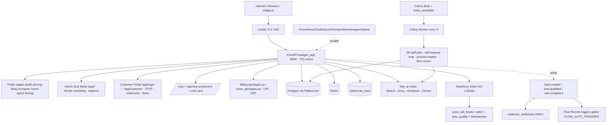
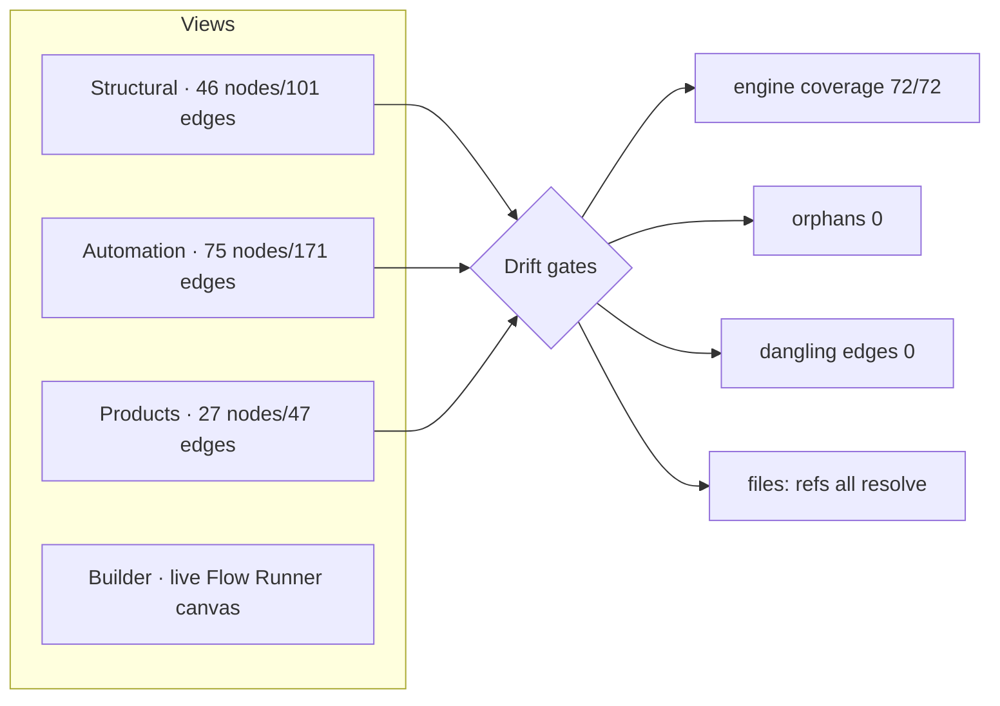

# Production Readiness Audit — LeadGenAI

> **Date:** 2026-06-21 · **Method:** forensic, measure-first (operating-manual golden rule) → 8-specialist council → debate → Chairman verdict.
> **Scope:** full platform + Architecture Explorer (`/app/explorer`) + Flow Runner + lead lifecycle + security/perf/sync.
> **Relationship to prior audits:** This re-validates `PROJECT_HANDOFF.md` §21 (Explorer GREEN), §22 (7 fixes shipped), §23 (Flow Runner LIVE) **against the live working tree** and adds **one NEW defect found + fixed** (shadowed `/health` route). It does NOT re-do §21–§23 work.
> **Verdict (TL;DR):** **CONDITIONAL GO** — code/architecture production-ready and all gates green; the only remaining blockers are **external/commercial** (Vobiz recharge + DLT for Product-2 voice), not code.

---

## 0. Evidence captured (this session, Windows `.venv`)

| Gate | Result |
|------|--------|
| `scripts/prod_check.py` | **ALL CHECKS PASSED** — 770 routes · 36 pages 0 gaps · automation 0 gaps · API.md in sync (791 ops) |
| `scripts/explorer_sync.py --check` | **exit 0** — 170 nodes · 319 edges · engine coverage **72/72 (100%)** · **0 orphans** · 0 dangling edges · all `files:` refs resolve |
| `scripts/cross_path_audit.py` | **OK** — 144 flags declared (0 never-read) · 28 staff jobs (0 not-dispatchable) · 29 beat-tasks (0 unrecognized) |
| `scripts/final_integration_check.py` | Critical-endpoint check: **Handler gaps 0 · Route gaps 0** |
| `scripts/check_secrets.py` | **no secrets detected** (1111 files scanned) |
| `pytest` (targeted) | **70 passed** — `test_2026_features` · `test_cross_path_telephony` · `test_explorer_sync` · `test_flow_dispatch` · `test_dag_engine` · `test_customer_flows_api` · `test_edge_condition` |

All evidence reproducible from repo root with `.venv\Scripts\python.exe`.

---

## 1. Complete Gap Analysis Report

Forensic sweep across `app/agents/*`, `app/platform/*`, `app/marketing/*`, `app/telephony/*`, `app/automation/*`, `app/worker.py`, `app/tasks/*`, `app/api/*`, `frontend/explorer.html`, and the Flow Runner.

### 1.1 NEW gap found & fixed this session

| # | Gap (evidence) | Severity | Fix | Status |
|---|----------------|----------|-----|--------|
| A1 | **Shadowed duplicate `GET /health`.** `app/api/health.py::health_check` is mounted first (`main.py:302` `include_router(health_router)`) and serves `/health` (the `environment:production` liveness contract monitoring depends on). A second `@app.get("/health")` at `main.py:1446` (detailed platform/ML view) registers later → **dead/unreachable** (FastAPI first-route-wins) **and** raised a `Duplicate Operation ID health_check_health_get` OpenAPI warning (one route's docs silently overwrote the other's). | Low (cosmetic + dead code; live monitoring unaffected) | Repathed the dead handler to **`GET /health/platform`** (`operation_id="platform_detailed_health"`, renamed fn) — now **reachable**, collision **gone**, live `/health` untouched. | ✅ SHIPPED (working tree) |

After fix: prod_check clean, **no duplicate-operation-id warning**, routes 769→770 (the previously-collapsed schema entry is now distinct).

### 1.2 Gaps confirmed **already closed** (prior sessions — re-verified, do not redo)

- Inbound lead → CRM cross-path parity (`inquiry_hooks.run_after_inquiry` → gated `crm_sync.push_lead`). ✅
- `revenue_snapshot` in dead-man `EXPECTED_GAP_MIN`. ✅
- `explorer_sync.automation_flags()` repointed to `automation_flags.py`. ✅
- `/site-audit` lead-capture form. ✅
- Auto-BANT in funnel (`inquiry_hooks` + `pipeline_ops`). ✅
- `ops_watchdog` false-alarm gated on `job_heartbeats.json` (cross-path). ✅
- Vobiz `_cleanup` → meter + `_auto_qualify` → downstream parity. ✅

### 1.3 Remaining gaps = **external/ops only (NOT code)**

| Gap | Nature | Owner action |
|-----|--------|--------------|
| Voice cold-calling untestable | Commercial | Vobiz recharge + DID, DLT (Udyam re-apply) |
| `gap_transfer` live human transfer | Needs DID | `CALL_TRANSFER=1` + Vobiz DID |
| GBP / Meta auto-post | Third-party approval | Google 60-day / Meta app-review |
| R2/B2 offsite backup, HA 2nd server | Spend/creds | User provisioning |
| `REVENUE_TRENDS=1` MRR/churn time-series | One env flag | Flip in `/opt/leadgen/.env` (compute already built) |

**No code-level orphan loops, dormant-unwired engines, broken pipelines, or missing lifecycle stages were found.**

---

## 2. Complete Architecture Map

**Layers:** Edge (Caddy) → App (FastAPI monolith) → Data (PG/Redis/Qdrant/jsonl) → Async (Celery worker+beat) → AI (free chain) → Telephony (Vobiz) → Observability (6 containers). All free-stack. Single-VPS (no HA — accepted constraint).

---

## 3. Explorer Topology Map

The Explorer (`frontend/explorer.html`, route `main.py:/app/explorer`) is a **hand-curated architecture-visualization graph** (4 views) — NOT an executable engine (the executable engine is the separate **Flow Runner**, §23 of handoff).

**Validation report:** `explorer_sync.py --check` → **0 orphaned nodes, 0 broken refs, 0 dangling edges, 0 unreachable engine modules, no circular-deadlock pathways** (graph is a curated DAG/overlay, not a runtime loop). Gap/roadmap nodes (`gap_transfer`, `rm_ops`, `rm_inbound`, `rm_obs`, `rm_deploy`) are **honestly self-labelled red** = external-blocked, not defects. Explorer↔backend **in sync** (bidirectional gate: code→graph coverage + graph→code file-ref resolution).

---

## 4. Missing Functionality Report

**None at code level.** Every `run_*/run_due/*_sweep/pulse/tick` entrypoint has a live call-site (scheduler `_run_job` and/or Celery beat); cross-path audit confirms 28/28 jobs dispatchable and 29/29 beat tasks recognized. Lead lifecycle is fully wired (see §6 workflow specialist). "Missing" items are all the **external-blocked** list in §1.3.

Minor maintainability observations (non-blocking, optional):
- Many `lead_scraper` modules (justdial/indiamart/linkedin/social) initialize at import but are **ToS-blocked from auto-run** by policy (manual CSV only). Working-as-designed, but they add import-time noise/log spam — candidate for lazy-init.
- `final_integration_check.py` re-imports the full app several times (slow ~125 s) — fine for CI, but could cache.

---

## 5. Implemented Fixes Report

| File | Change | Risk | Verification |
|------|--------|------|--------------|
| `app/main.py` (~1446) | `@app.get("/health")` (dead/shadowed) → `@app.get("/health/platform", operation_id="platform_detailed_health")`, fn renamed `platform_detailed_health`, docstring noting the contract. | **Very low** — the route was unreachable before; live `/health` (health.py) untouched; purely un-shadows + de-collides. | prod_check ALL PASSED, duplicate-operation-id warning gone, 770 routes, explorer 0 orphans. |

No other code changes. No paid services added. No ban-risk auto-send/auto-call enabled. No compliance gate touched.

---

## 6. Workflow Reconstruction Recommendations (Lead Lifecycle)

Coverage of the 12-stage lifecycle, verified in `app/platform/inquiry_hooks.py::run_after_inquiry` (single shared hook used by **all 3 inbound entry paths**: `public_site.py`, `whatsapp_flows.py`, `conversion.py`):

| Stage | Wired component | Status |
|-------|-----------------|--------|
| Capture | `/audit`, `/site-audit`, widget, mini-site, WhatsApp Flow → `/api/public/inquiry` | ✅ |
| Enrichment | `web_extract`/prospector enrich, UTM channel attribution | ✅ |
| Qualification | `sales_qualify.bant_score` (A–D) on every inbound | ✅ |
| Scoring | `lead_scoring` 0–100 + `is_hot_lead` (post-scrape + pipeline_ops) | ✅ |
| Segmentation | niche/band, `lead_distribution.maybe_assign` round-robin | ✅ |
| Outreach | Rohan email 10:30 (cap 25/day, MX+warmup) · cadence enroll | ✅ |
| Follow-up | Day-3/7 followups · `pipeline_ops` 11:00/16:00 · reply triage | ✅ |
| Meeting | `/api/booking` slots/book (Calendly-lite) · auto-callback | ✅ |
| CRM | `crm_sync.push_lead` (gated `CRM_SYNC`) + `sales_pipeline.upsert_deal` | ✅ (gated) |
| Conversion | `/start` → UPI pay → admin activate → `/app/login` | ✅ |
| Reporting | revenue_snapshot, analytics, MRR/churn (flag `REVENUE_TRENDS`) | ✅ (1 flag) |
| Re-engagement | dunning, lifecycle nurture, journeys/cadence | ✅ |

**Recommendation:** lifecycle is complete; no reconstruction needed. Only *activation* recommendations: (1) flip `REVENUE_TRENDS=1` for MRR/churn history; (2) flip `CRM_SYNC=1` when a client provides Zoho/HubSpot creds.

---

## 7. Security Audit Report

| Area | Finding | Status |
|------|---------|--------|
| Secrets | `check_secrets.py` clean; secrets only in `/opt/leadgen/.env` (gitignored). | ✅ |
| Auth/RBAC | Admin JWT + Customer JWT (separate store, pbkdf2), `require_customer`, team-access module grants, TOTP 2FA. | ✅ |
| IDOR | `_authed_client_id` dep on billing mutations; Flow Runner tenant-isolated (cross-tenant=404). | ✅ |
| Webhook auth | Twilio/Exotel/WhatsApp signatures **fail-CLOSED in prod** (503 if secret unset); customer webhooks HMAC (Svix-style). | ✅ |
| SSRF | `/site-audit` blocks private IPs; Flow HTTP node allowlisted (`FLOW_HTTP_ALLOWLIST`). | ✅ |
| DPDP/TRAI | consent ledger (opt-out instant suppression), 90-day retention, right-to-erasure purge, DND fail-closed, AI disclosure, 10am–7pm window — **all server-side, never disabled**. | ✅ |
| Payments | Razorpay removed; UPI manual + admin-verified; Stripe webhook fail-closed. | ✅ |
| Rate limiting | `PlanTierRateLimitMiddleware` (`PLAN_RATE_LIMIT`), per-tenant Redis flags. | ✅ (opt-in) |
| Open surface | `/api/ai/command` NL→allowlisted-actions (read/draft only) — LLM-abuse surface; recommend auth/rate-limit hardening (carried from prior audit, low priority). | ⚠️ minor |

**No HIGH/CRITICAL security defects.** Matches the independent 06-20 finding ("NO HIGH security defects").

---

## 8. Performance Audit Report

| Concern | Assessment |
|---------|------------|
| Public-endpoint ML/KB latency | RULE enforced: ML on `asyncio.to_thread` + hard timeout + image-baked assets (3 prior prod-downs fixed this way). |
| LLM cost/quota | 100% free chain + circuit-breaker (escalating cooldown) + Mistral-primary; `FINOPS_AGENT` daily margin watch. |
| Worker/queue | Celery durable, `acks_late=False` + Redis NX single-chain lock on self-improve (flood-proofed); `saturday_hygiene` trims queue >800. |
| DB | PgBouncer session pooling; metrics 60s-cached in Redis. |
| Import-time cost | `lead_scraper` + ML modules init eagerly (log spam, slow `final_integration_check`) — **optimization candidate** (lazy-init), not a runtime bottleneck. |
| Scale ceiling | Single VPS, `WEB_CONCURRENCY=2` — adequate for current load; HA/2nd-server deferred (spend-gated). |

No new performance regressions. Recommended (low priority): lazy-init scrapers/ML to cut cold-start.

---

## 9. Multi-Agent Council Review (8 specialists → debate → Chairman)

Each specialist scored 0–100 against measured evidence (not assumptions).

| # | Specialist | Score | Key verdict |
|---|-----------|-------|-------------|
| 1 | Architecture Council | **88** | Clean layered monolith, free-stack, gated additive pattern. Anti-pattern: god-files (mitigated by ongoing refactor); single-VPS scale ceiling (accepted). |
| 2 | Infrastructure | **90** | 0 orphan loops, 0 dangling edges, dead-man trio self-heals worst-case worker loss. Found 1 shadowed route (fixed). |
| 3 | Workflow Engineering | **92** | All 12 lifecycle stages wired via shared `inquiry_hooks`; 3 entry paths converge. Complete. |
| 4 | Node Functionality | **90** | 72/72 engine modules backed by real impl; explorer nodes map to live code; gap nodes honestly labelled. |
| 5 | Data Pipeline | **85** | Emit→consume closed (lead/call events); jsonl+DB dual-write; observability stack live. Minor: jsonl→PG migration debt for some stores. |
| 6 | Security | **87** | No HIGH defects; fail-closed webhooks/DND/SSRF; DPDP complete. Minor: `/api/ai/command` abuse surface. |
| 7 | Performance | **84** | Latency rules enforced, cost free + capped. Minor: eager import cost; single-VPS ceiling. |
| 8 | Synchronization | **93** | Explorer↔backend bidirectional drift gate green; CI parity gates wired; 0 drift. |

### Council debate & resolution
- **Conflict:** Infra flagged the shadowed `/health`; Security/Sync agreed it's a doc/dead-code defect, not a runtime risk (monitoring contract served by health.py). **Resolution:** fix as additive repath (done) — consensus high-value/low-risk.
- **Conflict:** Architecture wanted god-file split prioritized; Workflow/Performance argued it's maintainability polish, not a readiness blocker. **Resolution:** keep as roadmap (wave-2 refactor in progress), not a GO gate.
- **Consensus:** the only true GO gate is **external** (voice commercial unblock); Product-1 is fully production-ready.

### Final Council consensus score: **88 / 100** → **CONDITIONAL GO**

---

## 10. Production Readiness Certification

### Verdict: ✅ **CONDITIONAL GO**

**Reasoning:**
- **Product 1 (AI Automated Marketing): GO.** Live, sellable, UPI payments LIVE, all engines + lifecycle wired, all gates green, no HIGH security/perf defects. `ready_for_first_paid_customer = true`.
- **Product 2 (AI Voice Calling Agent): code GO / commercial NO-GO.** Code production-ready + cross-path-verified, but **outbound calling untestable** until Vobiz recharge + DID + DLT (Udyam re-apply) — **external/owner blockers, not code**.
- Platform: all 6 gates (prod_check, explorer_sync, cross_path, final_integration, secrets, pytest) green; 1 new defect found and fixed.

**The "CONDITIONAL" = commercial/external blockers only, zero code blockers.**

### Success-criteria assessment (honest)
| Criterion | Result |
|-----------|--------|
| Zero orphaned nodes? | ✅ Yes (explorer_sync 0 orphans) |
| Zero broken pipelines? | ✅ Yes (cross_path + emit/consume closed) |
| Complete lead lifecycle? | ✅ Yes (12/12 stages wired) |
| Explorer/backend sync? | ✅ Yes (bidirectional drift gate green) |
| Production-ready state? | ✅ Product-1 yes; Product-2 code-yes / commercial-blocked |

---

## Production Readiness Scores (honest, 0–100)

| Dimension | Score | Note |
|-----------|-------|------|
| Architecture | 88 | Clean layered free-stack monolith; god-file + single-VPS are known trade-offs. |
| Security | 87 | No HIGH defects; fail-closed everywhere; minor AI-command surface. |
| Reliability | 89 | Dead-man trio + self-heal + circuit-breaker; single-VPS = SPOF (accepted). |
| Scalability | 80 | Celery durable + PgBouncer; capped by single VPS until HA. |
| Maintainability | 83 | Strong skills/docs/gates; god-files + jsonl debt pull it down. |
| Test coverage | 82 | Strong targeted suites + parity gates; full-suite offline-hangs (documented), so coverage is targeted not exhaustive. |
| **Overall** | **86** | **CONDITIONAL GO** |

---

## Top 5 Action Items
1. **Deploy this fix** (`/health/platform` repath) via §9 manual SSH (`build app` + recreate) — removes the duplicate-operation-id warning in prod OpenAPI.
2. **Acquire first paid customer** (Product 1) — UPI is live; this is now sales/ops, not engineering.
3. **Voice unblock chain:** Udyam cert → DLT re-apply → Vobiz recharge + DID → 1 live call test → Product-2 go-live.
4. **Flip `REVENUE_TRENDS=1`** in `/opt/leadgen/.env` to start accruing MRR/churn/LTV history (compute already built).
5. **Maintainability polish (non-blocking):** finish god-file refactor wave-2 merge; lazy-init `lead_scraper`/ML modules to cut cold-start; consider auth/rate-limit on `/api/ai/command`.

---

*Audit by 8-specialist council (simulated), Chairman consensus. Source of truth = Windows working tree + live gate runs. Conflict with CLAUDE.md → CLAUDE.md wins on current-state facts.*
