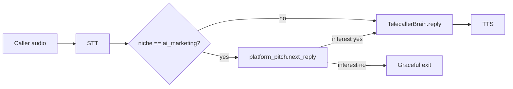

# SWARA — AI Voice Telecaller: Handoff + SOP + Improvement Roadmap

> **Combo doc** (single file, jaisa maanga gaya). Hinglish + English tech terms.
> **Banne ka reason:** Swara ko *duniya ka best telecaller* banana — current state ka clean handoff + roz chalane ka SOP + research/council-backed improvement plan (code-level) ek jagah.
> **Banaya:** 2026-06-21 · deep web research + 3-member LLM council (voice-latency engineer · Hinglish conversation designer · India compliance/ops) + live-code verification se.
> **Latest sync:** 2026-06-21 (project lockstep pass + **PR1 shipped LIVE**: D-0 calling-window 09:00 + D-2 per-turn latency metrics, commit `0e17073`) · **Live:** https://leadsgenai.in · **Explorer:** https://leadsgenai.in/app/explorer · ~772 routes (`prod_check`)
> **Related docs:** [`PRODUCT_HANDOFF_SOP.md`](PRODUCT_HANDOFF_SOP.md) Part 2 (Voice product SOP) · [`PROJECT_HANDOFF.md`](PROJECT_HANDOFF.md) §5–6 (AI stack + telephony) · [`PRODUCTION_READINESS_AUDIT_2026_06_21.md`](PRODUCTION_READINESS_AUDIT_2026_06_21.md) (verdict: code-ready, Vobiz/DLT blocked) · [`AGENT_REGISTRY.md`](AGENT_REGISTRY.md)
> **Source-of-truth:** Windows repo `C:\Users\Ratanshila\Documents\leadgenrationaiagent`. Detailed history `docs/SESSION_LOG.md`. Lean facts `CLAUDE.md`.
> **Golden rule:** **DO alag products** — Swara = **Product 2 (Voice Agent)** standalone SKU. Marketing Advanced tier me voice sirf **ek feature** hai. "Marketing + voice bundle" framing **mat use karo**.
> **Scope reminder:** Yeh doc = handoff + SOP + roadmap + **implementation PLAN** (kaunsi file, kya change). Roadmap items me **status tags** (DONE / PARTIAL / OPEN) — shipped code dubara mat banao.

---

## 0. Ek-line summary (TL;DR)

Swara = **Product 2 (AI Voice Calling Agent)** ka telecaller persona — **free-stack, cascade (STT→LLM→TTS) Hindi/Hinglish AI telecaller** jo Vobiz telephony pe chalti hai. Core working hai; **`platform_pitch`** (`ai_marketing` niche) aur **post-call hooks** (meter + qualify downstream) **shipped**; bahut saare *best-in-world* features **code me WIRED hain par flag se OFF** (streaming-TTS, Smart-Turn, Silero VAD, AMD). Sabse bada gap (bacha hua) = **turn-taking fluidity + streaming-TTS flip** (observability/per-turn latency log + 9am calling-window + **polite-no detector all niches** + eval/QA harness = **SHIPPED 2026-06-21, LIVE**; PR1+PR2+D-8 done). Phone abhi DLT/Vobiz-recharge pe blocked → **tuning ka surface = web-call** (`/app/test-call`, `/demo`). Roadmap P0→P5 me phased hai — status Part C/D me tagged.

---

# PART A — HANDOFF (Swara abhi kya hai)

## A0. Product 2 context (Voice Agent SKU)

| Item | Detail |
|------|--------|
| **Positioning** | Standalone **AI Voice Calling Agent** — full telecaller SKU. Marketing Advanced tier ka voice = alag **feature**, alag product nahi (ADR-009). |
| **Public page** | `/voice-agent` · ops: `/app/test-call` (FREE tune) · `/app/dialer` (human disposition) · `/demo` |
| **Pricing** | [`app/marketing/voice_packages.py`](app/marketing/voice_packages.py) — Band A **₹4,999** · B **₹9,999** · C **₹19,999**/mo (unlimited calls per niche-band). Annual = 10× monthly. Pilot: 7 din / 50 calls free. Niche→band: `lead_band()` in `niches.py`. |
| **Payments** | UPI primary (`UPI_VPA` LIVE). Razorpay removed 2026-06-18. |
| **Call insights** | `POST /api/voiceai/ask` · `POST /api/ai/qualify-call` |
| **Blockers (USER)** | DLT (Udyam re-apply) · Vobiz recharge + DID · `CALL_TRANSFER=1` (human handoff, needs DID) |

Full Product 2 SOP: [`PRODUCT_HANDOFF_SOP.md`](PRODUCT_HANDOFF_SOP.md) §2.

## A1. Persona / role (voice staff quartet)

**File:** `app/platform/team.py` (STAFF dict). Voice product staff (`product="voice"`):

| ID | Name | Role | Schedule |
|----|------|------|----------|
| `swara` | Swara 📞 | **Telecaller** — phone + web demo, niche scripts, qualify, objections | On-demand (calls/demos) |
| `arjun` | Arjun 🧪 | **QA** — scripted convos, bugs (double/repeat/slow/long) | ~02:30 IST + on-demand |
| `meera` | Meera 🎓 | **Trainer** — transcript quality, STT/latency tuning suggestions | ~03:00 IST + on-demand |
| `tara` | Tara 🎙️ | **Voice Infra Ops** — telephony readiness (Vobiz auth, caller-ID, webhooks, DND, TTS/STT/LLM chain) | Hourly (`telephony_pulse`) |

> **Note:** Active telephony provider = **Vobiz only** (Exotel code-level deleted 2026-06-18, team.py duties text updated 2026-06-23).

**Scheduler:** jobs Celery beat se chalte hain (`RUN_IN_PROCESS_SCHEDULER=0`, `leadgen_worker` + `leadgen_scheduler` containers) — in-process uvicorn pe nahi. Voice jobs: **QA** (~02:30, `eval_suite`, gated `VOICE_EVAL_AUTO`) · **Trainer** (~03:00, gated `ML_NIGHTLY_TRAINING`) · **voice pulse** (har 15 min) · **Tara telephony_pulse** (hourly). Full 24-job table: [`PRODUCT_HANDOFF_SOP.md`](PRODUCT_HANDOFF_SOP.md) Part 3.

## A2. Voice pipeline end-to-end (cascade)
Teen audio paths hain — sab parent VAD/STT/LLM/TTS reuse karte hain:

| Path | File | Audio | Use |
|---|---|---|---|
| **Vobiz phone stream** | `app/telephony/vobiz_stream.py` | L16 / 16 kHz, 20 ms frames | LIVE provider (DLT pe blocked) |
| **Phone stream 8k** | `app/voice_agent/phone_stream.py` | PCM/µ-law 8 kHz | legacy/8k parity |
| **Web-call** | `app/api/web_call.py` + `app/voice_agent/pipeline.py` | browser WS | **abhi ka tuning surface** |

**Flow (vobiz):** caller PCM → RMS/energy VAD (`VOBIZ_VAD_RMS`, default ~300) → end-of-turn = trailing silence (`VOBIZ_SILENCE_MS`, ~650 ms) → **STT** → (`platform_pitch` if `niche==ai_marketing` else `TelecallerBrain.reply()`) → **EdgeTTS** (`hi-IN-SwaraNeural`, MP3→PCM16) → Vobiz `playAudio` base64 chunks. Barge-in: caller bot ke upar bole → `clearAudio` (~100 ms speech-over-bot).

**Post-call (`vobiz_stream._cleanup`) — SHIPPED 2026-06-18:**
```
call end → post_call_hooks.meter_call_completion (billing + call.completed webhook, idempotent)
        → _auto_qualify (AUTO_QUALIFY_CALLS=1) → apply_qualified_downstream (CRM/cadence/sales)
        → emit_call_report (customer webhooks)
```
Guard: `scripts/cross_path_audit.py` in `final_integration_check`.

## A2b. Platform pitch flow (`platform_pitch.py`) — SHIPPED (ai_marketing only)

**File:** `app/voice_agent/platform_pitch.py` · **Niche:** `ai_marketing` only (`is_platform_pitch(niche)`).

LeadGen self-outbound pitch — deterministic opener chain + interest gate **before** generic `TelecallerBrain` discovery.



- **Interest gate:** regex yes/no (`_YES_PATTERNS` / `_NO_PATTERNS`) — **partial** step toward polite-no (niche-scoped, not all niches).
- **Wiring:** `vobiz_stream._platform_pitch_reply`, `opening_segments`, `generate_celebration_pcm`; `web_call.py` niche branch.
- **Script source:** `niche_scripts.get_script("ai_marketing")`.

## A3. Provider chains (sab FREE)
**File:** `app/voice_agent/free_ai.py`
- **LLM (realtime chain):** Mistral `mistral-small` → Groq `llama-3.1-8b-instant` → Cerebras 120B → Gemini flash-lite → SambaNova → OpenRouter (rotating keys). Hard cap **`_CALL_TIMEOUT_S = 8.0`s**.
- **Circuit breaker:** 429/quota → escalating cooldown 60s → 2m → 4m … cap **30 min**; success = reset. "per day/TPD/limit reached" → seedha 30 min.
- **STT:** Groq `whisper-large-v3-turbo` (lang forced `"hi"`, PRIMARY) → Gemini audio-in (multi-key) → Vosk / faster-whisper (CPU, `initial_prompt` hardcoded).
- **TTS:** EdgeTTS `hi-IN-SwaraNeural`; prosody knobs `PHONE_TTS_RATE` / `PHONE_TTS_PITCH`. `edge-tts>=7.2.0` zaroori (warna 403).

## A4. Turn-taking / barge-in (WIRED par mostly OFF)
**File:** `app/voice_agent/turn_detector.py`
- `get_speech_gate()` → **SileroSpeechGate** (line ~250) · `confirm_end_of_turn()` (line ~384) → Smart-Turn + text-endpoint heuristics.
- Flags (sab **default OFF**): `USE_SILERO_VAD`, `USE_SMART_TURN`, `USE_TEXT_ENDPOINT`. Bina flag/dep → graceful RMS+silence fallback.
- **Wiring reality (verified):**
  - `vobiz_stream.py` sirf `get_speech_gate().is_speech()` use karta (line ~715–717). **`confirm_end_of_turn()` vobiz path me CALL NAHI hota** → semantic Smart-Turn vobiz pe effectively dormant.
  - `pipeline.py` (web-call) **`confirm_end_of_turn()` use karta** (line ~310–312) → semantic endpoint sirf web path pe active.
- Backchannel ("haan/accha") + filler ("ek second") support: **nahi** hai.

## A5. Streaming TTS (CODED, flag OFF)
- **Module:** `app/voice_agent/llm_stream_tts.py` (gate `USE_LLM_STREAM_TTS`, default OFF).
- **Brain:** `telecaller_brain.py` `reply_stream_sentences()` (~line 646) — LLM token stream → sentence-by-sentence TTS.
- **Wired in:** `vobiz_stream.py` `_think_and_say_stream` (~line 1204) + `phone_stream.py` (~line 624). Bas flag flip karna hai.

## A6. RAG / KB grounding
- **File:** `telecaller_brain.py` — Qdrant, `_KB_TOP_K=2`, `_KB_TIMEOUT_S=1.5`, **`_KB_MIN_SCORE=0.05`** (bahut permissive → noisy context risk). Singleton load, **refresh nahi** hota (data change → restart chahiye).
- Niche data: `app/voice_agent/niche_scripts.py` `NICHE_SCRIPTS` (opening/discovery/objection/value/closing) + `kb_documents(niche)` flatten.

## A7. Compliance hooks (call path me) — VERIFIED wired
- **ComplianceGate:** `app/telephony/compliance.py` → `vobiz_handler.place_call()` pe dial se pehle call hota, **promo pe fail-CLOSED**. Window `_window()` (line ~149–155): **promo default 09:00–19:00** (was 10:00; fixed 2026-06-21), **txn 09:00–21:00** (env `COMPLIANCE_PROMO_START/END`, `COMPLIANCE_TXN_START/END`).
- **AI disclosure:** `niche_scripts.ensure_ai_disclosure()` (line ~148) → `vobiz_stream._opening_line` (~1303–1305) + `phone_stream` (~704–706) me **always-on**.
- **DND:** `app/utils/dnd_checker.py` — koi external provider nahi → **UNVERIFIED by default** → promo fail-CLOSED (`dnd_lookup_failed`). `DND_CARRIER_SCRUB=1` + Vobiz creds = verified-allow.
- **AMD:** `amd.py` `AnsweringMachineDetector` → `vobiz_stream._amd_check` (~line 906/916), gated **`AMD_DETECT` (default OFF)**.
- **Consent ledger:** `consent_ledger.py` — append-only JSONL; `record_consent/record_opt_out/is_suppressed/has_consent`; recording retention 90-din sweep (delete gated `RECORDING_RETENTION=1`).

## A8. QA / evaluation
- **`scripts/agent_tester.py`** (web-call text mode): flags **double-reply / empty-echo / repeat / too-long(>35 words) / banned-phrase / slow(>9s)**; per-niche scorecard.
- **`app/voice_agent/eval_suite.py`:** 7 built-in personas (interested_buyer, busy_rude, confused, price_objector, voicemail, not_interested, language_switcher) → checks qualified-outcome / polite-goodbye / not-pushy → `EvalReport.pass_rate`. Planned personas (Part D): polite_no_indian, whatsapp_brushoff, etc.
- Nightly guardrail eval: last ~5 `data/call_transcripts/*.jsonl` → `eval_metrics.transcript_quality()`.
- **Post-call qualify:** `app/voice_agent/call_qualifier.py` — `AUTO_QUALIFY_CALLS=1` → `vobiz_stream._auto_qualify`.

## A9. Key files index
| Area | File |
|---|---|
| Persona/scheduler | `app/platform/team.py`, `team_scheduler.py` |
| Platform pitch | `app/voice_agent/platform_pitch.py` |
| LLM/STT/TTS chains | `app/voice_agent/free_ai.py` |
| Brain (KB+ACP) | `app/voice_agent/telecaller_brain.py` |
| Scripts/disclosure | `app/voice_agent/niche_scripts.py` |
| Turn-taking | `app/voice_agent/turn_detector.py` |
| Streaming TTS | `app/voice_agent/llm_stream_tts.py` |
| Vobiz stream | `app/telephony/vobiz_stream.py` |
| Post-call hooks | `app/telephony/post_call_hooks.py` |
| Call qualifier | `app/voice_agent/call_qualifier.py` |
| Cross-path guard | `scripts/cross_path_audit.py` |
| Voice pricing | `app/marketing/voice_packages.py` |
| 8k phone stream | `app/voice_agent/phone_stream.py` |
| Web-call | `app/api/web_call.py`, `pipeline.py` |
| Compliance gate | `app/telephony/compliance.py` |
| DND / AMD / consent | `app/utils/dnd_checker.py`, `app/voice_agent/amd.py`, `app/telephony/consent_ledger.py` |
| QA | `scripts/agent_tester.py`, `app/voice_agent/eval_suite.py` |
| Flags registry | `app/api/automation_flags.py` · live: `GET /api/growth/infra/flags` |

## A10. Flags cheat-sheet (high-value)
| Flag | Effect | Default | Recommendation |
|---|---|---|---|
| `USE_LLM_STREAM_TTS` | LLM stream → early sentence TTS | OFF | **ON karo** (web-call) — coded, safe |
| `USE_SMART_TURN` | semantic end-of-turn | OFF | ON + **vobiz me wire karo** (abhi pipeline-only) |
| `USE_SILERO_VAD` | robust speech gate | OFF | ON (frame-size fix ke baad) |
| `USE_TEXT_ENDPOINT` | partial-transcript endpoint | OFF | ON |
| `AMD_DETECT` | voicemail detect (credits bachat) | OFF | telephony live hone pe ON |
| `DND_CARRIER_SCRUB` | carrier NDNC scrub | OFF | Vobiz creds aane pe ON |
| `AUTO_QUALIFY_CALLS` | Post-call LLM qualify → CRM/cadence (`vobiz_stream._auto_qualify`) | OFF | ON when CRM loop chahiye |
| `AUTO_CALLBACK_INQUIRY` | Inbound inquiry auto-callback (transactional) | OFF | inbound path ready |
| `VOICE_EVAL_AUTO` | Nightly eval_suite via Arjun QA job | OFF | ON for regression guard |

## A11. Capabilities vs gaps (snapshot)
**✅ Shipped:** cascade pipeline, free LLM/STT/TTS chain + circuit-breaker, RMS turn-end, barge-in (ungated), ComplianceGate (fail-closed promo), AI-disclosure always-on, consent ledger, AMD engine, QA scorecard + 7 eval personas, streaming-TTS & Smart-Turn **coded**, **post-call hooks** (meter + qualify downstream on vobiz path, 2026-06-18), **platform_pitch** for `ai_marketing` (interest gate + opener chain), cross-path audit in `final_integration_check`.
**❌ Gaps (OPEN):** (1) ~~per-turn latency logging~~ **[DONE 2026-06-21]** — `turn_metrics.py` LIVE (vobiz + web pipeline; P50/P95 rollup). (2) Smart-Turn vobiz me wire nahi. (3) streaming-TTS flag OFF. (4) ~~general polite-no detect~~ **[DONE 2026-06-21]** — `intent_softno.py` all-niche 2-strike de-escalation LIVE. (5) backchannel/filler nahi. (6) barge-in ungated + disclosure-leg interruptible. (7) Silero frame-size bug (per-20 ms call ⇒ ≥512 samples chahiye ⇒ silent RMS fallback). (8) STT niche-biasing sirf faster-whisper pe (Groq/Gemini pe nahi). (9) KB `min_score=0.05` noisy + no refresh. (10) web-call surface **ComplianceGate bypass** karta (sirf `place_call` pe gate).

---

# PART B — SOP (Swara ko roz operate / tune / QA / ship karne ka runbook)

## B1. Golden operating rules
1. **Tuning FREE web-call pe karo, phone pe nahi.** Phone paisa khaata + abhi DLT/recharge blocked. Web-call (`/app/test-call`, `/demo`) = primary surface. Public pitch page: `/voice-agent`.
2. **DO alag products** — Swara = Product 2 Voice Agent; Marketing Advanced voice = alag feature. Bundle framing mat use karo.
3. **Ek baar me ek knob badlo** (research-mandate). Frozen eval-set pe pehle baseline lo → ek change → re-run → compare. Multiple knobs ek saath = signal kho jaata.
4. **Har change ke baad top-20 "kharab" calls/transcripts manually suno/padho.** Numbers + ear dono.
5. **LEGAL-GATE kabhi disable mat karo** (ComplianceGate, AI-disclosure, DND fail-closed, calling-window, opt-out suppression). Detail § B6 + Part E.
6. **"Done" sirf jab `/verify` green** (prod_check + targeted tests). Bina proof done mat bolo.

## B2. Daily / scheduled ops (kya apne aap chalta)

Jobs **Celery beat** se fire (`leadgen_scheduler` container) — `RUN_IN_PROCESS_SCHEDULER=0` on VPS.

| Time (IST) | Job | Staff | Flag / note |
|---|---|---|---|
| ~02:30–04:00 | Voice QA (`run_qa` → `eval_suite`) | Arjun | `VOICE_EVAL_AUTO` |
| ~03:00–04:30 | Trainer (`run_trainer`) | Meera | `ML_NIGHTLY_TRAINING` |
| har 15 min | voice pulse (heartbeat) | Swara | standby health |
| hourly | telephony readiness | Tara | `telephony_pulse` |
| nightly | guardrail eval (last 5 transcripts) | Arjun | `eval_metrics` |

Full cross-product automation table: [`PRODUCT_HANDOFF_SOP.md`](PRODUCT_HANDOFF_SOP.md) Part 3.

**Health check:** worker recreate ke baad `redis-cli llen celery` → agar >500 to `del celery` (tasks regenerable, beat re-schedules).

## B3. Tuning loop (web-call pe)
1. **Baseline:** `python scripts/agent_tester.py` → per-niche scorecard note karo (double/empty/repeat/long/slow + banned). Yeh frozen-set hai.
2. **Eval personas:** `eval_suite.run_suite()` → `pass_rate` + `by_persona` save karo.
3. **`ai_marketing` niche:** test **both** `platform_pitch` path (interest gate) aur generic `TelecallerBrain` path on `/app/test-call`.
4. **Ek change** karo (prompt / flag / script).
5. **Re-run** dono → diff. Regression (kisi persona ka pass gira) = revert ya fix.
6. **Listen:** 10–20 web-call recordings/transcripts khud suno — latency feel, talk-over, polite-no handling, Hinglish naturalness.
7. Pass + ear-OK → commit → `/verify` → ship.

## B4. QA scorecard (Swara ke liye — har call is par grade)
> Call-center standard: ~30–50 weighted criteria; compliance items = **auto-fail** (poora call zero).

| Dimension | Pass criteria | Type |
|---|---|---|
| Opening + AI disclosure | first ~8s me naam + firm + "ek AI assistant" | **AUTO-FAIL agar missing** |
| Permission / timing | intro ke turant baad "do minute baat kar sakti hoon ya busy?" | quality |
| Source disclosure | "aapka number [website/inquiry] se mila" jaldi | quality |
| Discovery quality | 4–7 reframed open questions, **spread** (checklist nahi) | quality |
| Talk-listen ratio | agent ≤ ~55% words; turn ≤2 sentence/1 question | quality |
| Objection handling | agree → explore → reframe (LAER); incumbent trash NAHI | quality |
| **Polite-no respect** | 2nd soft-no ke baad push **band** | quality (India-critical) |
| Hinglish register | "aap"+"ji", caller-mix mirror, no robotic translation | quality |
| Compliance | OTP/payment kabhi nahi maanga; window ke andar; opt-out honor | **AUTO-FAIL** |
| Close + next step | alt-choice ("Tue ya Thu?") + confirmed slot/callback | quality |
| Latency / dead-air | gap >800 ms nahi; no awkward silence | quality |

## B5. Deploy / verify (free-stack loop)
1. `python scripts/prod_check.py` (~770 routes expected)
2. `scripts\run_tests.bat` → **`pytest_run.log` Read karo** (~80+ green; voice change pe `tests/test_voice_fixes.py`, `test_text_endpoint.py`, `test_phase3_voice.py`, `test_ai_disclosure.py`, `test_cross_path_telephony.py` zaroor).
3. Windows git push (`C:\PROGRA~1\Git\cmd\git.exe`).
4. VPS: Git-ssh → `docker compose -f docker-compose.vps.yml build app` + `up -d --no-deps app` → `/health` = `environment:production`.
5. **Voice/automation change** = recreate **app + worker + scheduler** (sirf app NAHI): `docker compose -f docker-compose.vps.yml up -d --no-deps app worker scheduler`
6. 🚨 **CI = GATE-ONLY** — `DEPLOY_ENABLED` unset → `git push` se prod auto-deploy NAHI; manual SSH deploy karo.
- Nayi `@app.get` route = **container recreate / hard reload** (stale `.pyc` 404). `sleep 16` + 2× health-check.
- Voice change ke baad **`scripts/agent_tester.py` re-run** (free scorecard) mandatory.

## B6. Compliance operating rules (LEGAL-GATE — NEVER disable)
- **ComplianceGate** (`compliance.py`): promo = DND + window + DLT/140 enforce; txn = sane window only. `COMPLIANCE_ENABLED=0` kill-switch = **liability — use mat karo; ideally alarm/remove**.
- **AI disclosure**: har opening me on (`ensure_ai_disclosure`). Disclosure-leg ko **non-interruptible** rakhna (barge-in se cut na ho). Client copy me *"TRAI mandates AI disclosure = ₹10L fine"* **mat likho** — Part E dekho.
- **Calling window:** TRAI promo window asal me **9:00–21:00**; code default promo ab **09:00–19:00** = conservative safe subset (P0-1 DONE 2026-06-21, was 10:00). Txn default 09:00–21:00. Detail Part E.
- **DND fail-CLOSED**: provider unset = promo block. Yeh **feature hai, bug nahi** — disable mat karo.
- **Opt-out**: "press 9"/"band karo" → instant `record_opt_out` + cross-channel suppression. 90-din re-consent cool-off.
- **Never** OTP/payment/sensitive data maango — spam-fatigue + DPDP risk.

## B7. Escalation / incident
| Symptom | Pehla step | Fix |
|---|---|---|
| Calls laggy / dead-air | per-turn latency log dekho (P1 banao) | streaming-TTS + Smart-Turn (Part D) |
| LLM empty replies | `free_ai` circuit-breaker state | provider cooldown wait; Mistral primary healthy? |
| STT galat (Hindi→English) | lang `"hi"` + initial_prompt | niche-biasing (D-6) |
| Bot polite-no pe push karta | `eval_suite` not_interested persona; `ai_marketing` pe `platform_pitch` path check | general polite-no detector (D-8 PARTIAL) |
| Compliance reject spike | `compliance.py` decision logs | window/DND config — gate sahi hai |
| Provider 429 storm | breaker cooldown escalate | chain order; OpenRouter keys rotate |

For non-trivial debug → `systematic-debugging` skill; ambiguous go/no-go → `llm-council-decision` (LIVE `/api/agents/council`).

---

# PART C — IMPROVEMENT ROADMAP (best-in-world telecaller) — LLM Council verdict

> **Process:** deep web research (2025–26 SOTA voice + India telecalling) → 3-member council (latency-engineer · Hinglish conversation-designer · compliance/ops) → live-code verification → Chairman synthesis (yeh section).

## C1. Research-backed targets (kis number pe aim karna)
| Metric | World-class target | Swara-relevant note |
|---|---|---|
| Voice-to-voice latency | great ~500 ms; telephony P50<600 ms, **P95<800–1000 ms** | PSTN ~600 ms fixed → endpointing + overlap pe squeeze |
| Human turn-gap | ~200 ms | pure-silence VAD ~800 ms feel "robotic" |
| Turn detection | semantic (Smart-Turn v3: 8 MB, 12 ms CPU, **Hindi ~93%**, FREE) | gap 650→~250 ms bina extra interruption |
| Barge-in | TTS stop **<60 ms**; validate via STT (raw VAD nahi) | "haan/accha" false-cut na ho |
| Perceived latency | sentence-stream TTS = **−60–80%** on multi-sentence | flag already coded |
| Hindi/Hinglish WER | **18–22% expected** (English 8% nahi) | code-switch +30–50% WER; biasing +20–30% rel |
| Talk-listen | listen ≥ talk; agent **never >~65%** | 95% Indian customers "telecaller bahut bolta hai" |
| Speed-to-lead | call <5 min → **~21× qualify** | AI ka structural superpower |
| Opener | permission/context-first ~11% vs "bad time?" 0.9% | + AI-disclosure fold-in |

## C2. Council consensus (jis par teeno agree)
1. **Observability pehle** — per-turn latency/STT/LLM/TTS logging without this sab tuning blind hai. (Unanimous #1 enabler.)
2. **Disclosure-leg non-interruptible** — latency-engineer + compliance + designer teeno yahan converge (ek hi feature, teen reason).
3. **Compliance gates already mostly coded** → "compliance-first" me din lagte hain, hafte nahi → quality work parallel chal sakta.
4. **Free-stack + additive** — koi paid STT/TTS/LLM nahi; working code rewrite nahi, additive + flag-gated.

## C3. Council disagreements → Chairman resolution
- **Latency-first vs Conversation-first:** Designer: "1.5s tez reply jo polite-no pe push kare, woh 3s reply jo gracefully ruke usse zyada deal haarta — India me *patience > snappiness*." Engineer: "1.2s late reply robotic feel deta chahe script perfect ho." **Verdict:** dono sahi, alag files touch karte (vobiz_stream/turn_detector vs telecaller_brain/niche_scripts) → **parallel chalao**. Shared dependency = observability + eval-harness → woh pehle.
- **Compliance-first vs baaki:** Ops: "tez+persuasive bot jo DND number ko 8am call kare = zyada efficient ₹-liability." **Verdict:** P0 compliance items chhote + mostly coded → pehle nipta do (din-bhar ka kaam), phir race. **Compliance = P0 correctness, quality ka tax nahi.**
- **Sequencing principle:** eval-harness (personas + checks) ko P2/P3 shipping se **pehle** banao — warna "polite-no detector kaam karta hai" prove nahi kar paoge.

## C4. PRIORITIZED ROADMAP (Chairman decision — phased)

> **Status legend:** **DONE** = shipped in repo · **PARTIAL** = niche-scoped or incomplete · **OPEN** = not started · **BLOCKED** = external dependency

### P0 — Legal/correctness hygiene (turant, ~1 din, near-zero effort)
- **P0-1 [DONE 2026-06-21 — LIVE]** Calling-window: promo default ab **`09:00–19:00`** (safe subset of TRAI 9–21; 9–10am legal hour wapas) + docstring reason fixed (§E). *LEGAL-GATE, gate intact.* `compliance.py` `_window` = `time(9,0)`; `tests/test_compliance.py` covers 09:30-allowed / 19:30-blocked / env-override. Prod-verified `promo_window 09:00-19:00`.
- **P0-2 [DONE 2026-06-21]** `CLAUDE.md` (lines 12, 102) + `PROJECT_HANDOFF.md` (lines 315, 317) corrected: TRAI window is 9am–9pm (code promo 9am–7pm conservative, not "10am-7pm"); ₹10L = UCC-misreport penalty on access providers, NOT a standalone "AI-disclosure = ₹10L" fine. Gate code untouched (§E).
- **P0-3 [DONE 2026-06-21 — LIVE]** `COMPLIANCE_ENABLED=0` kill-switch ab LOUD: escalated `logger.error` per-call + cooldown'd ops page (`ops_alerts.alert_compliance_disabled`, OPS_ALERTS-gated). Default always-on, behaviour unchanged.

### P1 — Observability (turant, small effort, UNBLOCKS sab) — **unanimous #1**
- **P1-1 [DONE 2026-06-21 — LIVE]** Per-turn metrics: `stt_ms`/`llm_first_ms`/`tts_first_ms`/`turn_ms`+outcome → `data/turn_metrics/*.jsonl` + transcript `turn_metrics`+`turn_rollup` (P50/P95). New `app/voice_agent/turn_metrics.py` (gated `TURN_METRICS`, default on, log-only); wired vobiz_stream (prod) + pipeline (web-call). *Caveat:* `tts_first_ms` reliable only on stream-TTS path → populates fully after D-3. *"Jo measure nahi kar sakte woh tune nahi kar sakte."*

### P2 — Latency / fluidity (web-call safe; zyada-tar already coded)
- **P2-1 [DONE 2026-06-21 — LIVE]** `USE_LLM_STREAM_TTS=1` flipped on prod (.env, both app+worker verified). Affects vobiz/phone path (web-call hardcodes off to dodge a 14s tune-loop hang). −60–80% perceived latency once phone live.
- **P2-2 [DONE 2026-06-21 — LIVE]** Smart-Turn **vobiz me wired** — `confirm_end_of_turn` on normal silence-end (hard 2x-silence + too_long always finalize). Activate: `USE_SMART_TURN=1`+`USE_TEXT_ENDPOINT=1` (needs pipecat dep); inert till then.
- **P2-3 [DONE 2026-06-21 — LIVE]** Silero **frame-size fix** — per-session rolling buffer (vobiz 512@16k / phone 256@8k) + sr-aware gate floor. Silero ab actually chalega jab `USE_SILERO_VAD=1`.
- **P2-4 [PARTIAL — gate+lock DONE 2026-06-21]** Barge-in **gate** (`BARGE_IN_ENABLED`) + disclosure-leg non-interruptible (`DISCLOSURE_LOCK`, default ON, 6 s safety cap) DONE. **Pending:** STT-validated backchannel allowlist (haan/accha = no barge) — needs STT-in-loop.
- **P2-5 [DONE 2026-06-21 — LIVE]** Filler/ack phrase while LLM thinks — vobiz cached rotating filler ab gated `USE_THINKING_FILLER` (default ON).

### P3 — Conversation intelligence (the India differentiator; web-call safe)
- **P3-1 [DONE 2026-06-21 — LIVE]** **Polite-No detector + 2-strike de-escalation** — `app/voice_agent/intent_softno.py` (reuses `qa_checks.is_soft_no`) wired into `telecaller_brain.reply()` + `reply_stream_sentences()` for ALL niches; 2nd soft-no → graceful async-exit (deterministic, no extra LLM call) + hard system-prompt rule. Gated `SOFTNO_DEESCALATE` (default ON). `platform_pitch` ka ai_marketing gate ab generalise ho gaya.
- **P3-2 [DONE 2026-06-21 — LIVE]** Opener → AI-disclosure → permission → source flow. Permission = `niche_scripts.ensure_permission_ask` (do-minute clause, gated `PERMISSION_OPENER`) in vobiz + phone openers (ALL niches); source-line = `_CONVO_DISCIPLINE` prompt rule. Minor follow-up: web-call opener helper parity.
- **P3-3..3-6 [DONE 2026-06-21 — LIVE, prompt-level]** Talk-listen governor + objection 3-step (agree→explore→reframe + incumbent rating trick, no trashing) + WhatsApp qualify-before-send gate + Hinglish-mirror (mix/formality/tech-nouns-English, literal-translation banned) — shipped as the `_CONVO_DISCIPLINE` block in `telecaller_brain` system prompt (gated `CONVO_DISCIPLINE`, default ON). Runtime-verifiable via `qa_checks.check_talk_listen_ratio` + `check_literal_translation`.
- **P3-7 [DONE 2026-06-21 — LIVE]** STT niche-biasing for **Groq + Gemini** — `niche_scripts.stt_keyterms` (client+niche+Hinglish) → Groq `prompt=` + Gemini context; vobiz session computes once. Gated `STT_BIAS` (default ON).
- **P3-8 [DONE 2026-06-21 — LIVE]** KB `min_score` 0.05→**0.35** (env-tunable `KB_MIN_SCORE`) + singleton TTL refresh (`KB_REFRESH_SEC`, default 0=off, opt-in re-bootstrap so KB data changes load without restart). Both deployed (refresh rode along with the voice-roles commit `c425fcb`).

### P4 — Eval / QA harness (P2/P3 shipping ka prerequisite)
- **P4-1 [DONE 2026-06-21]** Nayi eval personas in `eval_suite.EXTENDED_PERSONAS` (separate from default baseline; aspirational — drive D-8/D-10): `polite_no_indian`, `whatsapp_brushoff`, `incumbent_user`, `formal_hindi_speaker`, `english_dominant`.
- **P4-2 [DONE 2026-06-21]** Naye checks in new `app/voice_agent/qa_checks.py` (pure, unit-tested; wired in `agent_tester`): `check_pushy_after_softno`, `check_talk_listen_ratio`, `check_missing_permission`, `check_literal_translation` + `run_all`.
- **P4-3 [OPEN]** `eval_gate` → live transcripts; false-interruption vs missed-interruption **alag** track; LLM-judge **with rationale**.
- **P4-4 [DONE 2026-06-21 — LIVE]** Silence/no-input policy — vobiz no-input watchdog (gated `NOINPUT_POLICY`, default OFF): 12s silence → reprompt ×2 → graceful close.
- **P4-5 [DONE 2026-06-21 — LIVE]** Web-call opener ab AI-disclosure + permission deta (phone parity). Full PSTN ComplianceGate route N/A — web-call browser-demo hai, real number dial nahi karta.

### P5 — BLOCKED until DLT / Vobiz recharge (phone-only)
- **P5-1 [BLOCKED]** `AMD_DETECT=1` flip (coded; voicemail-drop, 15–30% efficiency).
- **P5-2 [BLOCKED]** Real DND provider wire (`DND_CARRIER_SCRUB` / NCPR).
- **P5-3 [BLOCKED]** DTMF/RFC2833 digit-capture + confirm-back + "press 9" opt-out on stream.
- **P5-4 [BLOCKED]** Persistent EdgeTTS/STT connection + region co-location (Mumbai).
- **P5-5 [OPEN]** Consent-ledger → Postgres-backed (multi-worker race safety; ab bhi ho sakta).

### Shipped (not in original P0–P5 numbering — do NOT rebuild)
- **Post-call hooks [DONE]** — `post_call_hooks.meter_call_completion` + `apply_qualified_downstream` on vobiz `_cleanup` (2026-06-18).
- **Platform pitch [DONE/PARTIAL]** — `platform_pitch.py` for `ai_marketing` (see A2b).
- **Cross-path audit [DONE]** — `scripts/cross_path_audit.py` in `final_integration_check`.

## C5. Top levers — quick reference
**Technical (ranked):** semantic turn-detect → region co-location → stream-LLM→TTS → filler phrases → backchannel+barge-policy → STT biasing → DTMF+confirm digits → speculative tool-call → RAG off critical-path → AMD → TTS disfluency/SSML → eval harness.
**Conversational (ranked):** speed-to-lead → permission opener+disclosure → listen>talk short turns → mirror caller mix → **detect polite-no** → conversational qualify (4–7 Q) → problem-first → objection agree-explore-reframe → tactical empathy → politeness register → alt-choice close+micro-commit → warm handoff lead-card.

---

# PART D — DETAILED CODE-LEVEL IMPLEMENTATION PLAN

> Format: **file → kya change → flag → test → verify**. Sab **additive + flag-gated** (working code rewrite nahi). Har item ke baad `scripts/agent_tester.py` + targeted pytest + `/verify`. Line numbers approx (edit se pehle file Read karo — source-of-truth Windows).

### D-0 (P0-1) Calling-window default fix — *LEGAL-GATE* **[DONE 2026-06-21 — LIVE]**
- **File:** `app/telephony/compliance.py` `_window()` (~line 151–152) + header docstring (line 7, 26–27).
- **Change:** promo default `time(10,0)` → **`time(9,0)`** start (end `19,0` rakho). Docstring me "TRAI promotional 10:00–19:00" ko theek karo: *"TRAI promo window asal me 9–21; hum 9–19 conservative rakhte hain (RBI 8–19 overlap)."*
- **Env:** `COMPLIANCE_PROMO_START=09:00` already override-able → default badlo.
- **Test:** `tests/` me window test add — 09:30 promo allowed, 19:30 blocked.
- **Verify:** `prod_check` + decision log "window=09:00-19:00".

### D-1 (P0-3) Kill-switch harden — *LEGAL-GATE* **[DONE 2026-06-21 — LIVE]**
- **File:** `compliance.py` jahan `COMPLIANCE_ENABLED` padha jaata.
- **Change:** disable hone pe **loud warning log + ops alert** (ntfy) emit karo; ya flag remove karo. Default = always-on.

### D-2 (P1-1) Per-turn latency/STT/LLM/TTS logging — **[DONE 2026-06-21 — LIVE]**
- **File:** `app/telephony/vobiz_stream.py` (turn loop `_handle_turn`/`_speak`/`_think_and_say*`); mirror `phone_stream.py` + `web_call.py`.
- **Change:** har turn pe `t0` capture → `stt_ms`, `llm_first_token_ms`, `tts_first_frame_ms`, `turn_ms`, `provider_used`, `outcome` → existing transcript JSONL (`data/call_transcripts/`) me field add. Helper `app/voice_agent/turn_metrics.py` (naya) — P50/P95 rollup.
- **Flag:** default ON (sirf log, behavior change nahi) ya `TURN_METRICS=1`.
- **Test:** unit — metric dict shape; transcript line me keys present.
- **Verify:** web-call karke JSONL me numbers dikhe; P95 compute.

### D-3 (P2-1) Streaming-TTS enable **[DONE 2026-06-21 — LIVE]**
- **File:** sirf env. `USE_LLM_STREAM_TTS=1`. Path already: `llm_stream_tts.py` + `telecaller_brain.reply_stream_sentences` (~646) + `vobiz_stream._think_and_say_stream` (~1204) + `phone_stream` (~624).
- **Gotcha:** `web_call.py:947` comment — stream path pe fast_path skip + 14s hang tune-loop. Pehle web-call pe verify, fir vobiz.
- **Test:** `agent_tester.py` slow-metric pehle/baad compare (perceived latency down).

### D-4 (P2-2) Smart-Turn ko vobiz me wire **[DONE 2026-06-21 — LIVE, pipecat-gated]**
- **File:** `app/telephony/vobiz_stream.py` `_on_media` ka `ended` block (~line 774 area).
- **Change:** finalize se pehle route: `from app.voice_agent.turn_detector import confirm_end_of_turn` → `if not confirm_end_of_turn(silence_ended=ended, pcm16=trailing_buf, text=partial): keep_listening`. (Pattern `pipeline.py:310–312` se copy.)
- **Flag:** `USE_SMART_TURN=1` + `USE_TEXT_ENDPOINT=1`; `VOBIZ_SILENCE_MS=350`.
- **Dep:** pipecat (Smart-Turn). Bina dep = graceful fallback (already).
- **Test:** `tests/test_phase3_voice.py` + `test_text_endpoint.py` extend for vobiz path; false/missed-interruption track (D-9).

### D-5 (P2-3) Silero frame-size fix **[DONE 2026-06-21 — LIVE]**
- **File:** `turn_detector.py` `SileroSpeechGate.is_speech()` + caller `vobiz_stream.py:717`, `phone_stream.py:428`.
- **Change:** 20 ms frame (320 samples @16k) Silero ke liye chhota (≥512 chahiye) → 2 frames buffer karke gate call karo (ya internal ring-buffer). Warna `None` → silent RMS fallback (Silero no-op aaj).
- **Flag:** `USE_SILERO_VAD=1` (fix ke baad).
- **Test:** unit — 512-sample buffer pe `is_speech` non-None.

### D-6 (P2-4) Barge-in gate + disclosure-leg lock + backchannel allowlist **[PARTIAL — gate+lock DONE/LIVE 2026-06-21; backchannel pending]**
- **File:** `vobiz_stream.py` barge-in (`_barge_in`/clearAudio ~line 176 logic) + `_opening_line`/`_run_play` (disclosure leg ~1303); allowlist `turn_detector.py` (reuse `_INCOMPLETE_TAIL_WORDS` pattern).
- **Change:** (a) `BARGE_IN_ENABLED` flag (default ON) — on/off knob; (b) disclosure/greeting leg pe `interruptible=False` → barge ignore jab tak disclosure complete; (c) backchannel allowlist set `{haan, accha, theek hai, ji, hmm, sahi}` → in tokens pe barge **mat** karo (STT-validate, raw RMS nahi).
- **Test:** `test_voice_fixes.py` extend — "haan" mid-bot → no clearAudio; disclosure leg → no barge.

### D-7 (P2-5) Filler/thinking phrase **[DONE 2026-06-21 — LIVE]**
- **File:** `telecaller_brain.py` (reply start) ya `vobiz_stream` pre-LLM.
- **Change:** LLM call shuru hote hi ek short ack TTS chunk ("Ek second…", "Dekhta hoon…") stream karo jab tak first token na aaye; gap >800 ms cover. Rotate 3–4 phrases (repeat na ho).
- **Flag:** `USE_THINKING_FILLER=1`.
- **Test:** `agent_tester` repeat-check pass (filler rotate); no double-reply.

### D-8 (P3-1) Polite-No detector + 2-strike de-escalation — **flagship** **[DONE 2026-06-21 — LIVE]**
- **Already shipped (partial):** `platform_pitch.py` interest/no gate for `ai_marketing` niche — do NOT rebuild.
- **Still planned:** naya `app/voice_agent/intent_softno.py` (cheap regex/keyword classifier, **no extra LLM call**) → inject in `telecaller_brain.reply()` for **all niches**.
- **Triggers:** `dekhte hain`, `soch ke bata(ta|ti) hoon`, `baad me baat`, `abhi nahi`, `time nahi`, `zarurat nahi`, rushed `theek hai theek hai`, `whatsapp pe bhej do` (jab <1 qualifying answer).
- **Behavior:** 1st soft-no → ONE value-anchored re-ask allowed. **2nd soft-no → mandatory de-escalate** (stop pitch, graceful exit + async option): *"Bilkul ji, samajh gayi — aap busy hain. Ek choti si baat WhatsApp pe bhej deti hoon, time ho to dekh lijiyega. Aapka din achha rahe!"* Brain prompt me hard rule: *"2 baar polite refusal = push KABHI nahi (India me rude + trust-tod)."*
- **Test:** new persona `polite_no_indian` (D-11) PASS = 2nd ke baad no re-pitch; `pushy_after_softno` check (D-12).

### D-9 (P3-2) Opener + disclosure + permission + source flow **[DONE 2026-06-21 — LIVE]** (permission = opener helper; source-line = `_CONVO_DISCIPLINE` prompt rule)
- **Already shipped (partial):** `platform_pitch.opening_segments` + `ensure_ai_disclosure` in vobiz/web-call for `ai_marketing`.
- **Still planned:**
- **File:** `niche_scripts.py` per-niche `opening` + `ensure_ai_disclosure()` (extend to also assert a permission-clause); `telecaller_brain` opening turn.
- **Change:** single ≤2-sentence opener: *"Namaste ji, main Swara — [Company] se ek AI assistant. [niche problem hook]. Do minute baat kar sakti hoon ya abhi busy hain?"* → engagement pe source line *"Aapka number [website/inquiry] se mila tha."*
- **Test:** `test_ai_disclosure.py` extend — opener me disclosure + permission dono; `missing_permission` check.

### D-10 (P3-3..3-6) Talk-listen + objection + WhatsApp-gate + Hinglish-mirror **[DONE 2026-06-21 — LIVE, prompt-level]**
- **File:** `telecaller_brain.py` system prompt + `niche_scripts.py` rebuttals.
- **Changes:** (a) prompt: "ask karo phir CHUP raho; agent ≤55% bole; ≤2 sentence/1 question" (already partial — strengthen). (b) Objection 3-beat template (agree→explore→reframe-with-number; incumbent "10 me kitne number?" trick) — flat strings ko template se replace. (c) "WhatsApp bhej do" → pehle 1 qualifying Q, fir send. (d) Hinglish: "caller ka exact mix + formality mirror karo; tech-nouns (demo/budget/slot) English; 'aap'+'ji'; literal-translation ban."
- **Test:** personas `whatsapp_brushoff`, `incumbent_user`, `formal_hindi_speaker`, `english_dominant`; checks `talk_listen_ratio`, `literal_translation`.

### D-11 (P3-7) STT niche-biasing (Groq + Gemini) **[DONE 2026-06-21 — LIVE]**
- **File:** `free_ai.py` `transcribe`/Groq call (~line 321) + vobiz Gemini STT.
- **Change:** per-niche brand/keyterm string (Qdrant niche namespace se top terms) → Groq `prompt=` / Gemini context me pass (jaise faster-whisper already karta line ~261). +20–30% rel accuracy on entities.
- **Test:** known Hinglish brand utterance → transcription improve (manual A/B).

### D-12 (P3-8) KB threshold + refresh **[DONE 2026-06-21 — LIVE]**
- **File:** `telecaller_brain.py` `_KB_MIN_SCORE` 0.05 → **0.35**; singleton ko time/TTL refresh (e.g. 1hr) ya reload hook.
- **Test:** off-topic query → top-2 chunk relevance up; stale-after-update gone.

### D-13 (P4) Eval/QA harness **[DONE 2026-06-21 — LIVE]**
**Shipped:** `EXTENDED_PERSONAS` (5) + `qa_checks.py` (4 checks + `run_all`) in `agent_tester`. Silence/no-input policy (P4-4) DONE. Web-call disclosure+permission parity (P4-5/D-14) DONE. **P4-3 DONE:** `app/agents/live_eval.py` scores real `call_transcripts` (voice_turn_score × qa_checks) → `eval_gate` (suite `live_calls`); LLM-judge with rationale (gated `LLM_JUDGE`); per-call `barge_count` interruption tracking (also FIXED a broken nightly `score_and_gate` call). **Lone remnant:** false-vs-missed interruption CLASSIFICATION needs STT-validated barge (same arch as D-6 backchannel allowlist).
- **File:** `app/voice_agent/eval_suite.py` (personas) + `scripts/agent_tester.py` (checks) + `eval_gate` wiring.
- **Changes:** personas `polite_no_indian`/`whatsapp_brushoff`/`incumbent_user`/`formal_hindi_speaker`/`english_dominant`; checks `pushy_after_softno`/`talk_listen_ratio`/`missing_permission`/`literal_translation`; `eval_gate` → live transcripts, false-vs-missed interruption alag, LLM-judge with rationale; silence/no-input policy (reprompt→wait→escalate→hangup) in turn loop.
- **Test:** har naya check apne fixture pe pass/fail prove kare.

### D-14 (P4-5) Web-call ComplianceGate route — *LEGAL-GATE jab web-call real PSTN dial kare* **[DONE 2026-06-21 — LIVE (disclosure+permission); PSTN-gate N/A]**
- **File:** `app/api/web_call.py` WS entry.
- **Change:** agar web-call kabhi real number dial kare → `place_call`-style gate call add. Pure browser-demo (no PSTN) = quality-only, par disclosure tab bhi on.

### D-15 (P5) Phone-blocked items (DLT/recharge ke baad) **[BLOCKED]**
`AMD_DETECT=1` flip · `DND_CARRIER_SCRUB=1` + provider · DTMF/RFC2833 + "press 9" opt-out · persistent TTS/STT conn + Mumbai co-location · consent-ledger → Postgres (P5-5 still **OPEN** — not phone-blocked). Post-call hooks (**DONE** — do NOT rebuild). Code references Part A/C me; in par token tab jalao jab unlock ho.

## D-16 Suggested ship-order (PR sequence)
**PR1:** P0 (D-0,D-1) + P1 (D-2) → legal hygiene + eyes. **PR2:** P4 harness core (D-13 personas/checks) → safety net. **PR3:** P2 latency (D-3,D-4,D-5,D-6,D-7). **PR4:** P3 conversation (D-8,D-9,D-10,D-11,D-12). **PR5:** P5 jab phone unblock. Har PR: `agent_tester` + pytest + `/verify` green.

---

# PART E — Compliance corrections (CLAUDE.md memory me fix karne ki cheezein)

> Research (official TRAI PIB PR-11/2025 + gazette) ke against fact-check hua. Yeh 2 cheezein memory me galat hain — code break nahi karti par **client-facing copy / decisions** me galat reason de sakti hain.

1. **Calling window** — Memory: *"10am-7pm TRAI window"*. **Galat.** TRAI telemarketing window asal me **9:00am–9:00pm** hai. "10am-7pm" actually **RBI debt-collection** hours (8am–7pm) hai, TRAI nahi. Code default ab **`compliance.py` promo 09–19** (P0-1 DONE 2026-06-21, pehle 10–19) — **conservatively SAFE** (TRAI ka subset) + reason docstring me theek. 9–10am legal hour wapas, fir bhi safe.

2. **AI-disclosure penalty** — Memory: *"AI disclosure mandatory, penalty ₹10L"*. **Galat framing.** Koi standalone TRAI rule nahi jo kahe "bot ko AI declare karna = ₹10L fine". ₹10L = generic **UCC misreporting financial-disincentive on ACCESS PROVIDERS** (telco par, sender par nahi), vendor-blogs ne misattribute kiya. Real hook = Feb-2025 ka **auto-dialer/robocall disclosure** clause + MeitY synthetic-content labeling (2026) + DPDP consent. **AI-disclosure-at-start = sahi PRACTICE** (Swara ka "ek AI assistant" pattern correct), par client copy me *"TRAI mandates AI disclosure = ₹10L"* **mat likho**.

**Jo SAHI hai (rakho):** DLT (PE→header→content→consent template; no full ad-lib) · 140 promo / 1600 transactional · NCPR/DND scrub ≤30 din + real-time opt-out + fail-CLOSED · DPDP 2023 consent (free/specific/informed/revocable) + rights + ledger · sector overlay (RBI BFSI human-escalation + 8am-7pm; IRDAI mis-selling liability). Penalty: ₹2L/5L/10L per instance **on access providers** for UCC misreport, cap ₹50L/mo/area; sender breach → 15-din bar → 1-yr disconnect.

> **Note:** Yeh sirf conversation/copy preference fix hai — **compliance GATE code (window/DND/disclosure/opt-out) INTACT rakhna**, kabhi disable mat karna (CLAUDE.md mandate).

---

# APPENDIX

## App-1. LLM Council record
- **Member 1 — Voice Latency & Turn-taking Engineer.** Top-3: `USE_LLM_STREAM_TTS=1`; Smart-Turn ko `confirm_end_of_turn` me wire + silence 350 ms; per-turn P50/P95 logging. Key catch: stream-TTS coded-but-OFF; Smart-Turn vobiz me dead; Silero frame-size bug.
- **Member 2 — Hinglish Conversation & Persuasion Designer.** Top-3: Polite-No detector + de-escalation; opener+permission+source+disclosure; `pushy_after_softno`+`talk_listen_ratio` checks. Thesis: "Swara ka world-class differentiator = *kab rukna hai* janna."
- **Member 3 — India Compliance + Voice-Ops.** Top-3: window default 9–19 fix; web-call gate-route + latency log; kill-switch alarm + ledger Postgres. Key catch: ComplianceGate/disclosure/AMD already wired (brief stale tha); window default galat-justified.
- **Chairman (synthesis):** Part C roadmap — P0 compliance hygiene → P1 observability → P2 latency ∥ P3 conversation (parallel) → P4 eval harness (prereq) → P5 phone-blocked.

## App-2. Verification done (2026-06-21 project lockstep pass)

Live-code grep/read se confirm:
- **Product 2:** `/voice-agent`, `/app/dialer`, `/app/test-call` routes in `main.py` · pricing in `voice_packages.py`
- **`platform_pitch`:** imports in `vobiz_stream.py` + `web_call.py` · `is_platform_pitch("ai_marketing")` gate
- **`post_call_hooks`:** `meter_call_completion` + `apply_qualified_downstream` in `vobiz_stream._cleanup`
- **`USE_LLM_STREAM_TTS`** (automation_flags:163, `llm_stream_tts.py`) · **`AMD_DETECT`** (automation_flags:160, vobiz_stream)
- **`ensure_ai_disclosure`** wired (vobiz_stream opening + phone_stream)
- **`confirm_end_of_turn`** (turn_detector) used in `pipeline.py` **but NOT vobiz_stream** (Smart-Turn vobiz = OPEN)
- **`get_speech_gate`** in vobiz_stream · **`compliance.py` `_window`** promo default **09:00–19:00** (fixed 2026-06-21, prod-verified), txn 09:00–21:00 · **`turn_metrics.py`** LIVE (vobiz + pipeline)
- **`prod_check`:** ~770 routes · **`cross_path_audit.py`:** OK in final_integration_check
- Line numbers approx — edit se pehle Read karo.

## App-3. Key sources (research)
- **Voice tech:** LiveKit (turn-detection, latency, agent architecture), Hamming.ai (4M+ call KPIs, interruption runbook), Daily/Pipecat (Smart-Turn v3 — 8 MB/12 ms/Hindi 93%), Deepgram (Flux, biasing, cascade-vs-S2S), AssemblyAI (low-latency build), Cartesia/Coval (TTS naturalness), Twilio (latency guide, AMD ~94%), arXiv **Svarah** (Indian-accent WER 7.2) + **Vistaar/IndicWhisper** (Hindi 13.6 WER).
- **Telecalling/India:** Gong (300M-call openers/objections/talk-ratio), MIT/InsideSales 2007 (speed-to-lead 21×), TeleCRM (Hindi scripts), Cialdini + Chris Voss (persuasion/empathy), Haptik/AutoInterviewAI (Hinglish code-switch, polite-no), **TRAI PIB PR-11/2025** + MeitY DPDP (compliance), Truecaller India Insights 2025 (4,168 cr spam calls).

## App-4. Glossary (quick)
**ACP** = Acknowledge-Confirm-Proceed turn pattern · **AMD** = Answering-Machine Detection · **Barge-in** = caller bot ke upar bole → bot ruk jaaye · **DLT** = TRAI distributed-ledger telemarketer registration · **Endpointing** = turn kab khatam hua detect · **NCPR/DND** = Do-Not-Disturb registry · **Smart-Turn** = semantic (silence nahi) end-of-turn model · **TTFB/TTFT** = time-to-first-byte/token · **WER** = word error rate.

---

*Doc end. Sawaal/next: "Swara P1 banao" ya "Smart-Turn vobiz wire karo" bolo to implementation start karein (verify-gated).*
