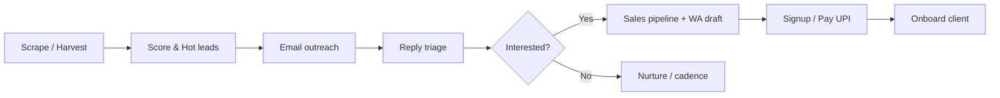
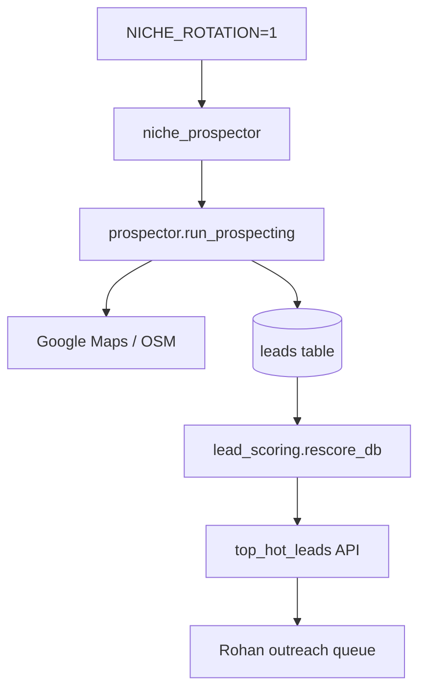
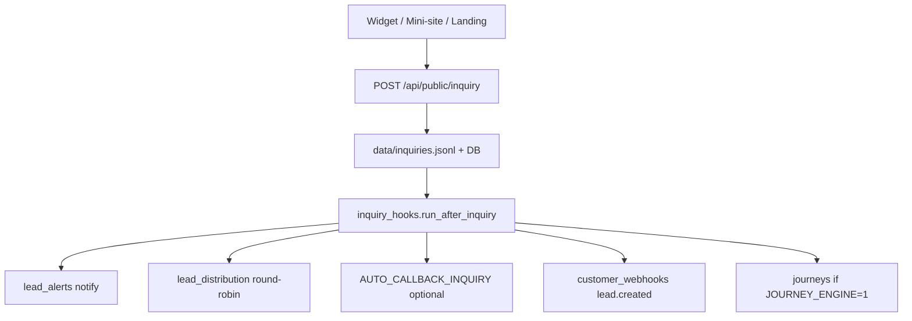
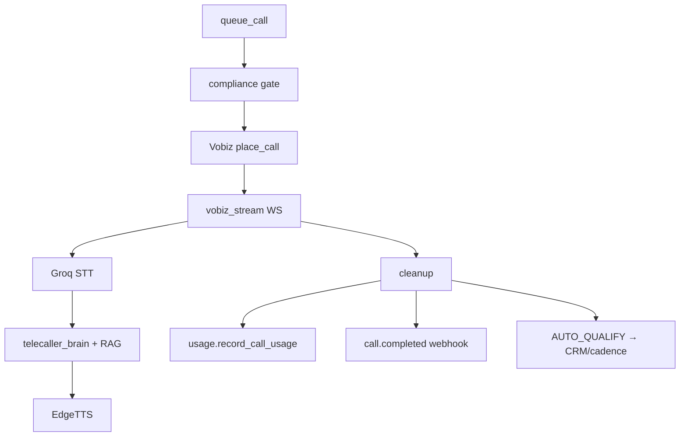
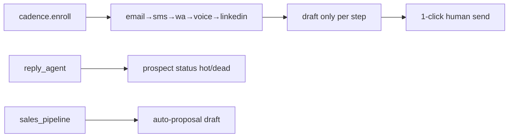
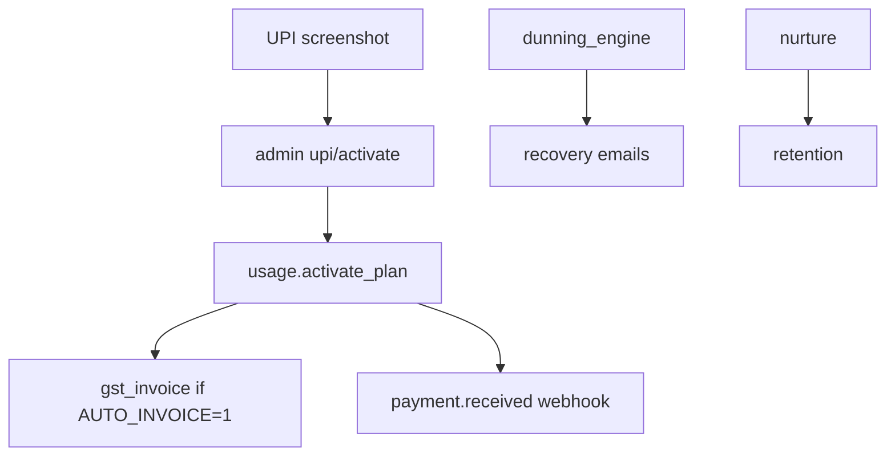
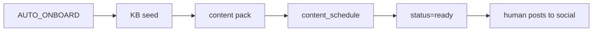

# Workflow Maps — LeadGenAI Pipelines

> **Visual ops reference** · Code paths verified 2026-06-20 · Runtime liveness re-verified 2026-06-27 (worker + scheduler Up, Celery queue 0, heartbeat fresh — `DIAGNOSTIC_ROOT_CAUSE_2026_06_27.md`) · Detail: [`AUTOMATION.md`](AUTOMATION.md)

---

## 1. Master pipeline (platform growth)

**Jobs:** prospect 09:30 · outreach 10:30 · reply hourly · pipeline 11:00

---

## 2. Lead scraping → qualification

Caps: `PROSPECT_MAX_LOOKUPS=60`/run · MX verify `OUTREACH_VERIFY_MX=1`

---

## 3. Inquiry → client lead (inbound)

Speed-to-lead metric: `speed_to_lead.py` — inquiry → first touch timestamp.

---

## 4. Calling → CRM (voice)

Cross-path audit: `scripts/cross_path_audit.py`

---

## 5. Follow-up omnichannel

Flags: `CADENCE_ENGINE=1` · `SALES_ENGINE=1` · `WHATSAPP_AUTO_SEND=0` default

---

## 6. Revenue loop

---

## 7. Client delivery loop (marketing)

---

## 8. AI staff daily rhythm (IST)

| Time | Job | Agent |
|------|-----|-------|
| 06:30 | blog | Ravi |
| 07:00 | content | Isha |
| 08:30 | digest | Boss/Kavya |
| 09:30 | prospect | Dev/Rohan |
| 10:30 | email outreach | Rohan |
| 11:00 | pipeline | Neha |
| Hourly | health, reply, watchdog | Kavya, reply_agent, Hermes |

Full schedule: `team_scheduler.py` · Celery mirror: `worker.py`

---

## 9. Human breakpoints (when automation stops)

| Step | Why human |
|------|-----------|
| UPI verify | Fraud prevention |
| WhatsApp send | Meta ban policy |
| Social publish | Meta API approval |
| Cold phone India | DLT paperwork |
| Code deploy | Sumit approve Vikram patches |
